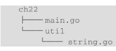
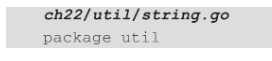

# 包

也可以定义自己的包，通过包的方式把相同业务、相同职责的代码放在一起。比如你有一个util包，用于存放一些常用的工具函数，项目结构如下所示：



在Go语言中，一个包对应一个文件夹，上面的项目结构示例也验证了这一点。在这个示例中，有一个util文件夹，它里面有一个string.go文件，这个Go语言文件就属于util包，它的包定义如下所示：




> Go语言中，所有的定义，比如函数、变量、结构体等，如果首字母是大写，就可以被其他包使用。反之，如果首字母是小写的，就只能在同一个包内使用。

## init 函数

除了main这个特殊的函数外，Go语言还有一个特殊的函数——init，通过它可以实现包级别的一些初始化操作。init函数没有返回值，也没有参数，它先于main函数执行。

一个包中可以有多个init函数，但是它们的执行顺序并不确定，所以如果你定义了多个init函数的话，要确保它们是相互独立的，一定不要有顺序上的依赖。

## 模块

如果包是比较低级的代码组织形式的话，那么模块就是更高级别的。在Go语言中，一个模块可以包含很多个包，所以模块是相关的包的集合。

Go语言为我们提供了go mod命令来创建一个模块（项目），比如要创建一个demo模块，可以通过如下命令实现：

```
go mod init demo
```

运行这一命令后，你会看到已经创建好一个名字为demo的文件夹，里面有一个go.mod文件，它里面的内容如下所示：

```
module demo
go 1.20 
```

> 模块名最好以自己的域名开头，比如 www.bai.du/demo，这样就可以很大程度上保证模块名的唯一性，不至于与其他模块重名。

### 使用第三方模块

你可以把项目中的公共代码抽取为一个模块，这样就可以供其他项目使用，而不用再重复开发。同理，在GitHub上有很多开源的Go语言项目，它们都是一个个独立的模块，也可以被我们直接使用，提高我们的开发效率，比如Web框架gin-gonic/gin。

众所周知，在使用第三方模块之前，需要先设置Go代理，也就是GOPROXY，这样我们就可以获取到第三方模块了：

```
go env -w GO111MODULE=on
go env -w GOPROXY=https://goproxy.cn,direct
```

在实际的项目开发中，除了第三方模块外，还有我们自己开发的模块，放在了公司的GitLab上，这时候就要把公司Git代码库的域名排除在Go代理之外，为此Go语言提供了GOPRIVATE这个环境变量帮助我们达到目的。通过如下命令即可设置GOPRIVATE：

```
go env -w GOPRIVATE=*.inner.com
```


一切都准备好就可以使用第三方的模块了，假设我们要使用Gin这个Web框架，首先需要安装它。通过如下命令即可安装Gin这个Web框架：

```
go get -u github.com/gin-gonic/gin
```

安装成功后，就可以像Go语言的标准包一样，通过import命令将其导入你的代码中，代码如下所示：

```go
package main

import (
	"fmt"

	"github.com/gin-gonic/gin"
)

func main() {
	fmt.Println("server start")
	app := gin.Default()
	app.Run()
}

```

以上代码现在还无法编译通过，因为还没有同步Gin这个模块的依赖，也就是没有把它添加到go.mod文件中。通过如下命令可以添加缺失的模块：

```go
go mod tidy
```

> 运行这一命令，就可以把缺失的模块添加进来，同时也可以移除不再需要的模块。