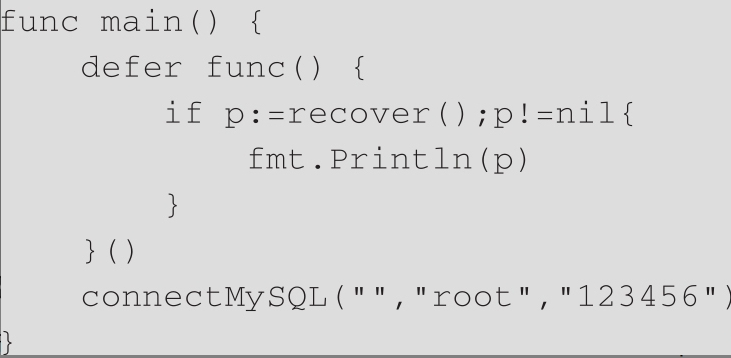

# 结构体

结构体(Struct)是一种聚合类型，里面可以包含任意类型的值，这些值就是我们定义的结构体的成员，也称为字段。在Go语言中，结构体语法：

```go
type structName struct{
  fieldName typeName
}
```

* type和struct是Go语言的关键字，二者组合就代表要定义一个新的结构体类型。

* structName是结构体类型的名字。

* fieldName是结构体的字段名，而typeName是对应的字段类型。

下面是示例：

```go
type person struct{
	name string
	age uint
}
```

## 声明和使用

结构体类型也可以使用与普通的字符串、整型一样的方式进行声明和初始化

在下面的例子中，我声明了一个person类型的变量p，因为没有对变量p初始化，所以默认会使用结构体里字段的零值。

```go
var p person
```

可以通过结构体字面量的方式初始化:

```go
p:=person{"zzq",30}
```

> 采用字面量初始化结构体时，初始化值的顺序很重要，必须与字段定义的顺序一致

那么是否可以不按照顺序初始化呢？当然可以，只不过需要指出字段名称:

```go
p:=person{name:"zzq",age:30}
```

如何访问结构体中的值呢：

```go
	p := person{name: "zzq", age: 30}
	fmt.Println(p.name, p.age)
```


结构体的字段可以是任意类型，包括自定义的结构体类型:

```go
type person struct {
	name string
	age  uint
	addr address
}

type address struct {
	province string
	city     string
}

func main() {
	p := person{name: "zzq", age: 30, addr: address{"shandong", "jinan"}}
	fmt.Println(p.name, p.age, p.addr.province)
}
```


## 方法

方法和函数是两个概念，但又非常相似，不同点在于方法必须要有一个接收者，这个接收者是一个类型，这样方法就与这个类型绑定在一起，称为这个类型的方法。

与函数不同，定义方法时会在关键字func和方法名String之间加一个接收者(age Age)，接收者使用小括号包围。

```go
type person struct {
	name string
	age  uint
	addr address
}

func (p person) ToString() string {
	return p.name + "," + p.addr.city
}
```

上面的示例中， ToString 就是person类型的方法 ， 方法名称前面的单个参数就是接收者。

### 值和指针类型接收者

方法的接收者除了可以是值类型，也可以是指针类型。

如果定义的方法的接收者类型是指针，我们对指针的修改就是有效的，如果不是指针，修改就没有效果：

```go
type person struct {
	name string
	age  uint
}

func (p person) ToString() string {
	return p.name
}

func (p *person) SetName(name string) {
	p.name = name
}

func main() {
	p := person{name: "zzq", age: 30}
	fmt.Println(p.ToString()) //zzq
	p.SetName("pangzi")
	fmt.Println(p.ToString()) //pangzi

}
```

在调用方法的时候，传递的接收者本质上都是副本，只不过一个是这个值的副本，一个是指向这个值的指针的副本。指针具有指向原有值的特性，所以修改了指针指向的值，也就修改了原有的值。我们可以简单地理解为值接收者使用的是值的副本来调用方法，而指针接收者使用实际的值来调用方法。

示例中调用指针接收者方法的时候，使用的是一个值类型的变量，并不是一个指针类型，其实这里使用指针变量调用也是可以的:

```go
	(&p).SetName("pangzi2")
	fmt.Println(p.ToString()) //pangzi2
```

这是因为Go语言编译器帮我们自动做了如下事情：如果使用一个值类型变量调用指针类型接收者的方法，Go语言编译器会自动帮我们取指针调用，以满足指针接收者的要求。同样的原理，如果使用一个指针类型变量调用值类型接收者的方法，Go语言编译器会自动帮我们解引用调用，以满足值类型接收者的要求。


# 接口

interface{}是空接口的意思，在Go语言中代表任意类型。

## 定义

```go
type interfaceName interface{
  method... 
}
```

Demo: 定义一个ToString 接口

``` go
type Stringer interface{
  ToString() string
}
```

## 接口的实现

接口的实现者必须是一个具体的类型，继续以person结构体为例，让它来实现Stringer接口：

```go
type person struct {
	name string
	age  uint
	addr address
}

type address struct {
	province string
	city     string
}

type Stringer interface {
	ToString() string
}

func (p person) ToString() string {
	return p.name + "," + p.addr.city
}

func main() {
	p := person{name: "zzq", age: 30, addr: address{"shandong", "jinan"}}
	fmt.Println(p.name, p.age, p.addr.province)
	fmt.Println(p.ToString())
}

```

给结构体类型person定义一个方法，这个方法与接口里方法的签名（名称、参数和返回值）一样，这样结构体person就实现了Stringer接口。接口的实现并没有通过任何关键字（比如Java中的implements），所以Go语言的接口是隐式实现的。

> 如果一个接口有多个方法，那么需要实现接口的每个方法才算是实现了这个接口。

## 值和指针类型接收者

* 当值类型作为接收者时，person类型和`*person`类型都实现了该接口。

* 当指针类型作为接收者时，只有`*person`类型实现了该接口。


# 继承和组合

在Go语言中没有继承的概念，所以结构体、接口之间也没有父子关系，Go语言提倡的是组合，利用组合达到代码复用的目的。


```go
type Reader interface {
	Read(p []byte) (n int, err error)
}

type Writer interface {
	Write(p []byte) (n int, err error)
}

type ReadWriter interface {
	Reader
	Writer
}
```

ReadWriter接口就是Reader和Writer的组合，组合后，ReadWriter接口具有Reader和Writer中的所有方法，这样新接口ReadWriter就不用定义自己的方法了，组合Reader和Writer的就可以了。


不止接口可以组合，结构体也可以组合，现在把address结构体组合到结构体person中，而不是当成一个字段:

```go
type person struct {
	name string
	age  uint
	address
}

type address struct {
	province string
	city     string
}
```

直接把结构体类型放进来，就是组合，不需要字段名。组合后，被组合的address称为内部类型，person称为外部类型。

修改了person结构体后，声明和使用也需要一起修改:

```go
type person struct {
	name string
	age  uint
	 address
}

type address struct {
	province string
	city     string
}


func main() {
	p := person{name: "zzq", age: 30, address: address{"shandong", "jinan"}}
	fmt.Println(p.name, p.age, p.province)
}

```

因为person组合了address，所以address的字段就像person自己的一样，可以直接使用。

类型组合后，外部类型不仅可以使用内部类型的字段，也可以使用内部类型的方法，就像使用自己的方法一样

## 方法覆盖

如果外部类型定义了与内部类型同样的方法，那么外部类型会覆盖内部类型，这就是方法的覆写

## 类型断言

类型断言（Type Assertion）是一个使用在接口值上的操作，用于检查接口类型变量所持有的值是否实现了期望的接口或者具体的类型。

在Go语言中类型断言的语法格式如下：

```go
value, ok := x.(T)
```

其中，x 表示一个接口的类型，T 表示一个具体的类型（也可为接口类型）。

```go
package main
import (
    "fmt"
)
func main() {
    var x interface{}
    x = 10
    value, ok := x.(int)
    fmt.Print(value, ",", ok)
}
```

运行结果如下：

```go
10,true
```

需要注意如果不接收第二个参数也就是上面代码中的 ok，断言失败时会直接造成一个 panic。如果 x 为 nil 同样也会 panic。


# 异常处理

在Go语言中，错误是通过内置的error接口表示的。它非常简单，只有一个Error方法，用来返回具体的错误信息:

```go
type error interface {
	Error() string
}
```

errors.New工厂函数来生成错误信息。errors.New函数接收一个字符串参数，返回一个error接口

```go
func sumInt2(a, b int) (int,error) {
	if a<0 {
		return 0, errors.New("a 不能是负数")
	}
	return a + b,nil
}
```

## 自定义error

你可能会想，上面采用工厂函数返回错误信息的方式只能传递一个字符串，也就是携带的信息只有字符串，如果想要携带更多信息（比如错误码信息），该怎么办呢？这个时候就需要自定义error。

自定义error其实就是先自定义一个新类型，比如结构体，然后让这个类型实现error接口


## 错误嵌套

error接口虽然比较简洁，但是功能也比较弱。想象一下，假如我们有这样的需求：基于一个存在的error再生成一个error，需要怎么做呢？这就是错误嵌套。

所以从Go语言1.13版本开始，Go标准库新增了Error Wrapping功能，让我们可以基于一个存在的error生成新的error，并且可以保留原error信息：

```go
	e := errors.New("原始错误")
	w := fmt.Errorf("包装错误:%w", e)
	fmt.Println(w) // 包装错误:原始错误
```

## errors.Is函数

有了Error Wrapping后，你会发现原来用的判断两个error是不是同一个error的方法失效了，比如Go语言标准库经常用到的如下代码中的方式：

```go
if err == os.ErrExist
```

为什么会出现这种情况呢？由于Go语言的Error Wrapping功能令人不知道返回的err是否被嵌套，嵌套了几层。

于是Go语言为我们提供了errors.Is函数，用来判断两个error是否是同一个

* 如果err和target是同一个，那么返回true。

* 如果err是一个wrapping error，target也包含在这个嵌套error链中的话，也返回true。

## errors.As函数

同样的原因，有了error嵌套后，error断言也不能用了，因为你不知道一个error是否被嵌套，又嵌套了几层。所以Go语言为解决这个问题提供了errors.As函数


## panic函数

Go语言是一门静态的强类型语言，很多问题都尽可能地在编译时捕获，但是有一些只能在运行时检查，比如数组越界访问、不相同的类型强制转换等，这类运行时的问题会引起panic异常。除了运行时可以产生panic异常外，我们自己也可以抛出panic异常


panic是Go语言内置的函数，可以接收interface{}类型的参数，也就是任何类型的值都可以传递给panic函数，


panic异常是一种非常严重的情况，会让程序中断运行，使程序崩溃，所以如果是不影响程序运行的错误，不要使用panic，使用普通错误error即可。


## recover函数

通常情况下，我们不对panic异常做任何处理，因为既然它是影响程序运行的异常，就让它直接崩溃即可。但是也的确有一些特例，比如在程序崩溃前做一些资源释放的处理，这时候就需要从panic异常中恢复，才能完成处理。

在Go语言中，可以通过内置的recover函数恢复panic异常。因为在程序因panic异常崩溃的时候，只有被defer修饰的函数才能被执行，所以recover函数要结合defer关键字使用才能生效。

下面的示例是通过“defer关键字+匿名函数+recover函数”从panic异常中恢复的方式。




# defer函数

在一个自定义函数中，如果你打开了一个文件，那么之后你需要关闭它以释放资源。不管你的代码执行了多少分支，是否出现了错误，文件都是一定要关闭的，这样才能保证资源的释放。如果这个事情由开发人员来做，在业务逻辑变复杂后就会非常麻烦，而且还有可能会忘记关闭。基于这种情况，Go语言为我们提供了defer函数，可以保证文件的关闭操作一定会被执行，而不管你自定义的函数是出现异常还是出现错误。

```go
package main

import "fmt"

func main() {
	defer func() {
		fmt.Println("First")
	}()

	defer func() {
		fmt.Println("Second")
	}() 
    // defer 后面必须是函数或者方法的调用，否则报错：

	fmt.Println("This is main func body")

}
```

输出：

```go
This is main func body
Second
First
```

defer语句常被用于成对的操作，如文件的打开和关闭、加锁和释放锁、连接的建立和断开等。不管多么复杂的操作，都可以保证资源被正确地释放。
