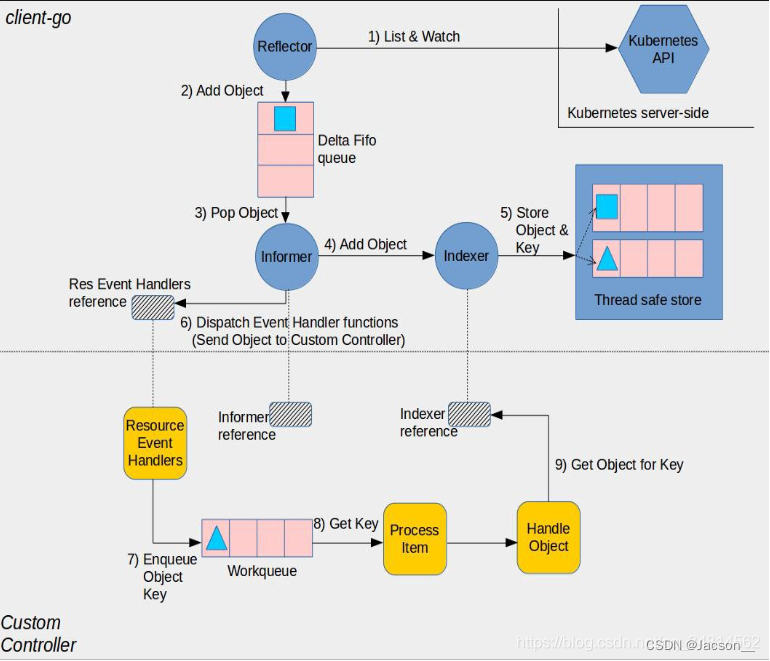

# CRD概念

在 Kubernetes 中我们使用 Deployment、DamenSet，StatefulSet 来管理应用 Workload，使用 Service，Ingress 等来管理应用的访问方式，使用 ConfigMap 和 Secret 来管理应用配置。在集群中，对这些**资源**的创建，更新，删除的动作都会被转换为事件(Event)，Kubernetes 的 Controller Manager 负责监听这些事件并触发相应的任务来满足用户的期望。这种方式我们称为声明式，用户只需要关心应用程序的最终状态，其它的都通过 Kubernetes 来帮助我们完成，通过这种方式可以大大简化应用的配置管理复杂度。

对应的，当我们对 Kubernetes 的使用逐渐加深之后，会发现这些默认的 Controller 和 **资源** 不足以支撑我们的系统，例如就拿 Prometheus Operator 来说，要想实现横向扩展并不容易；还有拿 Nginx Ingress 来说，要想实现截流器也并不容易。对于一些非通用的特性，Kubernetes 提供了一种扩展性的支撑方式，其实就是所谓的 CRD 和 Controller（Operator）。

CR（Custom Resource）其实就是在 Kubernetes 中定义一个自己的资源类型，是一个具体的 “自定义 API 资源” 实例，为了能够让 Kubernetes 认识这个 CR，就需要让 Kubernetes 明白这个 CR 的宏观定义是什么，也就是需要创建所谓的 CRD（Custom Resource Definition）来表述。

#  GVK(R)概念

gvk （g:`group`、k:`kind` 、v:`version`、r:`resource`），GVK 是定位资源的一种方式


# client-go功能

1. 封装复杂的HTTP通信细节：client-go的rest组件封装了与Kubernetes API服务器的HTTP通信，使开发者无需关心底层的请求发送和响应处理细节，仅需通过简单的API调用即可完成通信操作。
2. 提供丰富的资源操作能力：通过core组件，开发者可以对核心的Kubernetes资源（如Pod、Service、Deployment等）进行增、删、改、查等操作，满足了常见的资源管理需求。
3. 支持动态访问任意资源：dynamic组件使得开发者可以与任意Kubernetes API资源进行交互，而无需事先在客户端进行硬编码。这种动态的操作方式为开发者提供了更高的灵活性和扩展性。
4. 实现API资源的自动发现：通过discovery组件，开发者可以动态获取Kubernetes集群中支持的API资源列表，避免了手动维护资源信息的繁琐工作。
5. 提供高效的资源缓存与本地持久化能力：informers组件利用缓存和本地持久化机制，可以快速访问集群资源，并实时监听资源变化，为开发者提供了高效的资源操作方式。
6. 支持控制器资源的扩缩容操作：通过scale组件，开发者可以方便地调整Deployment、ReplicaSet等控制器资源的副本数量，实现扩缩容的功能。

## 安装

```text
go get k8s.io/client-go
```

## 关于认证

* 内部认证：当使用 `rest.InClusterConfig()` 时，client-go 使用被挂载到 Pod 里面的 `/var/run/secrets/kubernetes.io/serviceaccount` 路径上的 [Service Account token](https://kubernetes.io/docs/admin/authentication/#service-account-tokens)。
* 外部认证：使用包含集群上下文信息的 kubeconfig 文件初始化客户端。`kubectl` 命令也使用 kubeconfig 文件对集群进行身份验证。

## 客户端种类

* RESTClient：RESTClient 是对 http.Client 的封装，它在指定的路径上执行诸如 Get、Put、Post 和 Delete 之类的通用 REST 函数。其它客户端都是在它的基础上实现的。可用于 Kubernetes 内置资源和 CRD 资源。
* Clientset ：是用于处理 Kubernetes **内置资源对象**的客户端集合。默认情况下，不能操作 CRD 资源。
* DynamicClient ：不仅能对 Kubernetes 内置资源进行处理，还可以对 CRD 资源进行处理。dynamicClient的原理就是传入的资源数据都是使用map[string]interface{}结构。dynamicClient内部还是使用restClient.
* DiscoveryClient ：DiscoveryClient 是发现客户端，用于发现 Kubernetes API Server 支持的资源组（Group）、资源版本（Version）和资源信息（Resource）。
* scaleClient ：scaleClient 是用于对 Deployment、ReplicaSet 等资源进行扩缩容的客户端。

### Demo: rest_client

```go
package main

import (
  "context"
  "fmt"
  "k8s.io/api/core/v1"
  "k8s.io/client-go/kubernetes/scheme"
  "k8s.io/client-go/rest"
  "k8s.io/client-go/tools/clientcmd"
)

func main() {
  // 如果从 kubeconfig 文件构建 rest.Config 不方便，
  // 那么可以使用 clientcmd.BuildConfigFromKubeconfigGetter() 构建 rest.Config
  // （比如在凭证存储在配置中心的情况下）
  config, err := clientcmd.BuildConfigFromFlags("", clientcmd.RecommendedHomeFile)
  if err != nil {
    panic("fail to build config")
  }
  config.GroupVersion = &v1.SchemeGroupVersion
  config.NegotiatedSerializer = scheme.Codecs
  config.APIPath = "/api"

  // 创建 RESTClient
  restClient, err := rest.RESTClientFor(config)
  if err != nil {
    panic(err)
  }

  pod := &v1.Pod{}
  if err := restClient.Get().
    Namespace("default").
    Resource("pods").
    // 确保 Pod 存在，否则程序会报错
    Name("nginx-65778599-2nwp5").
    Do(context.TODO()).
    Into(pod); err != nil {
    panic(err)
  }
  fmt.Printf("GVK: %s\n", pod.GroupVersionKind())
}
```


### Demo: clientset

```go
package main

import (
  "context"
  "fmt"
  metav1 "k8s.io/apimachinery/pkg/apis/meta/v1"
  "k8s.io/client-go/kubernetes"
  "k8s.io/client-go/tools/clientcmd"
)

func main() {
  config, err := clientcmd.BuildConfigFromFlags("", clientcmd.RecommendedHomeFile)
  if err != nil {
    panic(err)
  }

  clientset, err := kubernetes.NewForConfig(config)
  if err != nil {
    panic(err)
  }

  pod, err := clientset.CoreV1().
    Pods("default").
    Get(context.TODO(), "nginx-65778599-2nwp5", metav1.GetOptions{})
  if err != nil {
    panic(err)
  }
  fmt.Printf("Annotations: %s\n", pod.Annotations)
}
```

### Demo: dynamic_client

```go
package main

import (
  "context"
  "fmt"
  metav1 "k8s.io/apimachinery/pkg/apis/meta/v1"
  "k8s.io/apimachinery/pkg/apis/meta/v1/unstructured"
  "k8s.io/apimachinery/pkg/runtime/schema"
  "k8s.io/client-go/dynamic"
  "k8s.io/client-go/tools/clientcmd"
)

func main() {
  config, err := clientcmd.BuildConfigFromFlags("", clientcmd.RecommendedHomeFile)
  if err != nil {
    panic(err)
  }
  client, err := dynamic.NewForConfig(config)
  if err != nil {
    panic(err)
  }

  deploymentSpec := &unstructured.Unstructured{
    Object: map[string]interface{}{
      "apiVersion": "apps/v1",
      "kind":       "Deployment",
      "metadata": map[string]interface{}{
        "name": "nginx-alpine-deployment-test",
      },
      "spec": map[string]interface{}{
        "replicas": 1,
        "selector": map[string]interface{}{
          "matchLabels": map[string]interface{}{
            "app": "nginx-alpine-test",
          },
        },
        "template": map[string]interface{}{
          "metadata": map[string]interface{}{
            "labels": map[string]interface{}{
              "app": "nginx-alpine-test",
            },
          },
          "spec": map[string]interface{}{
            "containers": []map[string]interface{}{
              {
                "name":  "nginx-alpine",
                "image": "nginx:alpine",
                "ports": []map[string]interface{}{
                  {
                    "name":          "http",
                    "protocol":      "TCP",
                    "containerPort": 80,
                  },
                },
              },
            },
          },
        },
      },
    },
  }
  deploymentResource := schema.GroupVersionResource{Group: "apps", Version: "v1", Resource: "deployments"}

  fmt.Println("Creating deployment...")
  result, err := client.
    Resource(deploymentResource).
    Namespace("default").
    Create(context.Background(), deploymentSpec, metav1.CreateOptions{})
  if err != nil {
    panic(err)
  }
  fmt.Printf("Created deployment %q.\n", result.GetName())
}
```

### Demo:  discovery_client

```go
package main

import (
  "fmt"
  "k8s.io/client-go/discovery"
  "k8s.io/client-go/tools/clientcmd"
)

func main() {
  config, err := clientcmd.BuildConfigFromFlags("", clientcmd.RecommendedHomeFile)
  if err != nil {
    panic(err)
  }
  discoveryClient, err := discovery.NewDiscoveryClientForConfig(config)
  if err != nil {
    panic(err)
  }
  _, APIResourceList, err := discoveryClient.ServerGroupsAndResources()
  if err != nil {
    panic(err)
  }
  for _, list := range APIResourceList {
    fmt.Println(list)
  }
}
```

### Demo: scale_client

```go
package main

import (
  "context"
  "fmt"
  autoscalingapi "k8s.io/api/autoscaling/v1"
  metav1 "k8s.io/apimachinery/pkg/apis/meta/v1"
  "k8s.io/apimachinery/pkg/runtime/schema"
  "k8s.io/client-go/discovery"
  "k8s.io/client-go/dynamic"
  "k8s.io/client-go/scale"
  "k8s.io/client-go/tools/clientcmd"
)

// resourceMapper 决定要伸缩的资源的推荐版本
type resourceMapper struct{}

// ResourceFor 带部分资源，返回推荐资源
func (r *resourceMapper) ResourceFor(resource schema.GroupVersionResource) (schema.GroupVersionResource, error) {
  fmt.Printf("ResourceFor was called with resource %s\n", resource.String())
  if resource.Group == "apps" && resource.Resource == "deployments" {
    return schema.GroupVersionResource{
      Group:    resource.Group,
      Version:  "v1",
      Resource: resource.Resource,
    }, nil
  }
  return schema.GroupVersionResource{}, fmt.Errorf("no preferred version for %s", resource.String())
}

func main() {
  config, err := clientcmd.BuildConfigFromFlags("", clientcmd.RecommendedHomeFile)
  if err != nil {
    panic(err)
  }

  discoveryClient, err := discovery.NewDiscoveryClientForConfig(config)
  if err != nil {
    panic(err)
  }

  // 创建 scaleClient
  scaleClient, err := scale.NewForConfig(
    config,
    &resourceMapper{},
    dynamic.LegacyAPIPathResolverFunc,
    scale.NewDiscoveryScaleKindResolver(discoveryClient))
  if err != nil {
    println(err)
  }

  scaleSpec := &autoscalingapi.Scale{
    Spec: autoscalingapi.ScaleSpec{
      // 期望的实例数量
      Replicas: 2,
    },
    Status: autoscalingapi.ScaleStatus{
      // 观察的实例的实际数量
      Replicas: 0,
      // 选择器。请查看 http://kubernetes.io/docs/user-guide/labels#label-selectors
      Selector: "app=nginx",
    },
  }
  // 命名空间
  scaleSpec.Namespace = "default"
  // Deployment 一定要存在
  scaleSpec.ObjectMeta.Name = "nginx"

  _, err = scaleClient.
    Scales("default").
    Update(
      context.Background(),
      // 给定的可伸缩资源
      schema.GroupResource{
        Group:    "apps",
        Resource: "deployments",
      },
      scaleSpec,
      metav1.UpdateOptions{},
    )
  if err != nil {
    panic(err)
  }

  fmt.Printf("%s was scaled", scaleSpec.Name)
}
```


## informer机制

informer在kubernetes系统中，保证各个组件之间消息的实时性、可靠性、顺序性等。k8s各组件通过client-go的informer机制与k8s apiserver通信。



Informer 设计为 List/Watch 的方式。Informer 在初始化的时先通过 List 从 Kubernetes 中取出资源的全部对象，并同时缓存，然后后面通过 Watch 的机制去监控资源，这样的话，通过 Informer 及其缓存，我们就可以直接和 Informer 交互而不是每次都和 Kubernetes 交互。

Informer 另外一块内容在于提供了事件 Handler 机制，并会触发回调，这样上层应用如 Controller 就可以基于回调处理具体业务逻辑。

因为Informer 通过 List、Watch 机制可以监控到所有资源的所有事件，因此只要给 Informer 添加 ResourceEventHandler 实例的回调函数实例取实现 OnAdd(obj interface{}) OnUpdate(oldObj, newObj interface{}) 和 OnDelete(obj interface{})这三个方法，就可以处理好资源的创建、更新和删除操作。


### Informer reference

controller需要创建合适的Informer才能通过Informer reference操作资源对象

### Indexer reference

controller创建Indexer reference然后去利用索引做相关处理

### Reflector

用于监控（Watch）指定的kubernetes资源，当监控的资源发生变化时，触发相应的变更事件，如add、update、delete等，并将其资源对象存入本地缓存DeltaFIFO中，然后Informer会从队列里面取数据。

### DeltaFIFO队列

DeltaFIFO可以分开理解，FIFO是一个先进先出的队列，它拥有队列操作的基本方法，例如Add、Update、Delete、List、Pop、Close等，而Delta是一个资源对象存储，它可以保存资源对象的操作类型，例如Added（添加）操作类型、Updated（更新）操作类型、Deleted（删除）操作类型、Sync（同步）操作类型等

### Indexer

是client-go用来存储资源对象冰紫带索引功能的本地存储，Refelctor从DeltaFIFO消费出来的资源对象存储至indexer。indexer与etcd集群保持一致。client-go可以很方便的从本地存储中读取响应的资源对象数据，而无需每次从etcd读取，以减轻kubernetes apiserver对etcd的压力。


### Demo：监听事件

```go
package main

import (
  "context"
  "fmt"
  appsv1 "k8s.io/api/apps/v1"
  metav1 "k8s.io/apimachinery/pkg/apis/meta/v1"
  "k8s.io/client-go/kubernetes"
  "k8s.io/client-go/tools/clientcmd"
)

func main() {
  config, err := clientcmd.BuildConfigFromFlags("", clientcmd.RecommendedHomeFile)
  if err != nil {
    panic(err)
  }

  clientset, err := kubernetes.NewForConfig(config)
  if err != nil {
    panic(err)
  }

  watcher, err := clientset.AppsV1().
    Deployments("default").
    Watch(
      context.TODO(),
      metav1.ListOptions{
        // 标签选择器
        LabelSelector: "app=nginx",
      },
    )
  if err != nil {
    panic(err)
  }

  for {
    select {
    case event, ok := <-watcher.ResultChan():
      if !ok {
        fmt.Println("channel closed")
        break
      }
      fmt.Println("Event Type:", event.Type)
      dp, ok := event.Object.(*appsv1.Deployment)
      if !ok {
        fmt.Println("not deployment")
        continue
      }
      fmt.Println(dp)
    }
  }
}
```

> 上面的代码 WATCH app 标签等于 nginx 的 Deployment 上发生的事件。


DEMO：监听POD日志

```go
package main

import (
	"context"
	"fmt"
	"io"

	log "github.com/sirupsen/logrus"
	v1 "k8s.io/api/core/v1"
	"k8s.io/client-go/kubernetes"
	"k8s.io/client-go/tools/clientcmd"
)

func main() {
	config, err := clientcmd.BuildConfigFromFlags("", "kube.yaml")
	if err != nil {
		log.Error(err.Error())
	}

	clientSet, err := kubernetes.NewForConfig(config)
	if err != nil {
		log.Error(err.Error())
	}

	count := int64(100)
	podLogOptions := v1.PodLogOptions{
		Container: "",
		Follow:    true,
		TailLines: &count,
	}

	podLogRequest := clientSet.CoreV1().Pods("kube-system").
		GetLogs("etcd-docker-desktop", &podLogOptions)
	stream, _ := podLogRequest.Stream(context.TODO())

	defer stream.Close()

	for {
		buf := make([]byte, 2000)
		numBytes, err := stream.Read(buf)
		if numBytes == 0 {
			continue
		}
		if err == io.EOF {
			break
		}

		message := string(buf[:numBytes])
		fmt.Print(message)
	}
}
```


1. 当pod下线。

2. 当pod发生了异常，暂时不可用

3. 监听代码中发生了异常。