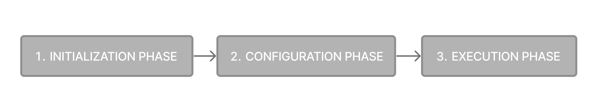

# 概述

`Gradle`根据构建脚本中的信息自动构建、测试和部署软件。


## 核心概念

### Project

Gradle `project `是一个可以构建的软件，例如应用程序或库。单个项目生成包括一个称为根项目的单个项目。多项目构建包括一个根项目和任意数量的子项目。

### 构建脚本

构建脚本详细说明了构建项目的步骤。每个项目都可以包括一个或多个构建脚本。

### 依赖管理

依赖关系管理是一种用于声明和解析项目所需外部资源的自动化技术。每个项目通常包括许多外部依赖项，Gradle将在构建过程中解决这些依赖项。

### 任务

任务是一个基本的工作单元，例如编译代码或运行测试。每个项目都包含一个或多个在构建脚本或插件中定义的任务。

### 插件

插件用于扩展Gradle的功能，并可选择为项目贡献任务。

## Gradle 项目结构

项目根目录中存在`gradlew`和`gradlew.bat`文件，这清楚地表明使用了Gradle。Gradle项目将类似于以下内容：

```shell
project
├── gradle # 存储 wrapper 文件                             
│   ├── libs.versions.toml   # 用于依赖项管理的catalog            
│   └── wrapper
│       ├── gradle-wrapper.jar
│       └── gradle-wrapper.properties
├── gradlew         #Gradle wrapper scripts                    
├── gradlew.bat     #Gradle wrapper scripts                    
├── settings.gradle(.kts)        # 设置文件以定义根项目名称和子项目       
├── subproject-a
│   ├── build.gradle(.kts) # 构建脚本             
│   └── src                             
└── subproject-b
    ├── build.gradle(.kts)              
    └── src   
```

## GradleWrapper

执行任何Gradle构建的推荐方法是使用`GradleWrapper`。Wrapper脚本调用一个已声明的Gradle版本，必要时可以提前下载。


Wrapper 入口 是 `gradlew`或`gradlew.bat`。Wrapper提供了以下好处：

* 在给定的Gradle版本上标准化项目。
* 为不同的用户提供相同的Gradle版本。
* 为不同的执行环境（IDE、CI服务器…）提供Gradle版本。

始终建议使用Wrapper执行构建，以确保构建的可靠、可控和标准化执行。根据操作系统的不同，可以运行`gradlew`或`gradlew.bat`而不是`gradle`命令。

典型的Gradle调用：

```shell
$ gradle build
```

要在Linux或OSX计算机上运行Wrapper，请执行以下操作：

```shell
$ ./gradlew build
```

要在Windows PowerShell上运行Wrapper，请执行以下操作：

```shell
$ .\gradlew.bat build
```

该命令在Wrapper所在的同一目录中运行。如果要在其他目录中运行该命令，则必须提供Wrapper的相对路径：

```shell
$ ../gradlew build
```

以下控制台输出演示了在基于Java的项目中，在Windows计算机上的命令提示符（cmd）中使用Wrapper：

```shell
$ gradlew.bat build

Downloading https://services.gradle.org/distributions/gradle-5.0-all.zip
.....................................................................................
Unzipping C:\Documents and Settings\Claudia\.gradle\wrapper\dists\gradle-5.0-all\ac27o8rbd0ic8ih41or9l32mv\gradle-5.0-all.zip to C:\Documents and Settings\Claudia\.gradle\wrapper\dists\gradle-5.0-al\ac27o8rbd0ic8ih41or9l32mv
Set executable permissions for: C:\Documents and Settings\Claudia\.gradle\wrapper\dists\gradle-5.0-all\ac27o8rbd0ic8ih41or9l32mv\gradle-5.0\bin\gradle

BUILD SUCCESSFUL in 12s
1 actionable task: 1 executed
```

### 目录结构

```shell
├── caches    # 全局缓存目录（用于非特定于项目的所有内容）。              
│   ├── 4.8   #特定于版本的缓存（例如，支持增量构建）。                  
│   ├── 4.9                     
│   ├── ⋮
│   ├── jars-3   #共享缓存（例如，用于依赖项的工件）。               
│   └── modules-2  #共享缓存（例如，用于依赖项的工件）。             
├── daemon #Gradle守护程序的注册表和日志。
│   ├── ⋮
│   ├── 4.8
│   └── 4.9
├── init.d   # 全局初始化脚本。               
│   └── my-setup.gradle
├── jdks     #通过工具链下载的JDK支持。               
│   ├── ⋮
│   └── jdk-14.0.2+12
├── wrapper #GradleWrapper下载的分发内容。
│   └── dists                   
│       ├── ⋮
│       ├── gradle-4.8-bin
│       ├── gradle-4.9-all
│       └── gradle-4.9-bin
└── gradle.properties  #全局配置属性。
```

默认情况下， Gradle User Home（`~/.Gradle`或`C:\Users\<USERNAME>\.Gradle`）存储全局配置属性、初始化脚本、缓存和日志文件， 即上面的目录信息。可以使用环境变量 `GRADLE_USER_HOME `修改。


## 命令格式

在命令行上执行Gradle符合以下结构：

```shell
gradle [taskName...] [--option-name...]
```

允许在任务名称之前和之后使用选项:

```shell
gradle [--option-name...] [taskName...]
```

如果指定了多个任务，则应使用空格将它们分隔开:

```shell
gradle [taskName1 taskName2...] [--option-name...]
```

可以指定选项值。建议使用`=`,也可以不指定`=`:

```shell
gradle [...] --console=plain
```

启用功能的长格式选项，反例是添加 `--no ` ，例如：
```shell
gradle [...] --build-cache
gradle [...] --no-build-cache
```

许多长格式的选项都有相应的短格式。以下内容相当：

```shell
gradle --help
gradle -h
```

## *settings* 文件

设置文件的主要用途是将子项目添加到构建中。Gradle支持单项目和多项目构建。

* 对于单个项目生成，设置文件是可选的。
* 对于多项目生成，设置文件是必需的，并声明所有子项目。

设置文件是一个脚本。它要么是用Groovy编写的`settings.gradle`文件，要么是Kotlin中的`settings.gradle.kts`文件。设置文件通常位于项目的根目录中。

让我们看一个例子：

```shell
rootProject.name = 'root-project'   # 项目名称

include('sub-project-a')            # 添加子项目
include('sub-project-b')
include('sub-project-c')
```

## 构建脚本

每个Gradle构建都至少包含一个构建脚本。在构建文件中，可以添加两种类型的依赖项：

* Gradle和构建脚本所依赖的库或插件。
* 项目源（即源代码）所依赖的库。

构建脚本要么是用Groovy编写的`build.gradle`文件，要么是Kotlin中的`build.gradle.kts`文件。


## 依赖管理

依赖关系管理是一种用于声明和解析项目所需外部资源的自动化技术。构建脚本定义了构建可能需要的外部依赖。依赖关系是指支持构建项目的JAR、插件、库或源代码。

### Version catalog

版本目录提供了一种将依赖项声明集中在`libs.versions.toml`文件中的方法。
catalog 使子项目之间的依赖关系和版本配置共享变得简单。它还允许团队在大型项目中强制执行库和插件的版本。

catalog 通常包含四个部分：

* [versions]来声明插件和库将引用的版本号。
* [libraries]定义构建文件中使用的库。
* [bundle]来定义一组依赖关系。
* [plugins]定义插件。

```toml
[versions]
androidGradlePlugin = "7.4.1"
mockito = "2.16.0"

[libraries]
googleMaterial = { group = "com.google.android.material", name = "material", version = "1.1.0-alpha05" }
mockitoCore = { module = "org.mockito:mockito-core", version.ref = "mockito" }

[plugins]
androidApplication = { id = "com.android.application", version.ref = "androidGradlePlugin" }
```

该文件位于`gradle/libs.versions.toml`目录中，因此gradle和IDE可以自动使用该文件。catalog应检入源代码管理。

若要将依赖项添加到项目中，请在build.gradle（.kts）文件的依赖项块中指定一个依赖项。以下build.gradle.kts文件使用上面的`catalog`向项目添加了一个插件和两个依赖项：

```groovy
plugins {
   alias(libs.plugins.androidApplication)  
}

dependencies {
    // Dependency on a remote binary to compile and run the code
    implementation(libs.googleMaterial)    

    // Dependency on a remote binary to compile and run the test code
    testImplementation(libs.mockitoCore)   
}
```

## 插件

Gradle是建立在插件系统上。Gradle本身主要由基础设施组成，例如复杂的依赖关系解析引擎。它的其余功能来自插件。插件是一种为Gradle构建系统提供额外功能的软件。

插件可以应用于Gradle构建脚本，以添加新任务、配置或其他与构建相关的功能：

* **The Java Library Plugin -** `java-library`： 用于定义和构建Java库。它使用compileJava任务编译Java源代码，使用Javadoc任务生成Javadoc，并使用JAR任务将编译后的类打包到JAR文件中。
* The Google Services Gradle Plugin - `com.google.gms:google-services`：使用名为`googleServices{}`的配置块和名为`generateReleaseAssets`的任务，在Android应用程序中启用Google API和`Firebase`服务。
* The Gradle Bintray Plugin - `com.jfrog.bintray`：允许您通过使用`bintray{}`块配置插件，将工件发布到`Bintray`。

插件有三种分发方式：

* 核心插件-Gradle开发并维护一组核心插件。
* 社区插件-Gradle的社区通过Gradle插件门户共享插件。
* 本地插件-Gradle允许用户使用API创建自定义插件。

将插件应用到项目可以使插件扩展项目的功能。您可以使用插件id（全局唯一的标识符/名称）和版本在构建脚本中应用插件：

```groovy
plugins {
    id «plugin id» version «plugin version»
}
```

### 核心插件

Gradle Core插件是Gradle发行版中包含的一组插件。这些插件为构建和管理项目提供了基本功能。核心插件的一些例子包括：

* java：为构建java项目提供支持。
* groovy：增加了对编译和测试groovy源文件的支持。
* ear：增加了对为企业应用程序构建ear文件的支持。

核心插件的独特之处在于，当应用于构建脚本时，它们提供了简短的名称，例如核心`JavaPlugin`的`java`。它们也不需要版本。要将java插件应用于项目，请执行以下操作：

```groovy
plugins {
    id("java")
}
```

### 社区插件

社区插件是由Gradle社区开发的插件，而不是核心Gradle发行版的一部分。这些插件提供了可能特定于某些用例或技术的附加功能。
Spring Boot Gradle插件打包可执行的JAR或WAR文件，并运行Spring Boot Java应用程序。

```groovy
plugins {
    id("org.springframework.boot") version "3.1.5"
}
```

### 本地插件

自定义或本地插件是在特定项目或组织中开发和使用的。这些插件不是公开共享的，而是根据项目或组织的特定需求量身定制的。
本地插件可以封装通用的构建逻辑，提供与内部系统或工具的集成，或者将复杂的功能抽象为可重用的组件。

Gradle为用户提供了使用API开发自定义插件的能力。要创建自己的插件，您通常会遵循以下步骤：

1.定义插件类：创建一个新的类来实现`plugin<Project>`接口。

```kotlin
// Define a 'HelloPlugin' plugin
class HelloPlugin : Plugin<Project> {
    override fun apply(project: Project) {
        // Define the 'hello' task
        val helloTask = project.tasks.register("hello") {
            doLast {
                println("Hello, Gradle!")
            }
        }
    }

```

2.构建并选择性地发布您的插件：生成一个包含插件代码的JAR文件，并选择性地将此JAR发布到存储库（本地或远程）以用于其他项目。

```kotlin
// Publish the plugin
plugins {
    `maven-publish`
}

publishing {
    publications {
        create<MavenPublication>("mavenJava") {
            from(components["java"])
        }
    }
    repositories {
        mavenLocal()
    }
}
```

3.应用你的插件：当你想使用插件时，在构建文件的plugins{}`块中包括插件ID和版本。

```groovy
// Apply the plugin
plugins {
    id("com.example.hello") version "1.0"
}
```


## 依赖声明

`Configuration`: 一个命名的依赖项集合，为特定的目标（如编译或运行模块）组织在一起。主要的类别：

* compileOnly ：用于编译，但不在运行时使用

* implementation ：用于编译和运行时

* runtimeOnly ： 用于运行时

* testCompileOnly 

* testImplementation 

* testRuntimeOnly 

* api ：非标准，需要 java-library 插件支持

  > JAVA库主要作为依赖提供给其他项目，其本身也会依赖其他JAVA库。那么其依赖项可以暴漏出来给消费者使用吗？为此，JAVA库插件提供了 `api`  Configuration。我们来看下面示例：
  >
  > ```groovy
  > dependencies {
  >     api 'org.apache.httpcomponents:httpclient:4.5.7'
  >     implementation 'org.apache.commons:commons-lang3:3.5'
  > }
  > ```
  >
  > api配置中的依赖项将被传递地暴露给库的使用者，因此将出现在使用者的编译类路径上。implementation 则不会。 

* compileOnlyApi ：非标准，需要 java-library 插件支持


## JAVA相关的插件

* Java插件支持 Java编译 、测试和build功能。它是许多其他JVM语言Gradle插件的基础。

* Java库插件通过提供有关Java库的特定知识来扩展Java插件（Java）的功能。例如API公开功能。

* application 插件用于创建可执行的JVM应用程序。它使得在开发过程中很容易在本地启动应用程序，并将应用程序打包为TAR或ZIP，包括特定于操作系统的启动脚本。其集成了java插件和[Distribution ](https://docs.gradle.org/current/userguide/distribution_plugin.html#distribution_plugin)插件

> Java平台插件提供了为Java生态系统声明平台的功能。一个平台可以用于不同的目的：
> * 一起发布的模块的描述（例如，共享同一版本）
> * 异构库的一组推荐版本。一个典型的例子包括Spring Boot BOM
> * 在子项目之间共享一组依赖关系版本
> 
> 平台是一种特殊的软件组件，不包含任何源码：它只用于引用其他库，组织依赖关系。


## 增量构建

增量构建是一种避免了任务的重复运行。如果这些任务只会重新产生相同的输出，那么重新执行这些任务是不必要的。

为了使增量构建发挥作用，任务必须定义其输入和输出。Gradle将确定输入或输出在构建时是否发生了更改。如果它们发生了更改，Gradle将执行该任务。否则，它将跳过执行。

增量构建始终处于启用状态，查看它们的最佳方式是打开详细(*verbose* )模式。在详细模式下，每个任务状态都会在构建过程中进行标记：

```shell
$ ./gradlew compileJava --console=verbose

> Task :buildSrc:generateExternalPluginSpecBuilders UP-TO-DATE
> Task :buildSrc:extractPrecompiledScriptPluginPlugins UP-TO-DATE
> Task :buildSrc:compilePluginsBlocks UP-TO-DATE
> Task :buildSrc:generatePrecompiledScriptPluginAccessors UP-TO-DATE
> Task :buildSrc:generateScriptPluginAdapters UP-TO-DATE
> Task :buildSrc:compileKotlin UP-TO-DATE
> Task :buildSrc:compileJava NO-SOURCE
> Task :buildSrc:compileGroovy NO-SOURCE
> Task :buildSrc:pluginDescriptors UP-TO-DATE
> Task :buildSrc:processResources UP-TO-DATE
> Task :buildSrc:classes UP-TO-DATE
> Task :buildSrc:jar UP-TO-DATE
> Task :list:compileJava UP-TO-DATE
> Task :utilities:compileJava UP-TO-DATE
> Task :app:compileJava UP-TO-DATE

BUILD SUCCESSFUL in 374ms
12 actionable tasks: 12 up-to-date
```

当您运行以前执行过且没有更改的任务时，会在该任务旁边打印`UP-TO-DATE`。

增量构建是一个很好的优化，有助于避免已经完成的工作。如果开发人员连续更改单个文件，则可能不需要重新生成项目中的所有其他文件。然而，当同一个开发人员切换到上周创建的新分支时，会发生什么？即使开发人员正在构建以前构建过的东西，文件也会重新构建。

这就是构建缓存的作用所在。生成缓存存储以前的生成结果，并在需要时进行恢复。它防止了执行耗时且昂贵的过程所带来的冗余工作和成本。
当构建缓存已用于重新填充本地目录时，任务标记为`FROM-CACHE`：

```shell
$ ./gradlew compileJava --build-cache

> Task :buildSrc:generateExternalPluginSpecBuilders UP-TO-DATE
> Task :buildSrc:extractPrecompiledScriptPluginPlugins UP-TO-DATE
> Task :buildSrc:compilePluginsBlocks UP-TO-DATE
> Task :buildSrc:generatePrecompiledScriptPluginAccessors UP-TO-DATE
> Task :buildSrc:generateScriptPluginAdapters UP-TO-DATE
> Task :buildSrc:compileKotlin UP-TO-DATE
> Task :buildSrc:compileJava NO-SOURCE
> Task :buildSrc:compileGroovy NO-SOURCE
> Task :buildSrc:pluginDescriptors UP-TO-DATE
> Task :buildSrc:processResources UP-TO-DATE
> Task :buildSrc:classes UP-TO-DATE
> Task :buildSrc:jar UP-TO-DATE
> Task :list:compileJava FROM-CACHE
> Task :utilities:compileJava FROM-CACHE
> Task :app:compileJava FROM-CACHE

BUILD SUCCESSFUL in 364ms
12 actionable tasks: 3 from cache, 9 up-to-date
```

一旦本地目录被重新填充，下一次执行将把任务标记为UP-TO-DATE，而不是FROM-CACHE。构建缓存允许您跨团队共享和重用未更改的构建和测试输出。这加快了本地和CI构建的速度。

## 持续构建

Continuous Build允许您在文件输入更改时自动重新执行请求的任务。您可以使用`-t`或`--continuous`命令行选项在此模式下执行构建。

例如，您可以连续运行测试任务和所有相关任务，方法是运行：

```shell
$ gradle test --continuous
```

Gradle的行为就像您在更改对请求任务有贡献的源或测试后运行Gradle测试一样。这意味着不相关的更改（例如对生成脚本的更改）不会触发重新生成。若要合并构建逻辑的更改，必须手动重新启动连续生成。

持续构建使用文件系统监视来检测输入的更改。如果文件系统监视在您的系统上不起作用，那么连续构建也不起作用。特别是，当使用`--no-daemon`进程时，连续构建不起作用。

当Gradle检测到输入的更改时，它不会立即触发构建。相反，它将等待一段时间，直到在一段安静的时间内没有检测到其他变化。您可以通过Gradle属性`org.Gradle.continous.quietperiod`以毫秒为单位配置静默期。

如果Gradle连接到交互式输入源（如终端），则可以通过按`CTRL-D`退出连续构建（在Microsoft Windows上，还需要在`CTRL-D`之后按`ENTER`或`RETURN`）。

如果Gradle未连接到交互式输入源（例如，作为脚本的一部分运行），则必须终止构建过程（例如，使用kill命令或类似命令）。

如果构建是通过工具API执行的，则可以使用工具API的取消机制来取消构建。


# 构建的生命周期

Gradle构建有三个不同的阶段：



Gradle按顺序运行这些阶段：

* Initialization：
  * 检测 settings.gradle(.kts) 文件
  * 创建 [`Settings`](https://docs.gradle.org/current/dsl/org.gradle.api.initialization.Settings.html) 实例
  * 评估设置文件以确定哪些项目参与构建。
  * 为每个项目创建一个[`Project`](https://docs.gradle.org/current/dsl/org.gradle.api.Project.html)实例。
* **Configuration**
  * 评估参与构建的每个项目的构建脚本build.gradle（.kts）。
  * 为请求的任务创建任务图。
* **Execution**
  * 安排并执行所选任务。
  * 任务之间的依赖关系决定了执行顺序。
  * 任务的执行可以并行进行。


# Settings 文件

设置文件是每个Gradle构建的入口点。


# 配置构建环境


# 在gradle中使用文件API


# 编写Task


# 编写插件


# 高级功能

## 通过工具嵌入Gradle API

Gradle提供了一个称为工具API的程序化API，您可以使用它将Gradle嵌入到自己的软件中。此API允许您执行和监视构建，并向Gradle查询构建的详细信息。此API的主要受众是IDE、CI服务器和其他UI作者；然而，API对任何需要在应用程序中嵌入Gradle的人都是开放的。

* [Gradle TestKit](https://docs.gradle.org/current/userguide/test_kit.html#test_kit) 使用工具API对Gradle插件进行功能测试。
* [Eclipse Buildship](http://projects.eclipse.org/projects/tools.buildship)使用工具API来导入Gradle项目和运行任务。
* [IntelliJ IDEA](https://www.jetbrains.com/idea/) 使用工具API导入Gradle项目并运行任务。

### 工具API功能

工具API的一个基本特性是它以独立于版本的方式运行。这意味着您可以使用相同的API来处理使用不同版本Gradle的构建，包括比您正在使用的工具API版本更新或更旧的版本。工具API是`Gradle wrapper `感知的，默认情况下，它使用的Gradle版本与`wrapper `驱动的构建所使用的版本相同。

工具API提供的一些功能：

* 查询构建的详细信息，包括项目层次结构和项目依赖关系、外部依赖关系（包括源代码和Javadoc jar）、源目录和每个项目的任务。
* 执行构建并侦听stdout和stderr日志记录和进度消息（例如，在命令行上运行时“状态栏”中显示的消息）。
* 执行特定的测试类或测试方法。
* 在执行构建时接收有趣的事件，例如项目配置、任务执行或测试执行。
* 取消正在运行的生成。
* 将多个单独的Gradle构建合并为一个复合构建。
* 工具API可以下载并安装适当的Gradle版本，类似于`Wrapper`。
* 该实现是轻量级的，只有少量的依赖项。它也是一个性能良好的库，对类加载器结构或日志配置不做任何假设。这使得API易于嵌入到您的应用程序中。

### 工具API和Gradle Build Daemon

工具API始终使用Gradle守护进程。这意味着对工具API的后续调用，无论是模型构建请求还是任务执行请求，都将在同一个长期进程中执行。

### 快速启动

由于工具API是开发人员的接口，Javadoc是它的主要文档。要使用工具API，请将以下存储库和依赖项声明添加到构建脚本中：

```groovy
repositories {
    maven { url 'https://repo.gradle.org/gradle/libs-releases' }
}

dependencies {
    implementation "org.gradle:gradle-tooling-api:$toolingApiVersion"
    // The tooling API need an SLF4J implementation available at runtime, replace this with any other implementation
    runtimeOnly 'org.slf4j:slf4j-simple:1.7.10'
}
```

工具API的主要入口点是[GradleConnector](https://docs.gradle.org/current/javadoc/org/gradle/tooling/GradleConnector.html)。您可以从那里导航以查找代码示例并探索可用的工具API模型。您可以使用`GradleConnector.connect()`创建`ProjectConnection`。`ProjectConnection`连接到单个Gradle项目。使用该连接，您可以执行任务、测试和检索与该项目相关的模型。


