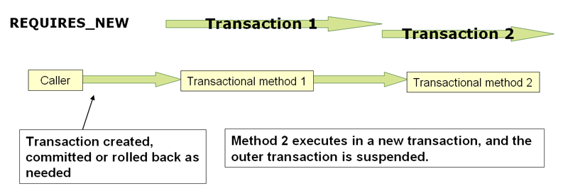

# Spring 事务模型的优势

传统上，EE应用程序开发人员对事务管理有两种选择：全局事务或本地事务，这两种选择都有深刻的局限性。在接下来的两个部分中，将回顾全局和本地事务管理，然后讨论Spring Framework的事务管理支持如何解决全局和本地交易模型的局限性。

## 全局事务

全局事务允许您使用多个事务资源，通常是关系数据库和消息队列。应用服务器通过JTA管理全局事务，JTA是一个繁琐的API（部分原因是其异常模型）。此外，JTA 通常需要来自JNDI的支持。全局事务的使用限制了应用程序代码的任何潜在重用，因为JTA通常只在应用程序服务器环境中可用。

以前，使用全局事务的首选方式是通过EJB CMT（容器管理事务）。CMT是一种声明性事务管理形式（区别于程序化事务管理）。EJB CMT消除了与事务相关的JNDI查找的需要，尽管EJB本身的使用需要使用JNDI。它消除了编写Java代码来控制事务的大部分（但不是全部）需要。显著的缺点是CMT与JTA和应用服务器环境绑定在一起。此外，只有当选择在EJB中实现业务逻辑（或者至少在事务EJB门面后面）时，它才可用。EJB的负面影响是如此之大，以至于这不是一个有吸引力的提议，尤其是在声明性事务管理的令人信服的替代方案面前。

## 本地事务

本地事务是特定于资源的，例如与JDBC连接相关联的事务。本地事务可能更容易使用，但有一个显著的缺点：它们不能跨多个事务资源工作。例如，通过使用JDBC连接来管理事务的代码不能在全局JTA事务中运行。由于应用程序服务器不参与事务管理，因此它无法帮助确保跨多个资源的正确性。值得注意的是，大多数应用程序都使用单个事务资源。另一个缺点是本地事务会侵入编程模型。

Spring解决了全局和本地事务的缺点。它允许应用程序开发人员在任何环境中使用一致的编程模型。您只需编写一次代码，就可以从不同环境中的不同事务管理策略中获益。Spring框架提供声明性和程序性事务管理。

Spring Framework事务抽象，可以在任何底层事务基础设施上运行。对于首选的声明性模型，开发人员通常很少编写或不编写与事务管理相关的代码，因此不依赖于Spring Framework事务API或任何其他事务API。

# 事务抽象-TransactionManager 


```java
public interface PlatformTransactionManager extends TransactionManager {//TransactionManager 是标记接口
	TransactionStatus getTransaction(TransactionDefinition definition) throws TransactionException;
	void commit(TransactionStatus status) throws TransactionException;
	void rollback(TransactionStatus status) throws TransactionException;
}
```

方法抛出的`TransactionException`都是未检查的（也就是说，它扩展了`java.lang.RuntimeException`类）。事务基础结构故障几乎总是致命的，只有至少的情况可以从事务失败中恢复，但spring允许开发人员自由选择是否捕获和处理`TransactionException`。

`getTransaction`方法根据`TransactionDefinition`参数返回`TransactionStatus`对象。如果当前调用堆栈中存在匹配的事务，则返回的`TransactionStatus`可能表示新事务，也可能表示现有事务。后一种情况的含义是，与Jakarta EE事务上下文一样，`TransactionStatus`与执行线程相关联。

`TransactionDefinition` 指定如下信息：

* Propagation：通常，事务范围内的所有代码都在该事务中运行。但是，如果在事务上下文已经存在的情况下运行事务方法，则可以指定行为。例如，代码可以在现有事务中继续运行（常见情况），或者可以挂起现有事务并创建新事务。
* Isolation：此事务与其他事务的工作隔离的级别。例如，此事务是否可以看到来自其他事务的未提交写入？
* Timeout：事务的超时时间，超时后将回滚事务。
* Read-only：当代码读取但不修改数据时，可以使用只读事务。在某些情况下，只读事务可能是一种有用的优化，例如当您使用Hibernate时。

TransactionStatus接口为事务代码提供了一种简单的方式来控制事务执行和查询事务状态：

```java
public interface TransactionStatus extends TransactionExecution, SavepointManager, Flushable {
	@Override
	boolean isNewTransaction();
	boolean hasSavepoint();
	@Override
	void setRollbackOnly();
	@Override
	boolean isRollbackOnly();
	void flush();
	@Override
	boolean isCompleted();
}
```

TransactionManager实现通常需要了解其工作环境：JDBC、JTA、Hibernate等等。以下示例显示了如何定义本地PlatformTransactionManager实现（在本例中，使用普通JDBC）：

```xml
<bean id="txManager" class="org.springframework.jdbc.datasource.DataSourceTransactionManager">
	<property name="dataSource" ref="dataSource"/>
</bean>
```

如果您在Jakarta EE容器中使用JTA，那么您将使用通过JNDI获得的容器DataSource以及Spring的JtaTransactionManager：

```xml
<?xml version="1.0" encoding="UTF-8"?>
<beans xmlns="http://www.springframework.org/schema/beans"
	xmlns:xsi="http://www.w3.org/2001/XMLSchema-instance"
	xmlns:jee="http://www.springframework.org/schema/jee"
	xsi:schemaLocation="
		http://www.springframework.org/schema/beans
		https://www.springframework.org/schema/beans/spring-beans.xsd
		http://www.springframework.org/schema/jee
		https://www.springframework.org/schema/jee/spring-jee.xsd">
  
	<jee:jndi-lookup id="dataSource" jndi-name="jdbc/jpetstore"/>
	<bean id="txManager" class="org.springframework.transaction.jta.JtaTransactionManager" />
  
</beans>
```

在所有Spring事务设置中，应用程序代码不需要更改。您可以仅通过更改配置来更改事务的管理方式，即使这种更改意味着从本地事务转移到全局事务，反之亦然。

您还可以轻松地使用Hibernate本地事务，如以下示例所示。在这种情况下，您需要定义一个Hibernate LocalSessionFactoryBean，您的应用程序代码可以使用它来获取Hibernate会话实例。
```xml
<bean id="sessionFactory" class="org.springframework.orm.hibernate5.LocalSessionFactoryBean">
	<property name="dataSource" ref="dataSource"/>
	<property name="mappingResources">
		<list>
			<value>org/springframework/samples/petclinic/hibernate/petclinic.hbm.xml</value>
		</list>
	</property>
	<property name="hibernateProperties">
		<value>
			hibernate.dialect=${hibernate.dialect}
		</value>
	</property>
</bean>

<bean id="txManager" class="org.springframework.orm.hibernate5.HibernateTransactionManager">
	<property name="sessionFactory" ref="sessionFactory"/>
</bean>
```


如何创建不同的事务管理器，以及如何将它们链接到需要同步到事务的相关资源已经很清楚了。例如 DataSourceTransactionManager 到JDBC DataSource，HibernateTransactionManager 到 Hibernate SessionFactory

本节介绍应用程序代码（直接或间接地，通过使用持久性API，如JDBC、Hibernate或JPA）如何确保正确创建、重用和清理这些资源


首选方法是使用Spring的最高级别的基于模板的持久性集成API，或者使用具有事务感知工厂bean或代理的本地ORM API来管理本地资源工厂。这些事务感知解决方案在内部处理资源创建和重用、清理、资源的可选事务同步以及异常映射。因此，用户数据访问代码不必处理这些任务，而是可以纯粹关注非样板持久性逻辑。通常，您使用原生的ORM API，或者通过使用JdbcTemplate对JDBC访问采用模板方法。这些解决方案将在本参考文档的后续章节中详细介绍。

DataSourceUtils（用于JDBC）、EntityManagerFactoryUtils（适用于JPA）、SessionFactoryUtil（适用于Hibernate）等类存在于较低级别。当您希望应用程序代码直接处理本机持久性API的资源类型时，您可以使用这些类来确保获得正确的Spring Framework托管实例，同步事务（可选），并将进程中发生的异常正确映射到一致的API。

例如，在JDBC的情况下，您可以使用Spring的org.springframework.JDBC.DataSource.DataSourceUtils类，而不是在DataSource上调用getConnection（）方法的传统JDBC方法，如下所示：

```java
Connection conn = DataSourceUtils.getConnection(dataSource);
```

如果现有事务已经有一个同步（链接）到它的连接，则返回该实例。否则，方法调用会触发创建一个新连接，该连接（可选）与任何现有事务同步，并可在同一事务中进行后续重用。如前所述，任何SQLException都封装在Spring Framework CannotGetJdbcConnectionException中，这是Spring Framework的未检查DataAccessException类型的层次结构之一。这种方法为您提供了比从SQLException轻松获得的信息更多的信息，并确保了跨数据库甚至跨不同持久性技术的可移植性。

这种方法也可以在没有Spring事务管理的情况下工作（事务同步是可选的），因此无论是否使用Spring进行事务管理，都可以使用它。

当然，一旦您使用了Spring的JDBC支持、JPA支持或Hibernate支持，您通常不喜欢使用DataSourceUtils或其他辅助类，因为与直接使用相关API相比，您更喜欢使用Spring抽象。例如，如果您使用Spring JdbcTemplate或jdbc.object包来简化jdbc的使用，则可以在后台进行正确的连接检索，并且无需编写任何特殊代码。


在最底层存在TransactionAwareDataSourceProxy类。这是目标DataSource的代理，它封装目标DataSource以添加对Spring托管事务的感知。在这方面，它类似于由Jakarta EE服务器提供的事务性JNDI DataSource。

您几乎不应该需要或想要使用此类，除非必须调用现有代码并传递标准JDBC DataSource接口实现。在这种情况下，该代码可能是可用的，但参与了Spring管理的事务。您可以使用前面提到的高级抽象来编写新代码。


# 声明式事务

Spring框架的声明性事务管理是通过Spring面向方面编程（AOP）实现的。Spring Framework的声明性事务管理类似于EJB CMT，因为您可以指定事务行为（或不指定事务行为），直到单个方法级别。如果需要，可以在事务上下文中调用setRollbackOnly。这两种类型的交易管理的区别在于：

* 与绑定到JTA的EJB CMT不同，Spring框架的声明性事务管理适用于任何环境。它可以使用JDBC、JPA或Hibernate通过调整配置文件来处理JTA事务或本地事务。
* 您可以将SpringFramework声明性事务管理应用于任何类，而不仅仅是EJB之类的特殊类。
* Spring框架提供了声明性回滚规则，这是一个没有EJB等效功能的特性。提供了对回滚规则的程序性和声明性支持。
* Spring Framework允许您使用AOP自定义事务行为。例如，您可以在事务回滚的情况下插入自定义行为。您还可以添加任意建议以及事务性建议。使用EJB CMT，除了使用setRollbackOnly（）之外，您不能影响容器的事务管理。
* Spring Framework不像高端应用程序服务器那样支持跨远程调用传播事务上下文。如果您需要此功能，我们建议您使用EJB。但是，在使用这样的功能之前要仔细考虑，因为通常情况下，不希望事务跨越远程调用。

回滚规则的概念很重要。它们允许您指定哪些异常（和可丢弃的）应导致自动回滚。您可以在配置中以声明方式指定，而不是在Java代码中。因此，尽管您仍然可以对TransactionStatus对象调用setRollbackOnly（）来回滚当前事务，但大多数情况下，您可以指定MyApplicationException必须始终导致回滚的规则。此选项的显著优点是业务对象不依赖于事务基础结构。例如，他们通常不需要导入Spring事务API或其他Spring API。

尽管EJB容器默认行为在系统异常（通常是运行时异常）上自动回滚事务，EJB CMT不会在应用程序异常（即除java.rmi.RemoteException之外的已检查异常）上自动回滚事务。虽然声明性事务管理的Spring默认行为遵循EJB约定（仅在未检查异常上自动回滚），但自定义此行为通常很有用。


## 原理

仅仅告诉你用@Transactional注释来注释你的类，将@EnableTransactionManagement添加到你的配置中，并期望你了解它是如何工作的，这是不够的。为了提供更深入的理解，本节将在事务相关问题的上下文中解释Spring Framework的声明性事务基础设施的内部工作。

关于Spring Framework的声明性事务支持，需要掌握的最重要的概念是，这种支持是通过AOP代理启用的，并且事务建议是由元数据驱动的（目前是基于XML或注释的）。AOP与事务元数据的组合产生了一个AOP代理，该代理使用TransactionInterceptor与适当的TransactionManager实现来驱动方法调用周围的事务。

Spring Framework的TransactionInterceptor为命令式和反应式编程模型提供事务管理。拦截器通过检查方法返回类型来检测所需的事务管理风格。返回响应式类型（如Publisher或Kotlin Flow（或其子类型）的方法符合响应式事务管理的条件。包括void在内的所有其他返回类型都使用命令式事务管理的代码路径。

事务管理会影响需要哪个事务管理器。强制事务需要PlatformTransactionManager，而响应事务使用ReactiveTransactionManager实现。


@Transactional通常使用PlatformTransactionManager管理的线程绑定事务，将事务暴露给当前执行线程中的所有数据访问操作。注意：这不会传播到方法中新启动的线程。
由ReactiveTransactionManager管理的反应事务使用Reactor上下文而不是线程本地属性。因此，所有参与的数据访问操作都需要在同一反应管道中的同一Reactor上下文中执行。

下图显示了在事务代理上调用方法的概念视图：


# 编程式事务管理

Spring Framework提供了两种编程事务管理方法：

* TransactionTemplate 或 TransactionalOperator
* 直接使用 TransactionManager 实现。

Spring团队通常建议TransactionTemplate用于命令流中的程序化事务管理，TransactionalOperator用于响应式代码。第二种方法类似于使用JTA UserTransaction API，但简化了异常处理。

## `TransactionTemplate`

TransactionTemplate采用了与其他Spring模板（如JdbcTemplate）相同的方法。它使用回调方法，使应用程序代码不必使用样板获取和释放事务资源。

```JAVA
public class SimpleService implements Service {

	// single TransactionTemplate shared amongst all methods in this instance
	private final TransactionTemplate transactionTemplate;

	// use constructor-injection to supply the PlatformTransactionManager
	public SimpleService(PlatformTransactionManager transactionManager) {
		this.transactionTemplate = new TransactionTemplate(transactionManager);
	}

	public Object someServiceMethod() {
		return transactionTemplate.execute(new TransactionCallback() {
			// the code in this method runs in a transactional context
			public Object doInTransaction(TransactionStatus status) {
				updateOperation1();
				return resultOfUpdateOperation2();
			}
		});
	}
}
```

如果不需要返回值：

```JAVA
transactionTemplate.execute(new TransactionCallbackWithoutResult() {
	protected void doInTransactionWithoutResult(TransactionStatus status) {
		updateOperation1();
		updateOperation2();
	}
});
```

回调中的代码可以通过对提供的TransactionStatus对象调用setRollbackOnly（）方法来回滚事务，如下所示：

```JAVA
transactionTemplate.execute(new TransactionCallbackWithoutResult() {

	protected void doInTransactionWithoutResult(TransactionStatus status) {
		try {
			updateOperation1();
			updateOperation2();
		} catch (SomeBusinessException ex) {
			status.setRollbackOnly();
		}
	}
});
```

您可以在TransactionTemplate上指定事务设置（如传播模式、隔离级别、超时等）。默认情况下，TransactionTemplate实例具有默认的事务设置。你可以通过下面方式自定义：

```JAVA
public class SimpleService implements Service {

	private final TransactionTemplate transactionTemplate;

	public SimpleService(PlatformTransactionManager transactionManager) {
		this.transactionTemplate = new TransactionTemplate(transactionManager);

		// the transaction settings can be set here explicitly if so desired
		this.transactionTemplate.setIsolationLevel(TransactionDefinition.ISOLATION_READ_UNCOMMITTED);
		this.transactionTemplate.setTimeout(30); // 30 seconds
		// and so forth...
	}
}
```

> TransactionTemplate类的实例是线程安全的，因为实例不维护任何会话状态。但是，TransactionTemplate实例确实维护配置状态。因此，虽然许多类可能共享一个TransactionTemplate实例，但如果一个类需要使用具有不同设置（例如，不同隔离级别）的TransactionTemplate，则需要创建两个不同的TransactionTemplate实例。

## `TransactionalOperator`

必须在事务上下文中运行并显式使用TransactionalOperator的应用程序代码示例：

```JAVA
public class SimpleService implements Service {

	// single TransactionalOperator shared amongst all methods in this instance
	private final TransactionalOperator transactionalOperator;

	// use constructor-injection to supply the ReactiveTransactionManager
	public SimpleService(ReactiveTransactionManager transactionManager) {
		this.transactionalOperator = TransactionalOperator.create(transactionManager);
	}

	public Mono<Object> someServiceMethod() {

		// the code in this method runs in a transactional context

		Mono<Object> update = updateOperation1();

		return update.then(resultOfUpdateOperation2).as(transactionalOperator::transactional);
	}
}
```

TransactionalOperator可以通过两种方式使用：

* reactor 类型的操作符：`mono.as(transactionalOperator::transactional)`
* 适用于其他案例的回调：`transactionalOperator.execute(TransactionCallback<T>)`

回调中的代码可以通过对提供的ReactiveTransaction对象调用setRollbackOnly方法来回滚事务，如下所示：

```JAVA
transactionalOperator.execute(new TransactionCallback<>() {

	public Mono<Object> doInTransaction(ReactiveTransaction status) {
		return updateOperation1().then(updateOperation2)
					.doOnError(SomeBusinessException.class, e -> status.setRollbackOnly());
		}
	}
});
```

在Reactive Streams中，订阅服务器可以取消其订阅并停止其发布服务器。Project Reactor中的运算符以及其他库中的运算符，如next（）、take（long）、timeout（Duration），都可以发出取消操作。无法知道取消的原因，无论是由于错误还是根本没有兴趣进一步消费。由于取消信号导致回滚。因此，重要的是要考虑事务发布服务器下游使用的运算符。特别是在Flux或其他多值发布服务器的情况下，必须消耗全部输出才能完成事务。


您可以在`TransactionalOperator`上指定事务设置（如传播模式、隔离级别、超时等）。默认情况下，`TransactionalOperator`实例具有默认的事务设置。你可以通过下面方式自定义：

```JAVA
public class SimpleService implements Service {

	private final TransactionalOperator transactionalOperator;

	public SimpleService(ReactiveTransactionManager transactionManager) {
		DefaultTransactionDefinition definition = new DefaultTransactionDefinition();

		// the transaction settings can be set here explicitly if so desired
		definition.setIsolationLevel(TransactionDefinition.ISOLATION_READ_UNCOMMITTED);
		definition.setTimeout(30); // 30 seconds
		// and so forth...

		this.transactionalOperator = TransactionalOperator.create(transactionManager, definition);
	}
}
```

## `TransactionManager`

### 使用 `PlatformTransactionManager`

```JAVA
DefaultTransactionDefinition def = new DefaultTransactionDefinition();
// explicitly setting the transaction name is something that can be done only programmatically
def.setName("SomeTxName");
def.setPropagationBehavior(TransactionDefinition.PROPAGATION_REQUIRED);

TransactionStatus status = txManager.getTransaction(def);
try {
	// put your business logic here
} catch (MyException ex) {
	txManager.rollback(status);
	throw ex;
}
txManager.commit(status);
```

### 使用 `ReactiveTransactionManager`

```JAVA
DefaultTransactionDefinition def = new DefaultTransactionDefinition();
// explicitly setting the transaction name is something that can be done only programmatically
def.setName("SomeTxName");
def.setPropagationBehavior(TransactionDefinition.PROPAGATION_REQUIRED);

Mono<ReactiveTransaction> reactiveTx = txManager.getReactiveTransaction(def);

reactiveTx.flatMap(status -> {

	Mono<Object> tx = ...; // put your business logic here

	return tx.then(txManager.commit(status))
			.onErrorResume(ex -> txManager.rollback(status).then(Mono.error(ex)));
});
```


# 事务事件处理

您可以使用`@EventListener`注册常规事件侦听器。如果需要将其绑定到事务，请使用`@TransactionalEventListener`。侦听器默认绑定到事务的提交阶段。


* `TransactionalApplicationListenerAdapter` 注册实现 ApplicationListener 的实例，并监听事件。

* `TransactionalApplicationListenerMethodAdapter` 注册用 @TransactionalEventListener 标注的方法，并监听事件。


TransactionalApplicationListenerSynchronization：发送触发事件，被上面的adapter调用。

AbstractPlatformTransactionManager 


下一个例子展示了这个概念。假设一个组件发布了一个订单创建的事件，并且我们希望定义一个侦听器，该侦听器只应在发布该事件的事务成功提交后才处理该事件。以下示例设置了这样一个事件侦听器：

```JAVA
@Component
public class MyComponent {

	@TransactionalEventListener
	public void handleOrderCreatedEvent(CreationEvent<Order> creationEvent) {
		// ...
	}
}
```

@TransactionalEventListener注释公开了一个阶段属性，该属性允许您自定义侦听器应绑定到的事务的阶段。有效阶段为BEFORE_COMMIT、AFTER_COMMIT（默认）、AFTER_ROLLBACK以及聚合事务完成（无论是提交还是回滚）的AFTER_COMPLETION。

如果没有事务正在运行，则根本不会调用侦听器，因为我们无法遵守所需的语义。但是，您可以通过将注释的fallbackExecution属性设置为true来覆盖该行为。


从6.1起，@TransactionalEventListener可以处理PlatformTransactionManager管理的线程绑定事务以及ReactiveTransactionManager管理。对于前者，侦听器可以保证看到当前的线程绑定事务。由于后者使用Reactor上下文而不是线程本地变量，因此事务上下文需要作为事件源包含在已发布的事件实例中。有关详细信息，请参阅TransactionalEventPublisher javadoc。

# `@Transactional`

如上所述在类级别使用，注释指示声明类（及其子类）的所有方法的默认值。或者，每个方法都可以单独进行注释。有关Spring认为哪些方法是事务性的，请参阅方法可见性。请注意，类级注释不适用于类层次结构上的祖先类；在这种情况下，继承的方法需要在本地重新声明，以便参与子类级别的注释。

当像上面这样的POJO类在Spring上下文中被定义为bean时，您可以通过@Configuration类中的@EnableTransactionManagement注释使bean实例具有事务性。有关详细信息，请参阅javadoc。


### 代理模式下的方法可见性和@Transactional

@Transactional注释通常用于具有公共可见性的方法。从6.0开始，默认情况下，对于基于类的代理，受保护或包可见的方法也可以是事务性的。请注意，基于接口的代理中的事务方法必须始终是公共的，并在代理接口中定义。对于这两种代理，只拦截通过代理传入的外部方法调用。


如果您希望在不同类型的代理之间一致地处理方法可见性（这是5.3之前的默认设置），请考虑指定publicMethodsOnly：

```JAVA
@Bean
TransactionAttributeSource transactionAttributeSource() {
	return new AnnotationTransactionAttributeSource(true);
}
```

可以将@Transactional注释应用于接口定义、接口上的方法、类定义或类上的方法。然而，仅仅存在@Transactional注释不足以激活事务行为。@Transactional注释只是相应的运行时基础设施可以使用的元数据，该基础设施使用该元数据来配置具有事务行为的适当bean。在前面的示例中，<tx:annotation-driven/>元素在运行时打开实际事务管理。


Spring团队建议您使用@Transactional注释来注释具体类的方法，而不是依赖于接口中的注释方法，即使后者在5.0之前确实适用于基于接口和目标类代理。由于Java注释不是从接口继承的，所以在使用AspectJ模式时，编织基础结构仍然无法识别接口声明的注释，因此不会应用方面。因此，您的事务注释可能会被默默地忽略：您的代码可能看起来“正常工作”，直到您测试回滚场景为止。

在代理模式（这是默认模式）下，只有通过代理传入的外部方法调用才会被拦截。这意味着自调用（实际上，目标对象中的一个方法调用目标对象的另一个方法）在运行时不会导致实际事务，即使调用的方法标记为@Transactional。此外，代理必须完全初始化才能提供预期的行为，因此您不应该在初始化代码中依赖此功能 — 例如在@PostConstruct方法中。


如果您希望自调用也包含事务，请考虑使用AspectJ模式。在这种情况下，首先没有代理。相反，目标类被编织也就是说，它的字节码被修改，以支持@Transactional运行时行为。AspectJ编织需要类路径中的spring-aspects.jar，并启用加载时编织（或编译时编织）。

| 注解属性                            | 默认值                      | 描述                                                         |
| ----------------------------------- | :-------------------------- | ------------------------------------------------------------ |
| 参考TransactionManagementConfigurer | transactionManager          | 要使用的事务管理器的名称。                                   |
| mode                                | proxy                       | 默认模式（proxy）通过使用Spring的AOP框架来处理要代理的带注释的bean（如前所述，遵循代理语义，仅适用于通过代理传入的方法调用）。替代模式（aspectj）将受影响的类与Spring的aspectj事务方面编织在一起，修改目标类字节码以应用于任何类型的方法调用。 |
| proxyTargetClass                    | false                       | 仅适用于代理模式。控制创建什么类型的事务代理。如果代理目标类属性设置为true，则会创建基于类的代理。如果proxy-target类为false或省略了属性，则会创建标准的JDK接口代理。 |
| order                               | `Ordered.LOWEST_PRECEDENCE` |                                                              |

代理模式下，同一类中的本地调用不能被拦截。


@Transactional注释是指定接口、类或方法必须具有事务语义的元数据（例如，“在调用此方法时启动全新的只读事务，挂起任何现有事务”）。默认的@Transactional设置如下：

* PROPAGATION_REQUIRED
* ISOLATION_DEFAULT
* 事务是可读可写的
* 事务超时默认为底层事务系统的默认超时，如果不支持超时，则为无。
* 任何RuntimeException或Error都会触发回滚，而可检查的Exception则不会。

注解上可配置的元数据：

| Property                                                     | Type                                                         | Description                                                  |
| :----------------------------------------------------------- | :----------------------------------------------------------- | :----------------------------------------------------------- |
| [value](https://docs.spring.io/spring-framework/reference/data-access/transaction/declarative/annotations.html#tx-multiple-tx-mgrs-with-attransactional) | String                                                       | 指定要使用的事务管理器的可选限定符。                         |
| `transactionManager`                                         | `String`                                                     | Alias for `value`.                                           |
| `label`                                                      | “字符串”标签数组，用于向事务添加表达性描述。                 | 标签可以由事务管理器进行评估，以实现特定的行为与实际事务相关联。 |
| [propagation](https://docs.spring.io/spring-framework/reference/data-access/transaction/declarative/tx-propagation.html) | `enum`: `Propagation`                                        | Optional propagation setting.                                |
| `isolation`                                                  | `enum`: `Isolation`                                          | 可选隔离级别。仅适用于“REQUIRED”或“REQUIRES_NEW”的传播值。   |
| `timeout`                                                    | `int` (in seconds of granularity)                            | 可选事务超时。仅适用于“REQUIRED”或“REQUIRES_NEW”的传播值。   |
| `timeoutString`                                              | `String` (in seconds of granularity)                         | 将“timeout”（以秒为单位）指定为“String”值的替代方法 — 例如作为占位符。 |
| `readOnly`                                                   | `boolean`                                                    | 读写事务与只读事务。仅适用于“REQUIRED”或“REQUIRES_NEW”的值。 |
| `rollbackFor`                                                | Array of `Class` objects, which must be derived from `Throwable.` | Optional array of exception types that must cause rollback.  |
| `rollbackForClassName`                                       | Array of exception name patterns.                            | Optional array of exception name patterns that must cause rollback. |
| `noRollbackFor`                                              | Array of `Class` objects, which must be derived from `Throwable.` | Optional array of exception types that must not cause rollback. |
| `noRollbackForClassName`                                     | Array of exception name patterns.                            | Optional array of exception name patterns that must not cause rollback. |

目前，您无法显式控制事务的名称，其中“name”表示出现在事务监视器和日志输出中的事务名称。对于声明性事务，事务名称始终是完全限定的类名+.+事务建议类的方法名。例如，如果BusinessService类的handlePayment（..）方法启动了一个事务，则该事务的名称将为：com.example.BusinessService.handlePayment。


## 事务的传播机制

逻辑事务和物理事务

## `PROPAGATION_REQUIRED`


PROPAGATION_REQUIRED强制你的代码包裹在物理事务中，如果还不存在事务，则为当前作用域创建事务，或者向上参与为更大作用域定义的现有“外部”事务。在同一线程内的堆栈调用中，这是一个很好的默认设置。例如，一个服务，调用几个存储库方法，其中所有底层资源都必须参与服务级别事务。

默认情况下，当前执行方法加入外部作用域的事务中时，会忽略本地隔离级别、超时值或只读标志（如果有的话）。如果您希望在参与具有不同隔离级别的现有事务时拒绝隔离级别声明，请考虑在事务管理器上将validateExistingTransactions标志切换为true。这种非宽松模式还拒绝只读不匹配（即，内部读写事务方法试图参与只读外部作用域事务）。

当传播设置为propagation_REQUIRED时，将为应用该设置的每个方法创建一个逻辑事务范围。每个这样的逻辑事务作用域可以单独确定仅回滚状态，外部事务作用域在逻辑上独立于内部事务作用域。在标准PROPAGATION_REQUIRED行为的情况下，所有这些作用域都映射到同一物理事务。因此，在内部事务范围中设置的仅回滚标记确实会影响外部事务实际提交的机会。

然而，在内部事务范围设置仅回滚标记的情况下，外部事务尚未决定回滚本身，因此回滚（由内部事务范围静默触发）是意外的。此时会引发相应的UnexpectedRollbackException。这是预期的行为，因此事务的调用方永远不会被误导，以为提交是在实际没有执行的情况下执行的。因此，如果内部事务（外部调用方不知道该事务）以静默方式将事务标记为仅回滚，则外部调用方仍然调用commit。外部调用程序需要接收一个UnexpectedRollbackException，以清楚地表明已执行回滚。

## `PROPAGATION_REQUIRES_NEW`



与PROPAGATION_REQUIRED相比，PROPAGATION_REQUIRES_NEW始终为每个受影响的事务范围使用独立的物理事务，从不参与外部范围的现有事务。在这种安排中，底层事务资源是不同的，因此可以独立提交或回滚，外部事务不受内部事务回滚状态的影响，内部事务的锁在完成后立即释放。这样一个独立的内部事务还可以声明自己的隔离级别、超时和只读设置，而不继承外部事务的特性。

当内部事务获取自己的资源（如新的数据库连接）时，附加到外部事务的资源将保持绑定。如果几个线程有一个活动的外部事务并等待为其内部事务获取新连接，而连接池无法再分发任何此类内部连接，这可能会导致连接池耗尽，并可能导致死锁。除非连接池大小适当，并发线程数至少1，否则不要使用PROPAGATION_REQUIRES_NEW。

## `PROPAGATION_NESTED`

PROPAGATION_NESTED使用具有多个保存点的单个物理事务，可以回滚到这些保存点。这种部分回滚使内部事务作用域触发其作用域的回滚，而外部事务能够继续物理事务，尽管某些操作已回滚。此设置通常映射到JDBC保存点，因此它仅适用于JDBC资源事务。请参阅Spring的DataSourceTransactionManager。
