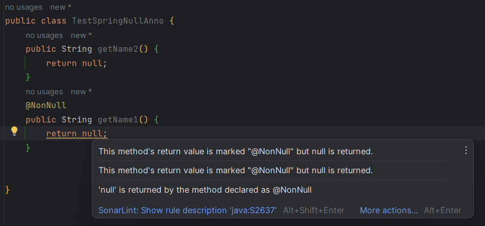

校验注解分为下面几类：

* 静态编译型: 
  * 生成式: lombok 的 `@NoNull`
  * 校验式: `jsr305` ，一套用来给代码分析工具( FindBugs、IntelliJ、Checkstyle 和 PMD)检查代码缺陷用的注解
* 动态代理型: `jsr303`(Bean Validation规范)

# JSR305注解规范

`jsr305`是一个规范，具体来说是一套用来给代码分析工具( FindBugs、IntelliJ、Checkstyle 和 PMD)检查代码缺陷用的注解，类似`jsr303`(Bean Validation规范)。

诸如 FindBugs、IntelliJ、Checkstyle 和 PMD 这样的静态分析工具在 Java 开发中得到了广泛应用。这些工具都很强大，但是有一些共同的问题它们都很难解决。比如何时值可以为 null，或者何时数字值不能为负。完备的 API 会将这些设计细节记录在 JavaDoc 之中，但是分析工具却无法发现类似细节，从而有可能将其忽略或是导致错误的检测结果。

为了解决这些问题，有些静态分析工具开发人员试图使用注解来定义相关细节。比如 FindBugs 和 IntelliJ 都定义了自己的注解，以表示方法何时返回 null。不过，这两个工具使用的注解有细微不同，也因此有了标准化的需求。由 FindBugs 创建人 Bill Pugh 带领制定的 JSR-305 标准，试图创建一套标准注解供分析工具使用，同时希望允许开发人员根据自己的需要添加额外的注解。当前提案中包括供判断是否为空、正负号、开发语言和线程等方面的众多注解。

## Spring 支持

Spring注解是用 [JSR 305](https://jcp.org/en/jsr/detail?id=305) 注解进行元注解的。JSR-305元注解让IDEA等工具以通用方式提供 null-safety 支持，而无需对Spring注解进行硬编码支持。

没有必要也不建议在项目classpath中添加JSR-305的依赖关系来利用Spring的 null-safe API。只有在编写基于Spring的类库（Libraries ）时，应在Gradle配置中添加 `com.google.code.findbugs:jsr305:3.0.2` 的 `compileOnly` 或 Maven `provided` scope，以免出现编译警告。

- [`@Nullable`](https://docs.spring.io/spring-framework/docs/6.0.8-SNAPSHOT/javadoc-api/org/springframework/lang/Nullable.html): 表明一个特定的参数、返回值或字段可以是 `null` 的。
- [`@NonNull`](https://docs.spring.io/spring-framework/docs/6.0.8-SNAPSHOT/javadoc-api/org/springframework/lang/NonNull.html): 表明特定的参数、返回值或字段不能为 `null`
- [`@NonNullApi`](https://docs.spring.io/spring-framework/docs/6.0.8-SNAPSHOT/javadoc-api/org/springframework/lang/NonNullApi.html): 包级注解，表明该包下面所有的参数和返回值都不能为空。
- [`@NonNullFields`](https://docs.spring.io/spring-framework/docs/6.0.8-SNAPSHOT/javadoc-api/org/springframework/lang/NonNullFields.html): 包级注解，表明该包下面所有的字段不能为空。

> 目前还不支持泛型参数、可变长参数和数组元素

示例：




# lombok 的 @NoNull

如果放在参数上，lombok将在方法/构造函数体的开头插入一个null检查，并抛出一个NullPointerException，该参数的名称作为消息。如果放在字段上，任何为该字段赋值的生成方法也会产生这些空检查。

```java
@Getter
@Setter
@AllArgsConstructor
public class Question {
    @NonNull
    private String text;
}
```

生成的代码如下：

```java
public class Question {
    private @NonNull String text;

    public @NonNull String getText() {
        return this.text;
    }
     // 增加了对参数的判空，而不是对字段的判空
    public void setText(final @NonNull String text) {
        if (text == null) {
            throw new NullPointerException("text is marked non-null but is null");
        } else {
            this.text = text;
        }
    }
    // 增加了对参数的判空，而不是对字段的判空
    public Question(final @NonNull String text) {
        if (text == null) {
            throw new NullPointerException("text is marked non-null but is null");
        } else {
            this.text = text;
        }
    }
}
```

> 当注解到字段时，在生成类时，**任何赋值该字段的地方**会检查参数是否为空


# Bean Validation

约束应用的范围：

- 字段级别

- 方法级别

- 容器元素

- 类级别

```java
    @NotNull
    private String manufacturer;
    @NotNull
    public String getManufacturer() {
        return manufacturer;
    }
    private List<@NotNull String> data;
    private Set<@Size(min = 3) String> data;
    private Map<@Size(min = 3) String, @Size(min = 3) String> data;
    private Optional<@Max(100) Integer> num;

```

@Valid 开启级联验证：

```java
public class Car {

    @NotNull
    @Valid
    private Person driver;

    //...
}

public class Person {
    @NotNull
    private String name;
    //...
}

```

从BeanValidation1.1开始，约束不仅可以应用于JavaBeans及其属性，还可以应用于任何Java类型的方法和构造函数的参数和返回值。


```java
dependencies {
    annotationProcessor 'org.hibernate.validator:hibernate-validator-annotation-processor:8.0.0.Final'
}

```

> 使用该依赖检查注解是否正确使用，例如：
>
> ```java
> public class Echo {
>     @NotNull
>     @Positive
>     private String name;
> }
> 
> ```
>
> 在编译期间可以检查出下面的错误：
>
> ```shell
> The annotation @Positive is disallowed for this data type.
>     @Positive
>     ^
> ```

## Spring支持

Spring 对 Bean Validation API  进行了全面支持， 包括在启动的时候注册 Bean Validation provider 为spring bean。您在只需要在验证位置注入`jakarta.validation.ValidatorFactory`或`jakarta.validation.Validator`。

您可以使用`LocalValidatorFactoryBean`将默认Validator配置为Spring bean，如下例所示：

```java
@Configuration
public class AppConfig {
	@Bean
	public LocalValidatorFactoryBean validator() {
		return new LocalValidatorFactoryBean();
	}
}
```

LocalValidatorFactoryBean 配置 默认引导机制。Bean验证提供程序，如Hibernate Validator，如果出现在类路径中，就会被自动检测到。

`LocalValidatorFactoryBean` 同时实现了 `jakarta.validation.ValidatorFactory` 和 `jakarta.validation.Validator`，以及Spring的 `org.springframework.validation.Validator`。你可以将这些接口的引用注入到需要调用验证逻辑的Bean中。


## 自定义注解

每个验证约束由两部分组成。

- 一个 `@Constraint` 注解，声明了约束及其可配置的属性。
- `jakarta.validation.ConstraintValidator` 接口实现，实现约束的行为。

为了将声明与实现联系起来，每个 `@Constraint` 注解都会引用一个相应的 `ConstraintValidator` 实现类。在运行时，当你的domain模型中出现约束注解时， `ConstraintValidatorFactory` 会实例化所引用的实现。

默认情况下，`LocalValidatorFactoryBean` 使用`SpringConstraintValidatorFactory`创建 `ConstraintValidator` 实例。这让你的自定义 `ConstraintValidators` 像其他 Spring Bean 一样受益于依赖注入。

```java
@Target({ElementType.METHOD, ElementType.FIELD})
@Retention(RetentionPolicy.RUNTIME)
@Constraint(validatedBy=MyConstraintValidator.class)
public @interface MyConstraint {
}
```

```java
public class MyConstraintValidator implements ConstraintValidator {

    @Autowired;
    private Foo aDependency;

    // ...
}
```

> ConstraintValidator 的实现可以像其他Spring Bean一样被 @Autowired

## Spring驱动的方法验证

Bean Validation 的 方法验证，由 MethodValidationPostProcessor  bean 集成。

```java
@Configuration
public class AppConfig {

    @Bean
    public MethodValidationPostProcessor validationPostProcessor() {
        return new MethodValidationPostProcessor();
    }
}
```

为了有资格进行Spring驱动的方法验证，**所有目标类都需要使用Spring的@Validated进行注释**，该注释还可以选择性地声明要使用的验证组。

## DataBinder

DataBinder 对验证过程进行了API抽象，下面式一个示例：

```java
Foo target = new Foo();
DataBinder binder = new DataBinder(target);
binder.setValidator(new FooValidator());

// bind to the target object
binder.bind(propertyValues);

// validate the target object
binder.validate();

// get BindingResult that includes any validation errors
BindingResult results = binder.getBindingResult();
```

你也可以通过 `dataBinder.addValidators` 和 `dataBinder.replaceValidators` 为 `DataBinder` 配置多个 `Validator` 实例。

## Spring MVC 支持

默认情况下，如果类路径上存在Bean Validation（例如，Hibernate Validator），则LocalValidatorFactoryBean将注册为全局Validator，用于控制器方法参数上的@Valid和@Validated。


请注意，您也可以在注册本地Validator实现，如下例所示：

```java
@Controller
public class MyController {

	@InitBinder
	protected void initBinder(WebDataBinder binder) {
		binder.addValidators(new FooValidator());
	}
}
```

示例：

```java
@RestController
public class GetHeaderController {

    @PostMapping("save")
    public void save(@RequestBody @Validated UserReq req){}
}
@RestController
public class GetHeaderController {

    @PostMapping("save")
    public void save(@RequestBody @Valid UserReq req){}
}
```

> 在 Controller 层 ，开始 对象参数的校验，可以使用 @Validated 或者 @Valid ，两者功能基本相同。但是对简单参数，必须使用 Validated 注解且必须定义在类级别（AOP代理类）：
>
> ```java
> @RestController
> @Validated
> public class GetHeaderController {
>     
>     @PostMapping("get")
>     public void get(@NotBlank(message = "名称 is required") String name,@NotBlank(message = "邮箱 is required") String email) throws JsonProcessingException {
> 
>     }
> }
> 
> ```

> 同样的，你也可以在service层使用检验，但是必须使用 Validated 注解 service， 就像上面的controller。
