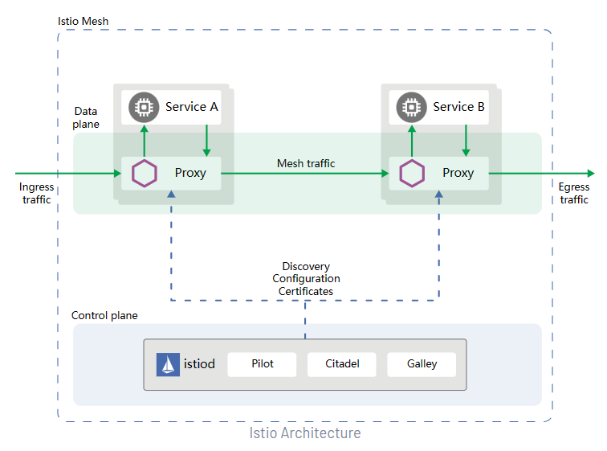
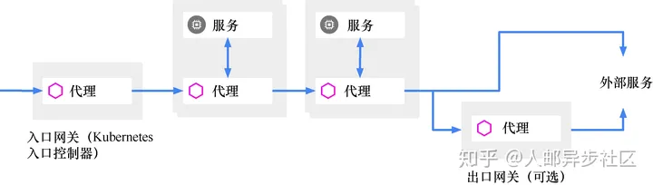
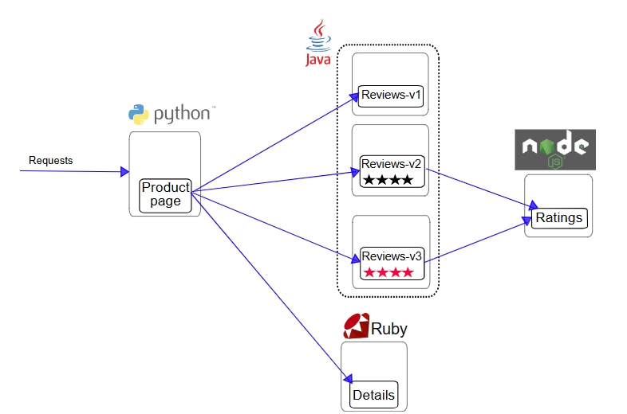
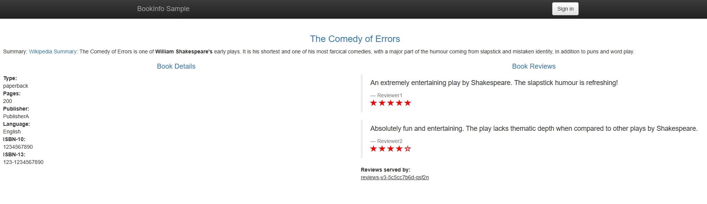
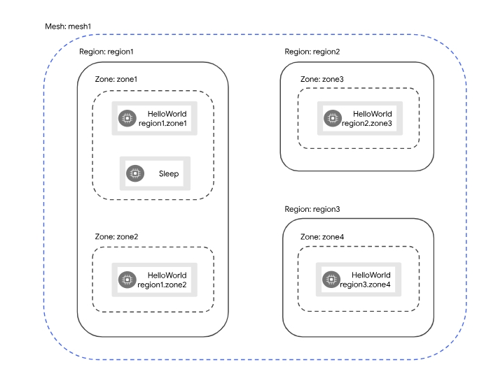
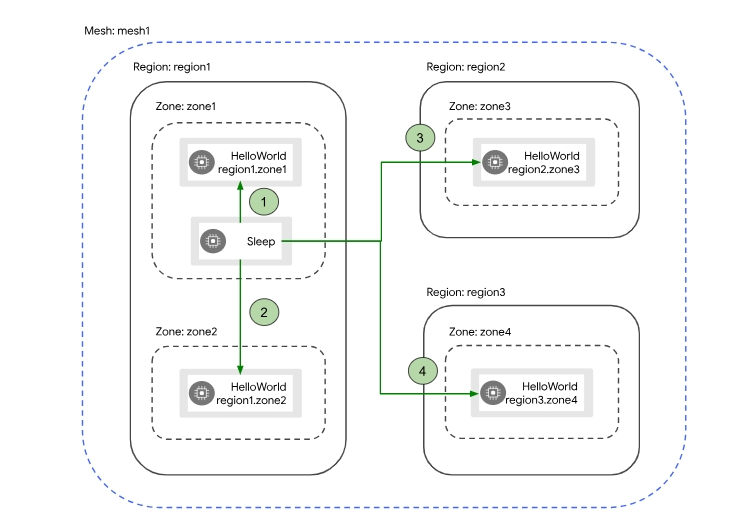

# 架构

Istio 服务网格从逻辑上分为**数据平面**和**控制平面**。

- **数据平面** 由一组智能代理（[Envoy](https://www.envoyproxy.io/)）组成， 被部署为 Sidecar。这些代理负责协调和控制微服务之间的所有网络通信。 它们还收集和报告所有网格**流量**的遥测数据。
- **控制平面** 管理并配置代理来进行流量路由。



## Envoy

Istio 使用 [Envoy](https://www.envoyproxy.io/) 代理的扩展版本。Envoy 是用 C++ 开发的高性能代理，用于协调服务网格中所有服务的入站和出站流量。Envoy 代理是唯一与数据平面流量交互的 Istio 组件。

Envoy 代理被部署为服务的 Sidecar，在逻辑上为服务增加了 Envoy 的许多内置特性，例如：

- 动态服务发现
- 负载均衡
- TLS 终端
- HTTP/2 与 gRPC 代理
- 熔断器
- 健康检查
- 基于百分比流量分割的分阶段发布
- 故障注入
- 丰富的指标

这种 Sidecar 部署允许 Istio 可以执行策略决策，并提取丰富的遥测数据， 接着将这些数据发送到监视系统以提供有关整个网格行为的信息。

Sidecar 代理模型还允许您向现有的部署添加 Istio 功能，而不需要重新设计架构或重写代码。

由 Envoy 代理启用的一些 Istio 的功能和任务包括：

- 流量控制功能：通过丰富的 HTTP、gRPC、WebSocket 和 TCP 流量路由规则来执行细粒度的流量控制。
- 网络弹性特性：重试设置、故障转移、熔断器和故障注入。
- 安全性和身份认证特性：执行安全性策略，并强制实行通过配置 API 定义的访问控制和速率限制。
- 基于 WebAssembly 的可插拔扩展模型，允许通过自定义策略执行和生成网格流量的遥测。

## Istiod

控制平面做了进一步的细分，分成了 Pilot、Citadel 和 Galley，它们的各自功能如下：

- Pilot：为 Envoy 提供了服务发现，流量管理和智能路由（AB 测试、金丝雀发布等），以及错误处理（超时、重试、熔断）功能。
- Citadel：为服务之间提供认证和证书管理，可以让服务自动升级成 TLS 协议。
- Galley：Galley 是 Istio 的配置验证、提取、处理和分发组件。它负责将其余的 Istio 组件与从底层平台（例如 Kubernetes）获取用户配置的细节隔离开来。

* 用于可扩展性的Mixer之类的组件

Istiod 将控制流量行为的高级路由规则转换为 Envoy 特定的配置， 并在运行时将其传播给 Sidecar。Pilot 提取了特定平台的服务发现机制， 并将其综合为一种标准格式，任何符合 [Envoy API](https://www.envoyproxy.io/docs/envoy/latest/api/api) 的 Sidecar 都可以使用。

Istio 可以支持发现多种环境，如 Kubernetes 或 VM。

您可以使用 Istio [流量管理 API](https://istio.io/latest/zh/docs/concepts/traffic-management/#introducing-istio-traffic-management) 让 Istiod 重新构造 Envoy 的配置，以便对服务网格中的流量进行更精细的控制。

Istiod [安全](https://istio.io/latest/zh/docs/concepts/security/)通过内置的身份和凭证管理， 实现了强大的服务对服务和终端用户认证。您可以使用 Istio 来升级服务网格中未加密的流量。 使用 Istio，运营商可以基于服务身份而不是相对不稳定的第 3 层或第 4 层网络标识符来执行策略。 此外，您可以使用 [Istio 的授权功能](https://istio.io/latest/zh/docs/concepts/security/#authorization)控制谁可以访问您的服务。

Istiod 充当证书授权（CA），并生成证书以允许在数据平面中进行安全的 mTLS 通信。

## **入口网关（Ingress）和出口网关（Egress）**

服务间通信是通过Envoy代理进行的。同样，我们也可以在整个系统的入口和出口处部署代理，使得所有流入和流出的流量都由代理进行转发，而这两个负责入口和出口的代理就叫作入口网关和出口网关。它们相当于整个微服务应用的边界代理，把守着进入和流出服务网格的流量。




## Sidecar注入

向 Pod 中注入 Istio Sidecar 的两种方法：

* 使用 [`istioctl`](https://istio.io/latest/zh/docs/reference/commands/istioctl) 手动注入

* 启用 Pod 所属命名空间的自动注入: 当您在一个命名空间中设置了 `istio-injection=enabled` 标签，且 Injection Webhook 被启用后，任何新的 Pod 都有将在创建时自动添加 Sidecar。

  > 注入也可以通过配置 Pod 上的 `sidecar.istio.io/inject` 标签，在每个 Pod 的基础上进行控制。

# Bookinfo 示例项目

Bookinfo 应用分为四个单独的微服务：

- `productpage`：这个微服务会调用 `details` 和 `reviews` 两个微服务，用来生成页面。
- `details`：这个微服务中包含了书籍的信息。
- `reviews`：这个微服务中包含了书籍相关的评论。它还会调用 `ratings` 微服务。
- `ratings`：这个微服务中包含了由书籍评价组成的评级信息。

`reviews` 微服务有 3 个版本：

- v1 版本不会调用 `ratings` 服务。
- v2 版本会调用 `ratings` 服务，并使用 1 到 5 个黑色星形图标来显示评分信息。
- v3 版本会调用 `ratings` 服务，并使用 1 到 5 个红色星形图标来显示评分信息。

下图展示了这个应用的端到端架构：



Bookinfo 应用中的几个微服务是由不同的语言编写的。 这些服务对 Istio 并无依赖，但是构成了一个有代表性的服务网格的例子： 它由多个服务、多个语言构成，并且 `reviews` 服务具有多个版本。

## 启动服务

1.Istio 支持[自动注入 Sidecar](https://istio.io/latest/zh/docs/setup/additional-setup/sidecar-injection/#automatic-sidecar-injection). 但需要为需要自动注入的命名空间打上标签 `istio-injection=enabled`：

```shell
kubectl label namespace default istio-injection=enabled
```

2.部署应用：

```shell
kubectl apply -f samples/bookinfo/platform/kube/bookinfo.yaml
```

3.确认所有的服务和 Pod 都已经正确的定义和启动：

```shell
$ kubectl get services
NAME          TYPE        CLUSTER-IP   EXTERNAL-IP   PORT(S)    AGE
details       ClusterIP   10.0.0.31    <none>        9080/TCP   6m
kubernetes    ClusterIP   10.0.0.1     <none>        443/TCP    7d
productpage   ClusterIP   10.0.0.120   <none>        9080/TCP   6m
ratings       ClusterIP   10.0.0.15    <none>        9080/TCP   6m
reviews       ClusterIP   10.0.0.170   <none>        9080/TCP   6m

$ kubectl get pods
NAME                                        READY     STATUS    RESTARTS   AGE
details-v1-1520924117-48z17                 2/2       Running   0          6m
productpage-v1-560495357-jk1lz              2/2       Running   0          6m
ratings-v1-734492171-rnr5l                  2/2       Running   0          6m
reviews-v1-874083890-f0qf0                  2/2       Running   0          6m
reviews-v2-1343845940-b34q5                 2/2       Running   0          6m
reviews-v3-1813607990-8ch52                 2/2       Running   0          6m
```

4.为 Bookinfo 应用程序定义一个网关：

```shell
$ kubectl apply -f samples/bookinfo/networking/bookinfo-gateway.yaml
gateway.networking.istio.io/bookinfo-gateway created
virtualservice.networking.istio.io/bookinfo created

$ kubectl get gateway
NAME               AGE
bookinfo-gateway   32s
```

5.访问http://127.0.0.1/productpage



# 流量管理

Istio 的流量路由规则可以让您很容易的控制服务之间的流量和 API 调用。 Istio 简化了**服务级别**属性的配置，比如熔断器、超时和重试，并且能轻松的设置重要的任务， 如 A/B 测试、金丝雀发布、基于流量百分比切分的分阶段发布等。它还提供了开箱即用的故障恢复特性， 有助于增强应用的健壮性，从而更好地应对被依赖的服务或网络发生故障的情况。

Istio 的流量管理模型源于和服务一起部署的 Envoy 代理。 网格内服务发送和接收的所有 data plane 流量都经由 Envoy 代理， 这让控制网格内的流量变得异常简单，而且不需要对服务做任何的更改。


## 虚拟服务

> 类似于nginx的反向代理，支持rewite 

虚拟服务允许您配置请求如何路由到特定的服务。 每个虚拟服务包含一组按顺序评估的`路由规则`，通过这些规则，Istio 将每个到虚拟服务的给定请求`匹配`到特定的、真实的`目标地址`。

### DEMO: 虚拟服务配置

```yaml
apiVersion: networking.istio.io/v1alpha3
kind: VirtualService
metadata:
  name: reviews
spec:
  hosts:
  - reviews
  http: # 基于http的路由匹配
  - match:
    - headers:
        end-user:
          exact: jason
    route:
    - destination:
        host: reviews # Kubernetes 服务名
        subset: v2
  - route:
    - destination:
        host: reviews
        subset: v3
```

* hosts 字段：虚拟服务主机名，这是客户端向服务发送请求时使用的一个或多个地址。虚拟服务主机名可以是 IP 地址、DNS 名称，或者依赖于平台的一个简称（例如 Kubernetes 服务的短名称），隐式或显式地指向一个完全限定域名（FQDN）。您也可以使用通配符（“*”）前缀， 创建一组匹配所有服务的路由规则。虚拟服务的 `hosts` 字段实际上不必是 Istio 服务注册的一部分，它只是虚拟的目标地址。这让您可以为没有路由到网格内部的虚拟主机建模。

* `http` 字段：指定路由规则，包含匹配条件和路由行为， 它们把 HTTP/1.1、HTTP2 和 gRPC 等流量发送到 hosts 字段指定的目标。您也可以用 `tcp` 和 `tls` 片段为 [TCP](https://istio.io/latest/zh/docs/reference/config/networking/virtual-service/#TCPRoute) 和 [TLS](https://istio.io/latest/zh/docs/reference/config/networking/virtual-service/#TLSRoute) 流量设置路由规则。

* match 字段：指定路由匹配规则

* destination字段：指定目标地址。与虚拟服务的 `hosts` 不同，destination 的 host 必须是存在于 Istio 服务注册中心的实际目标地址，否则 Envoy 不知道该将请求发送到哪里。

  * destination 片段还指定了 Kubernetes 服务的子集，将符合此规则条件的请求转入其中。 在本例中子集名称是 v2。您可以在[目标规则](https://istio.io/latest/zh/docs/concepts/traffic-management/#destination-rules)章节中看到如何定义服务子集。

  > 为了简单，我们使用 Kubernetes 的短名称设置 destination 的 host。在评估此规则时，Istio 会添加一个基于虚拟服务命名空间的域后缀。

### 路由规则

路由规则是将特定流量子集路由到指定目标地址的强大工具。 您可以在流量端口、header 字段、URI 等内容上设置匹配条件。

* 匹配条件还支持前缀或正则。

* 同一个 `match` 块添加多个匹配条件表达AND的意思

* 同一个规则添加多个 `match` 块表示OR的意思
* **路由规则**按从上到下的顺序选择，虚拟服务中定义的第一条规则有最高优先级。

## 目标规则

您可以将虚拟服务视为将流量如何路由到给定目标地址， 然后使用目标规则来配置该目标的流量。

特别是，您可以使用目标规则来指定命名的服务子集，例如按版本为所有给定服务的实例分组。 然后可以在虚拟服务的路由规则中使用这些服务子集来控制到服务不同实例的流量。

目标规则还允许您在调用整个目的地服务或特定服务子集时定制 Envoy 的流量策略， 比如您喜欢的负载均衡模型、TLS 安全模式或熔断器设置。

### 负载均衡选项

默认情况下，Istio 使用轮询的负载均衡策略，实例池中的每个实例依次获取请求，还支持：

- 随机：请求以随机的方式转发到池中的实例。
- 权重：请求根据指定的百分比转发到池中的实例。
- 最少请求：请求被转发到最少被访问的实例。

### DEMO：目标规则配置

```yaml
apiVersion: networking.istio.io/v1alpha3
kind: DestinationRule
metadata:
  name: my-destination-rule
spec:
  host: my-svc
  trafficPolicy:
    loadBalancer:
      simple: RANDOM
  subsets:
  - name: v1
    labels:
      version: v1
  - name: v2
    labels:
      version: v2
    trafficPolicy:
      loadBalancer:
        simple: ROUND_ROBIN
  - name: v3
    labels:
      version: v3
```

每个子集都是基于一个或多个 `labels` 定义的，这些标签应用于 Kubernetes 服务的 Deployment 并作为 `metadata` 来识别不同的版本。


## DEMO：基于权重的配置

```yaml
spec:
  hosts:
  - reviews
  http:
  - route:
    - destination:
        host: reviews
        subset: v1
      weight: 75
    - destination:
        host: reviews
        subset: v2
      weight: 25
```


## DEMO：路由到指定版本

```yaml
apiVersion: networking.istio.io/v1alpha3
kind: VirtualService
metadata:
  name: reviews
spec:
  hosts:
  - reviews
  http:
  - route:
    - destination:
        host: reviews
        subset: v1

---
apiVersion: networking.istio.io/v1alpha3
kind: DestinationRule
metadata:
  name: reviews
spec:
  host: reviews
  trafficPolicy:
    loadBalancer:
      simple: RANDOM
  subsets:
  - name: v1
    labels:
      version: v1
  - name: v2
    labels:
      version: v2
  - name: v3
    labels:
      version: v3

```

## DEMO：故障注入

故障注入是一种将错误引入系统以确保系统能够承受并从错误条件中恢复的测试方法。与其他错误注入机制（如延迟数据包或在网络层杀掉 Pod）不同，Istio 允许在应用层注入错误。 这使您可以注入更多相关的故障，例如 HTTP 错误码，以获得更多相关的结果。

您可以注入两种故障，它们都使用[虚拟服务](https://istio.io/latest/zh/docs/concepts/traffic-management/#virtual-services)来配置：

- 延迟：延迟是时间故障。它们模拟增加的网络延迟或一个超载的上游服务。
- 终止：终止是崩溃失败。他们模仿上游服务的失败。终止通常以 HTTP 错误码或 TCP 连接失败的形式出现。


### DEMO：服务延时

下面的虚拟服务为千分之一的访问 `ratings` 服务的请求配置了一个 5 秒的延迟：

```yaml
apiVersion: networking.istio.io/v1alpha3
kind: VirtualService
metadata:
  name: ratings
spec:
  hosts:
  - ratings
  http:
  - fault:
      delay:
        percentage:
          value: 0.1 #千分之一
        fixedDelay: 5s
    route:
    - destination:
        host: ratings
        subset: v1
```


### DEMO：HTTP abort 故障

```yaml
apiVersion: networking.istio.io/v1beta1
kind: VirtualService
spec:
  hosts:
  - ratings
  http:
  - fault:
      abort:
        httpStatus: 500
        percentage:
          value: 100
    match:
    - headers:
        end-user:
          exact: jason
    route:
    - destination:
        host: ratings
        subset: v1
  - route:
    - destination:
        host: ratings
        subset: v1

```

## DEMO：请求超时

超时是 Envoy 代理等待来自给定服务的答复的时间量，以确保服务不会因为等待答复而无限期的挂起， 并在可预测的时间范围内调用成功或失败。HTTP 请求的默认超时时间是 15 秒， 这意味着如果服务在 15 秒内没有响应，调用将失败。


HTTP 请求的超时可以通过路由规则中的 timeout 字段来指定。 默认情况下，超时是禁用的，本任务中，会把 `reviews` 服务的超时设置为半秒。 为了观察效果，还需要在对 `ratings` 服务的调用上人为引入 2 秒的延迟。

```yaml
apiVersion: networking.istio.io/v1alpha3
kind: VirtualService
metadata:
  name: reviews
spec:
  hosts:
  - reviews
  http:
  - route:
    - destination:
        host: reviews
        subset: v2
    timeout: 0.5s
EOF
```

> ，除了像本文一样在路由规则中进行超时设置之外， 还可以进行请求一级的设置，只需在应用的对外请求中加入 `x-envoy-upstream-rq-timeout-ms` 请求头即可。

## DEMO: 熔断

熔断器是 Istio 为创建具有弹性的微服务应用提供的另一个有用的机制。在熔断器中， 设置一个对服务中的单个主机调用的限制，例如并发连接的数量或对该主机调用失败的次数。 一旦限制被触发，熔断器就会“跳闸”并停止连接到该主机。 使用熔断模式可以快速失败而不必让客户端尝试连接到过载或有故障的主机。

您可以在[目标规则](https://istio.io/latest/zh/docs/concepts/traffic-management/#destination-rules)中配置熔断器阈值， 让配置应用于服务中的每个主机：

```yaml
apiVersion: networking.istio.io/v1alpha3
kind: DestinationRule
metadata:
  name: reviews
spec:
  host: reviews
  subsets:
  - name: v1
    labels:
      version: v1
    trafficPolicy:
      connectionPool:
        tcp:
          maxConnections: 100
```

## DEMO: 重试

重试设置指定如果初始调用失败，Envoy 代理尝试连接服务的最大次数。 重试可以通过确保调用不会由于暂时性问题（例如临时过载的服务或网络）而永久失败， 从而提高服务可用性和应用程序性能。重试之间的间隔（25ms+）是可变的，由 Istio 自动确定， 防止被调用的服务被请求淹没。HTTP 请求的默认重试行为是在返回错误之前重试两次。

下面的示例配置了在初始调用失败后最多重试 3 次来连接到服务子集，每个重试都有 2 秒的超时:

```yaml
apiVersion: networking.istio.io/v1alpha3
kind: VirtualService
metadata:
  name: ratings
spec:
  hosts:
  - ratings
  http:
  - route:
    - destination:
        host: ratings
        subset: v1
    retries:
      attempts: 3
      perTryTimeout: 2s
```

## DEMO：流量镜像

镜像会将实时流量的副本发送到镜像服务。

```yaml
apiVersion: networking.istio.io/v1alpha3
kind: VirtualService
metadata:
  name: httpbin
spec:
  hosts:
    - httpbin
  http:
  - route:
    - destination:
        host: httpbin
        subset: v1
      weight: 100
    mirror:
      host: httpbin
      subset: v2
    mirrorPercentage:
      value: 100.0
```

这个路由规则发送 100% 流量到 `v1` 版本。最后一节表示您将 100% 的相同流量镜像（即发送）到 `httpbin:v2` 服务。 当流量被镜像时，请求将发送到镜像服务中，并在 `headers` 中的 `Host/Authority` 属性值上追加 `-shadow`。 例如 `cluster-1` 变为 `cluster-1-shadow`。

此外，重点注意这些被镜像的流量是『即发即弃』的，就是说镜像请求的响应会被丢弃。


## DEMO：基于地域的负载均衡

地域是分层的，按匹配顺序排列：

1. 地区: 代表较大的地理区域，例如 **us-east**, 在 Kubernetes 中，用标签 [`topology.kubernetes.io/region`](https://kubernetes.io/zh-cn/docs/reference/labels-annotations-taints/#topologykubernetesioregion) 表示
2. 区域： Kubernetes 中， 用标签 [`topology.kubernetes.io/zone`](https://kubernetes.io/zh-cn/docs/reference/labels-annotations-taints/#topologykubernetesiozone) 表示
3. 分区：Kubernetes 中不存在分区的概念。所以 Istio 引入了自定义节点标签 [`topology.istio.io/subzone`](https://istio.io/latest/zh/docs/reference/config/labels/#:~:text=topology.istio.io/subzone) 来定义分区



您将使用 `Sleep` Pod 在 `region1.zone1` 作为请求源发送到 `HelloWorld` 服务。 然后，您将触发故障，这些故障将按照以下顺序导致不同地域之间的故障转移：




## 网关

Ingress `Gateway` 描述在网格边界运作的负载均衡器，用于接收传入的 HTTP/TCP 连接。 它会配置暴露的端口、协议等，但与 [Kubernetes Ingress 资源](https://kubernetes.io/zh-cn/docs/concepts/services-networking/ingress/)不同，不会包括任何流量路由配置。 转而使用路由规则来配置入口流量的流量路由，这与内部服务请求所用的方式相同。

与 Kubernetes Ingress API 这种控制进入系统流量机制不同， Istio 网关让您充分利用流量路由的强大能力和灵活性。您可以这么做的原因是 Istio 的网关资源可以配置 4-6 层的负载均衡属性， 如对外暴露的端口、TLS 设置等。然后，您无需将应用层流量路由 (L7) 添加到同一 API 资源， 而是将常规 Istio [虚拟服务](https://istio.io/latest/zh/docs/concepts/traffic-management/#virtual-services)绑定到网关。 这让您可以像管理网格中其他数据平面的流量一样去管理网关流量。

网关主要用于管理进入的流量，但您也可以配置出口网关。出口网关让您为离开网格的流量配置一个专用的出口节点， 这可以限制哪些服务可以或应该访问外部网络， 或者启用[出口流量安全控制](https://istio.io/latest/zh/blog/2019/egress-traffic-control-in-istio-part-1/)增强网格安全性。 您也可以使用网关配置一个纯粹的内部代理。

Istio 提供了一些预先配置好的网关代理部署（`istio-ingressgateway` 和 `istio-egressgateway`） 供您使用——如果使用 [demo 配置文件安装](https://istio.io/latest/zh/docs/setup/getting-started/)它们都已经部署好了； 如果使用的是 [default 配置文件](https://istio.io/latest/zh/docs/setup/additional-setup/config-profiles/)则只部署了入口网关。 可以将您自己的网关配置应用到这些部署或配置您自己的网关代理。

```yaml
apiVersion: networking.istio.io/v1alpha3
kind: Gateway
metadata:
  name: httpbin-gateway
spec:
  selector:
    istio: ingressgateway # use Istio default gateway implementation
  servers:
  - port:
      number: 80
      name: http
      protocol: HTTP
    hosts:
    - "httpbin.example.com"
```

通过 `Gateway` 为进入的流量配置路由：

```yaml
apiVersion: networking.istio.io/v1alpha3
kind: VirtualService
metadata:
  name: httpbin
spec:
  hosts:
  - "httpbin.example.com"
  gateways:
  - httpbin-gateway
  http:
  - match:
    - uri:
        prefix: /status
    - uri:
        prefix: /delay
    route:
    - destination:
        port:
          number: 8000
        host: httpbin
```

[Gateways](https://istio.io/latest/zh/docs/reference/config/networking/virtual-service/#VirtualService-gateways) 列表指定了哪些请求允许通 `httpbin-gateway` 网关。 所有其他外部请求均被拒绝并返回 404 响应。

每个 `Gateway` 由[类型为 LoadBalancer 的 Service](https://kubernetes.io/zh-cn/docs/tasks/access-application-cluster/create-external-load-balancer/)支撑。 该 Service 的外部负载均衡器 IP 和端口用于访问 Gateway。

```yaml
kubectl -n istio-system get service istio-ingressgateway
NAME                   TYPE           CLUSTER-IP     EXTERNAL-IP   PORT(S)                                                                      AGE
istio-ingressgateway   LoadBalancer   10.101.37.96   localhost     15021:32484/TCP,80:30860/TCP,443:32234/TCP,31400:32473/TCP,15443:30314/TCP   22h
```

使用 **curl** 访问 **httpbin** 服务：

```yaml
$ curl -s -I -HHost:httpbin.example.com "http://$INGRESS_HOST:$INGRESS_PORT/status/200"
HTTP/1.1 200 OK
server: istio-envoy
...
```

使用 `-H` 标识将 HTTP 头部参数 **Host** 设置为 “httpbin.example.com”。 该操作是必需的，因为 Ingress `Gateway` 已被配置用来处理 “httpbin.example.com” 的服务请求

在浏览器中输入 `httpbin` 服务的 URL 不能获得有效的响应，因为无法像 `curl` 那样， 将请求头部参数 **Host** 传给浏览器。您可以在简单的测试和演示中按下述方法绕过这个问题：

```yaml
apiVersion: networking.istio.io/v1alpha3
kind: Gateway
metadata:
  name: httpbin-gateway
spec:
  selector:
    istio: ingressgateway # 使用 Istio 默认网关实现
  servers:
  - port:
      number: 80
      name: http
      protocol: HTTP
    hosts:
    - "*"  # 忽略host
---
apiVersion: networking.istio.io/v1alpha3
kind: VirtualService
metadata:
  name: httpbin
spec:
  hosts:
  - "*"  # 忽略host
  gateways:
  - httpbin-gateway
  http:
  - match:
    - uri:
        prefix: /headers
    route:
    - destination:
        port:
          number: 8000
        host: httpbin
```

## 服务入口

添加了服务入口后，Envoy 代理可以向服务发送流量， 就好像它是网格内部的服务一样。配置服务入口允许您管理运行在网格外的服务的流量，它包括以下几种能力：

- 为外部目标重定向和转发请求，例如来自 Web 端的 API 调用，或者流向遗留老系统的服务。
- 为外部目标定义[重试](https://istio.io/latest/zh/docs/concepts/traffic-management/#retries)、[超时](https://istio.io/latest/zh/docs/concepts/traffic-management/#timeouts)和[故障注入](https://istio.io/latest/zh/docs/concepts/traffic-management/#fault-injection)策略。
- 添加一个运行在虚拟机的服务来[扩展您的网格](https://istio.io/latest/zh/docs/examples/virtual-machines/single-network/#running-services-on-the-added-VM)。

```yaml
apiVersion: networking.istio.io/v1alpha3
kind: ServiceEntry
metadata:
  name: svc-entry
spec:
  hosts:
  - ext-svc.example.com
  ports:
  - number: 443
    name: https
    protocol: HTTPS
  location: MESH_EXTERNAL
  resolution: DNS
```

您可以配置虚拟服务和目标规则，以更细粒度的方式控制到服务入口的流量， 这与网格中的任何其他服务配置流量的方式相同。

```yaml
apiVersion: networking.istio.io/v1alpha3
kind: DestinationRule
metadata:
  name: ext-res-dr
spec:
  host: ext-svc.example.com
  trafficPolicy:
    connectionPool:
      tcp:
        connectTimeout: 1s
```

## Sidecar

默认情况下，Istio 让每个 Envoy 代理都可以访问来自和它关联的工作负载的所有端口的请求， 然后转发到对应的工作负载。您可以使用 [Sidecar](https://istio.io/latest/zh/docs/reference/config/networking/sidecar/#Sidecar) 配置去做下面的事情：

- 微调 Envoy 代理接受的端口和协议集。
- 限制 Envoy 代理可以访问的服务集合。

您可能希望在较庞大的应用程序中限制这样的 Sidecar 可达性， 配置每个代理能访问网格中的任意服务可能会因为高内存使用量而影响网格的性能。

您可以指定将 Sidecar 配置应用于特定命名空间中的所有工作负载，或者使用 `workloadSelector` 选择特定的工作负载。例如，下面的 Sidecar 配置将 `bookinfo` 命名空间中的所有服务配置为仅能访问运行在相同命名空间和 Istio 控制平面中的服务（Istio 的 Egress 和遥测功能需要使用）：

```yaml
apiVersion: networking.istio.io/v1alpha3
kind: Sidecar
metadata:
  name: default
  namespace: bookinfo
spec:
  egress:
  - hosts:
    - "./*"
    - "istio-system/*"
```

