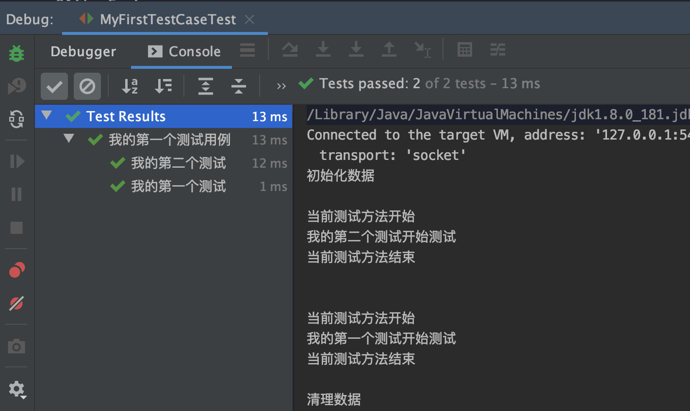
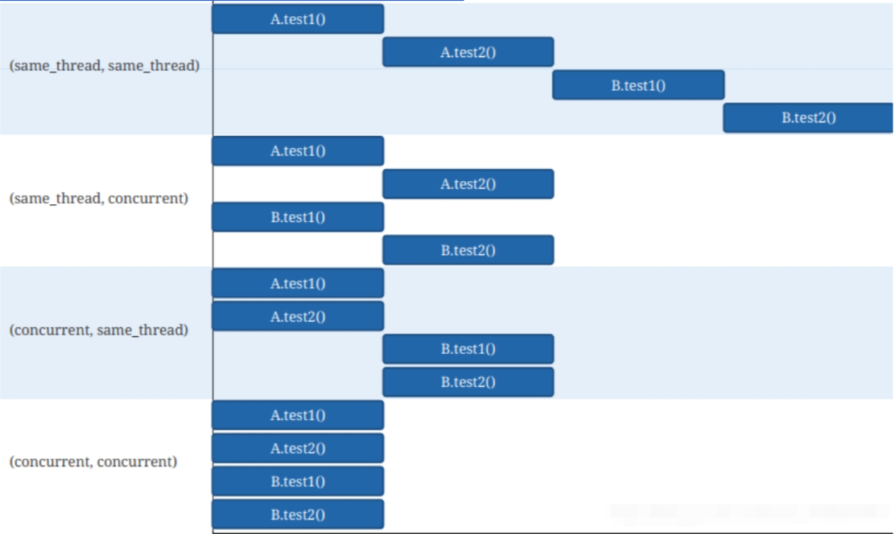

JUnit5有三个模块组成：

* **JUnit Platform**： 用于JVM上启动测试框架的基础服务，提供命令行，IDE和构建工具等方式执行测试的支持。
* **JUnit Jupiter**：包含 JUnit 5 新的编程模型和扩展模型，主要就是用于编写测试代码和扩展代码。
* **JUnit Vintage**：用于在JUnit 5 中兼容运行 JUnit3.x 和 JUnit4.x 的测试用例。


## 注解

### @ParameterizedTest：参数化测试

表示方法是参数化测试。利用**`@ValueSource`**等注解，指定入参，我们将可以使用不同的参数进行多次单元测试，而不需要每新增一个参数就新增一个单元测试，省去了很多冗余代码。

* `@ValueSource`: 为参数化测试指定入参来源，支持八大基础类以及String类型,Class类型

* `@NullSource`: 表示为参数化测试提供一个null的入参

* `@EnumSource`: 表示为参数化测试提供一个枚举入参
* **`@CsvFileSource`**：表示读取指定CSV文件内容作为参数化测试入参
* `@MethodSource`：表示读取指定方法的返回值作为参数化测试入参(注意方法返回需要是一个流)
* 自定义：实现**ArgumentsProvider**接口即可

```java
@ParameterizedTest
@ValueSource(strings = {"one", "two", "three"})
@DisplayName("参数化测试1")
public void parameterizedTest1(String string) {
    System.out.println(string);
    Assertions.assertTrue(StringUtils.isNotBlank(string));
}
```

### @Nested：嵌套单元测试

JUnit5提供了嵌套单元测试用于更好表示各个单元测试类之间的关系。平时我们写单元测试时一般都是一个类对应一个单元测试类。不过有些互相之间有业务关系的类，他们的单元测试完全是可以写在一起，使用内嵌的方式表示，减少测试类的数量防止类爆炸。

```java
public class NestedTestDemo {

    @Test
    @DisplayName("Nested")
    void isInstantiatedWithNew() {
        System.out.println("最一层--内嵌单元测试");
    }

    @Nested
    @DisplayName("Nested2")
    class Nested2 {

        @BeforeEach
        void Nested2_init() {
            System.out.println("Nested2_init");
        }

        @Test
        void Nested2_test() {
            System.out.println("第二层-内嵌单元测试");
        }


        @Nested
        @DisplayName("Nested3")
        class Nested3 {

            @BeforeEach
            void Nested3_init() {
                System.out.println("Nested3_init");
            }

            @Test
            void Nested3_test() {
                System.out.println("第三层-内嵌单元测试");
            }
        }
    }

}
```

### **@RepeatedTest**

表示方法可重复执行

```java
@RepeatedTest(10) //表示重复执行10次
@DisplayName("重复测试")
public void testRepeated() {
    Assertions.assertTrue(1 == 1);
}
```

### **@DisplayName**

为测试类或者测试方法设置展示名称

### **@Tag** 

表示单元测试类别，类似于JUnit4中的@Categories

### **@BeforeEach**

表示在每个单元测试之前执行

### **@BeforeAll**

表示在所有单元测试之前执行

### **@AfterEach**

表示在每个单元测试之后执行

### **@AfterAll**

表示在所有单元测试之后执行

### **@Disabled** 

表示测试类或测试方法不执行，类似于JUnit4中的@Ignore

### **@Timeout**

表示测试方法运行如果超过了指定时间将会返回错误

### **@ExtendWith**

为测试类或测试方法提供扩展类引用

### 综合demo

```java
@DisplayName("我的第一个测试用例")
public class MyFirstTestCaseTest {

    @BeforeAll
    public static void init() {
        System.out.println("初始化数据");
    }

    @AfterAll
    public static void cleanup() {
        System.out.println("清理数据");
    }

    @BeforeEach
    public void tearup() {
        System.out.println("当前测试方法开始");
    }

    @AfterEach
    public void tearDown() {
        System.out.println("当前测试方法结束");
    }

    @DisplayName("我的第一个测试")
    @Test
    void testFirstTest() {
        System.out.println("我的第一个测试开始测试");
    }

    @DisplayName("我的第二个测试")
    @Test
    void testSecondTest() {
        System.out.println("我的第二个测试开始测试");
    }
}
```




## 断言

### 异常断言

判断方法在执行期间，是否发生了指定的异常：

```java
@Test
@DisplayName("异常测试")
public void exceptionTest() {
    ArithmeticException exception = Assertions.assertThrows(
           //扔出断言异常
            ArithmeticException.class, () -> System.out.println(1 % 0));

}
```

### 超时断言

```java
@Test
@DisplayName("超时测试")
public void timeoutTest() {
    //如果测试方法时间超过1s将会异常
    Assertions.assertTimeout(Duration.ofMillis(1000), () -> Thread.sleep(500));
}
```


## 假设

假设仅在满足某些条件的情况下才用于运行测试。这通常用于测试正常运行所需的外部条件，但与正在测试的内容没有直接关系。

我们可以用assumeTrue、assumeFalse和assumingThat声明一个假设：

```java
@Test
void trueAssumption() {
    assumeTrue(5 > 1);
    assertEquals(5 + 2, 7);
}

@Test
void falseAssumption() {
    assumeFalse(5 < 1);
    assertEquals(5 + 2, 7);
}

@Test
void assumptionThat() {
    String someString = "Just a string";
    assumingThat(
        someString.equals("Just a string"),
        () -> assertEquals(2 + 2, 4)
    );
}
```

如果假设失败，则抛出TestAbortedException，并跳过测试。

## 测试套件

为了继续使用JUnit5的新功能，我们将探讨在一个测试套件中聚合多个测试类的概念，以便我们可以一起运行这些测试类。JUnit5提供了两个注释，@SelectPackages和@SelectClasses，用于创建测试套件。

```java
@Suite
@SelectPackages("com.baeldung")
@ExcludePackages("com.baeldung.suites")
public class AllUnitTest {}
```

```java
@Suite
@SelectClasses({AssertionTest.class, AssumptionTest.class, ExceptionTest.class})
public class AllUnitTest {}
```


## 动态测试

JUnit5允许我们动态的创建单元测试,通过**@TestFactory**注解，会在运行时生成单元测试。需要注意的是**@TestFactory**修饰的方法本身并不是单元测试，他只是负责生成单元测试。我们只需要返回 DynamicTest的迭代器甚至是流即可生成不同的单元测试。

```java
@TestFactory
@DisplayName("动态测试")
Iterator<DynamicTest> dynamicTests() {
    return Arrays.asList(
            dynamicTest("第一个动态测试", () -> assertTrue(true)),
            dynamicTest("第二个动态测试", () -> assertEquals(4, 2 * 2))
    ).iterator();
}
```

## 并行测试

默认情况下，JUnit Jupiter测试在单个线程中按顺序运行。 自5.3版起，支持并行。需要设置`src/test/resources/junit-platform.properties`：

```
junit.jupiter.execution.parallel.enabled=true
```

请注意，启用此属性只是并行执行测试所需的第一步。如果启用，默认情况下测试类和方法仍将按顺序执行。测试树中的节点是否同时执行由其执行模式控制。以下两种模式可用:

* `SAME_THREAD`: 强制跟父线程使用同一线程。例如，当在测试方法上使用时，该测试方法将在与包含测试类的任何`@BeforeAll`或`@AfterAll`方法相同的线程中执行。
* `CONCURRENT`: 并发执行，除非资源锁强制在同一线程中执行。

默认情况下，测试树中的节点使用`SAME_THREAD`执行模式。您可以通过设置`junit.jupiter.execution.parallel.mode.default`参数来更改默认值。或者，您可以使用`@Execution`注释来更改带注释的元素及其子元素（如果有的话）的执行模式，这允许您逐个激活单个测试类的并行执行。

```properties
junit.jupiter.execution.parallel.enabled = true
junit.jupiter.execution.parallel.mode.default = concurrent
```

采用以上的模式，所有的测试类和测试方法都是并发来执行的。当然还可以通过另外一个配置来保证类是并行测试而内部方法是串行测试的：

```properties
junit.jupiter.execution.parallel.enabled = true
junit.jupiter.execution.parallel.mode.default = same_thread
junit.jupiter.execution.parallel.mode.classes.default = concurrent
```

设置类之间串行而内部方法是并行的:

```properties
junit.jupiter.execution.parallel.enabled = true
junit.jupiter.execution.parallel.mode.default = concurrent
junit.jupiter.execution.parallel.mode.classes.default = same_thread
```

以上两个配置并行和串行的参数对应的四种情况如下所示：



### 示例

```java
@ExtendWith(MockitoExtension.class)
public class MocktioDemoTest7 {
    @Test
    public void first() throws Exception {
        System.out.println("FirstParallelUnitTest first() start => " + Thread.currentThread().getName());
        Thread.sleep(500);
        System.out.println("FirstParallelUnitTest first() end => " + Thread.currentThread().getName());
    }
    @Test
    public void second() throws Exception {
        System.out.println("FirstParallelUnitTest second() start => " + Thread.currentThread().getName());
        Thread.sleep(500);
        System.out.println("FirstParallelUnitTest second() end => " + Thread.currentThread().getName());
    }
}
```

执行结果：

```java
FirstParallelUnitTest first() start => ForkJoinPool-1-worker-1
FirstParallelUnitTest second() start => ForkJoinPool-1-worker-2
FirstParallelUnitTest first() end => ForkJoinPool-1-worker-1
FirstParallelUnitTest second() end => ForkJoinPool-1-worker-2
```

> 可以看到使用的是ForkJoinPool线程池，如何更改这个线程池的数量呢？
>
> ```
> junit.jupiter.execution.parallel.config.fixed.parallelism  # 固定线程数
> junit.jupiter.execution.parallel.config.strategy=fixed # 线程池配置策略
> junit.jupiter.execution.parallel.config.dynamic.factor #根据核心数动态确定线程数 线程数=核心数*factor(default=1)
> ```


