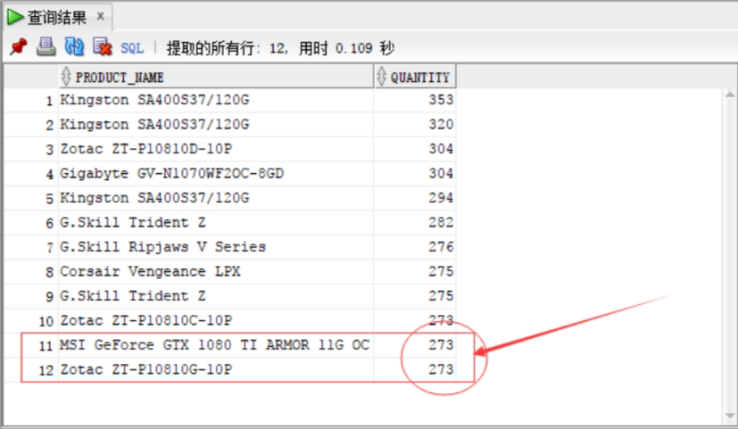

## 数据类型

### DATE

`DATE`数据类型允许以一秒的精度存储包括**日期**和**时间**的`时间点值`。它可以存储月，年，日，世纪，时，分和秒。它典型地用来表示什么时候事情已经发生或将要发生

输入和输出的标准日期格式是`DD-MON-YY`，由`NLS_DATE_FORMAT`参数的值表示

```sql
-- 日期转换字符串
SELECT TO_CHAR(SYSDATE,'YYYY-MM-DD') FROM dual; 
SELECT TO_CHAR(SYSDATE,'yyyy-mm-dd') FROM dual; -- 大小写好像没有不同

-- 字符串转日期
SELECT TO_DATE('2023-01-01','yyyy-mm-dd') FROM dual; 

-- 字符串转日期，但必须是 'YYYY-MM-DD' 格式
SELECT DATE '2023-01-01' FROM dual;
```

### TIMESTAMP 类型

除了包括了DATE数据类型的年月日时分秒的信息，还有小数秒的信息。

```sql
SELECT SYSTIMESTAMP FROM DUAL;
-- 类型转换
SELECT CAST(SYSDATE AS TIMESTAMP)  FROM dual;
```


## 运算符

### ALL

Oracle `ALL`操作符用于将值与`子查询返回的值列表`或`结果集`进行比较：

- ALL运算符前面必须有一个运算符，例如：`=`，`!=`,`>`，`>=`，`<`，`<=`，后跟一个列表或子查询。
- 列表或子查询必须用圆括号包围

使用`ALL`运算符将值与列表进行比较时，Oracle将初始条件扩展到列表的所有元素，并使用`AND`运算符将它们组合在一起，如下所示：

```sql
SELECT
    *
FROM
    table_name
WHERE
    c > ALL (
        v1,
        v2,
        v3
    );
```

实际的sql等同于：

```sql
SELECT
    *
FROM
    table_name
WHERE
    c > v1
    AND c > v2
    AND c > v3;
```

如果使用`ALL`运算符将值与子查询返回的结果集进行比较，则Oracle有两种等同的转换方式，如下所示：

```sql
SELECT product_name,
       list_price
FROM products
WHERE list_price > ALL
    ( 
      SELECT list_price
      FROM products
      WHERE category_id = 1 
    )
ORDER BY product_name;
```

第一种转换：

```sql
SELECT product_name,
       list_price
FROM products p1
WHERE NOT( 
  	p1.list_price <= ANY(
      			 SELECT list_price
             FROM products p2
             WHERE category_id = 1 
    )
)
ORDER BY product_name; 
```

第二种转换：

```sql
SELECT product_name,
       list_price
FROM products p1
WHERE NOT EXISTS
    (
      SELECT p2.list_price
      FROM products p2
      WHERE p2.category_id = 1
      AND p2.list_price >= p1.list_price 
    )
ORDER BY product_name;
```

### UNION

`UNION`运算符是一个集合运算符，它将两个或多个`SELECT`语句的结果集组合到一个结果集中。 以下说明了组合两个查询的结果集的`UNION`运算符的语法：

```sql
SELECT
    column_list_1
FROM
    T1
UNION 
SELECT
    column_list_1
FROM
    T2;
```

在此声明中，column_list_1和column_list_2必须具有相同顺序的相同列数。 另外，对应列的数据类型必须是相同的数据类型组 。

**Oracle UNION图示**

假设有两个表 - `T1`和`T2`：

- `T1`有三行：`1`,`2`和`3`
- `T2`也有三行：`2`,`3`和`4`

下图说明了T1和T2表的UNION运算图示：


UNION运算符删除(消除)重复的行 - 2和3

下图显示了UNION ALL运算符T1和T2表的结果：


正如上面所看到的，UNION ALL保留了重复的行 - 2和3。

要对由UNION运算符返回的结果集进行排序，可以将ORDER BY子句添加到最后一个SELECT语句中。

###  INTERSECT（交集）

Oracle INTERSECT运算符比较两个查询的结果，并返回两个查询输出的相同行。与UNION运算符相似，使用INTERSECT运算符时必须遵循以下规则：

- 两个查询中列的数量和顺序必须相同。
- 相应列的数据类型必须处于相同的数据类型组中，例如数字或字符。

**Oracle INTERSECT说明图**

假设有两个查询返回`T1`和`T2`表中的结果集。

- `T1`结果集包括：`1`，`2`，`3`行。
- `T2`结果集包括：`2`,`3`,`4`行。

`T1`和`T2`的相交结果返回是`2`和`3`。因为这些是由两个查询输出的相同值。

下图说明了`T1`和`T2`的交集：


###  MINUS

Oracle MINUS运算符比较两个查询，并返回第一个查询中但不是第二个查询输出的行。 换句话说，MINUS运算符从一个结果集中减去另一个结果集。 与UNION和INTERSECT操作符类似，上面的查询必须符合以下规则：

- 列数和它们的顺序必须匹配一致。
- 相应列的数据类型必须处于相同的数据类型组中，例如数字或字符。

假设第一个查询`T1`表返回包含`1`,`2`和`3`的结果集。第二个查询`T2`表返回包含`2`,`3`和`4`的结果集。

下图说明了T1和T2的MINUS运算结果：


###  ANY

Oracle ANY运算符用于将值与子查询返回的值或结果集列表进行比较。

- ANY运算符前面必须有一个运算符，例如：=，!=，>，>=，<，<=。
- 列表或子查询必须用圆括号包围。

使用ANY运算符将值与列表进行比较时，Oracle将初始条件扩展到列表的所有元素，并使用OR运算符将它们组合，如下所示：

```sql
SELECT
    *
FROM
    table_name
WHERE
    c > ANY (
        v1,
        v2,
        v3
    );
```

Oracle将上述查询转换为以下内容：

```sql
SELECT
    *
FROM
    table_name
WHERE
    c > v1
    OR c > v2
    OR c > v3;
```

### Exists

Oracle Exists运算符是返回true或false的布尔运算符。EXISTS运算符通常与子查询一起使用来测试行的存在：

```sql
SELECT
    *
FROM
    table_name
    WHERE
        EXISTS(subquery);
```

如果子查询返回任何行，则EXISTS运算符返回true，否则返回false。 另外，当子查询返回第一行，EXISTS操作符终止子查询的处理。

## 分页查询

如果使用的是*Oracle 11g*及以下版本的：

```sql
SELECT * FROM my_user WHERE rownum<3;
```

如果是使用的高版本：

```sql
SELECT * FROM my_user FETCH NEXT 5 ROWS ONLY;
```

下面是分页的详细语法：

```sql
[ OFFSET offset ROWS]
 FETCH  NEXT [  row_count | percent PERCENT  ] ROWS  [ ONLY | WITH TIES ]
```

### **OFFSET子句**

`OFFSET`子句指定在行限制开始之前要跳过行数。`OFFSET`子句是可选的。 如果跳过它，则偏移量为`0`，行限制从第一行开始计算。

偏移量必须是一个数字或一个表达式，其值为一个数字。偏移量遵守以下规则：

- 如果偏移量是负值，则将其视为`0`。
- 如果偏移量为`NULL`或大于查询返回的行数，则不返回任何行。
- 如果偏移量包含一个分数，则分数部分被截断。

示例：从第二行开始，拿2条数据：

```sql
SELECT * FROM my_user offset 1 rows FETCH NEXT 2 ROWS ONLY;
```

### **FETCH子句**

`FETCH`子句指定要返回的行数或百分比。

为了语义清晰的目的，您可以使用关键字`ROW`而不是`ROWS`，`FIRST`而不是`NEXT`。 例如，以下子句的行为和产生的结果相同：

```sql
FETCH NEXT 1 ROWS
FETCH FIRST 1 ROW
```

以下查询返回库存量最高的前`1％`的产品：

```sql
SELECT
    product_name,
    quantity
FROM
    inventories
INNER JOIN products
        USING(product_id)
ORDER BY
    quantity DESC 
FETCH FIRST 1 PERCENT ROWS ONLY;
```

库存(`inventories`)表总共有`1112`行，因此，`1112`中的`1％`是`11.1`，四舍五入为`12`(行)。

### **ONLY | WITH TIES选项**

- ONLY返回`FETCH NEXT`后的行
- `WITH TIES`返回与最后一行相同的排序键。请注意，如果使用`WITH TIES`，则必须在查询中指定一个`ORDER BY`子句。如果不这样做，查询将不会返回额外的行。

以下查询使用`WITH TIES`选项的行限制子句：

```sql
SELECT
 product_name,
 quantity
FROM
 inventories
INNER JOIN products
 USING(product_id)
ORDER BY
 quantity DESC 
FETCH NEXT 10 ROWS WITH TIES;
```

执行上面示例查询语句，得到以下结果 :



即使查询请求了`10`行数据，因为它具有`WITH TIES`选项，查询还返回了另外两行。 请注意，这两个附加行在`quantity`列的值与第`10`行`quantity`列的值相同。

## 管理操作

### 查看数据库的版本

方式一：

```sql
SELECT * from v$version;
```


方式二：

```sql
select * from product_component_version;
```


## 创建用户

```sql
-- 用户名必须以c##开头
CREATE USER c##zzq IDENTIFIED BY Zhao_19910425;
-- s
GRANT CREATE SESSION to c##zzq;
GRANT CREATE TABLE to c##zzq;
GRANT UNLIMITED TABLESPACE to c##zzq;
GRANT SELECT ANY TABLE to c##zzq;
GRANT UPDATE ANY TABLE to c##zzq;
GRANT INSERT ANY TABLE to c##zzq;
GRANT DROP ANY TABLE to c##zzq;
```


