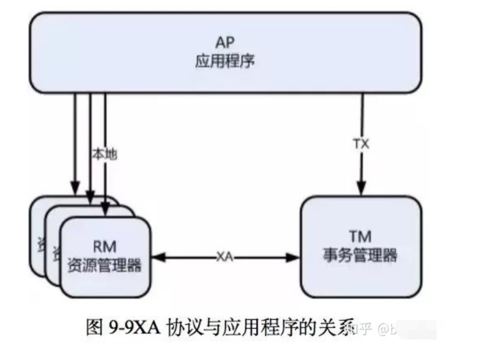
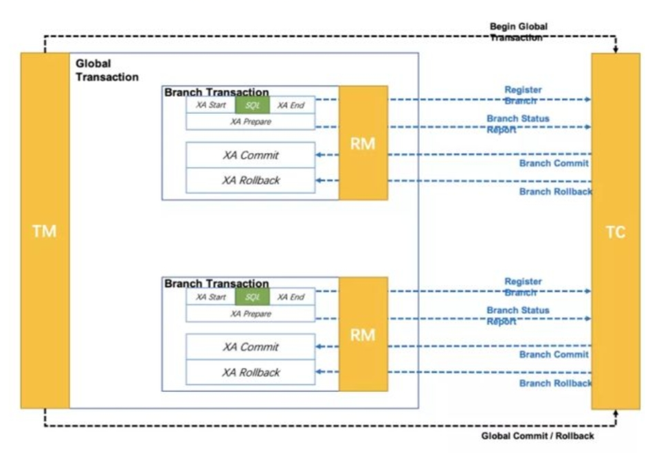

#  两阶段提交

**当一个事务跨越多个节点时**，**为了保持事务的ACID特性**，需要**引入协调者组件**来统一掌控所有节点(称作参与者)的操作结果。二阶段提交的算法思路可以概括为：**参与者将操作成败通知协调者，再由协调者根据所有参与者的反馈情报决定各参与者是要提交还是回滚。**

## 准备阶段

事务**协调者**给每个**参与者**发送**Prepare消息**，每个参与者**要么直接返回失败**，**要么在本地执行事务，写本地的redo和undo日志，但不提交**，到达一种“万事俱备，只欠东风”的状态。

这个过程中的细节如下：

1. **协调者**节点向所有参与者节点**询问**是否可以执行**提交操作**，并开始等待各参与者节点的响应。
2. 参与者节点检查事务权限，执行询问发起为止的所有事务操作，并将Undo信息和Redo信息写入日志。
3. 如果2执行成功，则返回同意，否则返回终止

## 提交阶段

如果协调者收到了参与者的失败消息或者超时，直接给每个参与者发送回滚(Rollback)消息；否则，发送提交(Commit)消息；参与者根据协调者的指令执行提交或者回滚操作，释放所有事务处理过程中使用的锁资源。(注意:必须在最后阶段释放锁资源)

## 二阶段提交的缺点

- **同步阻塞问题**：执行过程中，所有参与节点都是事务阻塞型的。当参与者占有资源时，其他第三方节点访问资源不得不处于阻塞状态。也就是说从准备阶段到提交阶段完成这段时间，资源是被锁住的。
- **单点故障**。由于协调者的重要性，**一旦协调者发生故障。参与者会一直阻塞下去。** 尤其在第二阶段，协调者发生故障，那么所有的参与者还都处于**锁定事务资源的状态中**，而无法继续完成事务操作。如果是协调者挂掉，可以重新选举一个协调者，但是**无法解决因为协调者宕机导致的参与者处于阻塞状态的问题**
- **数据不一致**。**阶段二中**，当协调者向参与者发送commit请求之后，发生了局部网络异常或者在发送commit请求过程中协调者发生了故障，这会导致只有一部分参与者接受到了commit请求。而在这部分参与者接到commit请求之后就会执行commit操作。但是其他部分未接到commit请求的机器则无法执行事务提交。于是整个分布式系统便出现了数据不一致性的现象。

由于二阶段提交存在着诸如**同步阻塞、单点问题、脑裂**等缺陷，所以，研究者们在二阶段提交的基础上做了改进，提出了三阶段提交。

# 三阶段提交

三阶段提交（Three-phase commit），也叫三阶段提交协议（Three-phase commit protocol），是二阶段提交（2PC）的改进版本。

与两阶段提交不同的是，三阶段提交有两个改动点：

- 引入**超时机制**。同时在协调者和参与者中都引入超时机制。
- 在第一阶段和第二阶段中插入一个**准备阶段，**保证了在最后提交阶段之前各参与节点状态的一致。

也就是说，除了引入超时机制之外，3PC把**2PC的准备阶段再次一分为二**，这样三阶段提交就有`CanCommit`、`PreCommit`、`DoCommit`三个阶段。

> **为什么要把准备阶段一分为二？**
>
> **假设有1个协调者，9个参与者。其中有一个参与者不具备执行该事务的能力。** 协调者发出prepare消息之后，其余参与者都将资源锁住，执行事务，写入undo和redo日志。协调者收到相应之后，发现有一个参与者不能参与。所以，又出一个roolback消息。其余8个参与者，又对消息进行回滚。这样子，是不是做了很多无用功？所以**，**引入can-Commit阶段，**主要是为了在预执行之前，保证所有参与者都具备可执行条件，从而减少资源浪费。**

## CanCommit阶段

协调者向参与者发送commit请求，参与者如果可以提交就返回Yes响应，否则返回No响应。具体：

1. **事务询问** 协调者向参与者发送CanCommit请求。询问是否可以执行事务提交操作。然后开始等待参与者的响应。
2. **响应反馈** 参与者接到CanCommit请求之后，正常情况下，如果其自身认为可以顺利执行事务，则返回Yes响应，并进入预备状态。否则反馈No

## PreCommit阶段

本阶段协调者会根据第一阶段的询盘结果采取相应操作，询盘结果主要有两种：

- 假如协调者从所有的参与者获得的反馈都是Yes响应，那么就会执行事务的预执行：
  1. **发送预提交请求** 协调者向参与者发送PreCommit请求，并进入Prepared阶段。
  2. **事务预提交** 参与者接收到PreCommit请求后，会执行事务操作，并将undo和redo信息记录到事务日志中。
  3. **响应反馈** 如果参与者成功的执行了事务操作，则返回ACK响应，同时开始等待最终指令。
- 假如有任何一个参与者向协调者发送了No响应，或者等待超时之后，协调者都没有接到参与者的响应，那么就执行事务的中断。具体步骤如下：
  1. **发送中断请求** 协调者向所有参与者发送abort请求。
  2. **中断事务** 参与者收到来自协调者的abort请求之后（或超时之后，仍未收到协调者的请求），执行事务的中断。

## doCommit阶段

该阶段进行真正的事务提交，也可以分为以下两种情况。

- **执行提交**：协调者向各个参与者发起事务提交请求，具体步骤如下：
  1. 协调者向所有参与者发送事务commit通知
  2. 所有参与者在收到通知之后执行commit操作，并释放占有的资源
  3. 参与者向协调者反馈事务提交结果
- **中断事务**:协调者没有接收到参与者发送的ACK响应（可能是接受者发送的不是ACK响应，也可能响应超时），那么就会执行中断事务。具体步骤如下
  1. 发送中断请求 协调者向所有参与者发送事务rollback通知。
  2. 事务回滚 所有参与者在收到通知之后执行rollback操作，并释放占有的资源。
  3. 反馈结果 参与者向协调者反馈事务提交结果。
  4. 中断事务 协调者接收到参与者反馈的ACK消息之后，执行事务的中断。

# 2PC与3PC的区别

在doCommit阶段，如果参与者无法及时接收到来自协调者的doCommit或者rebort请求时，**会在等待超时之后，会默认执行commit。**

> 为啥超时会默认commit,而不是别的策略？
>
> 其实这个应该是基于概率来决定的，当进入第三阶段时，说明参与者在第二阶段已经收到了PreCommit请求，这意味其他节点都同意修改了。所以，当进入第三阶段时，由于网络超时等原因，虽然参与者没有收到commit或者abort响应，但是他有理由相信：执行commit的正确性更高

但是这种机制也会导致数据一致性问题，因为，由于网络原因，协调者发送的abort响应没有及时被参与者接收到，那么参与者在等待超时之后执行了commit操作。这样就和其他接到abort命令并执行回滚的参与者之间存在数据不一致的情况。

**所以无论2pc还是3pc都不能保证数据的一致性。**

# XA协议

最早的分布式事务模型是由 X/Open 国际联盟提出的 X/Open Distributed Transaction Processing（DTP）模型，也称为XA协议。

XA协议通过一个全局事务管理器与多个资源管理器进行交互。全局事务管理器负责管理全局事务状态和参与事务的资源，资源管理器则负责具体的资源操作，XA协议与应用程序的关系如图所示。

XA协议使用两阶段提交来保证分布式事务的原子性，它将提交过程分为准备阶段和提交/回滚阶段。两阶段提交也是XA协议的标准实现。

## Seata XA 模式

**seata 的 xa 模式对传统的三阶段提交做了优化，改成了两阶段提交:**

1. 第一阶段首执行 XA 开启、执行 sql、XA 结束三个步骤，之后直接执行 XA prepare
2. 第二阶段执行 XA commit/rollback。

mysql 目前是支持 seata xa 模式的两阶段优化的。

1. TM 开启全局事务
2. RM 向 TC 注册分支事务
3. RM 向 TC 报告分支事务状态
4. TC 向 RM 发送 commit/rollback 请求
5. TM 结束全局事务

## 搭建环境

