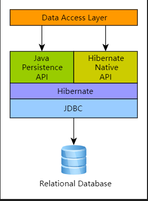
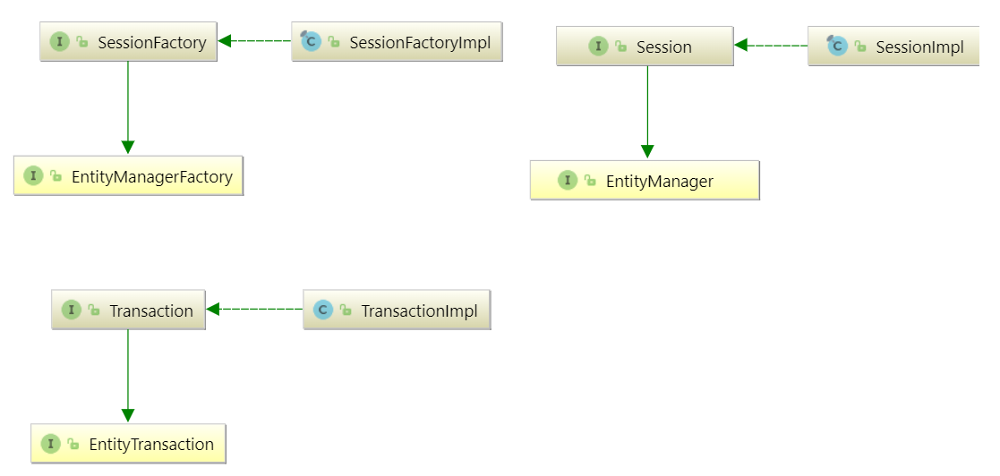

# 概述



Hibernate作为一种ORM解决方案，位于应用程序数据访问层和关系数据库之间，如上图所示。 Java 应用程序利用 Hibernate API 来加载、存储、查询等其域数据。

作为 Jakarta Persistence 提供商，Hibernate 实现了 Java Persistence API 规范，Jakarta Persistence 接口与 Hibernate 特定实现之间的关联可以在下图中可视化：



* SessionFactory (`org.hibernate.SessionFactory`)：线程安全，表示域模型到DB的映射。充当org.hibernate.Session实例的工厂。Jakarta Persistence中的EntityManagerFactory是与SessionFactory等效的，这两个元素使用相同的SessionFactory实现。

  SessionFactory的创建非常昂贵，因此，对于任何给定的数据库，应用程序应该只有一个关联的SessionFactory。SessionFactory维护Hibernate在所有会话中使用的服务，如二级缓存、连接池、事务系统集成等。

* Session (`org.hibernate.Session`)：单线程， 在Jakarta Persistence术语中，会话由EntityManager表示。在幕后，Hibernate Session包装了一个JDBC java.sql.Connection，并充当org.ibernate.Transaction实例的工厂。它维护应用程序域模型的一般“可重复读取”持久性上下文（一级缓存）。

* Transaction (`org.hibernate.Transaction`)： 单线程，与Jakarta Persistence 中的 EntityTransaction等效，两者都充当抽象API，将应用程序与正在使用的底层事务系统（JDBC或JTA）隔离开来。

# 域模型

Hibernate同时理解应用程序数据的Java和JDBC表示。Hibernate类型的功能是从数据库中读取/写入数据。在这种用法中，类型是org.ibernate.type.type接口的实现。该Hibernate类型还描述了Java类型的各种行为方面，例如如何检查相等性、如何克隆值等。

Hibernate类型既不是Java类型，也不是SQL数据类型。它提供了有关将Java类型映射到SQL类型的信息，以及如何将给定的Java类型持久化并从关系数据库中获取。
为了帮助理解类型分类，让我们看一个表和域模型的简单映射。

```sql
create table Contact (
    id integer not null,
    first varchar(255),
    last varchar(255),
    middle varchar(255),
    notes varchar(255),
    starred boolean not null,
    website varchar(255),
    primary key (id)
)
```

```java
@Entity(name = "Contact")
public static class Contact {

	@Id
	private Integer id;

	private Name name;

	private String notes;

	private URL website;

	private boolean starred;

	//Getters and setters are omitted for brevity
}

@Embeddable
public class Name {

	private String firstName;

	private String middleName;

	private String lastName;

	// getters and setters omitted
}
```

从广义上讲，Hibernate将类型分为两组：

- 值类型
- 实体类型

## 值类型

值类型是一段不定义其自身生命周期的数据。实际上，它由一个实体拥有，该实体定义了它的生命周期。从另一个角度来看，实体的所有状态都完全由值类型组成。这些状态字段或JavaBean 属性称为持久属性。Contact类的持久属性是值类型。

值类型进一步分为三类：

* 基本类型:在映射Contact表时，除了name之外的所有属性都将是基本类型。
* 嵌入类型：name属性属于嵌入类型
* 集合类型：虽然在前面的示例中没有出现，但集合类型在值类型中也是一个独特的类别

## 实体类型

实体由于其唯一标识符的性质，独立于其他对象而存在。实体是使用唯一标识符与数据库表中的行相关的域模型类。由于需要唯一标识符，实体独立存在并定义自己的生命周期。Contact类本身就是一个实体的示例。


# 基本类型

基本类型是Java类型和单个数据库列之间的映射。Hibernate可以将许多标准Java类型（Integer、String等）映射为基本类型。此外，Hibernate提供了多种灵活的方式来指示Java类型应该如何映射到数据库。

Jakarta Persistence规范严格限制那些Java类型可以标记为basic,如下：

| Category                          | Package     | Types                                                        |
| :-------------------------------- | :---------- | :----------------------------------------------------------- |
| Java primitive types              |             | `boolean`, `int`, `double`, etc.                             |
| Primitive wrappers                | `java.lang` | `Boolean`, `Integer`, `Double`, etc.                         |
| Strings                           | `java.lang` | `String`                                                     |
| Arbitrary-precision numeric types | `java.math` | `BigInteger` and `BigDecimal`                                |
| Date/time types                   | `java.time` | `LocalDate`, `LocalTime`, `LocalDateTime`, `OffsetTime`, `OffsetDateTime`, `Instant` |
| Deprecated date/time types        | `java.util` | `Date` and `Calendar`                                        |
| Deprecated date/time types from   | `java.sql`  | `Date`, `Time`, `Timestamp`                                  |
| Byte and character arrays         |             | `byte[]` or `Byte[]`, `char[]` or `Character[]`              |
| Java enumerated types             |             | Any `enum`                                                   |
| Serializable types                |             | Any type that implements `java.io.Serializable`              |

> Java Persistence 2.1引入了jakarta.Persistence.AttributeConverter，它支持处理规范中定义的类型以外的类型。有关此主题的详细信息，请参阅AttributeConverters。

### @Basic

严格来说，基本类型由jakarta.persistence.basic注释表示。通常，@Basic注释可以被忽略。以下两个示例最终都是相同的。

```java
@Entity(name = "Product")
public class Product {

	@Id
	@Basic
	private Integer id;

	@Basic
	private String sku;

	@Basic
	private String name;

	@Basic
	private String description;
}

@Entity(name = "Product")
public class Product {

	@Id
	private Integer id;

	private String sku;

	private String name;

	private String description;
}
```

@Basic 定义了两个属性：

* `optional` - boolean (默认true)：定义此属性是否允许空值。如果属性是java的基础类型，则该属性被忽略。只要类型不是基础类型，Hibernate就会接受这个值。
* `fetch` - FetchType (默认EAGER)：EAGER表示将作为所有者的一部分获取该值。LAZY表示仅当访问值时才获取值。Jakarta Persistence要求提供程序支持EAGER，而对LAZY的支持是可选的。只要您使用其字节码增强支持，Hibernate就支持延迟加载。

### @Column

Jakarta Persistence隐式确定表和列名称的规则。对于基本类型属性，隐式命名规则是：`列名与属性名相同`。如果隐式命名规则不符合您的要求，您可以明确告诉Hibernate（和其他提供程序）要使用的列名。

```java
@Entity(name = "Product")
public class Product {

	@Id
	private Integer id;

	private String sku;

	private String name;

	@Column(name = "NOTES")
	private String description;
}
```

### @Formula

@Formula允许将任何数据库计算值映射为虚拟只读列。

> @Formula注释采用可能影响数据库可移植性的 native SQL子句。@Formula是Hibernate特有的映射构造，Jakarta Persistence没有涉及。

```java
@Entity(name = "Account")
public static class Account {

	@Id
	private Long id;

	private Double credit;

	private Double rate;

	@Formula(value = "credit * rate")
	private Double interest;

	//Getters and setters omitted for brevity

}
```

加载Account实体时，Hibernate将使用配置的@Formula计算interest属性：

```java
doInJPA(this::entityManagerFactory, entityManager -> {
	Account account = new Account();
	account.setId(1L);
	account.setCredit(5000d);
	account.setRate(1.25 / 100);
	entityManager.persist(account);
});

doInJPA(this::entityManagerFactory, entityManager -> {
	Account account = entityManager.find(Account.class, 1L);
	assertEquals(Double.valueOf(62.5d), account.getInterest());
});
```

```java
INSERT INTO Account (credit, rate, id)
VALUES (5000.0, 0.0125, 1)

SELECT
    a.id as id1_0_0_,
    a.credit as credit2_0_0_,
    a.rate as rate3_0_0_,
    a.credit * a.rate as formula0_0_
FROM
    Account a
WHERE
    a.id = 1
```

@Formula注释定义的SQL片段可以任意复杂，甚至可以包含子查询。

### 映射基本类型

为了处理基本类型的值，Hibernate需要了解一些有关映射的信息：

* Java类型的方法。例如：

  * 如何比较值

  * 如何计算哈希码

  * 如何将此类型的值强制为另一类型

* 使用的JDBC类型

  * 如何将值绑定到JDBC语句

  * 如何从JDBC结果中提取

* 它应该对与数据库之间的值执行任何转换
* 值的可变性-内部状态是可以像java.util.Date一样改变，还是像java.lang.String一样不可变

本节介绍Hibernate如何确定这些片段，以及确定的过程。

映射主要由定义的基本java类型确定，这主要由反射实现。回退是将值映射到推荐的JDBC类型。最坏的情况是，如果Java类型是可序列化的，Hibernate将尝试通过二进制序列化来处理它。

对于Java类型不是标准类型的情况，或者如果需要一些专门的处理，Hibernate提供了两种主要方法来影响映射解析：

* 多个注解组合处理
* 用户自定义

这两种方法应视为互斥。自定义UserType始终优先于组合注释。

### 枚举

Hibernate以多种不同的方式支持将Java枚举映射为基本值类型。

#### `@Enumerated`

最初，与Jakarta Persistence兼容的映射枚举的方法是通过@Enumerated或@MapKeyEnumered注释，其原理是根据Jakarta.Persistence.EnumType指示的两种策略之一存储枚举值：

* ORDINAL：根据枚举值在枚举类中的序号位置存储，如java.lang.enum#ordinal
* STRING：根据枚举值的名称存储，如java.lang.enum#name所示

例如下面的枚举类型：

```java
public enum PhoneType {
    LAND_LINE,
    MOBILE;
}
```

在ORDINAL示例中，phone_type列被定义为（可为空）INTEGER类型，其值为：

* NULL： 空值
* 0： LAND_LINE值
* 1： MOBILE值

```java
@Entity(name = "Phone")
public static class Phone {

	@Id
	private Long id;

	@Column(name = "phone_number")
	private String number;

	@Enumerated(EnumType.ORDINAL)
	@Column(name = "phone_type")
	private PhoneType type;

	//Getters and setters are omitted for brevity

}
```


```java
Phone phone = new Phone();
phone.setId(1L);
phone.setNumber("123-456-78990");
phone.setType(PhoneType.MOBILE);
entityManager.persist(phone);
```


```sql
INSERT INTO Phone (phone_number, phone_type, id)
VALUES ('123-456-78990', 1, 1)
```

在STRING示例中，phone_type列被定义为（可为空）VARCHAR类型，其值可能为：

* NULL
* LAND_LINE
* MOBILE

```java
@Entity(name = "Phone")
public static class Phone {

	@Id
	private Long id;

	@Column(name = "phone_number")
	private String number;

	@Enumerated(EnumType.STRING)
	@Column(name = "phone_type")
	private PhoneType type;

	//Getters and setters are omitted for brevity

}
```

```sql
INSERT INTO Phone (phone_number, phone_type, id)
VALUES ('123-456-78990', 'MOBILE', 1)
```

#### 使用属性转化器

让我们考虑以下使用“M”和“F”代码存储其值的Gender枚举。

```java
public enum Gender {

    MALE('M'),
    FEMALE('F');

    private final char code;

    Gender(char code) {
        this.code = code;
    }

    public static Gender fromCode(char code) {
        if (code == 'M' || code == 'm') {
            return MALE;
        }
        if (code == 'F' || code == 'f') {
            return FEMALE;
        }
        throw new UnsupportedOperationException(
            "The code " + code + " is not supported!"
       );
    }

    public char getCode() {
        return code;
    }
}
```

您可以使用Jakarta Persistence AttributeConverter以符合Jakarta Persistence的方式映射枚举。

```java
@Entity(name = "Person")
public static class Person {

	@Id
	private Long id;

	private String name;

	@Convert(converter = GenderConverter.class)
	public Gender gender;

	//Getters and setters are omitted for brevity

}

@Converter
public static class GenderConverter
		implements AttributeConverter<Gender, Character> {

	public Character convertToDatabaseColumn(Gender value) {
		if (value == null) {
			return null;
		}

		return value.getCode();
	}

	public Gender convertToEntityAttribute(Character value) {
		if (value == null) {
			return null;
		}

		return Gender.fromCode(value);
	}
}
```

#### 自定义类型

还可以使用Hibernate自定义类型映射来映射enum。

```java
@Entity(name = "Person")
public static class Person {

	@Id
	private Long id;

	private String name;

	@Type(org.hibernate.userguide.mapping.basic.GenderType.class)
	public Gender gender;

	//Getters and setters are omitted for brevity

}

public class GenderType extends UserTypeSupport<Gender> {
    public GenderType() {
        super(Gender.class, Types.CHAR);
    }
}

public class GenderJavaType extends AbstractClassJavaType<Gender> {

    public static final GenderJavaType INSTANCE =
        new GenderJavaType();

    protected GenderJavaType() {
        super(Gender.class);
    }

    public String toString(Gender value) {
        return value == null ? null : value.name();
    }

    public Gender fromString(CharSequence string) {
        return string == null ? null : Gender.valueOf(string.toString());
    }

    public <X> X unwrap(Gender value, Class<X> type, WrapperOptions options) {
        return CharacterJavaType.INSTANCE.unwrap(
            value == null ? null : value.getCode(),
            type,
            options
       );
    }

    public <X> Gender wrap(X value, WrapperOptions options) {
        return Gender.fromCode(
				CharacterJavaType.INSTANCE.wrap( value, options)
       );
    }
}
```

### Boolean

默认情况下，Boolean属性映射到Boolean列，至少在数据库具有专用Boolean类型时是如此。在没有的数据库上，Hibernate使用任何其他可用的：BIT、TINYINT或SMALLINT。

```java
// this will be mapped to BIT or BOOLEAN on the database
@Basic
boolean implicit;
```

然而，找到编码为字符或整数的布尔值是很常见的。这种情况正是AttributeConverter的意图。为了方便起见，Hibernate为常见的布尔映射情况提供了3个内置转换器：

* YesNoConverter将布尔值编码为“Y”或“N”，
* TrueFalseConverter将布尔值编码为“T”或“F”，
* NumericBooleanConverter将值编码为整数，1表示真，0表示假。

```java
// this will get mapped to CHAR or NCHAR with a conversion
@Basic
@Convert(converter = org.hibernate.type.YesNoConverter.class)
boolean convertedYesNo;

// this will get mapped to CHAR or NCHAR with a conversion
@Basic
@Convert(converter = org.hibernate.type.TrueFalseConverter.class)
boolean convertedTrueFalse;

// this will get mapped to TINYINT with a conversion
@Basic
@Convert(converter = org.hibernate.type.NumericBooleanConverter.class)
boolean convertedNumeric;
```

如果在数据库中将布尔值定义为boolean、字符或整数以外的值，则也可以使用自定义AttributeConverter映射该值.

### Byte

默认情况下，Hibernate将Byte/byte的值映射到TINYINT JDBC类型。

```java
// these will both be mapped using TINYINT
Byte wrapper;
byte primitive;
```

### Short

默认情况下，Hibernate将short/Short的值映射到SMALLINT JDBC类型。

```java
// these will both be mapped using SMALLINT
Short wrapper;
short primitive;
```

### Integer

默认情况下，Hibernate将Integer/int值映射到Integer JDBC类型。

```java
// these will both be mapped using INTEGER
Integer wrapper;
int primitive;
```

### Long

默认情况下，Hibernate将Long/Long值映射到BIGINT JDBC类型。

```java
// these will both be mapped using BIGINT
Long wrapper;
long primitive;
```

### BigInteger

默认情况下，Hibernate将BigInteger的值映射到NUMERIC JDBC类型。

```java
// will be mapped using NUMERIC
BigInteger wrapper;
```

### Double

默认情况下，Hibernate将Double的值映射到Double、FLOAT、REAL或NUMERIC JDBC类型，具体取决于数据库的功能

```java
// these will be mapped using DOUBLE, FLOAT, REAL or NUMERIC
// depending on the capabilities of the database
Double wrapper;
double primitive;
```

可以使用[基本映射显式]部分中介绍的任何JDBC类型影响因素来影响特定类型。
如果使用@JdbcTypeCode，则仍会查询方言以确保数据库支持请求的类型。如果没有，则选择适当的类型

### Float

默认情况下，Hibernate根据数据库的功能将Float的值映射到Float、REAL或NUMERIC JDBC类型。

```java
// these will be mapped using FLOAT, REAL or NUMERIC
// depending on the capabilities of the database
Float wrapper;
float primitive;
```

可以使用[基本映射显式]部分中介绍的任何JDBC类型影响因素来影响特定类型。
如果使用@JdbcTypeCode，则仍会查询方言以确保数据库支持请求的类型。如果没有，则选择适当的类型

### BigDecimal

默认情况下，Hibernate将BigDecimal的值映射到NUMERIC JDBC类型。

```java
// will be mapped using NUMERIC
BigDecimal wrapper;
```

### Character

默认情况下，Hibernate将Character映射到CHAR JDBC类型。

```java
// these will be mapped using CHAR
Character wrapper;
char primitive;
```

### String

默认情况下，Hibernate将String映射到VARCHAR JDBC类型。

```java
// will be mapped using VARCHAR
String string;

// will be mapped using CLOB
@Lob
String clobString;
```


或者，可以使用@Column(length=…), 或者使用Hibernate Validator的@Size注释。对于非常大的字符串，可以使用org.hibernate.Length类定义的常量值之一，例如：

```java
@Column(length=Length.LONG)
private String text;
```

或者，您可以显式指定JDBC类型LONGVARCHAR，当未显式指定长度时，它被视为默认长度为length.LONG的VARCHAR映射：

```java
@JdbcTypeCode(Types.LONGVARCHAR)
private String text;
```

如果使用Hibernate生成模式，Hibernate将生成具有足够大的列类型的DDL，以容纳指定的最大长度。

> 如果指定的最大长度太长，无法容纳数据库支持的最大VARCHAR列，Hibernate的模式导出器将自动将列类型升级为TEXT、CLOB或数据库的等效类型。请不要因为需要TEXT列就使用JPA的@Lob注释。@Lob注释的目的不是控制DDL生成！

对于支持国际化字符集的数据库，还可以将字符串存储为国际化数据。

```java
// will be mapped using NVARCHAR
@Nationalized
String nstring;

// will be mapped using NCLOB
@Lob
@Nationalized
String nclobString;
```

### 字符数组

默认情况下，Hibernate将Character[]和char[]映射到VARCHAR JDBC类型。

```java
// mapped as VARCHAR
char[] primitive;
Character[] wrapper;

// mapped as CLOB
@Lob
char[] primitiveClob;
@Lob
Character[] wrapperClob;
```

对于支持国有化字符集的数据库，还可以将字符数组存储为国有化数据。

```java
// mapped as NVARCHAR
@Nationalized
char[] primitiveNVarchar;
@Nationalized
Character[] wrapperNVarchar;

// mapped as NCLOB
@Lob
@Nationalized
char[] primitiveNClob;
@Lob
@Nationalized
Character[] wrapperNClob;
```

### Clob / NClob

默认情况下，Hibernate将java.sql.Clob类型映射到Clob，java.sql.NClob映射到NClob。

```sql
CREATE TABLE Product (
  id INTEGER NOT NULL,
  name VARCHAR(255),
  warranty CLOB,
  PRIMARY KEY (id)
)
```

让我们首先使用@Lob Jakarta Persistence注释和java.sql.Clob类型来映射它：

```java
@Entity(name = "Product")
public static class Product {

    @Id
    private Integer id;

    private String name;

    @Lob
    private Clob warranty;

    //Getters and setters are omitted for brevity

}
```

要持久化这样的实体，必须使用Hibernate实用程序 ClobProxy 创建Clob：

```java
String warranty = "My product warranty";

final Product product = new Product();
product.setId(1);
product.setName("Mobile phone");

product.setWarranty(ClobProxy.generateProxy(warranty));

entityManager.persist(product);
```

要检索Clob内容，需要转换底层java.io.Reader：

```java
Product product = entityManager.find(Product.class, productId);

try (Reader reader = product.getWarranty().getCharacterStream()) {
    assertEquals("My product warranty", toString(reader));
}
```


我们还可以以物化形式映射CLOB。这样，我们可以使用String或char[]。


```java
@Entity(name = "Product")
public static class Product {

	@Id
	private Integer id;

	private String name;

	@Lob
	private String warranty;

	//Getters and setters are omitted for brevity

}
```


我们甚至可能希望将物化数据作为字符数组。

```java
@Entity(name = "Product")
public static class Product {

	@Id
	private Integer id;

	private String name;

	@Lob
	private char[] warranty;

	//Getters and setters are omitted for brevity

}
```

与CLOB一样，Hibernate也可以处理NCLOB SQL数据类型

###  Byte array

默认情况下，Hibernate将byte[]和byte[]类型的值映射到JDBC类型VARBINARY。

```java
// mapped as VARBINARY
private byte[] primitive;
private Byte[] wrapper;

// mapped as (materialized) BLOB
@Lob
private byte[] primitiveLob;
@Lob
private Byte[] wrapperLob;
```

与字符串一样，可以使用@Column（length=…) 或Hibernate Validator的@Size注释。对于非常大的数组，可以使用org.hibernate.Length定义的常量。或者，如果没有显式指定长度，@JdbcTypeCode（Types.LONGVARBINARY）将被视为VARBINARY映射，默认长度为Length.LONG。

如果使用Hibernate生成模式，Hibernate将生成具有足够大的列类型的DDL，以容纳指定的最大长度。

### Blob

默认情况下，Hibernate将java.sql.Blob java类型映射到Blob。

```sql
CREATE TABLE Product (
    id INTEGER NOT NULL ,
    image blob ,
    name VARCHAR(255) ,
    PRIMARY KEY ( id )
)
```

让我们首先使用JDBCjava.sql.Blob类型映射它。

```java
@Entity(name = "Product")
public static class Product {

    @Id
    private Integer id;

    private String name;

    @Lob
    private Blob image;

    //Getters and setters are omitted for brevity

}
```

要持久化这样的实体，必须使用BlobProxy Hibernate实用程序创建Blob：

```java
byte[] image = new byte[] {1, 2, 3};

final Product product = new Product();
product.setId(1);
product.setName("Mobile phone");

product.setImage(BlobProxy.generateProxy(image));

entityManager.persist(product);
```

要检索Blob内容，需要转换底层java.io.InputStream：

```java
Product product = entityManager.find(Product.class, productId);

try (InputStream inputStream = product.getImage().getBinaryStream()) {
    assertArrayEquals(new byte[] {1, 2, 3}, toBytes(inputStream));
}
```

我们还可以以物化形式（例如byte[]）映射BLOB。

```java
@Entity(name = "Product")
public static class Product {

    @Id
    private Integer id;

    private String name;

    @Lob
    private byte[] image;

    //Getters and setters are omitted for brevity

}
```

### Duration

默认情况下，Hibernate会将Duration映射到INTERVAL_SECOND SQL类型，并在必要时回退到NUMERIC。

```java
private Duration duration;
```

### Instant

Instant映射到TIMESTAMP_UTC SQL类型。

```java
// mapped as TIMESTAMP
private Instant instant;
```

#### LocalDate

LocalDate映射到DATE JDBC类型。

```java
// mapped as DATE
private LocalDate localDate;
```

### LocalDateTime

LocalDateTime映射到TIMESTAMP JDBC类型。

```java
// mapped as TIMESTAMP
private LocalDateTime localDateTime;
```

### LocalTime

LocalTime映射到TIME JDBC类型。

```java
// mapped as TIME
private LocalTime localTime;
```

### OffsetDateTime

OffsetDateTime映射到TIMESTAMP或TIMESTAMP_WITH_TIMEZONE JDBC类型，具体取决于数据库。

```java
// mapped as TIMESTAMP or TIMESTAMP_WITH_TIMEZONE
private OffsetDateTime offsetDateTime;
```

### OffsetTime

OffsetTime映射到TIME或TIME_WITH_TIMEZONE JDBC类型，具体取决于数据库。

```java
// mapped as TIME or TIME_WITH_TIMEZONE
private OffsetTime offsetTime;
```

### TimeZone

TimeZone映射到VARCHAR JDBC类型。

```java
// mapped as VARCHAR
private TimeZone timeZone;
```

### ZonedDateTime

ZonedDateTime映射到TIMESTAMP或TIMESTAMP_WITH_TIMEZONE JDBC类型，具体取决于数据库。

```java
// mapped as TIMESTAMP or TIMESTAMP_WITH_TIMEZONE
private ZonedDateTime zonedDateTime;
```

#### ZoneOffset

ZoneOffset映射到VARCHAR JDBC类型。

```java
// mapped as VARCHAR
private ZoneOffset zoneOffset;
```

### Calendar、Date、Time、Timestamp


### Class

Hibernate将类引用映射到VARCHAR JDBC类型

```java
// mapped as VARCHAR
private Class<?> clazz;
```

### Currency

Hibernate将Currency引用映射到VARCHAR JDBC类型

```java
// mapped as VARCHAR
private Currency currency;
```

### Locale

Hibernate将Locale引用映射到VARCHAR JDBC类型

```java
// mapped as VARCHAR
private Locale locale;
```

### UUID

Hibernate允许以多种方式映射UUID值。默认情况下，Hibernate将使用SQL类型UUID以本机形式存储UUID值，如果数据库没有本机UUID类型，则使用binary JDBC类型以二进制形式存储UUD值。

默认值使用二进制表示，因为它使用了更高效的列存储。然而，许多应用程序更喜欢基于字符的列存储的可读性。要切换默认映射，请将hibernate.type.preferred_uuid_jdbc_type配置设置为CHAR。

##### UUID as binary

如上所述，UUID属性的默认映射使用java.util.UUID#getMostSignificantBits和java.util.UUID#getLeastSignificantBit将UUID映射到byte[]，并将其存储为BINARY数据。之所以选择为默认值，只是因为从存储角度来看，它通常更高效。

##### UUID as (var)char

使用java.util.UUID#toString和java.util.UUID#fromString将UUID映射到字符串，并将其存储为CHAR或VARCHAR数据。

##### UUID as identifier

Hibernate支持使用UUID值作为标识符，甚至可以代表用户生成UUID值。

### InetAddress

默认情况下，Hibernate将InetAddress映射到INET SQL类型，并在必要时回退到BINARY。

```java
private InetAddress address;
```

### JSON mapping

如果通过@JdbcTypeCode（SqlTypes.JSON）显式配置，Hibernate将仅使用JSON类型。自动检测用于序列化/反序列化的JSON库，但可以通过设置hibernate.type.JSON_format_mapper来覆盖。

```java
@JdbcTypeCode( SqlTypes.JSON )
private Map<String, String> payload;
```

### XML mapping

如果通过@JdbcTypeCode（SqlTypes.SQLXML）显式配置，Hibernate将仅使用XML类型。用于序列化/反序列化的XML库是自动检测的，但可以通过设置hibernate.type.XML_format_mapper来覆盖。

### 基本数组映射

基本数组，而不是byte[]/Byte[]和char[]/Character[]，默认情况下映射到类型SqlTypes.ARRAY，如果可能，它映射到SQL标准array类型，这是通过org.ibernate.dialect.dialect的新方法getArrayTypeName和supportsStandardArrays确定的。如果SQL标准数组类型不可用，数据将被建模为SqlTypes.JSON、SqlTypes.XML或SqlTypes.VARBINARY，这取决于通过新方法org.ibernate.dialect.dialect.getPreferredSqlTypeCodeForArray确定的数据库支持。

```java
Short[] wrapper;
short[] primitive;
```

### 基本集合类型

未使用@ElementCollection注释的基本集合（仅为集合的子类型）默认映射到类型代码SqlTypes.ARRAY，如果可能，该类型代码映射到SQL标准数组类型，这通过org.ibernate.dialect.dialect的新方法getArrayTypeName和supportsStandardArrays确定。如果SQL标准数组的类型不可用，数据将被建模为SqlTypes.JSON，SqlTypes.XML或SqlTypes.VARBINARY，具体取决于通过新方法org.ibernate.dialect.dialect.getPreferredSqlTypeCodeForArray确定的数据库支持。

```java
List<Short> list;
SortedSet<Short> sortedSet;
```

### 组合基本类型的映射


#### JavaType

Hibernate需要了解Java类型的某些方面，才能正确有效地处理值。Hibernate通过org.ibernate.type.descriptor.java.JavaType合同了解这些功能。Hibernate为许多JDK类型（例如Integer、String）提供内置支持，但也支持应用程序更改任何标准JavaType注册的处理以及非标准类型的插件处理。Hibernate为应用程序提供了多种方式来影响要使用的JavaType描述符。

使用特定映射上的@JavaType注释可以在本地影响解析。所指示的描述符将仅用于该映射。也有@JavaType的形式，用于影响Map的键（@MapKeyJavaType）、List或数组的索引（@ListIndexJavaType），ID-BAG映射的标识符（@CollectionIdJavaType）以及ANY映射的鉴别器（@AnyDiscriminator）和键（@AnyKeyJavaClass，@AnyKeyJavaType）。

还可以通过向JavaTypeRegistry注册适当的JavaType描述符来全局影响解析。这种方法既可以“覆盖”某些Java类型的处理，也可以注册新类型。有关JavaTypeRegistry的讨论。


#### JdbcType

Hibernate还需要了解它应该使用的JDBC类型的各个方面（它应该如何绑定值，它应该如何提取值等），这是其org.Hibernate.type.descriptor.JDBC.JdbcType契约的作用。Hibernate为应用程序提供了多种方式来影响要使用的JdbcType描述符。

在本地，可以使用@JdbcType或@JdbcTypeCode注释来影响解析。还有一些注释可以影响与Map键（@MapKeyJdbcType，@MapKeyJdbcTypeCode）、List或数组的索引（@ListIndexJdbcType，@ListIndexJdbcTypeCode），ID-BAG映射的标识符（@CollectionIdJdbcType，@CollectionIdJdbcType）以及ANY映射的键（@AnyKeyJdbcType，@AnyKeyjdbcTypeCode）相关的Jdbc类型。@JdbcType指定要使用的特定Jdbc类型实现，而@JdbcTypeCode指定一个“代码”，然后根据JdbcTypeRegistry进行解析。

可以通过@JdbcTypeRegistration和TypeContributor来定制JdbcType注册表。有关JavaTypeRegistry的讨论，请参见Registrys。有关TypeContributor的讨论，请参阅TypeContributer。

#### MutabilityPlan

MutabilityPlan是Hibernate了解如何根据域值的内部可变性以及相关问题（如复制）来处理域值的方法。虽然这似乎是一个小问题，但它可能会对性能产生重大影响。请参阅AttributeConverter可变性计划，了解可能出现这种情况的一种情况。另一个讨论请参见案例研究：BitSet。

映射的MutabilityPlan可能会受到以下任何注释的影响：

- `@Mutability`
- `@Immutable`
- `@MapKeyMutability`
- `@CollectionIdMutability`

Hibernate按优先级顺序检查@Mutability和@Immutable的以下位置：

* 映射的本地
* 在关联的AttributeConverter实现类（如果有）上
* 关于值的Java类型


在大多数情况下，JavaType#getMutabilityPlan定义的回退是正确的策略。
Hibernate使用MutabilityPlan：

- 检查值是否被认为是脏的
- 制作深度副本
- 将值封送至二级缓存和从二级缓存封送值


一般来说，不可变值在所有这些情况下都表现得更好

- 为了检查脏，Hibernate只需要检查对象标识（==），而不是相等（object#equals）。
- 相同的值实例可以用作其自身的深度副本。
- 可以从二级缓存以及我们放入二级缓存的值中使用相同的值。

如果某个特定的Java类型被认为是可变的（例如Date），可以指定@Immutable或不可变的特定MutabilityPlan实现，让Hibernate将该值视为不可变。这也充当了应用程序的契约，即应用程序不会更改这些对象的内部状态。指定可变类型是不可变的，然后更改内部状态将导致问题；因此，只有在应用程序明确地不改变内部状态时才这样做。

#### BasicValueConverter

BasicValueConverter大致类似于AttributeConverter，因为它描述了在读取或写入基本值模型部分的值时发生的转换。事实上，Hibernate在内部将应用的AttributeConverter包装在BasicValueConverter中。它也在某些情况下应用隐式BasicValueConverter转换器，例如枚举处理等。

#### 解决合成问题

使用这种组合方法，Hibernate需要解析映射的某些部分。通常这涉及到“填空”，因为它只针对映射的一部分进行配置。本节概述了如何解决此问题。

首先，我们寻找自定义类型。如果找到，则需要预先确定。有关详细信息，请参阅自定义类型映射

如果应用了AttributeConverter，我们将其用作解析的基础

1. 如果还使用@JavaType，则该特定JavaType用于转换器的“域类型”。否则，由转换器定义为其“域类型”的Java类型将根据JavaTypeRegistry进行解析

2. 如果使用@JdbcType或@Jdbc TypeCode，则会使用指定的Jdbc类型，转换后的“关系Java类型”由JdbcType#getJdbcRecommendedJavaTypeMapping确定。否则，将使用转换器定义为其关系类型的Java类型，JdbcType由JdbcType#getRecommendedJdbcType确定

3. 可在AttributeConverter实现、基本值映射或用作域类型的Java类型上使用@Mutability或@Immutable指定MutabilityPlan。否则，将使用转换域类型的JdbcType#getJdbcRecommendedJavaTypeMapping来确定可变性计划。

   

接下来，我们尝试解析用于映射的JavaType。我们检查显式@JavaType，如果找到，则使用指定的JavaType。接下来，检查任何“隐含”指示；例如，List的索引具有隐式Java类型Integer。接下来，如果可能，我们使用反射。如果我们无法通过前面的步骤确定要使用的JavaType，我们尝试解析要使用的显式指定的JdbcType，如果找到，则使用其JdbcType#getJdbcRecommendedJavaTypeMapping作为映射的JavaType。如果此时无法确定JavaType，则会抛出错误。

然后检查先前解析的JavaType是否存在一些特殊情况。

1. 对于枚举值，我们检查显式@Enumerated并创建枚举映射。请注意，此解决方案仍然使用任何显式JdbcType指示符
2. 对于时间值，我们检查@temporal并创建一个枚举映射。请注意，此解决方案仍然使用任何显式JdbcType指示符；这包括@JdbcType和@Jdbc TypeCode，以及@TimeZoneStorage和@TimeZone列（如果适用）。

此时的退路是使用前面步骤中确定的JavaType和JdbcType来创建JDBC映射（它封装了JavaType和JdbcType），并将其与已解析的MutabilityPlan相结合
使用组合方法时，还有其他方法可以影响分辨率，如枚举、处理时间数据、处理LOB数据和处理国有化字符数据中所述
有关@JavaTypeRegistration和@JdbcTypeRegistratition的替代方案，请参阅TypeContributor。


### 自定义类型映射

另一种方法是使用@Type提供org.ibernate.usertype.UserType合约的实现。

对于特定的模型部分，也有相应的@Type专用形式：

* 映射Map时，@Type描述Map值，而@MapKeyType描述Map键
* 映射id包时，@Type描述元素，而@CollectionIdType描述集合id
* 对于其他集合映射，@Type描述了元素
* 对于区分的关联映射（@Any和@ManyToAny），@Type描述了区分符值

@Type允许更复杂的映射问题；但是，AttributeConverter和Compositional基本映射通常应首选为更简单的解决方案


### 处理时间数据

Hibernate支持以多种方式映射时间值，尽管这些策略最终归结为SQL规范定义的3种主要日期/时间类型：

* DATE
* TIME
* TIMESTAMP
* TIMESTAMP WITH TIME ZONE

java.time时间类型到特定SQL日期/时间类型的映射如下所示：

- DATE：java.time.LocalDate

- TIME：java.time.LocalTime, java.time.OffsetTime

- TIMESTAMP：java.time.Instant, java.time.LocalDateTime, java.time.OffsetDateTime and java.time.ZonedDateTime

- TIMESTAMP WITH TIME ZONE：java.time.OffsetDateTime, java.time.ZonedDateTime

尽管Hibernate建议使用java.time包来表示时间值，但它确实支持使用java.sql.Date、java.sql.time、java.sql_Timestamp、java.util.Date和java.util.Calendar。

- DATE：java.sql.Date

- TIME：java.sql.Time

- TIMESTAMP：java.sql.Timestamp

将@Temporal应用于java.sql.Date、java.sql.Time、java.sql_Timestamp或任何java.Time类型都被视为异常。

当使用java.util.Date或java.util.Calendar时，Hibernate采用TIMESTAMP。要改变这种情况，请使用@Temporal。

```java
// mapped as TIMESTAMP by default
Date dateAsTimestamp;

// explicitly mapped as DATE
@Temporal(TemporalType.DATE)
Date dateAsDate;

// explicitly mapped as TIME
@Temporal(TemporalType.TIME)
Date dateAsTime;
```

#### 使用特定的时区

默认情况下，当保存java.sql.Timestamp或java.sql.Time属性时，Hibernate将使用PreparedStatement.setTimestamp（int parameterIndex，java.sql.Ttimestamp）或PreparedSStatement.setTime（int paramarameterIndex，java.sql.Time x）。

当未指定时区时，JDBC驱动程序将使用底层JVM默认时区，如果应用程序在全球范围内使用，则该时区可能不适用。因此，每当从数据库保存/加载数据时，通常使用单个参考时区（例如UTC）。

另一种选择是将所有JVM配置为使用参考时区：

参数方式： `java -Duser.timezone=UTC` 

编程方式：`TimeZone.setDefault( TimeZone.getTimeZone( "UTC" ) );`

然而，正如[本文](https://in.relation.to/2016/09/12/jdbc-time-zone-configuration-property/)所解释的，这并不总是可行的，尤其是对于前端节点。因此，Hibernate提供了Hibernate.jdbc.time_zone配置属性，可以配置该属性：

声明性地，在SessionFactory级别：

```java
settings.put(
    AvailableSettings.JDBC_TIME_ZONE,
    TimeZone.getTimeZone( "UTC" )
);
```

按每个会话编程:

```java
Session session = sessionFactory()
    .withOptions()
    .jdbcTimeZone( TimeZone.getTimeZone( "UTC" ) )
    .openSession();
```

有了这个配置属性，Hibernate将调用PreparedStatement.setTimestamp（int parameterIndex，java.sql.Timestamp，Calendar cal）或PreparedSStatement.setTime（int parametrIndex，java.ql.Time x，Calendar al），其中java.util.Calendar引用通过Hibernate.jdbc.Time_zone属性提供的时区。

#### 处理时间类型的时区

默认情况下，Hibernate会将OffsetDateTime和ZonedDateTime转换并标准化为UTC格式的java.sql.Timestamp。可以通过配置hibernate.timezone.default_storage属性来更改此行为

```java
settings.put(
    AvailableSettings.TIMEZONE_DEFAULT_STORAGE,
    TimeZoneStorageType.AUTO
);
```

其他可能的存储类型包括AUTO、COLUMN、NATIVE和NORMALIZE（默认值）。使用COLUMN，Hibernate将时区信息保存到一个专用列中，而NATIVE将需要数据库支持保留时区信息的TIMESTAMP With time zone数据类型。NORMALIZE不存储时区信息，只将时间戳转换为UTC。Hibernate通过方言#getTimeZoneSupport了解数据库/方言支持什么，如果NATIVE与不支持此功能的数据库一起使用，则会因启动错误而中止。对于AUTO，如果可能，Hibernate尝试使用NATIVE，否则返回COLUMN。

### `@TimeZoneStorage`

Hibernate支持通过@TimeZoneStorage和@TimeZoneColumn注释定义存储以用于单个属性的时区信息。存储类型可以通过@TimeZoneStorage指定org.hibernate.annotations.TimeZoneStorageType来指定。默认存储类型为AUTO，这将确保保留时区信息。@TimeZoneColumn注释可与AUTO或COLUMN一起使用，并允许定义时区信息存储的列详细信息。

由于区域规则可能会更改，因此存储区域偏移量对于将来的时间戳可能会有问题。因此，存储偏移量仅对过去的时间戳是安全的，我们建议默认情况下坚持NORMALIZE策略。

```java
@TimeZoneStorage(TimeZoneStorageType.COLUMN)
@TimeZoneColumn(name = "birthday_offset_offset")
@Column(name = "birthday_offset")
private OffsetDateTime offsetDateTimeColumn;

@TimeZoneStorage(TimeZoneStorageType.COLUMN)
@TimeZoneColumn(name = "birthday_zoned_offset")
@Column(name = "birthday_zoned")
private ZonedDateTime zonedDateTimeColumn;
```

### AttributeConverters

使用自定义AttributeConverter，应用程序开发人员可以将给定的JDBC类型映射到实体基本类型。
在下面的示例中，java.time.Period将被映射到VARCHAR数据库列。

```java
@Converter
public class PeriodStringConverter
        implements AttributeConverter<Period, String> {

    @Override
    public String convertToDatabaseColumn(Period attribute) {
        return attribute.toString();
    }

    @Override
    public Period convertToEntityAttribute(String dbData) {
        return Period.parse(dbData);
    }
}
```

要使用此自定义转换器，@Convert注释必须修饰实体属性。

```java
@Entity(name = "Event")
public static class Event {

    @Id
    @GeneratedValue
    private Long id;

    @Convert(converter = PeriodStringConverter.class)
    @Column(columnDefinition = "")
    private Period span;

    //Getters and setters are omitted for brevity

}
```

当持久化这样的实体时，Hibernate将根据AttributeConverter逻辑进行类型转换：

```sql
INSERT INTO Event ( span, id )
VALUES ( 'P1Y2M3D', 1 )
```

AttributeConverter可以全局应用于（@Converter（autoApply=true））或本地应用。

#### AttributeConverter Java和JDBC类型

如果为转换的“数据库端”指定未知的Java类型（第二个AttributeConverter绑定参数），Hibernate将回退到Java.io.Serializable类型。
如果Hibernate不知道Java类型，您将遇到以下消息：

```
HHH000481: Encountered Java type for which we could not locate a JavaType and which does not appear to implement equals and/or hashCode. This can lead to significant performance problems when performing equality/dirty checking involving this Java type. Consider registering a custom JavaType or at least implementing equals/hashCode.
```

如果Java类型在JavaTypeRegistry中有注册，则它是“已知”的。虽然Hibernate确实将许多JDK类型加载到JavaTypeRegistry中，但应用程序也可以通过添加新的JavaType条目来扩展JavaTypeRegistry，如Compositional基本映射和TypeContributor中所讨论的。

#### 使用HBM映射映射AttributeConverter

当使用HBM映射时，您仍然可以使用Jakarta Persistence AttributeConverter，因为Hibernate支持通过类型属性进行映射，如下例所示。


```java
public class Money {

    private long cents;

    public Money(long cents) {
        this.cents = cents;
    }

    public long getCents() {
        return cents;
    }

    public void setCents(long cents) {
        this.cents = cents;
    }
}

public class Account {

    private Long id;

    private String owner;

    private Money balance;

    //Getters and setters are omitted for brevity
}
```

由于Hibernate不知道如何持久化Money类型，我们可以使用Jakarta Persistence AttributeConverter将Money类型转换为Long。为此，我们将使用以下MoneyConverter实用程序：

```java
public class MoneyConverter
        implements AttributeConverter<Money, Long> {

    @Override
    public Long convertToDatabaseColumn(Money attribute) {
        return attribute == null ? null : attribute.getCents();
    }

    @Override
    public Money convertToEntityAttribute(Long dbData) {
        return dbData == null ? null : new Money(dbData);
    }
}
```

要使用HBM配置文件映射MoneyConverter，需要在property元素的type属性中使用`converted::`前缀。

```xml
<?xml version="1.0"?>
<!DOCTYPE hibernate-mapping PUBLIC
        "-//Hibernate/Hibernate Mapping DTD 3.0//EN"
        "http://www.hibernate.org/dtd/hibernate-mapping-3.0.dtd">

<hibernate-mapping package="org.hibernate.userguide.mapping.converter.hbm">
    <class name="Account" table="account" >
        <id name="id"/>

        <property name="owner"/>

        <property name="balance"
            type="converted::org.hibernate.userguide.mapping.converter.hbm.MoneyConverter"/>

    </class>
</hibernate-mapping>
```

#### `AttributeConverter` Mutability Plan

如果基础Java类型是不可变的，则由Jakarta Persistence AttributeConverter转换的基本类型是不可更改的；如果关联的属性类型也是可变的，那么基本类型是可变的。
因此，关联实体属性类型的JavaType#getMutabilityPlan提供了可变性。
这可以通过在以下任何一项上使用@Immutable或@Mutability进行调整：

1. the basic value
2. the `AttributeConverter` class
3. the basic value type

#### 不可变类型

如果实体属性是字符串、基本包装器（例如Integer、Long）、枚举类型或任何其他不可变的Object类型，则只能通过将实体属性值重新分配为新值来更改实体属性值。

考虑到我们具有与AttributeConverters部分所示相同的Period实体属性：

```java
@Entity(name = "Event")
public static class Event {

    @Id
    @GeneratedValue
    private Long id;

    @Convert(converter = PeriodStringConverter.class)
    @Column(columnDefinition = "")
    private Period span;

    //Getters and setters are omitted for brevity

}
```

更改span属性的唯一方法是将其重新指定为其他值：

```java
 Event event = entityManager.createQuery("from Event", Event.class).getSingleResult();
 event.setSpan(Period
     .ofYears(3)
     .plusMonths(2)
     .plusDays(1)
);
```

#### 可变类型

另一方面，考虑以下示例，其中Money类型是可变的。

```java
public static class Money {

	private long cents;

	//Getters and setters are omitted for brevity
}

@Entity(name = "Account")
public static class Account {

	@Id
	private Long id;

	private String owner;

	@Convert(converter = MoneyConverter.class)
	private Money balance;

	//Getters and setters are omitted for brevity
}

public static class MoneyConverter
		implements AttributeConverter<Money, Long> {

	@Override
	public Long convertToDatabaseColumn(Money attribute) {
		return attribute == null ? null : attribute.getCents();
	}

	@Override
	public Money convertToEntityAttribute(Long dbData) {
		return dbData == null ? null : new Money(dbData);
	}
}
```

可变对象允许您修改其内部结构，Hibernate的脏检查机制会将更改传播到数据库：

```java
Account account = entityManager.find(Account.class, 1L);
account.getBalance().setCents(150 * 100L);
entityManager.persist(account);
```

尽管AttributeConverter类型可以是可变的，以便脏检查、深度复制和二级缓存能够正常工作，但将它们视为不可变（当它们确实是不可变时）更有效。
出于这个原因，尽可能选择不可变类型而不是可变类型。

#### 使用AttributeConverter实体属性作为查询参数

```java
@Entity(name = "Photo")
public static class Photo {

	@Id
	private Integer id;

	@Column(length = 256)
	private String name;

	@Column(length = 256)
	@Convert(converter = CaptionConverter.class)
	private Caption caption;

	//Getters and setters are omitted for brevity
}

public static class Caption {

	private String text;

	public Caption(String text) {
		this.text = text;
	}

	public String getText() {
		return text;
	}

	public void setText(String text) {
		this.text = text;
	}

	@Override
	public boolean equals(Object o) {
		if ( this == o ) {
			return true;
		}
		if ( o == null || getClass() != o.getClass() ) {
			return false;
		}
		Caption caption = (Caption) o;
		return text != null ? text.equals( caption.text ) : caption.text == null;

	}

	@Override
	public int hashCode() {
		return text != null ? text.hashCode() : 0;
	}
}

public static class CaptionConverter
		implements AttributeConverter<Caption, String> {

	@Override
	public String convertToDatabaseColumn(Caption attribute) {
		return attribute.getText();
	}

	@Override
	public Caption convertToEntityAttribute(String dbData) {
		return new Caption( dbData );
	}
}
```

传统上，当引用Caption实体属性时，只能使用DB数据Caption表示，在我们的例子中，它是一个字符串。

```java
Photo photo = entityManager.createQuery(
				"select p " +
						"from Photo p " +
						"where upper(caption) = upper(:caption) ", Photo.class )
		.setParameter( "caption", "Nicolae Grigorescu" )
		.getSingleResult();
```

为了使用Java对象Caption表示，必须获取相关的Hibernate类型。

```java
SessionFactoryImplementor sessionFactory = entityManager.getEntityManagerFactory()
		.unwrap( SessionFactoryImplementor.class );
final MappingMetamodelImplementor mappingMetamodel = sessionFactory
		.getRuntimeMetamodels()
		.getMappingMetamodel();

Type captionType = mappingMetamodel
		.getEntityDescriptor( Photo.class )
		.getPropertyType( "caption" );

Photo photo = (Photo) entityManager.createQuery(
				"select p " +
						"from Photo p " +
						"where upper(caption) = upper(:caption) ", Photo.class )
		.unwrap( Query.class )
		.setParameter(
				"caption",
				new Caption( "Nicolae Grigorescu" ),
				(BindableType) captionType
		)
		.getSingleResult();
```

通过传递关联的Hibernate类型，可以在绑定查询参数值时使用Caption对象。

### Registries

我们已经多次介绍了JavaTypeRegistry和JdbcTypeRegistry，主要是在解析组合中讨论的映射解析方面。但它们各自也发挥着额外的重要作用。
JavaTypeRegistry是由Java类型键入的JavaType引用的注册表。除了映射解析之外，该注册表还用于处理各种API（如查询参数类型）中公开的类引用。JavaType引用可以通过@JavaTypeRegistration注册。

JdbcTypeRegistry是由整数代码键入的JdbcType引用的注册表。正如JdbcType中所讨论的，这些类型代码通常与java.sql.Types中的相应代码匹配，但这不是一个要求-可以使用java.sql.type定义的整数以外的整数。这对于映射JDBC用户数据类型（UDT）或其他专用数据库特定类型（例如PostgreSQL的UUID类型）可能很有用。除了在映射解析中使用它之外，该注册表还用作解析JDBC ResultSet中“发现”值的主要源。JdbcType引用可以通过@JdbcTypeRegistration注册。

### TypeContributor

org.ibernate.boot.model.TypeContributor是一个重写或扩展hibernate类型系统部分的合约。
有许多方法可以集成TypeContributor。最常见的是将TypeContributor定义为Java服务（请参见Java.util.ServiceLoader）。

TypeContributor被传递一个TypeContributions引用，该引用允许注册自定义JavaType、JdbcType和BasicType引用。

虽然TypeContributor仍然公开了注册BasicType引用的功能，但这被认为是不推荐的。从6.0开始，这些BasicType注册仅在解释hbm.xml映射时使用，这些映射本身被认为是不推荐的。请改用自定义类型映射或合成基本映射。

### 案例研究：BitSet

到目前为止，我们已经介绍了许多指定基本值映射的方法。本节将通过应用到目前为止介绍的不同技术来研究java.util.BitSet类型的映射。

```java
@Entity(name = "Product")
public static class Product {
	@Id
	private Integer id;

	private BitSet bitSet;

	//Getters and setters are omitted for brevity
}
```

如前所述，Hibernate映射实现Serializable的基本类型的最坏情况是将其序列化到数据库。BitSet确实实现了Serializable，因此默认情况下Hibernate将通过序列化处理此映射。

这不是一个理想的映射。在下面的部分中，我们将研究如何改变BitSet如何映射到数据库的各个方面。

##### Using `AttributeConverter`

这在大多数情况下都很有效，并且可以在Jakarta Persistence提供者之间移植。

```java
@Entity(name = "Product")
public static class Product {
	@Id
	private Integer id;

	@Convert(converter = BitSetConverter.class)
	private BitSet bitSet;

	//Getters and setters are omitted for brevity
}

@Converter(autoApply = true)
public static class BitSetConverter implements AttributeConverter<BitSet,String> {
	@Override
	public String convertToDatabaseColumn(BitSet attribute) {
		return BitSetHelper.bitSetToString(attribute);
	}

	@Override
	public BitSet convertToEntityAttribute(String dbData) {
		return BitSetHelper.stringToBitSet(dbData);
	}
}
```

这大大提高了处理这些BitSet值的读写性能，因为AttributeConverter使用简单的可外化形式的BitSet，而不是序列化和反序列化值，可以更有效地实现这一点。

#### 使用`JavaTypeDescriptor`

如[基本映射显式]中所述，我们将为BitSet定义一个JavaType，默认情况下将值映射到VARCHAR进行存储。

```java
public class BitSetJavaType extends AbstractClassJavaType<BitSet> {
    public static final BitSetJavaType INSTANCE = new BitSetJavaType();

    public BitSetJavaType() {
        super(BitSet.class);
    }

    @Override
    public MutabilityPlan<BitSet> getMutabilityPlan() {
        return BitSetMutabilityPlan.INSTANCE;
    }

    @Override
    public JdbcType getRecommendedJdbcType(JdbcTypeIndicators indicators) {
        return indicators.getTypeConfiguration()
                .getJdbcTypeRegistry()
                .getDescriptor(Types.VARCHAR);
    }

    @Override
    public String toString(BitSet value) {
        return BitSetHelper.bitSetToString(value);
    }

    @Override
    public BitSet fromString(CharSequence string) {
        return BitSetHelper.stringToBitSet(string.toString());
    }

    @SuppressWarnings("unchecked")
    public <X> X unwrap(BitSet value, Class<X> type, WrapperOptions options) {
        if (value == null) {
            return null;
        }
        if (BitSet.class.isAssignableFrom(type)) {
            return (X) value;
        }
        if (String.class.isAssignableFrom(type)) {
            return (X) toString(value);
        }
        if (type.isArray()) {
            if (type.getComponentType() == byte.class) {
                return (X) value.toByteArray();
            }
        }
        throw unknownUnwrap(type);
    }

    public <X> BitSet wrap(X value, WrapperOptions options) {
        if (value == null) {
            return null;
        }
        if (value instanceof CharSequence) {
            return fromString((CharSequence) value);
        }
        if (value instanceof BitSet) {
            return (BitSet) value;
        }
        throw unknownWrap(value.getClass());
    }

}
```

我们可以使用@JavaType在本地应用该类型

```java
@Entity(name = "Product")
public static class Product {
	@Id
	private Integer id;

	@JavaType(BitSetJavaType.class)
	private BitSet bitSet;

	//Constructors, getters, and setters are omitted for brevity
}
```

或者我们可以使用@JavaTypeRegistration全局应用它。这允许在遇到BitSet类型时将注册的JavaType用作默认值

```java
@Entity(name = "Product")
@JavaTypeRegistration(javaType = BitSet.class, descriptorClass = BitSetJavaType.class)
public static class Product {
	@Id
	private Integer id;

	private BitSet bitSet;

	//Constructors, getters, and setters are omitted for brevity
}
```

#### 选择不同的JdbcTypeDescriptor

默认情况下，我们的自定义BitSetJavaType将BitSet值映射到VARCHAR。这是一个比直接序列化更好的选项。但由于BitSet最终是二进制数据，我们可能真的希望将其映射为VARBINARY类型。一种方法是将BitSetJavaType#getRecommendedJdbcType更改为返回VARBINARY描述符。另一种选择是使用本地@JdbcType或@JdbcTypeCode。

指定JdbcType的示例假设我们的BitSetJavaType是全局注册的。
我们将再次将这些值作为VARBINARY存储在数据库中。然而，现在的区别是，强制方法#wrap和#unwrap将用于准备值，而不是依赖于序列化。


```java
@Entity(name = "Product")
public static class Product {
	@Id
	private Integer id;

	@JdbcTypeCode(Types.VARBINARY)
	private BitSet bitSet;

	//Constructors, getters, and setters are omitted for brevity
}
```

在本例中，@JdbcTypeCode用于指示应使用为JDBC的VARBINARY类型注册的JdbcType。


```java
@Entity(name = "Product")
public static class Product {
	@Id
	private Integer id;

	@JdbcType(CustomBinaryJdbcType.class)
	private BitSet bitSet;

	//Constructors, getters, and setters are omitted for brevity
}
```

在本例中，@JdbcType已用于为该属性本地指定自定义BitSetJdbc类型描述符。
我们可以使用@JdbcTypeRegistration替换Hibernate处理所有VARBINARY的方式，使用我们的自定义impl

```java
@Entity(name = "Product")
@JdbcTypeRegistration(CustomBinaryJdbcType.class)
public static class Product {
	@Id
	private Integer id;

	private BitSet bitSet;

	//Constructors, getters, and setters are omitted for brevity
}
```


### SQL引用标识符

您可以强制Hibernate在生成的SQL中引用标识符，方法是将表或列名括在映射文档的反引号中。传统上，Hibernate使用反引号来转义SQL保留关键字，而Jakarta Persistence使用双引号。

一旦转义了保留的关键字，Hibernate将为SQL方言使用正确的引号样式。这通常是双引号，但SQL Server使用括号，MySQL使用反引号。

*Hibernate quoting*

```java
@Entity(name = "Product")
public static class Product {

	@Id
	private Long id;

	@Column(name = "`name`")
	private String name;

	@Column(name = "`number`")
	private String number;

	//Getters and setters are omitted for brevity

}
```

*Jakarta Persistence quoting*

```java
@Entity(name = "Product")
public static class Product {

	@Id
	private Long id;

	@Column(name = "\"name\"")
	private String name;

	@Column(name = "\"number\"")
	private String number;

	//Getters and setters are omitted for brevity

}
```

因为name和number是保留字，Product实体映射使用反引号引用这些列名。保存以下Product实体时，Hibernate生成以下SQL插入语句：

```java
Product product = new Product();
product.setId(1L);
product.setName("Mobile phone");
product.setNumber("123-456-7890");
entityManager.persist(product);
```

```sql
INSERT INTO Product ("name", "number", id)
VALUES ('Mobile phone', '123-456-7890', 1)
```

#### 全局引号

Hibernate还可以使用以下配置属性引用所有标识符（例如表、列）：

```xml
<property
    name="hibernate.globally_quoted_identifiers"
    value="true"
/>
```

这样，我们不需要手动引用任何标识符：

```java
@Entity(name = "Product")
public static class Product {

	@Id
	private Long id;

	private String name;

	private String number;

	//Getters and setters are omitted for brevity

}
```

当持久化Product实体时，Hibernate将引用所有标识符，如下例所示：

```sql
INSERT INTO "Product" ("name", "number", "id")
VALUES ('Mobile phone', '123-456-7890', 1)
```

如您所见，表名和所有列都被引用了。

### 生成属性

本节讨论为非标识符属性生成值。有关生成标识符值的讨论，请参阅生成标识符值。

生成的属性的值是在执行SQL INSERT或UPDATE时生成的。应用程序可以通过多种方式生成这些值（SQLDEFAULT值、触发器等）。通常，应用程序需要刷新对象，这是一个主要缺点。

应用程序还可以将生成委托给Hibernate，在这种情况下，Hibernate将自行管理值生成和（潜在的[3]）状态刷新。

只能将@Basic和@Version属性标记为已生成。此外，生成的属性必须是不可插入和不可更新的。

Hibernate支持VM和DB生成。使用当前JVM时间戳作为生成值的生成是VM内策略的一个示例。使用数据库的current_timestamp函数的生成是数据库内策略的一个示例。


Hibernate支持以下生成策略：

* `NEVER` (the default)：未生成给定的属性值
* INSERT：属性值在插入时生成，但在后续更新时不会重新生成
* ALWAYS：插入和更新时都会生成属性值。

Hibernate支持多种方式将属性标记为生成：

* 使用Hibernate提供的专用生成器

- `@CurrentTimestamp` - [`@CurrentTimestamp`](https://docs.jboss.org/hibernate/orm/6.1/userguide/html_single/Hibernate_User_Guide.html#mapping-generated-CurrentTimestamp)
- `@CreationTimestamp` - [`@CreationTimestamp`](https://docs.jboss.org/hibernate/orm/6.1/userguide/html_single/Hibernate_User_Guide.html#mapping-generated-CreationTimestamp)
- `@UpdateTimestamp` - [`@UpdateTimestamp` annotation](https://docs.jboss.org/hibernate/orm/6.1/userguide/html_single/Hibernate_User_Guide.html#mapping-generated-UpdateTimestamp)
- `@Generated` - [`@Generated` annotation](https://docs.jboss.org/hibernate/orm/6.1/userguide/html_single/Hibernate_User_Guide.html#mapping-generated-Generated)

* @GeneratorType-已弃用，此处未涉及
* 使用自定义生成策略-自定义生成策略

##### `@CurrentTimestamp`

@CurrentTimestamp注释是一种db生成策略，可以配置INSERT或ALWAYS策略。它使用数据库的current_timestamp函数作为生成的值

```java
@CurrentTimestamp( timing = GenerationTiming.INSERT )
public Instant createdAt;

@CurrentTimestamp( timing = GenerationTiming.ALWAYS )
public Instant lastUpdatedAt;
```

##### `@CreationTimestamp`

@CreationTimestamp注释是VM内INSERT策略。Hibernate将使用JVM的当前时间戳作为属性的插入值。支持大多数时间类型（java.time.Instant、java.util.Date、java.util.Calendar等）

```java
@Entity(name = "Event")
public static class Event {

	@Id
	@GeneratedValue
	private Long id;

	@Column(name = "`timestamp`")
	@CreationTimestamp
	private Date timestamp;

	//Constructors, getters, and setters are omitted for brevity
}
```

在插入事件时，Hibernate将用当前JVM时间戳值填充底层时间戳列

##### `@UpdateTimestamp`

@UpdateTimestamp注释是VM内INSERT策略。Hibernate将使用JVM的当前时间戳作为属性的插入和更新值。支持大多数时间类型（java.time.Instant、java.util.Date、java.util.Calendar等）

```java
@Entity(name = "Bid")
public static class Bid {

	@Id
	@GeneratedValue
	private Long id;

	@Column(name = "updated_on")
	@UpdateTimestamp
	private Date updatedOn;

	@Column(name = "updated_by")
	private String updatedBy;

	private Long cents;

	//Getters and setters are omitted for brevity

}
```

##### `@Generated`

@Generated注释是一种DB内策略，可以配置timing等于INSERT或ALWAYS,这是DB中生成值的遗留映射。

```java
@Entity(name = "Person")
public static class Person {

	@Id
	private Long id;

	private String firstName;

	private String lastName;

	private String middleName1;

	private String middleName2;

	private String middleName3;

	private String middleName4;

	private String middleName5;

	@Generated(value = GenerationTime.ALWAYS)
	@Column(columnDefinition =
		"AS CONCAT(" +
		"	COALESCE(firstName, ''), " +
		"	COALESCE(' ' + middleName1, ''), " +
		"	COALESCE(' ' + middleName2, ''), " +
		"	COALESCE(' ' + middleName3, ''), " +
		"	COALESCE(' ' + middleName4, ''), " +
		"	COALESCE(' ' + middleName5, ''), " +
		"	COALESCE(' ' + lastName, '') " +
		")")
	private String fullName;

}
```

#### 自定义生成策略

Hibernate还支持使用@ValueGenerationType和AnnotationValueGeneration可插拔API生成值，允许用户定义他们想要的任何生成策略。
让我们看一个生成UUID值的示例。首先是属性映射

```java
@GeneratedUuidValue( timing = GenerationTiming.INSERT )
public UUID createdUuid;

@GeneratedUuidValue( timing = GenerationTiming.ALWAYS )
   public UUID updatedUuid;
```

这个示例使用了一个名为@GeneratedUuidValue的注释，但该注释是在哪里定义的？这是应用程序提供的自定义注释。

```java
@ValueGenerationType( generatedBy = UuidValueGeneration.class )
@Retention(RetentionPolicy.RUNTIME)
@Target( { ElementType.FIELD, ElementType.METHOD, ElementType.ANNOTATION_TYPE } )
@Inherited
public @interface GeneratedUuidValue {
	GenerationTiming timing();
}
```

这里的@ValueGenerationType（generatedBy=UuidValueGeneration.class）是重要的部分；它告诉Hibernate如何为属性生成值-在这里它将使用指定的UuidValueGeneration类

```java
public static class UuidValueGeneration implements AnnotationValueGeneration<GeneratedUuidValue>, ValueGenerator<UUID> {
	private GenerationTiming timing;

	@Override
	public void initialize(GeneratedUuidValue annotation, Class<?> propertyType) {
		timing = annotation.timing();
	}

	@Override
	public GenerationTiming getGenerationTiming() {
		return timing;
	}

	@Override
	public ValueGenerator<?> getValueGenerator() {
		return this;
	}

	@Override
	public boolean referenceColumnInSql() {
		return false;
	}

	@Override
	public String getDatabaseGeneratedReferencedColumnValue() {
		return null;
	}

	@Override
	public UUID generateValue(Session session, Object owner) {
		return UUID.randomUUID();
	}
}
```

### 列转化换器：读取和写入表达式

Hibernate允许您自定义用于读取和写入映射到@Basic类型的列值的SQL。例如，如果您的数据库提供了一组数据加密函数，则可以像下面的示例一样为各个列调用它们。

```java
@Entity(name = "Employee")
	public static class Employee {

		@Id
		private Long id;

		@NaturalId
		private String username;

		@Column(name = "pswd")
		@ColumnTransformer(
			read = "decrypt('AES', '00', pswd )",
			write = "encrypt('AES', '00', ?)"
		)
// For H2 2.0.202+ one must use the varbinary DDL type
//		@Column(name = "pswd", columnDefinition = "varbinary")
//		@ColumnTransformer(
//			read = "trim(trailing u&'\\0000' from cast(decrypt('AES', '00', pswd ) as character varying))",
//			write = "encrypt('AES', '00', ?)"
//		)
		private String password;

		private int accessLevel;

		@ManyToOne(fetch = FetchType.LAZY)
		private Department department;

		@ManyToMany(mappedBy = "employees")
		private List<Project> projects = new ArrayList<>();

		//Getters and setters omitted for brevity
	}
```

如果属性使用多个列，则必须使用forColumn属性指定@ColumnTransformer读写表达式的目标列:

```java
@Entity(name = "Savings")
public static class Savings {

	@Id
	private Long id;

	@CompositeType(MonetaryAmountUserType.class)
	@AttributeOverrides({
		@AttributeOverride(name = "amount", column = @Column(name = "money")),
		@AttributeOverride(name = "currency", column = @Column(name = "currency"))
	})
	@ColumnTransformer(
			forColumn = "money",
			read = "money / 100",
			write = "? * 100"
	)
	private MonetaryAmount wallet;

	//Getters and setters omitted for brevity

}
```

每当查询中引用属性时，Hibernate都会自动应用自定义表达式。此功能类似于派生属性[映射列公式]，但有两个区别：

* 该属性由一个或多个列作为自动架构生成的一部分导出。
* 该属性是读写的，而不是只读的。

如果指定了write表达式，则该表达式必须仅包含一个“？”值的占位符。


```sql
doInJPA(this::entityManagerFactory, entityManager -> {
	Savings savings = new Savings();
	savings.setId(1L);
	savings.setWallet(new MonetaryAmount(BigDecimal.TEN, Currency.getInstance(Locale.US)));
	entityManager.persist(savings);
});

doInJPA(this::entityManagerFactory, entityManager -> {
	Savings savings = entityManager.find(Savings.class, 1L);
	assertEquals(10, savings.getWallet().getAmount().intValue());
	assertEquals(Currency.getInstance(Locale.US), savings.getWallet().getCurrency());
});


INSERT INTO Savings (money, currency, id)
VALUES (10 * 100, 'USD', 1)

SELECT
    s.id as id1_0_0_,
    s.money / 100 as money2_0_0_,
    s.currency as currency3_0_0_
FROM
    Savings s
WHERE
    s.id = 1
```


# Criteria查询

条件查询为HQL、JPQL和native SQL查询提供了一种类型安全的替代方法。

条件查询是一种编程的、类型安全的表达查询的方式。使用接口和类来表示查询的各个部分（如查询本身、select子句或order by等）。在引用属性方面，它们也是类型安全的，我们稍后会看到。

条件查询本质上是一个对象图，图中的每个部分表示一个原子的查询。执行条件查询的第一步是构建此图。在使用条件查询之前，首先需要熟悉jakarta.persistence.criteria.CriteriaBuilder接口。它是CriteriaQuery的构建工厂。通过调用jakarta.persistence.EntityManagerFactory或jakarta.persistence.EntityManager的getCriteriaBuilder（）方法，可以获得jakarta.prersistence.CriteriaBuilder实例。

下一步是获取jakarta.persistence.criteria.CriteriaQuery。为此，可以使用jakarta.prersistence.coriteria.CriteriaBuilder上的三种方法之一完成此操作：

- `<T> CriteriaQuery<T> createQuery( Class<T> resultClass )`
- `CriteriaQuery<Tuple> createTupleQuery()`
- `CriteriaQuery<Object> createQuery()`

根据查询结果的类型，每种方法都有不同的用途。


## 条件查询的类型

条件查询的类型（也称为＜T＞）指示查询结果中的预期类型。这可能是实体、整数或任何其他对象。

## 选择实体

这可能是最常见的查询形式。应用程序希望查询实体实例。

```java
CriteriaBuilder builder = entityManager.getCriteriaBuilder();

CriteriaQuery<Person> criteria = builder.createQuery(Person.class); //1.
Root<Person> root = criteria.from(Person.class); //2.
criteria.select(root); //3.
criteria.where(builder.equal(root.get(Person_.name), "John Doe"));//4.

List<Person> persons = entityManager.createQuery(criteria).getResultList();
```

1. 该示例使用createQuery()传入Person类引用，因为查询结果将是Person对象。
2. 选择查询的实体， 对应SQL中的 `from table`
3. 指定返回那些列，本例中对CriteriaQuery#select方法的调用是不必要的，因为根将是隐含的选择，因为我们只有一个查询根。这里只做了一个示例的完整性。
4. Person_.name引用是Jakarta Persistence Metamodel引用的静态形式的一个示例。

## 选择表达式

选择表达式的最简单形式是从实体中选择特定属性。但这个表达式也可能表示聚合、数学运算等。

```java
CriteriaBuilder builder = entityManager.getCriteriaBuilder();

CriteriaQuery<String> criteria = builder.createQuery(String.class);
Root<Person> root = criteria.from(Person.class);
criteria.select(root.get(Person_.nickName));
criteria.where(builder.equal(root.get(Person_.name), "John Doe"));

List<String> nickNames = entityManager.createQuery(criteria).getResultList();
```

在本例中，查询类型为java.lang.String，因为这是预期的结果类型（Person#nickName属性的类型为java.lang.String）。属性引用通过Root#get方法调用完成的。

## 选择多个值

实际上，使用条件查询选择多个值有几种不同的方法。我们将在这里探讨两个选项，一种推荐的方法是使用元组，另一种是包装器查询。

##### 示例：使用数组

```java
CriteriaBuilder builder = entityManager.getCriteriaBuilder();

CriteriaQuery<Object[]> criteria = builder.createQuery(Object[].class); //
Root<Person> root = criteria.from(Person.class);

Path<Long> idPath = root.get(Person_.id);
Path<String> nickNamePath = root.get(Person_.nickName);

criteria.select(builder.array(idPath, nickNamePath)); //
criteria.where(builder.equal(root.get(Person_.name), "John Doe"));

List<Object[]> idAndNickNames = entityManager.createQuery(criteria).getResultList();
```

从技术上讲，这被归类为类型化查询，但从处理结果中可以看出，这有点误导。无论如何，这里的预期结果类型是一个数组。

##### 示例：使用multiselect

```java
CriteriaBuilder builder = entityManager.getCriteriaBuilder();

CriteriaQuery<Object[]> criteria = builder.createQuery(Object[].class);
Root<Person> root = criteria.from(Person.class);

Path<Long> idPath = root.get(Person_.id);
Path<String> nickNamePath = root.get(Person_.nickName);

criteria.multiselect(idPath, nickNamePath);
criteria.where(builder.equal(root.get(Person_.name), "John Doe"));

List<Object[]> idAndNickNames = entityManager.createQuery(criteria).getResultList();
```

## 选择 包装器

选择多个值的另一种选择是选择一个对象，该对象将“包装”多个值。返回示例查询，而不是返回[Person#id，Person#nickName]数组，而是声明一个保存这些值的类并将其用作返回对象。

```java
public class PersonWrapper {

    private final Long id;

    private final String nickName;

    public PersonWrapper(Long id, String nickName) {
        this.id = id;
        this.nickName = nickName;
    }

    public Long getId() {
        return id;
    }

    public String getNickName() {
        return nickName;
    }
}


CriteriaBuilder builder = entityManager.getCriteriaBuilder();

CriteriaQuery<PersonWrapper> criteria = builder.createQuery(PersonWrapper.class);
Root<Person> root = criteria.from(Person.class);

Path<Long> idPath = root.get(Person_.id);
Path<String> nickNamePath = root.get(Person_.nickName);

criteria.select(builder.construct(PersonWrapper.class, idPath, nickNamePath));
criteria.where(builder.equal(root.get(Person_.name), "John Doe"));

List<PersonWrapper> wrappers = entityManager.createQuery(criteria).getResultList();
```

首先，我们看到将用于包装结果值的包装器对象的简单定义。具体来说，请注意构造函数及其参数类型。因为我们将返回PersonWrapper对象，所以我们使用PersonWrappe作为条件查询的类型。

## 元组条件查询

选择多个值的更好方法是使用包装器（我们刚刚在选择包装器中看到）或使用jakarta.persistence.Tuple合约。

```java
CriteriaBuilder builder = entityManager.getCriteriaBuilder();

CriteriaQuery<Tuple> criteria = builder.createQuery(Tuple.class);
Root<Person> root = criteria.from(Person.class);

Path<Long> idPath = root.get(Person_.id);
Path<String> nickNamePath = root.get(Person_.nickName);

criteria.multiselect(idPath, nickNamePath);
criteria.where(builder.equal(root.get(Person_.name), "John Doe"));

List<Tuple> tuples = entityManager.createQuery(criteria).getResultList();

for (Tuple tuple : tuples) {
	Long id = tuple.get(idPath);
	String nickName = tuple.get(nickNamePath);
}

//or using indices
for (Tuple tuple : tuples) {
	Long id = (Long) tuple.get(0);
	String nickName = (String) tuple.get(1);
}
```

此示例说明如何通过jakarta.persistence.Tuple接口访问查询结果。该示例使用jakarta.persistence.criteria.criteria.CriteriaBuilder的显式createTupleQuery（）。另一种方法是使用createQuery（Tuple.class）。

jakarta.persistence.Tuple合同提供了三种形式的底层元素访问：

* typed:  `tuple.get( idPath )` 和 `tuple.get( nickNamePath )`使用的就是这种方式，这允许基于用于构建条件的jakarta.persistence.TupleElement表达式对底层元组值进行类型化访问。
* positional： 允许基于位置访问基础元组值。简单的Object get（int position）形式与选择数组和使用multiselect选择数组中所示的访问非常相似。＜X＞X get（int position，Class＜X＞类型形式允许类型化位置访问，但基于显式提供的类型，元组值必须是类型可赋值的。
* aliased：允许基于（可选）分配的别名访问基础元组值。示例查询未应用别名。别名将通过jakarta.persistence.criteriaSelection上的alias 方法应用。就像位置访问一样，有类型化（Object get（String alias））和非类型化（＜X＞X get（String别名，Class＜X＞type））形式。


## from子句

CriteriaQuery对象定义对一个或多个实体、可嵌入或基本抽象模式类型的查询。查询的根对象是实体，可以从中访问其他类型。

FROM子句的所有单独部分（roots, joins, paths）都实现了jakarta.persistence.criteria.FROM接口。

## roots

根定义查询中所有join、路径和属性的基础。根始终是实体类型。根由jakarta.persistence.criteria.criteria.CriteriaQuery上的重载from方法定义并添加到条件中：

```java
<X> Root<X> from( Class<X> );

<X> Root<X> from( EntityType<X> );
```

示例如下：

```java
CriteriaBuilder builder = entityManager.getCriteriaBuilder();

CriteriaQuery<Person> criteria = builder.createQuery(Person.class);
Root<Person> root = criteria.from(Person.class);
```

条件查询可以定义多个根，其效果是在新添加的根和其他根之间创建笛卡尔积：

```java
CriteriaBuilder builder = entityManager.getCriteriaBuilder();

CriteriaQuery<Tuple> criteria = builder.createQuery(Tuple.class);

Root<Person> personRoot = criteria.from(Person.class);
Root<Partner> partnerRoot = criteria.from(Partner.class);
criteria.multiselect(personRoot, partnerRoot);

Predicate personRestriction = builder.and(
	builder.equal(personRoot.get(Person_.address), address),
	builder.isNotEmpty(personRoot.get(Person_.phones))
);
Predicate partnerRestriction = builder.and(
	builder.like(partnerRoot.get(Partner_.name), prefix),
	builder.equal(partnerRoot.get(Partner_.version), 0)
);
criteria.where(builder.and(personRestriction, partnerRestriction));

List<Tuple> tuples = entityManager.createQuery(criteria).getResultList();
```

## joins

joins允许从其他jakarta.persistence.criteria.from导航到关联或嵌入属性。joins是由jakarta.persistence.criteria.From接口的大量重载join方法创建的。

```java
CriteriaBuilder builder = entityManager.getCriteriaBuilder();

CriteriaQuery<Phone> criteria = builder.createQuery(Phone.class);
Root<Phone> root = criteria.from(Phone.class);

// Phone.person is a @ManyToOne
Join<Phone, Person> personJoin = root.join(Phone_.person);
// Person.addresses is an @ElementCollection
Join<Person, String> addressesJoin = personJoin.join(Person_.addresses);

criteria.where(builder.isNotEmpty(root.get(Phone_.calls)));

List<Phone> phones = entityManager.createQuery(criteria).getResultList();
```

## Fetches

就像在HQL和JPQL中一样，条件查询可以指定与所有者一起fetch关联数据。fetch由jakarta.persistence.criteria.From接口的大量重载fetch方法创建。

```java
CriteriaBuilder builder = entityManager.getCriteriaBuilder();

CriteriaQuery<Phone> criteria = builder.createQuery(Phone.class);
Root<Phone> root = criteria.from(Phone.class);

// Phone.person is a @ManyToOne
Fetch<Phone, Person> personFetch = root.fetch(Phone_.person);
// Person.addresses is an @ElementCollection
Fetch<Person, String> addressesJoin = personFetch.fetch(Person_.addresses);

criteria.where(builder.isNotEmpty(root.get(Phone_.calls)));

List<Phone> phones = entityManager.createQuery(criteria).getResultList();
```

从技术上讲，嵌入属性总是从其所有者那里获取的。然而，为了定义Phone#addresses的获取，我们需要jakarta.persistence.criteria.Fetch，因为元素集合默认为LAZY。

## Path expressions

Roots, joins 和 fetches本身也是路径表达式。

## 使用参数

```java
CriteriaBuilder builder = entityManager.getCriteriaBuilder();

CriteriaQuery<Person> criteria = builder.createQuery(Person.class);
Root<Person> root = criteria.from(Person.class);

ParameterExpression<String> nickNameParameter = builder.parameter(String.class);
criteria.where(builder.equal(root.get(Person_.nickName), nickNameParameter));

TypedQuery<Person> query = entityManager.createQuery(criteria);
query.setParameter(nickNameParameter, "JD");
List<Person> persons = query.getResultList();
```

使用jakarta.persistence.criteria.CriteriaBuilder的parameter方法获取参数引用。然后使用参数引用将参数值绑定到jakarta.persistence.Query。

## Using group by

```java
CriteriaBuilder builder = entityManager.getCriteriaBuilder();

CriteriaQuery<Tuple> criteria = builder.createQuery(Tuple.class);
Root<Person> root = criteria.from(Person.class);

criteria.groupBy(root.get("address"));
criteria.multiselect(root.get("address"), builder.count(root));

List<Tuple> tuples = entityManager.createQuery(criteria).getResultList();

for (Tuple tuple : tuples) {
	String name = (String) tuple.get(0);
	Long count = (Long) tuple.get(1);
}
```


# 规范


### path导航

Path实例可以是Root实例、Join实例、通过get导航方法从另一个Path实例派生的Path实例，或者通过使用key或value方法从映射值关联或元素集合派生出的Path实例。

当执行条件查询时，使用Jakarta Persistence查询语言的路径导航， 等同于 inner join 的语义。也就是说，如果非终端Path实例的值为空，则该路径被认为没有值，并且不参与查询结果的确定。

get方法用于路径导航。get方法的参数由相应元模型类对应的SingularAttribute或集合值属性（CollectionAttribute、SetAttribute、ListAttribute或MapAttribute）指定。


##### 示例一：

在下面的例子中，*ContactInfo*是由一个*address* 和一组*Phone* 组成的可嵌入类。*Phone* 是一个实体。

```java
CriteriaQuery<Vendor> q = cb.createQuery(Vendor.class);
Root<Employee> emp = q.from(Employee.class);
Join<ContactInfo, Phone> phone =emp.join(Employee_.contactInfo).join(ContactInfo_.phones);
q.where(cb.equal(emp.get(Employee_.contactInfo)
        .get(ContactInfo_.address)
        .get(Address_.zipcode), "95054"))
        .select(phone.get(Phone_.vendor));
```

以下Jakarta Persistence查询语言查询是等效的：

```sql
SELECT p.vendor
FROM Employee e JOIN e.contactInfo.phones p
WHERE e.contactInfo.address.zipcode = '95054'
```

##### 示例二：

在本例中，photos属性对应于map(key=照片标签,value=文件名)。map键是一个字符串，值是一个对象。此查询的结果将作为Tuple对象返回，其元素类型为String和object。

```java
CriteriaQuery<Tuple> q = cb.createTupleQuery();
Root<Item> item = q.from(Item.class);
MapJoin<Item, String, Object> photo = item.join(Item_.photos);
q.multiselect(item.get(Item_.name), photo)
    .where(cb.like(photo.key(), "%egret%"));
```

以下Jakarta Persistence查询语言查询是等效的：

```sql
SELECT i.name, p
FROM Item i JOIN i.photos p
WHERE KEY(p) LIKE '%egret%'
```

