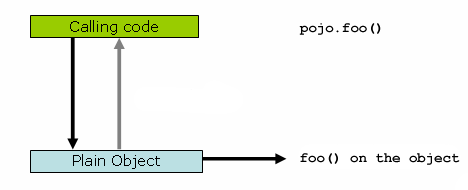
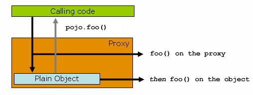

动态代理是Java中的一种设计模式，它允许开发者在运行时动态地创建接口的实现类。这种技术通常用于在不修改原有代码的基础上，为对象添加额外的行为，如日志记录、事务处理、安全检查等。在Java中，动态代理主要通过`java.lang.reflect.Proxy`类和`java.lang.reflect.InvocationHandler`接口来实现。

# java动态代理

## 动态代理的关键点

1. ** 接口**：动态代理是基于接口的，即被代理类必须实现一个或多个接口。
2. **Proxy类**：该类提供了一组静态方法用于创建动态代理的类和实例。
3. **InvocationHandler接口**：所有通过动态代理实例的方法调用都会转发到实现这个接口的实例的`invoke`方法上。

## 工作原理

1. **定义接口**：首先定义一个或多个接口，这些接口将被代理类实现。
2. **创建InvocationHandler实现**：实现`InvocationHandler`接口，并重写`invoke`方法。在这个方法中，你可以添加自定义逻辑，并在调用原始方法之前或之后执行。
3. **创建代理实例**：使用`Proxy.newProxyInstance`方法创建代理实例。这个方法需要三个参数：类加载器（用于加载代理类），被代理类实现的接口数组，以及`InvocationHandler`实现类的实例。
4. **通过代理实例调用方法**：当通过代理实例调用方法时，实际上会调用`InvocationHandler`的`invoke`方法，然后`invoke`方法再调用原始方法。

### 示例

下面是一个简单的动态代理示例，它展示了如何为`HelloService`接口创建一个代理实例，并在调用`sayHello`方法时添加日志记录。

```java
import java.lang.reflect.InvocationHandler;  
import java.lang.reflect.Method;  
import java.lang.reflect.Proxy;  
  
// 定义接口  
interface HelloService {  
    void sayHello();  
}  
  
// 被代理类  
class HelloServiceImpl implements HelloService {  
    @Override  
    public void sayHello() {  
        System.out.println("Hello, world!");  
    }  
}  
  
// InvocationHandler实现  
class LoggingInvocationHandler implements InvocationHandler {  
    private Object target;  
  
    public LoggingInvocationHandler(Object target) {  
        this.target = target;  
    }  
  
    @Override  
    public Object invoke(Object proxy, Method method, Object[] args) throws Throwable {  
        System.out.println("Before method: " + method.getName());  
        Object result = method.invoke(target, args); // 调用原始方法  
        System.out.println("After method: " + method.getName());  
        return result;  
    }  
}  
  
public class DynamicProxyExample {  
    public static void main(String[] args) {  
        HelloService helloService = new HelloServiceImpl();  
  
        // 创建代理实例  
        HelloService proxy = (HelloService) Proxy.newProxyInstance(  
            HelloServiceImpl.class.getClassLoader(),  
            new Class[]{HelloService.class},  
            new LoggingInvocationHandler(helloService)  
        );  
  
        // 通过代理实例调用方法  
        proxy.sayHello();  
    }  
}
```

在这个示例中，`LoggingInvocationHandler`类实现了`InvocationHandler`接口，并在`invoke`方法中添加了日志记录的逻辑。然后，我们使用`Proxy.newProxyInstance`方法创建了`HelloService`接口的代理实例，并通过这个代理实例调用了`sayHello`方法。从输出中可以看到，在调用`sayHello`方法之前和之后，都输出了日志信息。

## 适用场景

动态代理在软件开发中具有广泛的应用场景，主要因其能够在不修改原有代码的基础上，为对象添加额外的行为或功能。以下是动态代理适用的几个主要场景：

### 1. 面向切面编程（AOP）

- **日志记录**：在方法调用前后添加日志记录的逻辑，方便追踪和调试。
- **性能监控**：监控方法的执行时间、调用次数等性能指标。
- **事务管理**：在方法调用前后开启和提交/回滚事务，确保数据的一致性和完整性。
- **安全检查**：在方法调用前进行权限验证、身份验证等安全检查。

AOP框架如Spring广泛使用动态代理来实现这些横切关注点，从而提高代码的可维护性和复用性。

### 2. 远程调用（RPC）

动态代理可以将本地对象的方法调用转化为远程调用，实现不同系统或服务之间的通信。在分布式系统中，这种机制非常有用，因为它允许开发者像调用本地方法一样调用远程服务的方法。

### 3. 缓存代理

动态代理可以将方法的调用结果缓存起来，当下次调用相同的方法时，如果缓存中已有结果，则直接返回缓存的结果，从而提高系统的响应速度和性能。

### 4. 延迟加载

在某些情况下，对象的初始化和资源的加载可以延迟到真正需要使用时再进行。动态代理可以实现这种延迟加载的机制，从而提高程序的性能和资源利用率。


# Spring AOP代理

Spring AOP 默认使用标准 JDK 动态代理作为 AOP 代理。这使得任何接口（或一组接口）都可以被代理。Spring AOP 也可以使用 CGLIB 代理（基于类而非接口）。默认情况下，如果业务对象未实现接口，则使用 CGLIB。由于对接口而不是类进行编程是一种很好的做法，因此业务类通常实现一个或多个业务接口。在那些（希望很少见）你需要通知（advise）未在接口上声明的方法，或者你需要将代理对象作为具体类型传递给方法的情况下，可以[强制使用 CGLIB。](https://docs.spring.io/spring-framework/reference/core/aop/proxying.html)


如果要代理的目标对象至少实现一个接口，则使用 JDK 动态代理。目标类型实现的所有接口都是代理的。如果目标对象未实现任何接口，则会创建一个 CGLIB 代理。如果要强制使用 CGLIB 代理（例如，代理为目标对象定义的每个方法，而不仅仅是由其接口实现的方法），则可以这样做。但是，您应该考虑以下问题：

* 使用 CGLIB 时，不能建议(advised) `final` 方法，因为它们不能在运行时生成的子类中被覆盖。
* 从 Spring 4.0 开始，代理对象的构造函数不再被调用两次，因为 CGLIB 代理实例是通过 `Objenesis `创建的。只有当您的 JVM 不允许绕过构造函数时，您才可能会看到来自 Spring 的 AOP 支持的双重调用和相应的调试日志条目。
* 您的 CGLIB 代理使用可能会遇到 JDK 9+ 平台模块系统的限制。作为典型情况，在模块路径上部署时，您无法为 `java.lang` 包中的类创建 CGLIB 代理。这种情况需要一个 JVM 引导标志 `--add-opens=java.base/java.lang=ALL-UNNAMED`，该标志不适用于模块。


## 示例

```java
public class SimplePojo implements Pojo {

	public void foo() {
		// this next method invocation is a direct call on the 'this' reference
		this.bar();
	}

	public void bar() {
		// some logic...
	}
}
```

如果在对象引用上调用方法，则直接在该对象引用上调用该方法，如下图所示：



当客户端代码具有的引用是代理时，情况会略有变化。请考虑以下关系图和代码片段：



```java
public class Main {

	public static void main(String[] args) {
		ProxyFactory factory = new ProxyFactory(new SimplePojo());
		factory.addInterface(Pojo.class);
		factory.addAdvice(new RetryAdvice());

		Pojo pojo = (Pojo) factory.getProxy();
		// this is a method call on the proxy!
		pojo.foo();
	}
}
```

`Main` 类的 `main（..）` 方法内的客户端代码具有对代理的引用。这意味着对该对象引用的方法调用是对代理的调用。但是，一旦调用最终到达目标对象（在本例中为 `SimplePojo` 引用），它可能对自身进行的任何方法调用（例如 `this.bar（）` 或 `this.foo（）`）都将针对 `this` 引用调用，而不是针对代理调用。这具有重要意义。这意味着自我调用不会导致与方法调用相关的建议有机会运行。好的，那么该怎么办呢？

```java
public class SimplePojo implements Pojo {

	public void foo() {
		// this works, but... gah!
		((Pojo) AopContext.currentProxy()).bar();
	}

	public void bar() {
		// some logic...
	}
}
```

这将你的代码完全耦合到 Spring AOP，它使类本身意识到它正在 AOP 上下文中使用的事实，这与 AOP 背道而驰。在创建代理时，它还需要一些额外的配置，如下例所示：

```java
public class Main {

	public static void main(String[] args) {
		ProxyFactory factory = new ProxyFactory(new SimplePojo());
		factory.addInterface(Pojo.class);
		factory.addAdvice(new RetryAdvice());
		factory.setExposeProxy(true);

		Pojo pojo = (Pojo) factory.getProxy();
		// this is a method call on the proxy!
		pojo.foo();
	}
}
```

最后，必须注意的是，`AspectJ `不存在这种自调用问题，因为它不是一个基于代理的 AOP 框架。

# AspectJ 代理

Spring AOP 是用纯 Java 实现的。不需要特殊的编译过程。Spring AOP 不需要控制类加载器层次结构，因此适合在 servlet 容器或应用程序服务器中使用。

Spring AOP 目前仅支持方法执行连接点（建议在 Spring bean 上执行方法）。字段拦截没有实现，尽管可以在不破坏核心 Spring AOP API 的情况下添加对字段拦截的支持。如果您需要建议字段访问和更新连接点，请考虑使用 AspectJ 等语言。

AspectJ会修改底层代码，主要包括编译时织入和加载时织入两种。编译时织入需要在编译过程中使用AspectJ编译器（ajc）将切面代码织入到目标代码中；加载时织入则是在Java虚拟机加载类时，通过特定的类加载器来加载和织入切面代码。

Spring AOP 比使用完整的 AspectJ 更简单，因为不需要将 AspectJ 编译器/编织器引入你的开发和构建过程。如果你只需要建议在 Spring bean 上执行操作，Spring AOP 是正确的选择。如果需要通知不由 Spring 容器管理的对象（例如域对象），则需要使用 AspectJ。如果你希望通知连接点而不是简单的方法执行（例如，字段 get 或 set 连接点等），你也需要使用 AspectJ。