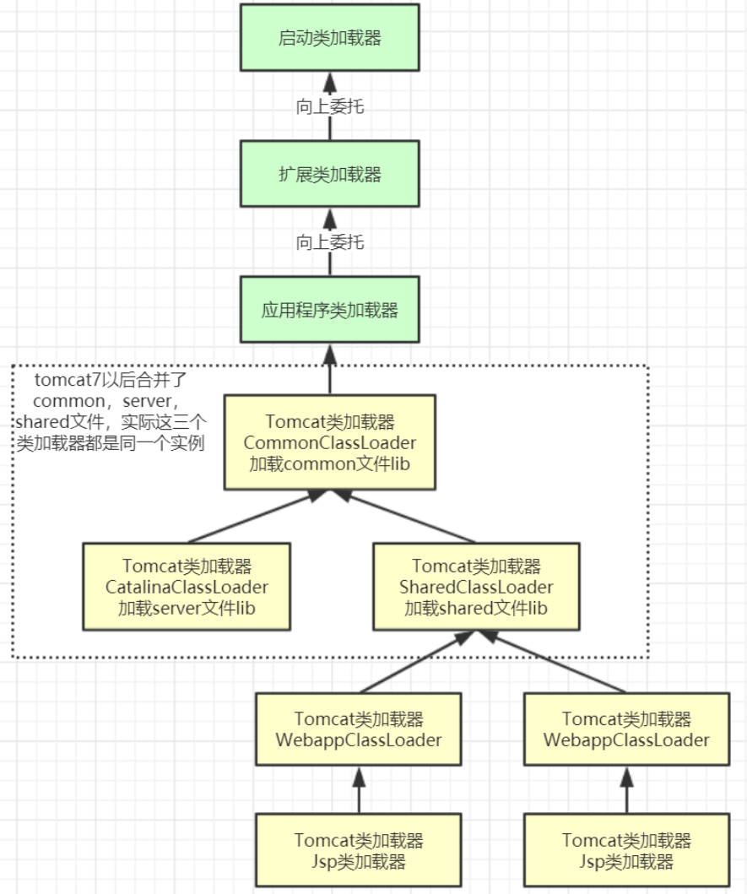

类加载器是一个负责加载类的对象。`ClassLoader` 是一个抽象类。给定类的二进制名称，类加载器应尝试定位或生成构成类定义的数据。典型的策略是将名称转换为文件名，然后从文件系统中读取该名称的类文件。

每个 Java 类都有一个引用指向加载它的 `ClassLoader`。不过，数组类不是通过 `ClassLoader` 创建的，而是 JVM 在需要的时候自动创建的，数组类通过`getClassLoader()`方法获取 `ClassLoader` 的时候和该数组的元素类型的 `ClassLoader` 是一致的。

简单来说，**类加载器的主要作用就是加载 Java 类的字节码（ `.class` 文件）到 JVM 中（在内存中生成一个代表该类的 `Class` 对象）。** 字节码可以是 Java 源程序（`.java`文件）经过 `javac` 编译得来，也可以是通过工具动态生成或者通过网络下载得来。

> 其实除了加载类之外，类加载器还可以加载 Java 应用所需的资源如文本、图像、配置文件、视频等等文件资源。


## 类加载规则

JVM 启动的时候，并不会一次性加载所有的类，而是根据需要去动态加载。也就是说，大部分类在具体用到的时候才会去加载。对于已经加载的类会被放在 `ClassLoader` 中。在类加载的时候，系统会首先判断当前类是否被加载过。已经被加载的类会直接返回，否则才会尝试加载。也就是说，对于一个类加载器来说，相同二进制名称的类只会被加载一次。

## 类加载器分类

JVM 中内置了三个重要的 `ClassLoader`：

1. **`BootstrapClassLoader`(启动类加载器)**：最顶层的加载类，由 C++实现，通常表示为 null，并且没有父级，主要用来加载 JDK 内部的核心类库（ `%JAVA_HOME%/lib`目录下的 `rt.jar`、`resources.jar`、`charsets.jar`等 jar 包和类）以及被 `-Xbootclasspath`参数指定的路径下的所有类。
2. **`ExtensionClassLoader`(扩展类加载器)**：主要负责加载 `%JRE_HOME%/lib/ext` 目录下的 jar 包和类以及被 `java.ext.dirs` 系统变量所指定的路径下的所有类。
3. **`AppClassLoader`(应用程序类加载器)**：面向我们用户的加载器，负责加载当前应用 `classpath `下的所有 jar 包和类。


> **`rt.jar`**：rt 代表 `RunTime`，`rt.jar`是 Java 基础类库，包含 Java doc 里面看到的所有的类的类文件。也就是说，我们常用内置库 `java.xxx.*`都在里面，比如`java.util.*`、`java.io.*`、`java.nio.*`、`java.lang.*`、`java.sql.*`、`java.math.*`。
>
> Java 9 引入了模块系统，并且略微更改了上述的类加载器。扩展类加载器被改名为`平台类加载器`（platform class loader）。Java SE 中除了少数几个关键模块，比如说 `java.base` 是由启动类加载器加载之外，其他的模块均由平台类加载器所加载。


除了这三种类加载器之外，用户还可以加入自定义的类加载器来进行拓展，以满足自己的特殊需求。就比如说，我们可以对 Java 类的字节码（ `.class` 文件）进行加密，加载时再利用自定义的类加载器对其解密。


除了 `BootstrapClassLoader` 是 JVM 自身的一部分之外，其他所有的类加载器都是在 JVM 外部实现的，并且全都继承自 `ClassLoader`抽象类。这样做的好处是用户可以自定义类加载器，以便让应用程序自己决定如何去获取所需的类。每个 `ClassLoader` 可以通过`getParent()`获取其父 `ClassLoader`，如果获取到 `ClassLoader` 为`null`的话，那么该类是通过 `BootstrapClassLoader` 加载的。


## 双亲委派模型

`ClassLoader` 类使用委托模型来搜索类和资源。每个 `ClassLoader` 实例都有一个相关的父类加载器。需要查找类或资源时，`ClassLoader` 实例会将搜索类或资源的任务委托给其父类加载器, 只有父类找不到对应资源时，才自己动手干。

双亲委派模型的实现代码非常简单，逻辑非常清晰，都集中在 `java.lang.ClassLoader` 的 `loadClass()` 中，相关代码如下所示：

```java
protected Class<?> loadClass(String name, boolean resolve)
    throws ClassNotFoundException
{
    synchronized (getClassLoadingLock(name)) {
        //首先，检查该类是否已经加载过
        Class c = findLoadedClass(name);
        if (c == null) {
            //如果 c 为 null，则说明该类没有被加载过
            long t0 = System.nanoTime();
            try {
                if (parent != null) {
                    //当父类的加载器不为空，则通过父类的loadClass来加载该类
                    c = parent.loadClass(name, false);
                } else {
                    //当父类的加载器为空，则调用启动类加载器来加载该类
                    c = findBootstrapClassOrNull(name);
                }
            } catch (ClassNotFoundException e) {
                //非空父类的类加载器无法找到相应的类，则抛出异常
            }

            if (c == null) {
                //当父类加载器无法加载时，则调用findClass方法来加载该类
                //用户可通过覆写该方法，来自定义类加载器
                long t1 = System.nanoTime();
                c = findClass(name);

                //用于统计类加载器相关的信息
                sun.misc.PerfCounter.getParentDelegationTime().addTime(t1 - t0);
                sun.misc.PerfCounter.getFindClassTime().addElapsedTimeFrom(t1);
                sun.misc.PerfCounter.getFindClasses().increment();
            }
        }
        if (resolve) {
            //对类进行link操作
            resolveClass(c);
        }
        return c;
    }
}

```

结合上面的源码，简单总结一下双亲委派模型的执行流程：

1. 在类加载的时候，系统会首先判断当前类是否被加载过。已经被加载的类会直接返回，否则才会尝试加载（每个父类加载器都会走一遍这个流程）。

2. 类加载器在进行类加载的时候，它首先不会自己去尝试加载这个类，而是把这个请求委派给父类加载器去完成（调用父加载器 `loadClass()`方法来加载类）。这样的话，所有的请求最终都会传送到顶层的启动类加载器 `BootstrapClassLoader` 中。

3. 只有当父加载器反馈自己无法完成这个加载请求（它的搜索范围中没有找到所需的类）时，子加载器才会尝试自己去加载（调用自己的 `findClass()` 方法来加载类）。

4. 如果子类加载器也无法加载这个类，那么它会抛出一个 `ClassNotFoundException` 异常。


> **JVM 判定两个 Java 类是否相同的具体规则**：JVM 不仅要看类的全名是否相同，还要看加载此类的类加载器是否一样。只有两者都相同的情况，才认为两个类是相同的。即使两个类来源于同一个 `Class` 文件，被同一个虚拟机加载，只要加载它们的类加载器不同，那这两个类就必定不相同。


### 双亲委派模型的好处

双亲委派模型保证了 Java 程序的稳定运行，可以避免类的重复加载（JVM 区分不同类的方式不仅仅根据类名，相同的类文件被不同的类加载器加载产生的是两个不同的类），也保证了 Java 的核心 API 不被篡改。

如果没有使用双亲委派模型，而是每个类加载器加载自己的话就会出现一些问题，比如我们编写一个称为 `java.lang.Object` 类的话，那么程序运行的时候，系统就会出现两个不同的 `Object` 类。双亲委派模型可以保证加载的是 JRE 里的那个 `Object` 类，而不是你写的 `Object` 类。这是因为 `AppClassLoader` 在加载你的 `Object` 类时，会委托给 `ExtClassLoader` 去加载，而 `ExtClassLoader` 又会委托给 `BootstrapClassLoader`，`BootstrapClassLoader` 发现自己已经加载过了 `Object` 类，会直接返回，不会去加载你写的 `Object` 类。

### 打破双亲委派模型方法

自定义加载器的话，需要继承 `ClassLoader` 。如果我们不想打破双亲委派模型，就重写 `ClassLoader` 类中的 `findClass()` 方法即可，无法被父类加载器加载的类最终会通过这个方法被加载。但是，如果想打破双亲委派模型则需要重写 `loadClass()` 方法。


我们比较熟悉的 Tomcat 服务器为了能够优先加载 Web 应用目录下的类，然后再加载其他目录下的类，就自定义了类加载器 `WebAppClassLoader` 来打破双亲委托机制。这也是 Tomcat 下 Web 应用之间的类实现隔离的具体原理。




> `WebAppClassloader`对应 `<Tomcat >/webapps/<app>/WEB-INF/*`

1.`CatalinaClassLoader` 和 `SharedClassLoader` 能加载的类则与对方相互隔离。`CatalinaClassLoader` 用于加载 Tomcat 自身的类，为了隔离 Tomcat 本身的类和 Web 应用的类。`SharedClassLoader` 作为 `WebAppClassLoader` 的父加载器，专门来加载 Web 应用之间共享的类比如 Spring、Mybatis。

2.每个 Web 应用都会创建一个单独的 `WebAppClassLoader`，并在启动 Web 应用的线程里设置线程线程上下文类加载器为 `WebAppClassLoader`。各个 `WebAppClassLoader` 实例之间相互隔离，进而实现 Web 应用之间的类隔。

#### SPI

单纯依靠自定义类加载器没办法满足某些场景的要求，例如，有些情况下，高层的类加载器需要加载低层的加载器才能加载的类。

比如，SPI 中，SPI 的接口（如 `java.sql.Driver`）是由 Java 核心库提供的，由`BootstrapClassLoader` 加载。而 SPI 的实现（如`com.mysql.cj.jdbc.Driver`）是由第三方供应商提供的，它们是由应用程序类加载器或者自定义类加载器来加载的。默认情况下，一个类及其依赖类由同一个类加载器加载。所以，加载 SPI 的接口的类加载器（`BootstrapClassLoader`）也会用来加载 SPI 的实现。按照双亲委派模型，`BootstrapClassLoader` 是无法找到 SPI 的实现类的，因为它无法委托给子类加载器去尝试加载。如何解决这个问题呢？ 这个时候就需要用到线程上下文类加载器`ThreadContextClassLoader`了。

接下来，我们以java.sql.DriverManager为例，看下线程上下文加载器的用法，在java.sql.DriverManager类的下面这个静态块中，是JDBC驱动加载的入口。

```Java
    /**
     * Load the initial JDBC drivers by checking the System property
     * jdbc.properties and then use the {@code ServiceLoader} mechanism
     */
    static {
        loadInitialDrivers();
        println("JDBC DriverManager initialized");
    }
```

顺着`loadInitialDrivers()`方法往下看，使用线程上下文加载器的地方在`ServiceLoader.load`里

```Java
    private static void loadInitialDrivers() {
				// ……省去别的代码
        AccessController.doPrivileged(new PrivilegedAction<Void>() {
            public Void run() {
							
                ServiceLoader<Driver> loadedDrivers = ServiceLoader.load(Driver.class);
                Iterator<Driver> driversIterator = loadedDrivers.iterator();
              
                try{
                    while(driversIterator.hasNext()) {
                        driversIterator.next();
                    }
                } catch(Throwable t) {
                // Do nothing
                }
                return null;
            }
        });
      //…… 省去别的代码
```

`ServiceLoader.load`方法的代码如下，`JDBC`的`sqlDriverManager`就是这里获得的上下文加载器来驱动用户代码加载指定的类的。

```java
    public static <S> ServiceLoader<S> load(Class<S> service) {
	      // 获取当前线程中的上下文类加载器
        ClassLoader cl = Thread.currentThread().getContextClassLoader();
        return ServiceLoader.load(service, cl);
    }
```

那么这个上下文加载器是什么时候设置进去的呢？前面我们提到了：

`这个类加载器可以通过java.lang.Thread类的setContextClassLoader()方法进行设置，如果创建线程时候它还没有被设置，就会从父线程中继承一个，如果在应用程序的全局范围都没有设置过的话，那这个类加载器就是应用程序类加载器。`

看下`setContextClassLoader()`方法别谁调用了，在Launcher中找到了如下代码：

```java
public class Launcher {
		//……省去别的代码
    public Launcher() {
        Launcher.ExtClassLoader var1;
        try {
            var1 = Launcher.ExtClassLoader.getExtClassLoader();
        } catch (IOException var10) {
            throw new InternalError("Could not create extension class loader", var10);
        }

        try {
            this.loader = Launcher.AppClassLoader.getAppClassLoader(var1);
        } catch (IOException var9) {
            throw new InternalError("Could not create application class loader", var9);
        }

        Thread.currentThread().setContextClassLoader(this.loader);
        //……省去别的代码
    }
}
```


## 自定义类加载器

我们前面也说说了，除了 `BootstrapClassLoader` 其他类加载器均由 Java 实现且全部继承自`java.lang.ClassLoader`。如果我们要自定义自己的类加载器，很明显需要继承 `ClassLoader`抽象类。

`ClassLoader` 类有两个关键的方法：

- `protected Class loadClass(String name, boolean resolve)`：加载指定二进制名称的类，实现了双亲委派机制 。`name` 为类的二进制名称，`resolve` 如果为 true，在加载时调用 `resolveClass(Class<?> c)` 方法解析该类。
- `protected Class findClass(String name)`：根据类的二进制名称来查找类，默认实现是空方法。

> 如果我们不想打破双亲委派模型，就重写 `ClassLoader` 类中的 `findClass()` 方法即可，无法被父类加载器加载的类最终会通过这个方法被加载。但是，如果想打破双亲委派模型则需要重写 `loadClass()` 方法。


### resolveClass 和 findClass

- `resolveClass(Class<?> c)`，用于链接指定的类。此方法在类被加载后，将其解析并转换为可执行的代码形式，完成类的验证、准备和解析阶段（如果还未进行的话）。
- `findClass(String name)`用于查找并加载类的字节码数据，然后将其定义为一个`Class`对象。它是自定义类加载器中通常需要重写的关键方法之一，允许开发人员按照特定的逻辑去查找类。

> `resolveClass`通常在类加载的后期阶段被调用，以确保类的完全加载和准备就绪以供使用。例如在动态代理生成类并加载后，需要通过`resolveClass`来确保代理类的所有引用和依赖都被正确解析。
>
> `findClass`则侧重于实际去定位类的字节码资源。例如在实现一个从网络上加载类的自定义类加载器时，需要在`findClass`中编写通过网络请求获取类的字节码数据的逻辑。

在类加载的过程中，通常先调用`findClass`找到类的字节码，然后再调用`resolveClass`来完成类的链接过程。它们共同协作确保类能够被正确加载到 Java 虚拟机中。如果自定义类加载器不重写`findClass`，默认的双亲委派加载机制将会生效，按照类加载器的层次结构去尝试加载类。而`resolveClass`在默认的类加载器实现中，通常在加载类的过程中的适当阶段自动调用。但在一些特殊的类加载场景，如需要特殊的类解析逻辑或在加载某些特定类型的类时，可以在自定义类加载器中选择性地手动调用`resolveClass`来控制类的链接时机和方式。