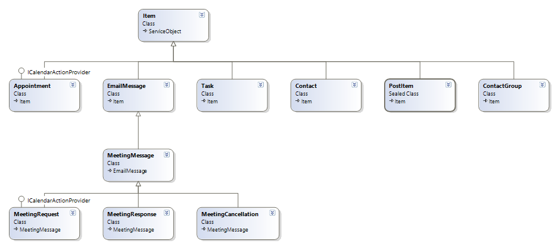
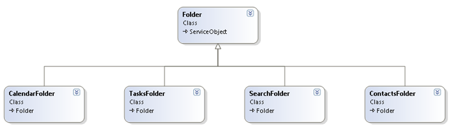

依赖: `com.microsoft.ews-java-api:ews-java-api:2.0`

## ExchangeService

要使用`EWS JAVA API`访问`Exchange Web`服务（`EWS`），您只需要一个`ExchangeService`类的实例，如下例所示。注意：`ExchangeService`类不是线程安全的。因此，每个线程必须使用一个实例。

```java
ExchangeService service = new ExchangeService(ExchangeVersion.Exchange2010_SP2);
ExchangeCredentials credentials = new WebCredentials("emailAddress", "password");
service.setCredentials(credentials);
```

### 设置URL

有两种方式：

* 手动：如果您知道EWS的URL，或者您之前已经通过自动发现服务确定了它。
* 自动：使用自动发现服务

```java
service.setUrl(new URI("<ews_url>")); // 手动
service.autodiscoverUrl("<your_email_address>"); //自动发现
```

我们建议您使用自动发现服务，原因如下：

* 自动发现确定给定用户的最佳结点（最接近用户邮箱服务器的结点）。
* EWS URL可能会随着管理员部署新的客户端访问服务器而更改。

您可以安全地缓存自动发现服务返回的URL并重新使用它。应定期调用自动发现，或者在EWS与给定URL的连接丢失时调用。请注意，您应该手动设置URL或调用`AutodiscoverUrl`，但不应同时执行这两种操作。

### 自动发现重定向

如果用户电子邮件地址的域被重定向，则引发此异常：

```
microsoft.exchange.webservices.data.autodiscover.exception.AutodiscoverLocalException: Autodiscover blocked a potentially insecure redirection to URL. To allow Autodiscover to follow the redirection, use the AutodiscoverUrl(string, AutodiscoverRedirectionUrlValidationCallback) overload.<
```

当这种情况发生时，系统会提示用户是否接受重定向，而不是失败。该功能需要在`autodiscoverRedirectionUrlValidationCallback`方法中实现。在下面的示例中，它只检查重定向url是否以`https://`开头:

```java
static class RedirectionUrlCallback implements IAutodiscoverRedirectionUrl {
        public boolean autodiscoverRedirectionUrlValidationCallback(
                String redirectionUrl) {
            return redirectionUrl.toLowerCase().startsWith("https://");
        }
    }

service.autodiscoverUrl("<your_email_address>", new RedirectionUrlCallback());
```

## 条目

EWS  JAVA  API 定义了条目的类层次结构。层次结构中的每个类都映射到`Exchange`中的给定项类型。例如，`EmailMessage`类表示电子邮件，`Appointment`类表示日历事件和会议。



### 绑定到现有条目

如果您知道电子邮件的唯一标识符，并且希望从Exchange检索其详细信息：

```java
// Bind to an existing message using its unique identifier.
EmailMessage message = EmailMessage.bind(service, new ItemId(uniqueId));

// Write the sender's name.
System.out.println(message.getSender().getName());
```

如果您不知道唯一标识符映射到什么类型的条目，也可以编写以下内容：

```java
// Bind to an existing item using its unique identifier.
Item item = Item.bind(service, new ItemId(uniqueId));

if (item instanceof EmailMessage) {
	// If the item is an e-mail message, write the sender's name.
	System.out.println(((EmailMessage)item).getSender().getName());
} else if (item instanceof Appointment) {
	// If the item is an appointment, write its start time.
	System.out.println(((Appointment)item).getStart()));
} else {
	// Handle other types.
}
```

### 删除条目

```java
message.delete(DeleteMode.HardDelete);
```

### 搜索

您可以使用EWS列出用户邮箱中的前10个条目：

```java
public void listFirstTenItems() {
	ItemView view = new ItemView(10);
	FindItemsResults<Item> findResults = service.findItems(folder.getId(), view);
        
        //MOOOOOOST IMPORTANT: load messages' properties before
  service.loadPropertiesForItems(findResults, PropertySet.FirstClassProperties);
	
  for (Item item : findResults.getItems()) {
		// Do something with the item as shown
		System.out.println("id==========" + item.getId());
		System.out.println("sub==========" + item.getSubject());
	}
}
```

分页检索

```java
public void pageThroughEntireInbox() throws Exception {
    final int pageSize = 50;
    ItemView view = new ItemView(pageSize);
    FindItemsResults<Item> findResults;

    do {
        findResults = service.findItems(WellKnownFolderName.Inbox, view);

        for (Item item : findResults.getItems()) {
            // Do something with the item.
        }

        view.setOffset(view.getOffset() + pageSize);
    } while (findResults.isMoreAvailable());
}
```

在收件箱中查找主题包含EWS或API字样的前10封邮件，按收到日期排序，并仅返回主题和收到日期属性。

```java
public void findItems() {
	ItemView view = new ItemView(10);
	view.getOrderBy().add(ItemSchema.DateTimeReceived, SortDirection.Ascending);
	view.setPropertySet(new PropertySet(BasePropertySet.IdOnly, ItemSchema.Subject, ItemSchema.DateTimeReceived));

	FindItemsResults<Item> findResults =
    	service.findItems(WellKnownFolderName.Inbox,
        	new SearchFilter.SearchFilterCollection(
				LogicalOperator.Or, new SearchFilter.ContainsSubstring(ItemSchema.Subject, "EWS"),
			new SearchFilter.ContainsSubstring(ItemSchema.Subject, "API")), view);

    //MOOOOOOST IMPORTANT: load items properties, before
    service.loadPropertiesForItems(findResults, PropertySet.FirstClassProperties);
	System.out.println("Total number of items found: " + findResults.getTotalCount());

	for (Item item : findResults) {
		System.out.println(item.getSubject());
		System.out.println(item.getBody());
		// Do something with the item.
	}
}
```

使用FindFolder操作在已识别父文件夹的所有子文件夹中进行搜索；例如，您可以搜索收件箱的所有子文件夹，如以下示例所示:

```java
public void findChildFolders() {
	FindFoldersResults findResults = service.findFolders(WellKnownFolderName.Inbox, new FolderView(Integer.MAX_VALUE));

	for (Folder folder : findResults.getFolders()) {
		System.out.println("Count======" + folder.getChildFolderCount());
		System.out.println("Name=======" + folder.getDisplayName());
	}
}
```

以下示例显示如何获取指定文件夹中startDate和endDate之间的所有约会，包括定期会议:

```java
public void findAppointments(CalendarFolder folder, Date startDate, Date endDate) {
	SimpleDateFormat formatter = new SimpleDateFormat("yyyy-MM-dd HH:mm:ss");
	Date startDate = formatter.parse("2010-05-01 12:00:00");
	Date endDate = formatter.parse("2010-05-30 13:00:00");
	CalendarFolder cf=CalendarFolder.bind(service, WellKnownFolderName.Calendar);
	FindItemsResults<Appointment> findResults = cf.findAppointments(new CalendarView(startDate, endDate));
	for (Appointment appt : findResults.getItems()) {
		appt.load(PropertySet.FirstClassProperties);
		System.out.println("SUBJECT====="+appt.getSubject());
		System.out.println("BODY========"+appt.getBody());
	}
}
```


## 目录

文件夹操作提供对Exchange数据存储中文件夹的访问权限。客户端应用程序可以创建、更新、删除、复制、查找、获取和移动与邮箱用户关联的文件夹。文件夹用于获得对存储中项目的访问权限，并为存储中的项目提供参考容器。

EWS JAVA API还定义了文件夹的类层次结构，如下图所示：



Exchange中的条目和文件夹是唯一标识的。在 EWS  JAVA  API中，条目和文件夹具有一个ID属性，该属性保存其Exchange唯一标识。项目的ID的类型为`ItemId`；文件夹的ID属于`FolderId`类型。

### 绑定到现有目录

绑定到现有文件夹的方式与绑定到现有项的方式相同：

```java
// Bind to an existing folder using its unique identifier.
Folder folder = Folder.bind(service, new FolderId(uniqueId));
```

您还可以绑定到一个众所周知的文件夹（收件箱、日历、任务等），而不知道其ID:

```java
// Bind to the Inbox.
Folder inbox = Folder.bind(service, WellKnownFolderName.Inbox);
```

### 创建目录

```java
Folder folder = new Folder(service);
folder.setDisplayName("EWS-JAVA-Folder");
// creates the folder as a child of the Inbox folder.
folder.save(WellKnownFolderName.Inbox); 
```


## 发送邮件

```java
EmailMessage msg= new EmailMessage(service);
msg.setSubject("Hello world!");
msg.setBody(MessageBody.getMessageBodyFromText("Sent using the EWS Java API."));
msg.getToRecipients().add("someone@contoso.com");
msg.send();
```


## 规则

### 创建规则

```java
// Create an Inbox rule.
// If "Interesting" is in the subject, move it into the Junk folder.
Rule newRule = new Rule();
newRule.setDisplayName("FinalInboxRule333");
newRule.setPriority(1);
newRule.setIsEnabled(true);
newRule.getConditions().getContainsSubjectStrings().add("FinalInboxRuleSubject333");
newRule.getActions().setMoveToFolder(new FolderId(WellKnownFolderName.JunkEmail));

CreateRuleOperation createOperation = new CreateRuleOperation(newRule);
List<RuleOperation> ruleList = new ArrayList<RuleOperation>();
ruleList.add(createOperation);
service.updateInboxRules(ruleList, true);

RuleCollection ruleCollection = service.getInboxRules("someone@contoso.com");
System.out.println("Collection count: " + ruleCollection.getCount());

List<RuleOperation> deleterules = new ArrayList<RuleOperation>();

// Write the DisplayName and ID of each rule.
for (Rule rule : ruleCollection) {
	System.out.println(rule.getDisplayName());
	System.out.println(rule.getId());
	DeleteRuleOperation d = new DeleteRuleOperation(rule.getId());
	deleterules.add(d);
}

service.updateInboxRules(deleterules, true);
ruleCollection = service.getInboxRules("someone@contoso.com");
System.out.println("Collection count: " + ruleCollection.getCount());

// Write the DisplayName and ID of each rule.
for (Rule rule : ruleCollection) {
	System.out.println(rule.getDisplayName());
	System.out.println(rule.getId());
}
```

### 获取规则

```java
RuleCollection ruleCollection = service.getInboxRules("someone@contoso.com");
System.out.println("Collection count: " + ruleCollection.getCount());

// Write the DisplayName and Id of each Rule.
for (Rule rule : ruleCollection) {
	System.out.println(rule.getDisplayName());
	System.out.println(rule.getId());
}
```


