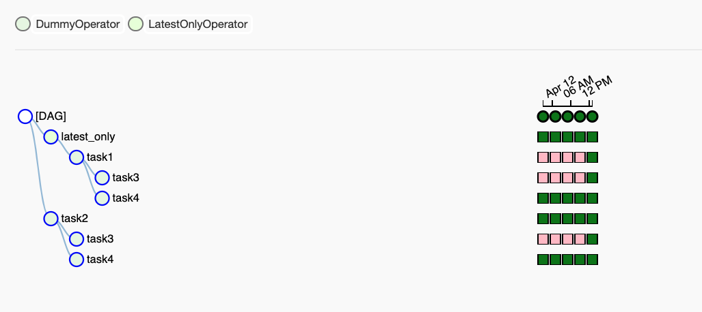
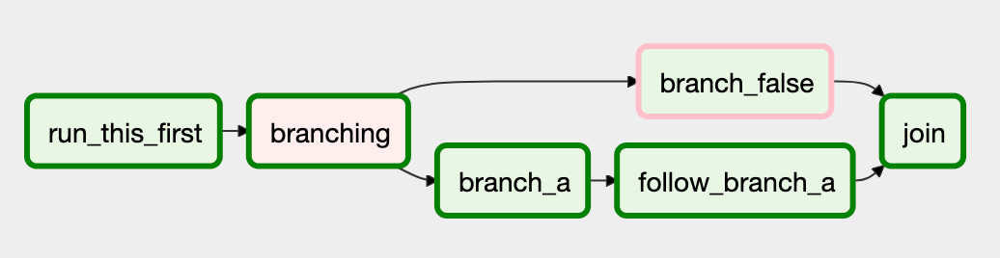

Airflow是一个用于开发、调度和监控 **面向批处理的工作流** 的开源平台。**主要特点是所有工作流都是用Python代码定义的**。

# 快速入门

```python
from datetime import datetime

from airflow import DAG
from airflow.decorators import task
from airflow.operators.bash import BashOperator

# A DAG represents a workflow, a collection of tasks
with DAG(dag_id="demo", start_date=datetime(2022, 1, 1), schedule="0 0 * * *") as dag:

    # Tasks are represented as operators
    hello = BashOperator(task_id="hello", bash_command="echo hello")

    @task()
    def airflow():
        print("airflow")

    # Set dependencies between tasks
    hello >> airflow()
```

1. 一个名为 `demo` 的DAG，从2022年1月1日开始，每天运行一次。DAG是Airflow对工作流的表示。
2. 两个任务，一个是运行Bash脚本的BashOperator，另一个是使用@task decorator定义的Python函数

3. `>>` 在任务之间，定义了一个依赖项，并控制任务的执行顺序

Airflow评估此脚本，并按设定的间隔和定义的顺序执行任务。`demo` DAG的状态在web界面中可见：


本例演示了一个简单的Bash和Python脚本，但这些任务可以运行任何代码。可以运行Spark作业、在两个存储桶之间移动数据或发送电子邮件。同样的结构也可以随着时间的推移而运行：


每列表示一个DAG运行。这是Airflow中最常用的两个视图，但还有其他几个视图可以让您深入了解工作流的状态。


Airflow 是一个批处理工作流编排平台。Airflow框架包含可与许多技术连接的operators ，并且可轻松扩展以与新技术连接。如果您的工作流有一个明确的开始和结束，并且以定期间隔运行，则可以将其编程为DAG。


Airflow包括以下核心组件：

1. webserver

2. scheduler

3. CLI 

Providers 包包括与第三方项目的集成。它们的版本和发布独立于Apache Airflow核心包。


wsl ubuntu 安装python

```shell
sudo apt remove python3 # 移除默认安装的3.10
sudo apt autoremove
sudo ln -s /usr/bin/python3.9 /usr/bin/python
sudo apt install python3-pip
pip config set global.index-url https://pypi.tuna.tsinghua.edu.cn/simple

```


# 安装

* 需要安装python3环境
* 需要 pip 包安装工具


1. 设置Home（可选）

   Airflow需要主目录，使用AIRFLOW_HOME环境变量配置，默认情况下使用`~/airflow`。

   ```shell
   export AIRFLOW_HOME=~/airflow
   ```

2. 使用约束文件安装Airflow，该文件是根据我们传递的URL确定的：

   ```shell
   AIRFLOW_VERSION=2.7.2
   PYTHON_VERSION="$(python --version | cut -d " " -f 2 | cut -d "." -f 1-2)"
   CONSTRAINT_URL="https://raw.githubusercontent.com/apache/airflow/constraints-${AIRFLOW_VERSION}/constraints-${PYTHON_VERSION}.txt"
   pip install "apache-airflow==${AIRFLOW_VERSION}" --constraint "${CONSTRAINT_URL}"
   ```

3. 启动, 初始化数据库，创建一个用户，并启动所有组件。

   ```shell
   export PATH=PATH:/home/zzq/.local/bin #配置airflow的cli 目录
   airflow standalone
   ```

   > 如果要手动运行Airflow的各个部件，而不是使用一体式独立命令，则可以运行：
   >
   > ```shell
   > airflow db migrate
   > 
   > airflow users create \
   >     --username admin \
   >     --firstname Peter \
   >     --lastname Parker \
   >     --role Admin \
   >     --email spiderman@superhero.org
   > 
   > airflow webserver --port 8080
   > 
   > airflow scheduler
   > ```
   >
   > 

4. 访问UI：localhost:8080 ，用户名和密码在控制台打印。

   > 运行这些命令后，Airflow将创建`$AIRFLOW_HOME`文件夹，并使用默认值创建`airflow.cfg`文件，这将使您快速运行。您可以使用环境变量覆盖默认值。
   >
   > 您可以在`$AIRFLOW_HOME/airflow.cfg`中检查文件，也可以在UI上通过`Admin->Configuration`菜单检查文件。
   >
   > Web服务器的PID文件将存储在`$AIRFLOW_HOME/airflow-webserver.pid`中，如果由systemd启动，则存储在`/run/airflow/webserver.pid`中
   >
   > 
   >
   > 默认，Airflow使用了一个SQLite数据库。因为使用这个数据库后端不可能进行并行化，所以它与SequentialExecutor协同工作，后者将仅按顺序运行任务实例。


5. 以下是一些将触发一些任务实例的命令。当您运行下面的命令时，您应该能够在`example_bash_operator` DAG中看到作业的状态更改。

   ```shell
   # run your first task instance
   airflow tasks test example_bash_operator runme_0 2015-01-01
   # run a backfill over 2 days
   airflow dags backfill example_bash_operator \
       --start-date 2015-01-01 \
       --end-date 2015-01-02
   ```

   

# 基础概念

```shell

from datetime import datetime, timedelta
from textwrap import dedent

# The DAG object; we'll need this to instantiate a DAG
from airflow import DAG

# Operators; we need this to operate!
from airflow.operators.bash import BashOperator
with DAG(
    "tutorial",
    # These args will get passed on to each operator
    # You can override them on a per-task basis during operator initialization
    default_args={
        "depends_on_past": False,
        "email": ["airflow@example.com"],
        "email_on_failure": False,
        "email_on_retry": False,
        "retries": 1,
        "retry_delay": timedelta(minutes=5),
        # 'queue': 'bash_queue',
        # 'pool': 'backfill',
        # 'priority_weight': 10,
        # 'end_date': datetime(2016, 1, 1),
        # 'wait_for_downstream': False,
        # 'sla': timedelta(hours=2),
        # 'execution_timeout': timedelta(seconds=300),
        # 'on_failure_callback': some_function, # or list of functions
        # 'on_success_callback': some_other_function, # or list of functions
        # 'on_retry_callback': another_function, # or list of functions
        # 'sla_miss_callback': yet_another_function, # or list of functions
        # 'trigger_rule': 'all_success'
    },
    description="A simple tutorial DAG",
    schedule=timedelta(days=1),
    start_date=datetime(2021, 1, 1),
    catchup=False,
    tags=["example"],
) as dag:

    # t1, t2 and t3 are examples of tasks created by instantiating operators
    t1 = BashOperator(
        task_id="print_date",
        bash_command="date",
    )

    t2 = BashOperator(
        task_id="sleep",
        depends_on_past=False,
        bash_command="sleep 5",
        retries=3,
    )
    t1.doc_md = dedent(
        """\
    #### Task Documentation
    You can document your task using the attributes `doc_md` (markdown),
    `doc` (plain text), `doc_rst`, `doc_json`, `doc_yaml` which gets
    rendered in the UI's Task Instance Details page.
    
    **Image Credit:** Randall Munroe, [XKCD](https://xkcd.com/license.html)
    """
    )

    dag.doc_md = __doc__  # providing that you have a docstring at the beginning of the DAG; OR
    dag.doc_md = """
    This is a documentation placed anywhere
    """  # otherwise, type it like this
    templated_command = dedent(
        """
    
        echo "{{ ds }}"
        echo "{{ macros.ds_add(ds, 7)}}"
    
    """
    )

    t3 = BashOperator(
        task_id="templated",
        depends_on_past=False,
        bash_command=templated_command,
    )

    t1 >> [t2, t3]
```

这是一个DAG定义文件，使用python代码编写。人们有时会认为DAG定义文件是他们可以进行一些实际数据处理的地方——事实并非如此！脚本的目的是定义一个DAG对象。它需要快速评估（秒，而不是分钟），因为调度程序会定期执行它以反映更改（如果有的话）

### 默认参数 ： default_args

在创建一个DAG和一些任务时，我们可以选择显式地将一组参数传递给每个任务的构造函数（这将变得多余），或者（更好！）我们可以定义一个默认参数字典，以便在创建任务时使用。

有关BaseOperator参数及其作用的更多信息，请参阅`airflow.models.BaseOperator`文档。


### 实例化DAG

我们需要一个DAG对象来包裹我们的任务。在这里，我们传递一个定义dag_id的字符串，dag_id是dag的唯一标识符。我们还传递了我们刚刚定义的默认参数字典，并为DAG定义了一个1天的调度间隔。

## Operators

operator 定义Airflow要完成的工作单元。使用操作符是在Airflow中定义任务的经典方法。对于某些用例，最好使用TaskFlow API来定义Python上下文中的任务，如使用TaskFlow中所述。目前，使用操作符有助于在DAG代码中可视化任务依赖关系。

所有操作符都继承自BaseOperator。一些最流行的操作符是PythonOperator、BashOperator和KubernetsPodOperator。

Airflow根据您传递给操作符的参数完成工作。在本教程中，我们使用BashOperator来运行一些bash脚本。

## 任务

要在DAG中使用操作符，必须将其实例化为任务。任务决定如何在DAG的上下文中执行操作符的工作。

在上面的示例中，我们将BashOperator实例化为两个独立的任务，以便运行两个单独的bash脚本。每个实例化的第一个参数task_id充当任务的唯一标识符。

任务参数的优先级规则如下：

* 显式传递的参数

* default_args字典中存在的值

* 操作符的默认值（如果存在）

> 任务必须包含或继承参数task_id和owner，否则Airflow将引发异常。

## Jinja模板

Airflow利用了Jinja Templateing的强大功能，并为管道作者提供了一组内置参数和宏。Airflow还为管道作者提供了钩子，以定义他们自己的参数、宏和模板。
本教程几乎没有触及如何在Airflow中使用模板，但本节的目标是让您知道该功能的存在，熟悉双花括号，并指向最常见的模板变量：{{ ds }} 。

请注意，templated_command在`｛% %｝`块中包含代码逻辑，引用像｛`｛ds｝｝`这样的参数，并调用像`｛macros.ds_ad（ds，7）｝`中那样的函数。

文件也可以传递给bash_command参数，如`bash_command='templated_command.sh'`，其中文件位置相对于包含管道文件的目录（在本例中为tutorial.py）。也可以指定其他位置。

使用相同的DAG构造函数调用，可以定义user_defined_tmacros，从而可以指定自己的变量。例如，将`dict(foo='bar')`传递给此参数允许您在模板中使用`｛｛foo｝｝`。此外，指定user_defined_filters允许您注册自己的过滤器。例如，将`dict(hello=lambda name: 'Hello %s' % name)`传递到此参数允许您在模板中使用`{{ 'world' | hello }}`。有关自定义过滤器的更多信息，请参阅Jinja文档。

## 文档

我们可以为DAG或每个任务添加文档。到目前为止，DAG文档只支持markdown，而任务文档支持纯文本、markdown、reStructuredText、json和yaml。DAG文档可以作为文档字符串写入DAG文件的开头（推荐），也可以写入文件中的任何其他位置。


## 任务依赖关系

我们有相互不依赖的任务t1、t2和t3。以下是定义它们之间依赖关系的几种方法：

```python
t1.set_downstream(t2)

# This means that t2 will depend on t1
# running successfully to run.
# It is equivalent to:
t2.set_upstream(t1)

# The bit shift operator can also be
# used to chain operations:
t1 >> t2

# And the upstream dependency with the
# bit shift operator:
t2 << t1

# Chaining multiple dependencies becomes
# concise with the bit shift operator:
t1 >> t2 >> t3

# A list of tasks can also be set as
# dependencies. These operations
# all have the same effect:
t1.set_downstream([t2, t3])
t1 >> [t2, t3]
[t2, t3] << t1
```

> 请注意，在执行脚本时，当Airflow在DAG中找到循环或依赖项被多次引用时，它将引发异常。

## 时区

创建一个时区感知DAG非常简单。只要确保使用`pendulum`创建带有时区的时间即可。不要试图使用标准库时区，因为众所周知它们有局限性，我们故意不允许在DAG中使用它们。

## 测试

### 验证

假设我们将上面的代码保存在airflow.cfg中引用的DAG文件夹中。DAG的默认位置为`~/airflow/DAGs`。

```shell
python ~/airflow/dags/tutorial.py
```

如果脚本没有引发异常，则表示您没有做任何可怕的错误，并且您的Airflow环境在某种程度上是健全的。


让我们运行一些命令来进一步验证这个脚本。

```shell
# initialize the database tables
airflow db migrate

# print the list of active DAGs
airflow dags list

# prints the list of tasks in the "tutorial" DAG
airflow tasks list tutorial

# prints the hierarchy of tasks in the "tutorial" DAG
airflow tasks list tutorial --tree
```

### 运行任务

让我们通过运行特定日期的实际任务实例来进行测试。在此上下文中指定的日期称为逻辑日期（出于历史原因，也称为执行日期），它模拟调度程序在特定日期和时间运行任务或DAG，即使它现在物理上会运行（或在满足其依赖关系时）。

```shell
# command layout: command subcommand [dag_id] [task_id] [(optional) date]

# testing print_date
airflow tasks test tutorial print_date 2015-06-01

# testing sleep
airflow tasks test tutorial sleep 2015-06-01
```

现在还记得我们之前对模板做了什么吗？通过运行以下命令查看如何渲染和执行此模板：

```shell
# testing templated
airflow tasks test tutorial templated 2015-06-01
```

这将导致显示详细的事件日志，并最终运行bash命令并打印结果。

请注意，airflow tasks test命令在本地运行任务实例，将其日志输出到stdout（在屏幕上），不涉及依赖关系，也不将状态（正在运行、成功、失败…）与数据库通信。它只允许测试单个任务实例。

这同样适用于dags测试，但在DAG级别上。它对给定的DAG id执行一次DAG运行。虽然它确实考虑了任务依赖性，但没有在数据库中注册任何状态。

### Backfill(回填)

一切看起来都很好，所以让我们进行回填。回填将尊重您的依赖关系，将日志发送到文件中，并与数据库对话以记录状态。如果你有一个网络服务器，你将能够跟踪进度。如果您有兴趣在回填过程中直观地跟踪进度，airflow webserver将启动一个web服务器。

请注意，如果使用depends_on_past=True，则单个任务实例将取决于其上一个任务实例（即根据逻辑日期的上一个）的成功率。逻辑日期等于start_date的任务实例将忽略此依赖关系，因为不会为它们创建过去的任务实例。

在使用depends_on_past=True时，您可能还需要考虑wait_for_downstream=True。depends_on_past=True会导致任务实例依赖于其上一个task_instance的成功，而wait_for_downstream=True会导致一个任务实例也会等待上一个任务示例下游的所有任务实例成功。

此上下文中的日期范围是start_date和end_date（可选），用于使用此DAG中的任务实例填充运行计划。

```shell
# optional, start a web server in debug mode in the background
# airflow webserver --debug &

# start your backfill on a date range
airflow dags backfill tutorial \
    --start-date 2015-06-01 \
    --end-date 2015-06-07
```


## TaskFlow 

```python

import json

import pendulum

from airflow.decorators import dag, task
@dag(
    schedule=None,
    start_date=pendulum.datetime(2021, 1, 1, tz="UTC"),
    catchup=False,
    tags=["example"],
)
def tutorial_taskflow_api():
    """
    ### TaskFlow API Tutorial Documentation
    This is a simple data pipeline example which demonstrates the use of
    the TaskFlow API using three simple tasks for Extract, Transform, and Load.
    Documentation that goes along with the Airflow TaskFlow API tutorial is
    located
    [here](https://airflow.apache.org/docs/apache-airflow/stable/tutorial_taskflow_api.html)
    """
    @task()
    def extract():
        """
        #### Extract task
        A simple Extract task to get data ready for the rest of the data
        pipeline. In this case, getting data is simulated by reading from a
        hardcoded JSON string.
        """
        data_string = '{"1001": 301.27, "1002": 433.21, "1003": 502.22}'

        order_data_dict = json.loads(data_string)
        return order_data_dict
    @task(multiple_outputs=True)
    def transform(order_data_dict: dict):
        """
        #### Transform task
        A simple Transform task which takes in the collection of order data and
        computes the total order value.
        """
        total_order_value = 0

        for value in order_data_dict.values():
            total_order_value += value

        return {"total_order_value": total_order_value}
    @task()
    def load(total_order_value: float):
        """
        #### Load task
        A simple Load task which takes in the result of the Transform task and
        instead of saving it to end user review, just prints it out.
        """

        print(f"Total order value is: {total_order_value:.2f}")
    order_data = extract()
    order_summary = transform(order_data)
    load(order_summary["total_order_value"])
tutorial_taskflow_api()

```

我们正在创建一个DAG，它是任务之间具有依赖关系的任务的集合。这是一个非常简单的定义，因为我们只希望在使用Airflow构建DAG时运行DAG，而不需要任何重试或复杂的调度。在这个例子中，请注意，我们使用@DAG装饰器创建这个DAG，Python函数名充当DAG标识符。

在这个数据管道中，使用@task decorator基于Python函数创建任务，如下所示。函数名称充当任务的唯一标识符。

任务之间的依赖关系以及这些任务之间的数据传递都由Airflow处理，这些任务可能在网络上不同节点上的不同工作线程上运行。


### 重用

装饰任务是灵活的。您可以在多个DAG中重用修饰的任务，覆盖task_id, `queue`, pool等任务参数。
以下是如何在多个DAG中重用装饰任务的示例：

```python
from airflow.decorators import task, dag
from datetime import datetime


@task
def add_task(x, y):
    print(f"Task args: x={x}, y={y}")
    return x + y


@dag(start_date=datetime(2022, 1, 1))
def mydag():
    start = add_task.override(task_id="start")(1, 2)
    for i in range(3):
        start >> add_task.override(task_id=f"add_start_{i}")(start, i)


@dag(start_date=datetime(2022, 1, 1))
def mydag2():
    start = add_task(1, 2)
    for i in range(3):
        start >> add_task.override(task_id=f"new_add_task_{i}")(start, i)


first_dag = mydag()
second_dag = mydag2()
```

您也可以导入上面的add_task，并在另一个DAG文件中使用它。假设add_task代码位于一个名为common.py的文件中:

```python
from common import add_task
from airflow.decorators import dag
from datetime import datetime


@dag(start_date=datetime(2022, 1, 1))
def use_add_task():
    start = add_task.override(priority_weight=3)(1, 2)
    for i in range(3):
        start >> add_task.override(task_id=f"new_add_task_{i}", retries=4)(start, i)


created_dag = use_add_task()
```

### 使用具有复杂/冲突Python依赖关系的TaskFlow API

对于下面描述的所有修饰函数的情况，您必须确保这些函数是可序列化的，并且它们只对您使用的其他依赖项使用本地导入。这些导入的附加库必须在目标环境中可用——它们不需要在主Airflow环境中可用。

您应该使用哪种运算符取决于以下几个因素：

* 使用Docker引擎还是Kubernetes运行Airflow
* 是否可以负担动态创建具有新依赖项的虚拟环境的开销
* 是否可以为所有Airflow组件部署预先存在的、不可变的Python环境。

这些选项应该为那些希望保持工作流程更简单、更Python化的用户提供更大的灵活性，并允许您在DAG本身中保留DAG的完整逻辑。

#### 为每个任务动态创建Virtualenv

最简单的方法是在同一台机器上动态地（每次运行任务时）创建一个单独的虚拟环境，您可以使用`@task.virtualenv`装饰器。decorator允许您使用自定义库动态创建一个新的virtualenv，甚至可以使用不同的Python版本来运行您的函数。

```python
    @task.virtualenv(
        task_id="virtualenv_python", requirements=["colorama==0.4.0"], system_site_packages=False
    )
    def callable_virtualenv():
        """
        Example function that will be performed in a virtual environment.

        Importing at the module level ensures that it will not attempt to import the
        library before it is installed.
        """
        from time import sleep

        from colorama import Back, Fore, Style

        print(Fore.RED + "some red text")
        print(Back.GREEN + "and with a green background")
        print(Style.DIM + "and in dim text")
        print(Style.RESET_ALL)
        for _ in range(4):
            print(Style.DIM + "Please wait...", flush=True)
            sleep(1)
        print("Finished")

    virtualenv_task = callable_virtualenv()
```

#### 使用带有预装依赖项的Python环境

更复杂的`@task.external_python` decorator允许您在预定义的、不可变的virtualenv（或在没有virtualenv的系统级安装的python二进制文件）中运行Airflow任务。这个virtualenv或系统python也可以安装不同的自定义库集，并且必须在所有可以在同一位置执行任务的工作者中提供。

```python
    @task.external_python(task_id="external_python", python=PATH_TO_PYTHON_BINARY)
    def callable_external_python():
        """
        Example function that will be performed in a virtual environment.

        Importing at the module level ensures that it will not attempt to import the
        library before it is installed.
        """
        import sys
        from time import sleep

        print(f"Running task via {sys.executable}")
        print("Sleeping")
        for _ in range(4):
            print("Please wait...", flush=True)
            sleep(1)
        print("Finished")

    external_python_task = callable_external_python()
```

#### 使用Docker运算符进行依赖分离

如果你的Airflow工作人员可以访问docker引擎，你可以使用DockerOperator并添加任何所需的参数来正确运行任务。请注意，docker映像必须安装一个可工作的Python，并将bash命令作为command参数。

```python
@task.docker(image="python:3.9-slim-bullseye", multiple_outputs=True)
def transform(order_data_dict: dict):
    """
    #### Transform task
    A simple Transform task which takes in the collection of order data and
    computes the total order value.
    """
    total_order_value = 0

    for value in order_data_dict.values():
        total_order_value += value

    return {"total_order_value": total_order_value}

```

#### 使用Kubernetes Pod运算符进行依赖分离

如果您的Airflow工作人员可以访问Kubernetes，那么您可以使用KubernetsPodOperator并添加任何所需的参数来正确运行任务。
```python
@task.kubernetes(
    image="python:3.8-slim-buster",
    name="k8s_test",
    namespace="default",
    in_cluster=False,
    config_file="/path/to/.kube/config",
)
def execute_in_k8s_pod():
    import time

    print("Hello from k8s pod")
    time.sleep(2)

@task.kubernetes(image="python:3.8-slim-buster", namespace="default", in_cluster=False)
def print_pattern():
    n = 5
    for i in range(0, n):
        # inner loop to handle number of columns
        # values changing acc. to outer loop
        for j in range(0, i + 1):
            # printing stars
            print("* ", end="")

        # ending line after each row
        print("\r")

execute_in_k8s_pod_instance = execute_in_k8s_pod()
print_pattern_instance = print_pattern()

execute_in_k8s_pod_instance >> print_pattern_instance
```

### 与传感器（Sensor ）操作符一起使用TaskFlow API

您可以应用@task.sensor decorator将常规Python函数转换为BaseSensorOperator类的实例。Python函数实现poke逻辑，并像BaseSensorOperator中的poke（）方法那样返回PokeReturnValue类的实例。在Airflow 2.3中，传感器操作员将能够返回XCOM值。这是通过在poke（）方法的末尾返回PokeReturnValue对象的实例来实现的：

```python
from airflow.sensors.base import PokeReturnValue


class SensorWithXcomValue(BaseSensorOperator):
    def poke(self, context: Context) -> Union[bool, PokeReturnValue]:
        # ...
        is_done = ...  # set to true if the sensor should stop poking.
        xcom_value = ...  # return value of the sensor operator to be pushed to XCOM.
        return PokeReturnValue(is_done, xcom_value)
```

### 多输出推理

任务还可以通过使用 dict Python类型来推断多个输出。

```python
@task
def identity_dict(x: int, y: int) -> dict[str, int]:
    return {"x": x, "y": y}
```

通过对函数返回类型使用键入Dict，multiple_outputs参数将自动设置为true。

> 注意，如果手动设置multiple_outputs参数，则会禁用推理并使用参数值。

### 添加装饰任务和传统任务之间的依赖关系

上面的教程展示了如何在TaskFlow函数之间创建依赖关系。但是，也可以在传统任务（如BashOperator或FileSensor）和TaskFlow函数之间设置依赖关系。

```python
@task()
def extract_from_file():
    """
    #### Extract from file task
    A simple Extract task to get data ready for the rest of the data
    pipeline, by reading the data from a file into a pandas dataframe
    """
    order_data_file = "/tmp/order_data.csv"
    order_data_df = pd.read_csv(order_data_file)


file_task = FileSensor(task_id="check_file", filepath="/tmp/order_data.csv")
order_data = extract_from_file()

file_task >> order_data
```

在上面的代码块中，一个新的TaskFlow函数被定义为extract_from_file，它从已知的文件位置读取数据。在主DAG中，定义了一个新的FileSensor任务来检查该文件。请注意，这是一个等待文件的传感器任务。最后，指定了此Sensor任务和TaskFlow函数之间的依赖关系。

### 在装饰和传统任务之间消费XComs


### 访问装饰任务中的上下文变量

当运行可调用程序时，Airflow将传递一组可在函数中使用的关键字参数。这组kwarg与您可以在Jinja模板中使用的内容完全对应。为了实现这一点，您需要在函数头中定义**kwargs，或者您可以直接添加想要获得的关键字参数——例如，使用下面的代码，您的可调用对象将获得ti和next_ds上下文变量的值。请注意，当使用显式关键字参数时，必须在函数头中将其设为可选参数，以避免在DAG解析过程中出现TypeError异常，因为这些值在任务执行之前不可用。

使用明确的参数：

```python
@task
def my_python_callable(ti=None, next_ds=None):
    pass
```

使用kwargs：

```python
@task
def my_python_callable(**kwargs):
    ti = kwargs["ti"]
    next_ds = kwargs["next_ds"]
```

此外，有时您可能希望访问堆栈深处的某个上下文，但不希望传递可调用任务中的上下文变量。您仍然可以通过get_current_context方法访问执行上下文。

```python
from airflow.operators.python import get_current_context


def some_function_in_your_library():
    context = get_current_context()
    ti = context["ti"]
```

当前上下文只能在任务执行期间访问。在执行前或执行后，上下文不可访问。在执行上下文之外调用此方法将引发错误。

# 构建pip

让我们看另一个例子：我们需要从在线托管的文件中获取一些数据，并将其插入本地数据库。我们还需要考虑在插入时删除重复的行。

## 初始设置

我们需要安装Docker：

```shell
# Download the docker-compose.yaml file
curl -LfO 'https://airflow.apache.org/docs/apache-airflow/stable/docker-compose.yaml'

# Make expected directories and set an expected environment variable
mkdir -p ./dags ./logs ./plugins
echo -e "AIRFLOW_UID=$(id -u)" > .env

# Initialize the database
docker-compose up airflow-init

# Start up all services
docker-compose up
```

所有服务启动后，web UI将在以下位置可用：http://localhost:8080.默认帐户具有用户名airflow和密码airflow。

我们还需要创建一个到postgresdb的连接。要通过web UI创建一个，请从“Admin”菜单中选择“Connections”，然后单击加号将`Add a new record` 添加到连接列表中。

填写如下所示的字段。请注意Connection Id值，我们将把它作为postgres_conn_Id kwarg的参数传递:

- Connection Id: tutorial_pg_conn
- Connection Type: postgres
- Host: postgres
- Schema: airflow
- Login: airflow
- Password: airflow
- Port: 5432


# 架构

Airflow是一个允许您构建和运行工作流的平台。工作流被表示为DAG（有向无循环图），包含称为任务的单独单元，并考虑了任务的依赖关系和数据流。


DAG指定任务之间的依赖关系，以及执行任务和运行重试的顺序；任务本身描述了要做什么，例如获取数据、运行分析、触发其他系统 等等。

Airflow通常由以下部件组成：

* 调度程序（[scheduler](https://airflow.apache.org/docs/apache-airflow/stable/administration-and-deployment/scheduler.html)），触发任务，并将任务提交给执行器。
* 执行器（[executor](https://airflow.apache.org/docs/apache-airflow/stable/core-concepts/executor/index.html)），运行任务。
* Web服务器，它提供了一个方便的用户界面来检查、触发和调试DAG和任务的行为。
* DAG文件的文件夹，由调度程序和执行程序（以及执行程序拥有的任何工作者）读取
* 一个元数据数据库，由调度器、执行器和Web服务器用来存储状态。


大多数执行器通常还会引入其他组件，让他们与工作人员交谈，比如任务队列。

## 工作负载

DAG运行一系列任务，您将看到三种常见类型的任务：

* 操作符（[Operators](https://airflow.apache.org/docs/apache-airflow/stable/core-concepts/operators.html)），预定义的任务，您可以快速串在一起构建DAG的大部分。
* 传感器（[Sensors](https://airflow.apache.org/docs/apache-airflow/stable/core-concepts/sensors.html)），操作符的一个特殊子类，完全是为了等待外部事件发生。
* TaskFlow @task，将自定义Python函数包装成task。

在内部，这些实际上都是Airflow的BaseOperator的子类，Task和Operator的概念在某种程度上是可互换的，但将它们视为单独的概念是有用的——本质上，Operators和Sensors是模板，当你在DAG文件中调用一个模板时，就生成了Task。

## 控制流程

DAG被设计为多次运行，并且它们的多次运行可以并行进行。DAG是参数化的，总是包括它们**运行的间隔**（数据间隔），但也有其他可选参数。

任务之间有声明的依赖关系:

```shell
first_task >> [second_task, third_task]
fourth_task << third_task
first_task.set_downstream([second_task, third_task])
fourth_task.set_upstream(third_task)
```

这些依赖关系构成了图形的**边**，以及Airflow如何确定任务的运行顺序。默认情况下，任务将等待所有上游任务成功后才能运行，但这可以使用`Branching`、`LatestOnly`和`Trigger Rules`等功能进行自定义。


要在任务之间传递数据，您有三个选项：

* XComs（交叉通信），一个可以让任务推送和提取少量元数据的系统。
* 从存储服务（您运行的存储服务或公共云的一部分）上传和下载大文件
* TaskFlow API通过隐式XComs在任务之间自动传递数据

当空间可用时，Airflow会发送任务在Workers上运行，因此无法保证DAG中的所有任务都会在同一个worker或同一台机器上运行。


当你构建DAG时，它们可能会变得非常复杂，因此Airflow提供了几种机制来使其更具可用性——SubDAG可以让你制作**可重复使用的DAG**，你可以嵌入其他DAG中，而TaskGroups可以让你在UI中**对任务进行可视化分组**。


还有一些功能可以让您以Connections&Hooks的形式轻松地预配置对中央资源（如数据存储）的访问，也可以通过Pools限制并发性。


## 用户界面

Airflow提供了一个用户界面，可以让您查看DAG及其任务正在做什么，触发DAG的运行，查看日志，并对DAG的问题进行一些有限的调试和解决。


# DAG

DAG（有向无循环图）是Airflow的核心概念，它将任务组织在一起，用依赖关系进行组织，以说明它们应该如何运行。


它定义了四个任务——A、B、C和D——并规定了它们必须运行的顺序，以及依赖关系。它还将说明DAG的运行频率——可能是`从明天开始每5分钟`，也可能是`自2020年1月1日起每天`。

> DAG本身并不关心任务内部发生的事情；它只关心如何执行它们——运行它们的顺序、重试次数、是否超时等等。

## 声明DAG

有三种方法可以声明DAG:

1. 您可以使用上下文管理器，它将其中的任何内容隐式添加到DAG：

   ```python
    import datetime
   
    from airflow import DAG
    from airflow.operators.empty import EmptyOperator
   
    with DAG(
        dag_id="my_dag_name",
        start_date=datetime.datetime(2021, 1, 1),
        schedule="@daily",
    ):
        EmptyOperator(task_id="task")
   ```

2. 使用标准构造函数，将DAG传递给您使用的任何运算符：

   ```python
    import datetime
   
    from airflow import DAG
    from airflow.operators.empty import EmptyOperator
   
    my_dag = DAG(
        dag_id="my_dag_name",
        start_date=datetime.datetime(2021, 1, 1),
        schedule="@daily",
    )
    EmptyOperator(task_id="task", dag=my_dag)
   ```

   

3. 使用@dag decorator将函数转换为dag生成器：

   ```python
   import datetime
   
   from airflow.decorators import dag
   from airflow.operators.empty import EmptyOperator
   
   
   @dag(start_date=datetime.datetime(2021, 1, 1), schedule="@daily")
   def generate_dag():
       EmptyOperator(task_id="task")
   
   
   generate_dag()
   ```


DAG没有要运行的任务就什么都不是，它们通常以Operators、Sensors或TaskFlow的形式出现。

### 任务依赖

**任务/操作符** 通常不会独自生活；它依赖于其他任务（上游任务），其他任务依赖于它（下游任务）。声明任务之间的这些依赖关系构成了DAG结构（有向无环图的边）。

有两种主要的方法来声明各个任务的依赖关系。建议使用`>>`和`<<`运算符：

```python
first_task >> [second_task, third_task]
third_task << fourth_task
```

或者，您也可以使用更明确的set_upstream和set_downstream方法：

```python
first_task.set_downstream(second_task, third_task)
third_task.set_upstream(fourth_task)
```

还有一些快捷方式可以声明更复杂的依赖关系。如果你想让两个任务列表相互依赖，你不能使用上面的任何一种方法，所以你需要使用`cross_downstream`：

```python
from airflow.models.baseoperator import cross_downstream

# Replaces
# [op1, op2] >> op3
# [op1, op2] >> op4
cross_downstream([op1, op2], [op3, op4])
```

如果您想将依赖项链接在一起，可以使用chain：

```python
from airflow.models.baseoperator import chain

# Replaces op1 >> op2 >> op3 >> op4
chain(op1, op2, op3, op4)

# You can also do it dynamically
chain(*[EmptyOperator(task_id='op' + i) for i in range(1, 6)])
```

Chain还可以对相同大小的列表进行成对依赖（这与cross_downstream创建的交叉依赖不同！）：

```python
from airflow.models.baseoperator import chain

# Replaces
# op1 >> op2 >> op4 >> op6
# op1 >> op3 >> op5 >> op6
chain(op1, [op2, op3], [op4, op5], op6)
```

## 加载DAG

Airflow从Python源文件加载DAG，并在其配置的DAG_FOLDER中查找这些文件。

这意味着您可以为每个Python文件定义多个DAG，甚至可以使用导入将一个非常复杂的DAG分布在多个Python文件中。

不过，请注意，当Airflow从Python文件加载DAG时，它只会拉取作为DAG实例的顶层的任何对象。例如，以以下DAG文件为例：

```python
dag_1 = DAG('this_dag_will_be_discovered')

def my_function():
    dag_2 = DAG('but_this_dag_will_not')

my_function()
```

当访问文件时，两个DAG构造函数都会被调用，但只有DAG_1处于顶级（在globals（）中），因此只有它被添加到Airflow中。dag2未加载。

> 在DAG_FOLDER中搜索DAG时，Airflow只将包含字符串Airflow和DAG（不区分大小写）的Python文件视为DAG。要考虑所有Python文件，请禁用DAG_DISCOVERY_SAFE_MODE配置标志。

您还可以在`DAG_FOLDER`或其任何子文件夹中提供.airflowignore文件，该文件描述了加载程序要忽略的文件模式。它覆盖了它所在的目录及其下的所有子文件夹。

如果.airflowignore不能满足您的需求，并且您想要一种更灵活的方式来控制是否需要由Airflow解析python文件。您可以通过在配置文件中设置`might_contain_dag_callable`来插入您的可调用文件。注意，此可调用项将替换默认的Airflow启发式，即检查文件中的字符串Airflow和dag（不区分大小写）。

```python
def might_contain_dag(file_path: str, zip_file: zipfile.ZipFile | None = None) -> bool:
    # Your logic to check if there are DAGs defined in the file_path
    # Return True if the file_path needs to be parsed, otherwise False
```

## 运行DAG

DAG将以两种方式之一运行：

* 当手动或通过API触发它们时
* 在定义的schedule上，该schedule被定义为DAG的一部分

schedule不是强制的，但定义schedule是很常见的。您可以通过schedule参数来定义它，如下所示：

```python
with DAG("my_daily_dag", schedule="@daily"):
    ...
```

schedule使用任何有效的Crontab计划值，因此您也可以执行以下操作：
```python
with DAG("my_daily_dag", schedule="0 0 * * *"):
    ...
```

每次运行DAG时，都会创建该DAG的新实例，Airflow称之为DAG run。DAG运行可以对同一个DAG并行运行，每个DAG都有一个定义的数据间隔，用于标识任务应该操作的数据周期。

DAG运行将在开始时具有开始日期，在结束时具有结束日期。此时间段描述DAG实际“运行”的时间除了DAG运行的开始和结束日期外，还有一个称为逻辑日期（正式名称为执行日期）的日期，它描述了DAG运行计划或触发的预期时间。之所以称之为逻辑，是因为它的抽象性质具有多种含义，这取决于DAG运行本身的上下文。

例如，如果DAG运行是由用户手动触发的，则其逻辑日期将是触发DAG运行的日期和时间，并且该值应等于DAG运行开始日期。然而，当DAG被自动调度时，在特定的调度间隔到位的情况下，逻辑日期将指示它标记数据间隔开始的时间，其中DAG运行的开始日期将是逻辑日期+调度间隔。

## 默认参数

通常，DAG中的许多操作符需要相同的一组默认参数（例如重试次数）。不必为每个操作符单独指定，而是可以在创建DAG时将default_args传递给DAG，DAG将自动将它们应用于与其绑定的任何运算符：

```python
import pendulum

with DAG(
    dag_id="my_dag",
    start_date=pendulum.datetime(2016, 1, 1),
    schedule="@daily",
    default_args={"retries": 2},
):
    op = BashOperator(task_id="hello_world", bash_command="Hello World!")
    print(op.retries)  # 2
```

## 控制流程

默认情况下，DAG只有在它所依赖的所有任务都成功时才会运行任务。但是，有几种方法可以对此进行修改：

* 分支（[Branching](https://airflow.apache.org/docs/apache-airflow/stable/core-concepts/dags.html#concepts-branching) ）-根据条件选择要移动到的任务
* 触发器规则（[Trigger Rules](https://airflow.apache.org/docs/apache-airflow/stable/core-concepts/dags.html#concepts-trigger-rules) ）-设置DAG运行任务的条件
* 设置和拆卸（[Setup and Teardown](https://airflow.apache.org/docs/apache-airflow/stable/howto/setup-and-teardown.html) ）-定义设置和拆卸关系
* Latest Only-一种特殊的分支形式，只在当前运行的DAG上运行
* 依赖于过去（[Depends On Past](https://airflow.apache.org/docs/apache-airflow/stable/core-concepts/dags.html#concepts-depends-on-past) ）-任务可以依赖于以前运行的任务本身

### 分支

您可以利用分支来告诉DAG不要运行所有依赖的任务，而是选择一个或多个路径。这就是@task.branch装饰器的用武之地。
@task.branch decorator与@task非常相似，只是它希望decorated函数向任务返回ID（或ID列表）。将遵循指定的任务，而跳过所有其他路径。它还可以返回None以跳过所有下游任务。

@task.branch也可以与XComs一起使用，允许分支上下文根据上游任务动态决定要遵循哪个分支。例如：

```python
@task.branch(task_id="branch_task")
def branch_func(ti=None):
    xcom_value = int(ti.xcom_pull(task_ids="start_task"))
    if xcom_value >= 5:
        return "continue_task"
    elif xcom_value >= 3:
        return "stop_task"
    else:
        return None


start_op = BashOperator(
    task_id="start_task",
    bash_command="echo 5",
    xcom_push=True,
    dag=dag,
)

branch_op = branch_func()

continue_op = EmptyOperator(task_id="continue_task", dag=dag)
stop_op = EmptyOperator(task_id="stop_task", dag=dag)

start_op >> branch_op >> [continue_op, stop_op]
```

如果您希望使用分支功能实现自己的运算符，可以从BaseBranchOperator继承，它的行为与@task.branch decorator类似，但希望您提供方法choose_branch的实现。

与@task.branch的可调用函数一样，此方法可以返回下游任务的ID或任务ID列表，这些任务ID将被运行，所有其他任务都将被跳过。它还可以返回None以跳过所有下游任务：

```python
class MyBranchOperator(BaseBranchOperator):
    def choose_branch(self, context):
        """
        Run an extra branch on the first day of the month
        """
        if context['data_interval_start'].day == 1:
            return ['daily_task_id', 'monthly_task_id']
        elif context['data_interval_start'].day == 2:
            return 'daily_task_id'
        else:
            return None
```

### Latest Only

Airflow的DAG run通常在与当前日期不同的日期运行，例如，在上个月的每一天运行一份DAG副本以回填一些数据。

不过，在某些情况下，你不想让DAG的某些（或全部）部分在前一个日期运行；在这种情况下，您可以使用LatestOnlyOperator。

如果您不在“最新”DAG运行中（如果当前墙上的时钟时间在其执行时间和下一个计划执行时间之间，并且它不是外部触发的运行），则此特殊操作符将跳过其下游的所有任务。

```python
import datetime

import pendulum

from airflow import DAG
from airflow.operators.empty import EmptyOperator
from airflow.operators.latest_only import LatestOnlyOperator
from airflow.utils.trigger_rule import TriggerRule

with DAG(
    dag_id="latest_only_with_trigger",
    schedule=datetime.timedelta(hours=4),
    start_date=pendulum.datetime(2021, 1, 1, tz="UTC"),
    catchup=False,
    tags=["example3"],
) as dag:
    latest_only = LatestOnlyOperator(task_id="latest_only")
    task1 = EmptyOperator(task_id="task1")
    task2 = EmptyOperator(task_id="task2")
    task3 = EmptyOperator(task_id="task3")
    task4 = EmptyOperator(task_id="task4", trigger_rule=TriggerRule.ALL_DONE)

    latest_only >> task1 >> [task3, task4]
    task2 >> [task3, task4]
```

* task1直接位于latest_only的下游，将跳过除最新运行之外的所有运行。
* task2完全独立于latest_only，并且将在所有计划的时段中运行
* task3位于task1和task2的下游，由于默认触发规则为all_success，因此将从task1接收级联跳过。
* task4位于task1和task2的下游，但不会跳过它，因为它的trigger_rule设置为all_done。



### 依赖于过去

您也可以说，只有在上一次DAG运行中任务的上一次运行成功时，任务才能运行。要使用它，您只需要将Task上的dependens_on_plast参数设置为True。

请注意，如果您在DAG生命的最初阶段（特别是它的第一次自动运行）运行DAG，那么Task仍将运行，因为没有以前的运行可依赖。

### 触发器规则

默认情况下，Airflow将等待所有上游（直接父任务）任务成功，然后再运行该任务。然而，这只是默认行为，您可以使用Task的trigger_rule参数来控制它。trigger_rule的选项包括：

* all_success（默认）：所有上游任务都已成功
* all_failed：所有上游任务都处于失败或上游失败状态
* all_done：所有上游任务都已执行完毕
* all_skipped:所有上游任务都处于跳过状态
* one_failed:至少有一个上游任务失败（不等待所有上游任务完成）
* one_success:至少有一个上游任务成功（不等待所有上游任务完成）
* one_done:至少有一个上游任务成功或失败
* none_failed：所有上游任务没有失败或upstream_failed，即所有上游任务都已成功或跳过
* none_failed_min_one_success：所有上游任务都没有失败或上游失败，并且至少有一个上游任务成功。
* none_skipped：没有上游任务处于跳过状态，即所有上游任务都处于成功、失败或上游失败状态
  始终：完全没有依赖项，随时运行此任务

> 如果您愿意，也可以将其与“依赖过去”功能结合使用。

重要的是要注意触发规则和跳过的任务之间的交互，尤其是作为分支操作的一部分跳过的任务。您几乎从不希望在分支操作的下游使用all_success或all_failed。

跳过的任务将通过触发规则all_success和all_failed级联，并导致它们也跳过。考虑以下DAG：

```python
# dags/branch_without_trigger.py
import pendulum

from airflow.decorators import task
from airflow.models import DAG
from airflow.operators.empty import EmptyOperator

dag = DAG(
    dag_id="branch_without_trigger",
    schedule="@once",
    start_date=pendulum.datetime(2019, 2, 28, tz="UTC"),
)

run_this_first = EmptyOperator(task_id="run_this_first", dag=dag)


@task.branch(task_id="branching")
def do_branching():
    return "branch_a"


branching = do_branching()

branch_a = EmptyOperator(task_id="branch_a", dag=dag)
follow_branch_a = EmptyOperator(task_id="follow_branch_a", dag=dag)

branch_false = EmptyOperator(task_id="branch_false", dag=dag)

join = EmptyOperator(task_id="join", dag=dag)

run_this_first >> branching
branching >> branch_a >> follow_branch_a >> join
branching >> branch_false >> join
```

join位于follow_branch_a和branch_false的下游。联接任务将显示为已跳过，因为默认情况下其trigger_rule设置为all_success，并且分支操作导致的跳过向下级联以跳过标记为all_ssuccess的任务。


通过在联接任务中将trigger_rule设置为none_failed_min_one_success，我们可以获得预期的行为：



### Setup and teardown

在数据工作流中，通常创建一个资源（如计算资源），使用它来做一些工作，然后将其拆下。Airflow提供安装和拆卸任务来支持这一需求。

## 动态DAG

由于DAG是由Python代码定义的，因此它不需要是纯粹的声明性的；您可以自由使用循环、函数等来定义DAG。
例如，这里有一个DAG，它使用For循环来定义一些任务：

```python
 with DAG("loop_example", ...):

     first = EmptyOperator(task_id="first")
     last = EmptyOperator(task_id="last")

     options = ["branch_a", "branch_b", "branch_c", "branch_d"]
     for option in options:
         t = EmptyOperator(task_id=option)
         first >> t >> last
```

一般来说，我们建议您尽量保持DAG任务的拓扑结构（布局）相对稳定；动态DAG通常更好地用于动态加载配置选项。

## DAG可视化

如果要查看DAG的视觉表示，有两个选项：

* 您可以在UI上，导航到DAG，然后选择Graph
* 您可以运行命令 `airflow dags show`，将其渲染为图像文件

随着您开发DAG，它们将变得越来越复杂，因此我们提供了一些方法来修改这些DAG视图，使其更易于理解。

### 任务组

“任务组”可用于在Graph视图中将任务组织为层次组。它对于创建重复图案和减少视觉混乱非常有用。

与SubDAG不同，TaskGroups纯粹是一个UI分组概念。TaskGroups中的任务位于同一个原始DAG上，并遵守所有DAG设置和池配置。


依赖关系可以应用于带有>>和<<运算符的TaskGroup中的所有任务。例如，以下代码将task1和task2放在TaskGroup组1中，然后将这两个任务都放在task3的上游：

```python
 from airflow.decorators import task_group


 @task_group()
 def group1():
     task1 = EmptyOperator(task_id="task1")
     task2 = EmptyOperator(task_id="task2")


 task3 = EmptyOperator(task_id="task3")

 group1() >> task3
```

TaskGroup也支持类似DAG的default_args，它将覆盖DAG级别的default_arg：

```python
import datetime

from airflow import DAG
from airflow.decorators import task_group
from airflow.operators.bash import BashOperator
from airflow.operators.empty import EmptyOperator

with DAG(
    dag_id="dag1",
    start_date=datetime.datetime(2016, 1, 1),
    schedule="@daily",
    default_args={"retries": 1},
):

    @task_group(default_args={"retries": 3})
    def group1():
        """This docstring will become the tooltip for the TaskGroup."""
        task1 = EmptyOperator(task_id="task1")
        task2 = BashOperator(task_id="task2", bash_command="echo Hello World!", retries=2)
        print(task1.retries)  # 3
        print(task2.retries)  # 2
```

默认情况下，子任务/任务组的id前缀为其父任务组的group_id。这有助于确保group_id和task_id在整个DAG中的唯一性。
要禁用前缀，请在创建TaskGroup时传递prefix_group_id=False，但请注意，您现在将负责确保每个任务和组都有自己的唯一id。

### 边标签

除了将任务分组外，还可以在Graph视图中标记不同任务之间的依赖边-这对于DAG的分支区域特别有用，因此可以标记某些分支可能运行的条件。

要添加标签，可以直接与>>和<<运算符内联使用它们：

```python
from airflow.utils.edgemodifier import Label

my_task >> Label("When empty") >> other_task

from airflow.utils.edgemodifier import Label

my_task.set_downstream(other_task, Label("When empty"))
```

下面是一个DAG示例，它说明了如何标记不同的分支：


## DAG和任务文档

可以向您的DAG和任务对象添加文档或注释，这些文档或注释在web界面中可见（DAG的“图形”和“树”，任务的“任务实例详细信息”）。
如果定义了一组特殊的任务属性，则这些属性将被呈现为丰富的内容：

| attribute | rendered to      |
| --------- | ---------------- |
| doc       | monospace        |
| doc_json  | json             |
| doc_yaml  | yaml             |
| doc_md    | markdown         |
| doc_rst   | reStructuredText |

请注意，对于DAG，doc_md是唯一解释的属性。对于DAG，它可以包含字符串或对模板文件的引用。模板引用由以.md结尾的str识别。如果提供了相对路径，它将从DAG文件的文件夹开始。此外，模板文件必须存在，否则Airflow将引发jinja2.exceptions.TemplateNotFound异常。

如果您的任务是从配置文件动态构建的，这一点尤其有用，因为它允许您在Airflow中公开导致相关任务的配置：

```python
"""
### My great DAG
"""
import pendulum

dag = DAG(
    "my_dag",
    start_date=pendulum.datetime(2021, 1, 1, tz="UTC"),
    schedule="@daily",
    catchup=False,
)
dag.doc_md = __doc__

t = BashOperator("foo", dag=dag)
t.doc_md = """\
#Title"
Here's a [url](www.airbnb.com)
"""
```

## SubDAGs

有时，你会发现你经常向每个DAG添加完全相同的任务集，或者你想把很多任务分组到一个单一的逻辑单元中。这就是SubDAG的作用。
例如，这里有一个DAG，它在两个部分中有很多并行任务：


我们可以将所有并行`task-*`运算符组合到一个SubDAG中，这样得到的DAG类似于以下内容：


请注意，SubDAG运算符应该包含一个返回DAG对象的工厂方法。这将防止SubDAG在主UI中被视为单独的DAG——记住，如果Airflow在Python文件的顶层看到一个DAG，它将把它作为自己的DAG加载。例如：

```python
import pendulum

from airflow import DAG
from airflow.operators.empty import EmptyOperator


def subdag(parent_dag_name, child_dag_name, args) -> DAG:
    """
    Generate a DAG to be used as a subdag.

    :param str parent_dag_name: Id of the parent DAG
    :param str child_dag_name: Id of the child DAG
    :param dict args: Default arguments to provide to the subdag
    :return: DAG to use as a subdag
    """
    dag_subdag = DAG(
        dag_id=f"{parent_dag_name}.{child_dag_name}",
        default_args=args,
        start_date=pendulum.datetime(2021, 1, 1, tz="UTC"),
        catchup=False,
        schedule="@daily",
    )

    for i in range(5):
        EmptyOperator(
            task_id=f"{child_dag_name}-task-{i + 1}",
            default_args=args,
            dag=dag_subdag,
        )

    return dag_subdag


```

然后可以在主DAG文件中引用此子DAG：

```python
import datetime

from airflow import DAG
from airflow.example_dags.subdags.subdag import subdag
from airflow.operators.empty import EmptyOperator
from airflow.operators.subdag import SubDagOperator

DAG_NAME = "example_subdag_operator"

with DAG(
    dag_id=DAG_NAME,
    default_args={"retries": 2},
    start_date=datetime.datetime(2022, 1, 1),
    schedule="@once",
    tags=["example"],
) as dag:

    start = EmptyOperator(
        task_id="start",
    )

    section_1 = SubDagOperator(
        task_id="section-1",
        subdag=subdag(DAG_NAME, "section-1", dag.default_args),
    )

    some_other_task = EmptyOperator(
        task_id="some-other-task",
    )

    section_2 = SubDagOperator(
        task_id="section-2",
        subdag=subdag(DAG_NAME, "section-2", dag.default_args),
    )

    end = EmptyOperator(
        task_id="end",
    )

    start >> section_1 >> some_other_task >> section_2 >> end
```

您可以从主DAG的图形视图放大SubDagOperator，以显示SubDAG中包含的任务：


使用SubDAG时的一些其他提示：

* 按照惯例，子dag的dag_id应该以其父dag的名称和一个点（parent.child）为前缀
* 您应该通过将参数传递给SubDAG运算符来在主DAG和SubDAG之间共享参数（如上所示）
* 子DAG必须有一个时间表并已启用。如果SubDAG的时间表设置为None或@once，则SubDAG将在不执行任何操作的情况下成功。
* 清除SubDagOperator也会清除其中任务的状态。
* 在SubDagOperator上标记成功不会影响其中任务的状态。
* 不要在SubDAG中的任务中使用“依赖于过去”，因为这可能会令人困惑。
* 您可以为SubDAG指定一个执行器。如果您想在进程内运行SubDAG并有效地将其并行度限制为1，则通常使用SequenceExecutor。使用LocalExecutor可能会有问题，因为它可能会过度订阅您的工作程序，在一个插槽中运行多个任务。

## 打包DAG

虽然更简单的DAG通常只在一个Python文件中，但更复杂的DAG可能分布在多个文件中，并具有应随附的依赖项（“vendored”），这并不罕见。
您可以使用标准文件系统布局在DAG_FOLDER内部完成这一切，也可以将DAG及其所有Python文件打包为一个zip文件。例如，您可以将两个DAG以及它们所需的依赖项作为包含以下内容的zip文件：

```shell
my_dag1.py
my_dag2.py
package1/__init__.py
package1/functions.py
```

请注意，打包的DAG附带一些注意事项：

* 如果为序列化启用了pickling ，则不能使用它们
* 它们不能包含已编译的库（例如libz.so），只能包含纯Python
* 它们将插入Python的sys.path中，并且可以由Airflow进程中的任何其他代码导入，因此请确保包名称不会与系统上已安装的其他包冲突。

一般来说，如果您有一组复杂的已编译依赖项和模块，那么最好使用Python virtualenv系统，并使用pip在目标系统上安装必要的包。

## DAG 依赖

虽然DAG中任务之间的依赖关系是通过上游和下游关系明确定义的，但DAG之间的依赖性有点复杂。通常，有两种方式可以使一个DAG依赖于另一个：

- triggering - [`TriggerDagRunOperator`](https://airflow.apache.org/docs/apache-airflow/stable/_api/airflow/operators/trigger_dagrun/index.html#airflow.operators.trigger_dagrun.TriggerDagRunOperator)
- waiting - `ExternalTaskSensor`

另外的困难是，一个DAG可能会等待或触发具有不同数据间隔的其他DAG的多次运行。Dag依赖关系视图菜单->浏览->Dag依赖关系有助于可视化Dag之间的依赖关系。依赖关系由调度程序在DAG序列化期间计算，Web服务器使用它们来构建依赖关系图。

依赖检测器是可配置的，因此您可以实现自己的逻辑，而不是DependencyDetector中的默认逻辑

## DAG暂停、停用和删除

当涉及到“未运行”时，DAG有几种状态。DAG可以暂停、停用，最后可以删除DAG的所有元数据。

当Dag存在于DAGS_FOLDER中时，可以通过UI暂停它，调度器将其存储在数据库中，但用户选择通过UI禁用它。“暂停”和“取消暂停”操作可通过UI和API使用。计划程序不安排暂停的DAG，但您可以通过UI触发它们以进行手动运行。在UI中，您可以看到Paused DAG（在Paused选项卡中）。未暂停的DAG可以在活动选项卡中找到。

Dag可以通过从DAGS_FOLDER中删除来停用（不要将其与UI中的Active标记混淆）。当调度器解析DAGS_FOLDER并错过它之前看到并存储在数据库中的DAG时，它将设置为停用。DAG的元数据和历史记录为停用的DAG保留，当DAG被重新添加到DAGs_FOLDER时，它将再次被激活，历史记录将可见。不能通过UI或API激活/停用DAG，只能通过从DAGS_FOLDER中删除文件来完成。再一次，当调度程序停用DAG时，DAG历史运行的数据不会丢失。请注意，气流UI中的“活动”选项卡指的是未激活和未暂停的DAG，因此最初可能会有点混乱。

你在UI中看不到停用的DAG——有时你可以看到历史运行，但当你试图查看这些DAG的信息时，你会看到DAG丢失的错误。

您也可以使用UI或API从元数据数据库中删除DAG元数据，但这并不总是导致DAG从UI中消失-这在最初可能也有点令人困惑。如果删除元数据时DAG仍在DAGS_FOLDER中，则DAG将重新出现，因为Scheduler将解析文件夹，只删除DAG的历史运行信息。

这一切都意味着，如果你想真正删除DAG及其所有历史元数据，你需要分三个步骤来完成：

1. 暂停DAG
2. 通过UI或API从数据库中删除历史元数据
3. 从DAGS_FOLDER中删除DAG文件，并等待它变为非活动状态


# Executor


airflow一次只能配置一个执行器；这是由配置文件的[core]部分中的executor选项设置的。内置执行器通过名称进行引用，例如：

```shell
[core]
executor = KubernetesExecutor
```

如果您想检查当前设置了哪个执行器：

```shell
$ airflow config get-value core executor
SequentialExecutor
```

## 类型

有两种类型的执行器：

* 在本地运行任务（在调度程序进程内）
* 远程运行任务（通常通过工作线程池）。

默认情况下，Airflow配置有SequenceExecutor，这是一个本地执行器，也是最安全的执行选项，但我们强烈建议您将其更改为小型单机安装的LocalExecutor或多机/云安装的远程执行器之一。

**Local Executors**

- [Testing DAGs with dag.test()](https://airflow.apache.org/docs/apache-airflow/stable/core-concepts/executor/debug.html)
- [Debugging Airflow DAGs on the command line](https://airflow.apache.org/docs/apache-airflow/stable/core-concepts/executor/debug.html#debugging-airflow-dags-on-the-command-line)
- [Debug Executor (deprecated)](https://airflow.apache.org/docs/apache-airflow/stable/core-concepts/executor/debug.html#debug-executor-deprecated)
- [Local Executor](https://airflow.apache.org/docs/apache-airflow/stable/core-concepts/executor/local.html)
- [Sequential Executor](https://airflow.apache.org/docs/apache-airflow/stable/core-concepts/executor/sequential.html)

**Remote Executors**

- [Celery Executor](https://airflow.apache.org/docs/apache-airflow/stable/core-concepts/executor/celery.html)
- [CeleryKubernetes Executor](https://airflow.apache.org/docs/apache-airflow/stable/core-concepts/executor/celery_kubernetes.html)
- [Dask Executor](https://airflow.apache.org/docs/apache-airflow/stable/core-concepts/executor/dask.html)
- [Kubernetes Executor](https://airflow.apache.org/docs/apache-airflow/stable/core-concepts/executor/kubernetes.html)
- [LocalKubernetes Executor](https://airflow.apache.org/docs/apache-airflow/stable/core-concepts/executor/local_kubernetes.html)

## Kubernetes Executor

Kubernetes执行器在Kubernete集群上自己的pod中运行每个任务实例。

KubernetesExecutor在Airflow Scheduler中作为一个进程运行。调度器本身不一定需要在Kubernetes上运行，但确实需要访问Kubernete集群。

KubernetesExecutor在后端需要一个非sqlite数据库。

当DAG提交任务时，KubernetesExecutor从Kubernetes API请求一个worker pod。然后worker pod运行任务，报告结果并终止。


下面显示了在Kubernetes集群中五个节点的分布式集合上运行的Airflow部署的一个示例：


与常规Airflow体系结构一致，Workers需要访问DAG文件，以执行这些DAG中的任务并与元数据存储库交互。此外，需要在Airflow配置文件中指定特定于Kubernetes Executor的配置信息，如工作命名空间和映像信息。

此外，Kubernetes Executor允许使用Executor配置在每个任务的基础上指定附加功能。


### 主要配置

* pod_template_file：要自定义用于k8s执行器工作进程的pod，可以创建一个pod模板文件。您必须在airflow.cfg的kubernetes_executor部分的pod_template_file选项中提供模板文件的路径。Airflow对pod模板文件有两个严格的要求：基础镜像和pod名称。
* 基础镜像：pod_template_file必须在spec.channels[0]位置有一个名为base的容器，并且必须指定其映像。您可以在该必需容器之后自由创建sidecar容器，但Airflow假定辅助容器存在于容器阵列的开头，并假定容器命名为base。
* pod名称：pod的元数据名称必须在模板文件中设置。该字段将始终在pod启动时动态设置，以确保所有pod的唯一性。但是，它必须包含在模板中，不能留空。

```yaml
---
apiVersion: v1
kind: Pod
metadata:
  name: placeholder-name
spec:
  containers:
    - env:
        - name: AIRFLOW__CORE__EXECUTOR
          value: LocalExecutor
        # Hard Coded Airflow Envs
        - name: AIRFLOW__CORE__FERNET_KEY
          valueFrom:
            secretKeyRef:
              name: RELEASE-NAME-fernet-key
              key: fernet-key
        - name: AIRFLOW__DATABASE__SQL_ALCHEMY_CONN
          valueFrom:
            secretKeyRef:
              name: RELEASE-NAME-airflow-metadata
              key: connection
        - name: AIRFLOW_CONN_AIRFLOW_DB
          valueFrom:
            secretKeyRef:
              name: RELEASE-NAME-airflow-metadata
              key: connection
      image: dummy_image
      imagePullPolicy: IfNotPresent
      name: base
      volumeMounts:
        - mountPath: "/opt/airflow/logs"
          name: airflow-logs
        - mountPath: /opt/airflow/airflow.cfg
          name: airflow-config
          readOnly: true
          subPath: airflow.cfg
  restartPolicy: Never
  securityContext:
    runAsUser: 50000
    fsGroup: 50000
  serviceAccountName: "RELEASE-NAME-worker-serviceaccount"
  volumes:
    - emptyDir: {}
      name: airflow-logs
    - configMap:
        name: RELEASE-NAME-airflow-config
      name: airflow-config
```

### 在持久卷中存储DAG：

```yaml
---
apiVersion: v1
kind: Pod
metadata:
  name: placeholder-name
spec:
  containers:
    - env:
        - name: AIRFLOW__CORE__EXECUTOR
          value: LocalExecutor
        # Hard Coded Airflow Envs
        - name: AIRFLOW__CORE__FERNET_KEY
          valueFrom:
            secretKeyRef:
              name: RELEASE-NAME-fernet-key
              key: fernet-key
        - name: AIRFLOW__DATABASE__SQL_ALCHEMY_CONN
          valueFrom:
            secretKeyRef:
              name: RELEASE-NAME-airflow-metadata
              key: connection
        - name: AIRFLOW_CONN_AIRFLOW_DB
          valueFrom:
            secretKeyRef:
              name: RELEASE-NAME-airflow-metadata
              key: connection
      image: dummy_image
      imagePullPolicy: IfNotPresent
      name: base
      volumeMounts:
        - mountPath: "/opt/airflow/logs"
          name: airflow-logs
        - mountPath: /opt/airflow/dags
          name: airflow-dags
          readOnly: true
        - mountPath: /opt/airflow/airflow.cfg
          name: airflow-config
          readOnly: true
          subPath: airflow.cfg
  restartPolicy: Never
  securityContext:
    runAsUser: 50000
    fsGroup: 50000
  serviceAccountName: "RELEASE-NAME-worker-serviceaccount"
  volumes:
    - name: airflow-dags
      persistentVolumeClaim:
        claimName: RELEASE-NAME-dags
    - emptyDir: {}
      name: airflow-logs
    - configMap:
        name: RELEASE-NAME-airflow-config
      name: airflow-config
```

### 从git中提取DAG:

```yaml
---
apiVersion: v1
kind: Pod
metadata:
  name: dummy-name
spec:
  initContainers:
    - name: git-sync
      image: "registry.k8s.io/git-sync/git-sync:v3.6.3"
      env:
        - name: GIT_SYNC_BRANCH
          value: "v2-2-stable"
        - name: GIT_SYNC_REPO
          value: "https://github.com/apache/airflow.git"
        - name: GIT_SYNC_DEPTH
          value: "1"
        - name: GIT_SYNC_ROOT
          value: "/git"
        - name: GIT_SYNC_DEST
          value: "repo"
        - name: GIT_SYNC_ADD_USER
          value: "true"
        - name: GIT_SYNC_ONE_TIME
          value: "true"
      volumeMounts:
        - name: airflow-dags
          mountPath: /git
  containers:
    - env:
        - name: AIRFLOW__CORE__EXECUTOR
          value: LocalExecutor
        # Hard Coded Airflow Envs
        - name: AIRFLOW__CORE__FERNET_KEY
          valueFrom:
            secretKeyRef:
              name: RELEASE-NAME-fernet-key
              key: fernet-key
        - name: AIRFLOW__DATABASE__SQL_ALCHEMY_CONN
          valueFrom:
            secretKeyRef:
              name: RELEASE-NAME-airflow-metadata
              key: connection
        - name: AIRFLOW_CONN_AIRFLOW_DB
          valueFrom:
            secretKeyRef:
              name: RELEASE-NAME-airflow-metadata
              key: connection
      image: dummy_image
      imagePullPolicy: IfNotPresent
      name: base
      volumeMounts:
        - mountPath: "/opt/airflow/logs"
          name: airflow-logs
        - mountPath: /opt/airflow/dags
          name: airflow-dags
          subPath: repo/airflow/example_dags
          readOnly: false
        - mountPath: /opt/airflow/airflow.cfg
          name: airflow-config
          readOnly: true
          subPath: airflow.cfg
  restartPolicy: Never
  securityContext:
    runAsUser: 50000
    fsGroup: 50000
  serviceAccountName: "RELEASE-NAME-worker-serviceaccount"
  volumes:
    - name: airflow-dags
      emptyDir: {}
    - name: airflow-logs
      emptyDir: {}
    - configMap:
        name: RELEASE-NAME-airflow-config
      name: airflow-config
```

### pod覆盖

当使用KubernetesExecutor时，Airflow提供了在每个任务的基础上覆盖系统默认值的能力。要使用此功能，请创建一个Kubernetes V1pod对象并填写所需的覆盖。请注意，在启动V1pod之前，调度程序将覆盖它的metadata.name和container[0].args。

要覆盖KubernetesExecutor启动的pod的基本容器，请创建一个带有单个容器的V1pod，并按如下方式覆盖字段：

```python
        executor_config_volume_mount = {
            "pod_override": k8s.V1Pod(
                spec=k8s.V1PodSpec(
                    containers=[
                        k8s.V1Container(
                            name="base",
                            volume_mounts=[
                                k8s.V1VolumeMount(mount_path="/foo/", name="example-kubernetes-test-volume")
                            ],
                        )
                    ],
                    volumes=[
                        k8s.V1Volume(
                            name="example-kubernetes-test-volume",
                            host_path=k8s.V1HostPathVolumeSource(path="/tmp/"),
                        )
                    ],
                )
            ),
        }

        @task(executor_config=executor_config_volume_mount)
        def test_volume_mount():
            """
            Tests whether the volume has been mounted.
            """

            with open("/foo/volume_mount_test.txt", "w") as foo:
                foo.write("Hello")

            return_code = os.system("cat /foo/volume_mount_test.txt")
            if return_code != 0:
                raise ValueError(f"Error when checking volume mount. Return code {return_code}")

        volume_task = test_volume_mount()
```

请注意，以下字段将被扩展，而不是覆盖。 From *spec*: volumes, and init_containers. From *container*: volume mounts, environment variables, ports, and devices.

要将sidecar容器添加到启动的pod中，请创建一个V1pod，其中第一个容器为空，名称为base，第二个容器包含所需的sidecar。

```yaml
        executor_config_sidecar = {
            "pod_override": k8s.V1Pod(
                spec=k8s.V1PodSpec(
                    containers=[
                        k8s.V1Container(
                            name="base",
                            volume_mounts=[k8s.V1VolumeMount(mount_path="/shared/", name="shared-empty-dir")],
                        ),
                        k8s.V1Container(
                            name="sidecar",
                            image="ubuntu",
                            args=['echo "retrieved from mount" > /shared/test.txt'],
                            command=["bash", "-cx"],
                            volume_mounts=[k8s.V1VolumeMount(mount_path="/shared/", name="shared-empty-dir")],
                        ),
                    ],
                    volumes=[
                        k8s.V1Volume(name="shared-empty-dir", empty_dir=k8s.V1EmptyDirVolumeSource()),
                    ],
                )
            ),
        }

        @task(executor_config=executor_config_sidecar)
        def test_sharedvolume_mount():
            """
            Tests whether the volume has been mounted.
            """
            for i in range(5):
                try:
                    return_code = os.system("cat /shared/test.txt")
                    if return_code != 0:
                        raise ValueError(f"Error when checking volume mount. Return code {return_code}")
                except ValueError as e:
                    if i > 4:
                        raise e

        sidecar_task = test_sharedvolume_mount()
```

还可以按任务创建自定义pod_template_file，以便在多个任务之间回收相同的基值。这将替换airflow.cfg中命名的默认pod_template_file，然后使用pod_override覆盖该模板。

```python
import os

import pendulum

from airflow import DAG
from airflow.decorators import task
from airflow.example_dags.libs.helper import print_stuff
from airflow.settings import AIRFLOW_HOME

from kubernetes.client import models as k8s

with DAG(
    dag_id="example_pod_template_file",
    schedule=None,
    start_date=pendulum.datetime(2021, 1, 1, tz="UTC"),
    catchup=False,
    tags=["example3"],
) as dag:
    executor_config_template = {
        "pod_template_file": os.path.join(AIRFLOW_HOME, "pod_templates/basic_template.yaml"),
        "pod_override": k8s.V1Pod(metadata=k8s.V1ObjectMeta(labels={"release": "stable"})),
    }

    @task(executor_config=executor_config_template)
    def task_with_template():
        print_stuff()
```


# KubernetesPodOperator

KubernetePodOperator使用Kubernetes API在Kubernetes集群中启动一个pod。通过提供一个镜像URL和一个带有可选参数的命令，操作符使用Kube Python客户端生成一个Kubernetes API请求，该请求动态启动这些单独的pods。用户可以使用config_file参数指定kubeconfig文件，否则操作符将默认为~/.kube/config。

KubernetsPodOperator支持任务级别的资源配置，对于无法通过公共PyPI存储库获得的自定义Python依赖关系，它是最佳的。它还允许用户使用pod_template_file参数提供模板YAML文件。最终，它允许Airflow充当工作协调人——无论这些工作是用什么语言写的


### 调试KubernetesPodOperator

您可以打印出pod的Kubernetes清单，该清单将在运行时通过在操作符的实例上调用dry_run（）来创建。

```python
from airflow.providers.cncf.kubernetes.operators.pod import KubernetesPodOperator

k = KubernetesPodOperator(
    name="hello-dry-run",
    image="debian",
    cmds=["bash", "-cx"],
    arguments=["echo", "10"],
    labels={"foo": "bar"},
    task_id="dry_run_demo",
    do_xcom_push=True,
)

k.dry_run()
```

### 参数优先级

* KPO argument 

* full pod spec 

* pod template file 

* airflow connection.

对于名称空间，如果没有通过这些方法中的任何一个提供名称空间，那么我们将首先尝试获取当前名称空间（如果任务已经在kubernetes中运行），否则我们将使用default名称空间。

对于pod名称，如果没有明确提供，我们将使用task_id。默认情况下会添加一个随机后缀。


### 如何在Pod中使用集群ConfigMaps、Secrets和Volumes？

要添加ConfigMaps、Volumes和其他Kubernetes原生对象，我们建议您导入Kubernete模型API，如下所示：

```python
from kubernetes.client import models as k8s
```

通过这个API对象，您可以以python类的形式访问所有Kubernetes API对象。使用此方法将确保正确性和类型安全性。虽然我们删除了几乎所有的Kubernetes便利类，但我们保留了Secret类，以简化生成Secret卷/env变量的过程:

```python
secret_file = Secret("volume", "/etc/sql_conn", "airflow-secrets", "sql_alchemy_conn")
secret_env = Secret("env", "SQL_CONN", "airflow-secrets", "sql_alchemy_conn")
secret_all_keys = Secret("env", None, "airflow-secrets-2")
volume_mount = k8s.V1VolumeMount(
    name="test-volume", mount_path="/root/mount_file", sub_path=None, read_only=True
)

configmaps = [
    k8s.V1EnvFromSource(config_map_ref=k8s.V1ConfigMapEnvSource(name="test-configmap-1")),
    k8s.V1EnvFromSource(config_map_ref=k8s.V1ConfigMapEnvSource(name="test-configmap-2")),
]

volume = k8s.V1Volume(
    name="test-volume",
    persistent_volume_claim=k8s.V1PersistentVolumeClaimVolumeSource(claim_name="test-volume"),
)

port = k8s.V1ContainerPort(name="http", container_port=80)

init_container_volume_mounts = [
    k8s.V1VolumeMount(mount_path="/etc/foo", name="test-volume", sub_path=None, read_only=True)
]

init_environments = [k8s.V1EnvVar(name="key1", value="value1"), k8s.V1EnvVar(name="key2", value="value2")]

init_container = k8s.V1Container(
    name="init-container",
    image="ubuntu:16.04",
    env=init_environments,
    volume_mounts=init_container_volume_mounts,
    command=["bash", "-cx"],
    args=["echo 10"],
)

affinity = k8s.V1Affinity(
    node_affinity=k8s.V1NodeAffinity(
        preferred_during_scheduling_ignored_during_execution=[
            k8s.V1PreferredSchedulingTerm(
                weight=1,
                preference=k8s.V1NodeSelectorTerm(
                    match_expressions=[
                        k8s.V1NodeSelectorRequirement(key="disktype", operator="In", values=["ssd"])
                    ]
                ),
            )
        ]
    ),
    pod_affinity=k8s.V1PodAffinity(
        required_during_scheduling_ignored_during_execution=[
            k8s.V1WeightedPodAffinityTerm(
                weight=1,
                pod_affinity_term=k8s.V1PodAffinityTerm(
                    label_selector=k8s.V1LabelSelector(
                        match_expressions=[
                            k8s.V1LabelSelectorRequirement(key="security", operator="In", values="S1")
                        ]
                    ),
                    topology_key="failure-domain.beta.kubernetes.io/zone",
                ),
            )
        ]
    ),
)

tolerations = [k8s.V1Toleration(key="key", operator="Equal", value="value")]

```

默认情况下，KubernetsPodOperator将查找Dockerhub上公开托管的图像。要从专用注册表（如ECR、GCR、Quay或其他注册表）中提取映像，必须创建一个Kubernetes Secret，该Secret表示从image_pull_secrets参数中指定的专用注册表访问映像的凭据。

```python
    quay_k8s = KubernetesPodOperator(
        namespace="default",
        image="quay.io/apache/bash",
        image_pull_secrets=[k8s.V1LocalObjectReference("testquay")],
        cmds=["bash", "-cx"],
        arguments=["echo", "10", "echo pwd"],
        labels={"foo": "bar"},
        name="airflow-private-image-pod",
        on_finish_action="delete_pod",
        in_cluster=True,
        task_id="task-two",
        get_logs=True,
    )
```

KubernetsPodOperator处理XCom值的方式与其他运算符不同。为了从Pod传递XCom值，必须将do_xcom_push指定为True。这将创建一个与Pod一起运行的sidecar容器。Pod必须将XCom值写入/airflow/xcom/return.json位置。

```yaml
    write_xcom = KubernetesPodOperator(
        namespace="default",
        image="alpine",
        cmds=["sh", "-c", "mkdir -p /airflow/xcom/;echo '[1,2,3,4]' > /airflow/xcom/return.json"],
        name="write-xcom",
        do_xcom_push=True,
        on_finish_action="delete_pod",
        in_cluster=True,
        task_id="write-xcom",
        get_logs=True,
    )

    pod_task_xcom_result = BashOperator(
        bash_command="echo \"{{ task_instance.xcom_pull('write-xcom')[0] }}\"",
        task_id="pod_task_xcom_result",
    )

    write_xcom >> pod_task_xcom_result
```

写入/dev/termination日志的任何内容都将由Kubernetes检索，并在任务失败时包含在异常消息中。

```yaml
k = KubernetesPodOperator(
    task_id="test_error_message",
    image="alpine",
    cmds=["/bin/sh"],
    arguments=["-c", "echo hello world; echo Custom error > /dev/termination-log; exit 1;"],
    name="test-error-message",
    email="airflow@example.com",
    email_on_failure=True,
)
```

