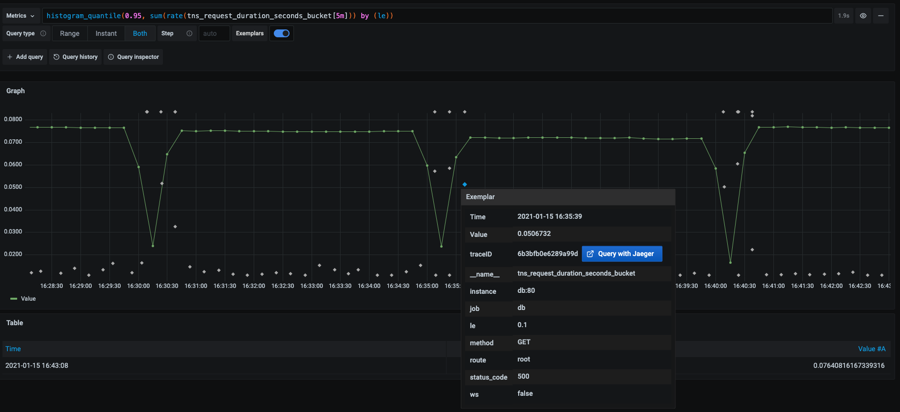
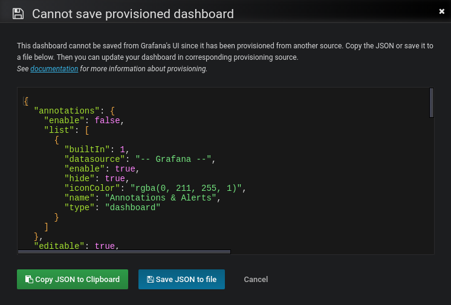

# exemplars

exemplar表示在给定时间间隔内的metrics对应的trace。虽然metrics擅长为您提供系统的聚合视图，但trace可以为您提供单个请求的细粒度视图；exemplar是将两者联系起来的一种方式。

假设您的公司网站正在经历流量激增。虽然超过80%的用户能够在两秒内访问网站，但一些用户的响应时间比正常时间长，导致用户体验不佳。要确定导致延迟的因素，必须将快速响应的trace与慢速响应的trace进行比较。考虑到典型生产环境中的大量数据，这将是一项极其费力和耗时的工作。

使用exemplars，查询在一段时间间隔内表现出高延迟的trace，帮助诊断数据分布中的问题。一旦将延迟问题定位为几个exemplars trace，就可以将其与其他基于系统的信息或位置属性相结合，以更快地执行根本原因分析，从而快速解决性能问题。


对exemplars的支持仅适用于Prometheus数据源。启用该功能后，默认情况下exemplars数据可用。具体配置参考 [configuring exemplars in Prometheus data source](https://grafana.com/docs/grafana/v9.3/datasources/prometheus/#configuring-exemplars)

Grafana在Explore视图和仪表板中显示了exemplars以及metrics。每个exemplars为突出显示的星形。您可以将光标悬停在exemplars上查看更多，它是键值对的组合。要进一步调查，请单击traceID属性旁边的蓝色按钮。




# 配置

Grafana具有默认和自定义配置文件。您可以通过修改自定义配置文件或使用环境变量来自定义Grafana实例。Grafana实例的默认设置存储在$WORKING_DIR/conf/defaults.ini 文件。不要更改此文件。你可以使用 --config 参数指定自定义文件。

> Grafana使用分号（；）注释.ini文件中的行。


## 变量替换

不要使用环境变量添加新的配置。相反，使用环境变量替代现有选项。

```
GF_<SectionName>_<KeyName>
```

* SectionName 和  KeyName要全大写
* `. 和 -` 要替换成 `_`

```ini
# default section
instance_name = ${HOSTNAME}

[security]
admin_user = admin

[auth.google]
client_secret = 0ldS3cretKey

[plugin.grafana-image-renderer]
rendering_ignore_https_errors = true

[feature_toggles]
enable = newNavigation
```


```shell
export GF_DEFAULT_INSTANCE_NAME=my-instance
export GF_SECURITY_ADMIN_USER=owner
export GF_AUTH_GOOGLE_CLIENT_SECRET=newS3cretKey
export GF_PLUGIN_GRAFANA_IMAGE_RENDERER_RENDERING_IGNORE_HTTPS_ERRORS=true
export GF_FEATURE_TOGGLES_ENABLE=newNavigation
```

## 变量扩展

如果配置包含表达式`$__<provider>{<argument>}`或`${<environmentvariable>}`，则它们将由Grafana的变量扩展器处理。有三个提供程序：env、file和vault。

### Env provider

env提供程序可用于扩展环境变量。如果将选项设置为`$__env｛PORT｝`，则将在其位置使用PORT环境变量。对于环境变量，您还可以使用速记语法`${PORT}`。

```ini
[paths]
logs = $__env{LOGDIR}/grafana
```

### File provider

file从文件系统读取文件。它删除文件开头和结尾的空白。以下示例中的数据库密码将替换为`/etc/secrets/gf_sql_password`文件的内容：

```ini
[database]
password = $__file{/etc/secrets/gf_sql_password}
```

### Vault provider

vault提供程序允许您使用Hashicorp vault管理机密。


## 主要配置项

* app_mode：可选值是`production（默认）` 和 `development`. 除非您正在开发Grafana，否则不要更改此选项。

* instance_name：设置grafana服务器实例的名称。用于日志记录、内部度量和群集信息。默认值为：${HOSTNAME｝，如果环境变量HOSTNAME为空或不存在，则该变量将被替换为HOSTNAME,Grafana将尝试使用系统调用获取机器名称。

* force_migration: 强制迁移可能导致数据丢失。默认值为false。

* paths

  * data: Grafana存储sqlite3数据库（如果使用）、基于文件的会话（如果使用的话）和其他数据的路径。此路径通常通过init.d脚本或systemd服务文件指定。

  * temp_data_lifetime: 数据目录中的临时图片应保留多长时间。默认值为：24小时。支持的修饰符：h（小时）、m（分钟），例如：168h、30m、10h30m。使用0从不清理临时文件。

  * logs: Grafana存储日志的路径。此路径通常通过init.d脚本或systemd服务文件指定。您可以在配置文件或默认环境变量文件中覆盖它。但是，请注意，在Grafana完全初始化/启动之前，将临时使用默认日志路径。

    ```
    ./grafana-server --config /custom/config.ini --homepath /custom/homepath cfg:default.paths.logs=/custom/path
    ```

  * plugins:Grafana自动扫描和查找插件的目录。

  * provisioning: 包含Grafana将在启动时应用的配置文件的文件夹。当json文件更改时，仪表板将重新加载。

* database: Grafana需要一个数据库来存储用户和仪表盘（以及其他东西）。默认情况下，它被配置为使用sqlite3，这是一个嵌入式数据库。

  * type: 可选值 mysql, postgres ，sqlite3

* remote_cache：在配置的数据库Redis或Memcached中缓存身份验证详细信息和会话信息。此设置不配置Grafana Enterprise中的查询缓存。
* log：
  * mode： 可选值  “console”, “file”, “syslog”， 默认是 `console file`.
  * level： “debug”, “info”, “warn”, “error”, “critical”.
  * filters：为特定记录器设置不同级别的可选设置，例如 filters = sqlstore:debug


grafana对外暴漏的指标信息：

- Active Grafana instances
- Number of dashboards, users, and playlists
- HTTP status codes
- Requests by routing group
- Grafana active alerts
- Grafana performance


# Provision 

可以在配置文件中使用环境变量插值。允许的语法是`$ENV_VAR_NAME`或`${ENV_VAR_NAME}`，并且只能用于值，而不能用于键。它在仪表板的定义文件中不可用，只能仪表板provisioning配置中使用。例子：

```yaml
datasources:
  - name: Graphite
    url: http://localhost:$PORT
    user: $USER
    secureJsonData:
      password: $PASSWORD
```

如果您的值中有一个文字`$`，并且希望避免插值，则可以使用`$$`。

目前，我们没有提供任何用于配置Grafana的脚本。但是有几个社区支持：

| Puppet    | https://forge.puppet.com/puppet/grafana               |
| --------- | ----------------------------------------------------- |
| Ansible   | https://github.com/cloudalchemy/ansible-grafana       |
| Chef      | https://github.com/JonathanTron/chef-grafana          |
| Saltstack | https://github.com/salt-formulas/salt-formula-grafana |
| Jsonnet   | https://github.com/grafana/grafonnet-lib/             |

## 配置数据源

您可以通过在provision/datasources目录中添加YAML配置文件来管理Grafana中的数据源。每个配置文件都可以包含启动期间要添加或更新的数据源列表。如果数据源已经存在，Grafana会重新配置它以匹配配置的配置文件。

配置文件还可以列出要自动删除的数据源，称为deleteDatasources。Grafana删除deleteDatasources中列出的数据源，然后再添加或更新数据源列表中的数据源。

> 如果运行多个Grafana实例，请在配置中为每个数据源添加版本号，并在更新配置时增加版本号。Grafana仅更新版本号与配置中指定的版本号相同或更低的数据源。


由于并非所有数据源都具有相同的配置设置，因此我们只将最常见的作为字段。要提供数据源的其余设置，请将它们作为JSON blob包含在jsonData字段中。


可以在Grafana UI中更改已配置的仪表板。但是，无法将更改自动保存回调配源。如果allowUiUpdates设置为true，并且您对配置的仪表板进行了更改，则可以保存仪表板，然后将更改保存到Grafana数据库中。

如果allowUiUpdates配置为false，则无法对配置的仪表板进行更改。单击“保存”时，Grafana将显示“无法保存已配置的仪表板”对话框。下面的截图说明了这种行为。




如果JSON文件中的仪表板包含UID，Grafana会强制插入/更新该UID。这允许您在Grafana实例之间迁移仪表板，并从配置中配置Grafana，而不破坏给定的URL，因为新的仪表板URL使用UID作为标识符。Grafana启动时，会更新/插入配置文件夹中的所有可用仪表板。如果修改文件，则仪表板也会更新。默认情况下，如果文件被删除，Grafana会删除数据库中的仪表板。可以使用disableDelete设置禁用此行为。

如果您已经使用git repo或文件系统中的文件夹存储仪表板，并且希望在Grafana菜单中具有相同的文件夹名称，则可以使用foldersFromFilesStructure选项。例如，为了将这些仪表板结构从文件系统复制到Grafana：

```
/etc/dashboards
├── /server
│   ├── /common_dashboard.json
│   └── /network_dashboard.json
└── /application
    ├── /requests_dashboard.json
    └── /resources_dashboard.json
```

您只需要指定这个简短的配置文件:

```yaml
apiVersion: 1

providers:
  - name: dashboards
    type: file
    updateIntervalSeconds: 30
    options:
      path: /etc/dashboards
      foldersFromFilesStructure: true
```

> folder和folderUid选项应为空或缺失，以使foldersFromFilesStructure正常工作。

> 要将仪表板设置到“General”文件夹，请将它们存储在路径的根目录中。

## Alerting

警报基础设施通常是复杂的，其中许多管道通常位于不同的地方。在多个团队和组织中扩展这一点是一项特别具有挑战性的任务。Grafana Alerting provisioning使您能够以最适合您的组织的方式创建、管理和维护警报数据，从而使此过程更加简单。

有三个选项可供选择：

* 使用文件provisioning 通过磁盘上的文件配置Grafana Alerting资源，如警报规则和联系人。
* 使用警报配置HTTP API provisioning 警报资源。通常，您无法从Grafana UI编辑API provisioning 的警报规则。为了启用编辑，在API中创建或编辑警报规则时，将x-disable-provenance标头添加到以下请求中：
  * POST /api/v1/provisioning/alert-rules
  * PUT /api/v1/provisioning/alert-rules/{UID}
* 使用Terraform配置您的警报资源。

目前，Grafana Alerting的provisioning 支持警报规则、联系人、静音计时和模板。使用文件配置或Terraform配置的警报资源只能在创建它们的源中编辑，而不能在Grafana或任何其他源中编辑。例如，如果您使用磁盘上的文件配置警报资源，则无法在Terraform或Grafana中编辑数据。

### file provisioning

使用磁盘中的文件配置警报资源。启动Grafana时，这些文件中的数据将在Grafana系统中创建。Grafana添加您创建的任何新资源，更新您更改的任何资源，并删除旧资源。

以最适合您的用例的方式在目录中排列文件。例如，您可以选择基于团队的布局，其中每个团队都有自己的文件，您可以为所有团队创建一个大文件；或者每个资源类型可以有一个文件。

下面列出了有关如何设置文件以及每个对象需要哪些字段的详细信息，具体取决于您正在配置的资源。

具体操作步骤：

1. 在Grafana中创建警报规则。
2. 使用警报[设置API](https://grafana.com/docs/grafana/latest/developers/http_api/alerting/#get-alerts)提取警报规则。
3. 将内容复制到YAML或JSON配置文件中。
4. 确保您的文件位于运行Grafana服务器的节点上的正确目录中，以便它们与Grafana实例一起部署。
5. 删除Grafana中的警报规则。如果不删除警报规则，则上载后将与设置的警报规则冲突。


下面是用于创建警报规则的配置文件的示例。

```yaml
# config file version
apiVersion: 1

# List of rule groups to import or update
groups:
  # <int> organization ID, default = 1
  - orgId: 1
    # <string, required> name of the rule group
    name: my_rule_group
    # <string, required> name of the folder the rule group will be stored in
    folder: my_first_folder
    # <duration, required> interval that the rule group should evaluated at
    interval: 60s
    # <list, required> list of rules that are part of the rule group
    rules:
      # <string, required> unique identifier for the rule
      - uid: my_id_1
        # <string, required> title of the rule that will be displayed in the UI
        title: my_first_rule
        # <string, required> which query should be used for the condition
        condition: A
        # <list, required> list of query objects that should be executed on each
        #                  evaluation - should be obtained trough the API
        data:
          - refId: A
            datasourceUid: '-100'
            model:
              conditions:
                - evaluator:
                    params:
                      - 3
                    type: gt
                  operator:
                    type: and
                  query:
                    params:
                      - A
                  reducer:
                    type: last
                  type: query
              datasource:
                type: __expr__
                uid: '-100'
              expression: 1==0
              intervalMs: 1000
              maxDataPoints: 43200
              refId: A
              type: math
        # <string> UID of a dashboard that the alert rule should be linked to
        dashboardUid: my_dashboard
        # <int> ID of the panel that the alert rule should be linked to
        panelId: 123
        # <string> the state the alert rule will have when no data is returned
        #          possible values: "NoData", "Alerting", "OK", default = NoData
        noDataState: Alerting
        # <string> the state the alert rule will have when the query execution
        #          failed - possible values: "Error", "Alerting", "OK"
        #          default = Alerting
        # <duration, required> for how long should the alert fire before alerting
        for: 60s
        # <map<string, string>> a map of strings to pass around any data
        annotations:
          some_key: some_value
        # <map<string, string> a map of strings that can be used to filter and
        #                      route alerts
        labels:
          team: sre_team_1
```

下面是用于删除警报规则的配置文件的示例。

```yaml
# config file version
apiVersion: 1

# List of alert rule UIDs that should be deleted
deleteRules:
  # <int> organization ID, default = 1
  - orgId: 1
    # <string, required> unique identifier for the rule
    uid: my_id_1
```

### Provision 联系人

在Grafana实例中创建或删除联系人。

1. 创建YAML或JSON配置文件。
2. 将文件添加到GitOps工作流中，以便它们与Grafana实例一起部署。

```yaml
# config file version
apiVersion: 1

# List of contact points to import or update
contactPoints:
  # <int> organization ID, default = 1
  - orgId: 1
    # <string, required> name of the contact point
    name: cp_1
    receivers:
      # <string, required> unique identifier for the receiver
      - uid: first_uid
        # <string, required> type of the receiver
        type: prometheus-alertmanager
        # <object, required> settings for the specific receiver type
        settings:
          url: http://test:9000
```

以下是用于删除联系人的配置文件的示例。

```yaml
# config file version
apiVersion: 1

# List of receivers that should be deleted
deleteContactPoints:
  # <int> organization ID, default = 1
  - orgId: 1
    # <string, required> unique identifier for the receiver
    uid: first_uid
```

### Provision 通知策略

1. 创建YAML或JSON配置文件。
2. 将文件添加到GitOps工作流中，以便它们与Grafana实例一起部署。

```yaml
# config file version
apiVersion: 1

# List of notification policies
policies:
  # <int> organization ID, default = 1
  - orgId: 1
    # <string> name of the contact point that should be used for this route
    receiver: grafana-default-email
    # <list> The labels by which incoming alerts are grouped together. For example,
    #        multiple alerts coming in for cluster=A and alertname=LatencyHigh would
    #        be batched into a single group.
    #
    #        To aggregate by all possible labels use the special value '...' as
    #        the sole label name, for example:
    #        group_by: ['...']
    #        This effectively disables aggregation entirely, passing through all
    #        alerts as-is. This is unlikely to be what you want, unless you have
    #        a very low alert volume or your upstream notification system performs
    #        its own grouping.
    group_by: ['...']
    # <list> a list of matchers that an alert has to fulfill to match the node
    matchers:
      - alertname = Watchdog
      - severity =~ "warning|critical"
    # <list> Times when the route should be muted. These must match the name of a
    #        mute time interval.
    #        Additionally, the root node cannot have any mute times.
    #        When a route is muted it will not send any notifications, but
    #        otherwise acts normally (including ending the route-matching process
    #        if the `continue` option is not set)
    mute_time_intervals:
      - abc
    # <duration> How long to initially wait to send a notification for a group
    #            of alerts. Allows to collect more initial alerts for the same group.
    #            (Usually ~0s to few minutes), default = 30s
    group_wait: 30s
    # <duration> How long to wait before sending a notification about new alerts that
    #            are added to a group of alerts for which an initial notification has
    #            already been sent. (Usually ~5m or more), default = 5m
    group_interval: 5m
    # <duration>  How long to wait before sending a notification again if it has already
    #             been sent successfully for an alert. (Usually ~3h or more), default = 4h
    repeat_interval: 4h
    # <list> Zero or more child routes
    # routes:
    # ...
```

下面是用于重置通知策略的配置文件的示例:

```yaml
# config file version
apiVersion: 1

# List of orgIds that should be reset to the default policy
resetPolicies:
  - 1
```

### Provision 通知模板

```yaml
# config file version
apiVersion: 1

# List of templates to import or update
templates:
  # <int> organization ID, default = 1
  - orgID: 1
    # <string, required> name of the template, must be unique
    name: my_first_template
    # <string, required> content of the the template
    template: Alerting with a custom text template
```

删除模板：

```yaml
# config file version
apiVersion: 1

# List of alert rule UIDs that should be deleted
deleteTemplates:
  # <int> organization ID, default = 1
  - orgId: 1
    # <string, required> name of the template, must be unique
    name: my_first_template
```

### Provision 静默

```yaml
# config file version
apiVersion: 1

# List of mute time intervals to import or update
muteTimes:
  # <int> organization ID, default = 1
  - orgId: 1
    # <string, required> name of the mute time interval, must be unique
    name: mti_1
    # <list> time intervals that should trigger the muting
    #        refer to https://prometheus.io/docs/alerting/latest/configuration/#time_interval-0
    time_intervals:
      - times:
          - start_time: '06:00'
            end_time: '23:59'
        weekdays: ['monday:wednesday', 'saturday', 'sunday']
        months: ['1:3', 'may:august', 'december']
        years: ['2020:2022', '2030']
        days_of_month: ['1:5', '-3:-1']
```

删除静默：

```yaml
# config file version
apiVersion: 1

# List of mute time intervals that should be deleted
deleteMuteTimes:
  # <int> organization ID, default = 1
  - orgId: 1
    # <string, required> name of the mute time interval, must be unique
    name: mti_1
```


## Alert Notification Channels

> 
