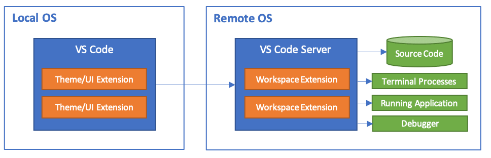
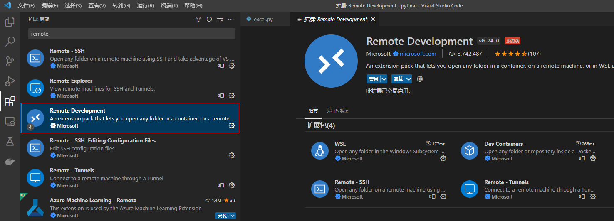
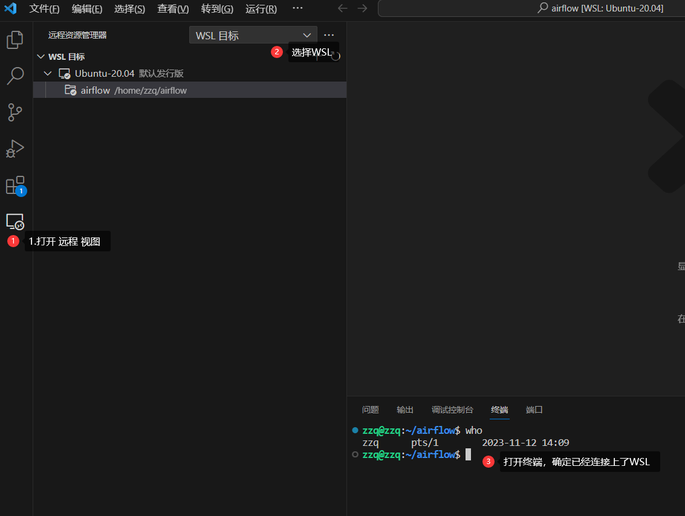

# 推荐插件

* Code Runner:  为当前项目或文件生成运行按钮
* CodeGeeX:   AI 生成代码

# 远程开发

Visual Studio代码远程开发允许您使用`容器`、`远程计算机`或`Windows Subsystem for Linux（WSL）`作为开发环境。下面是远程开发的组件示意图：

远程开发扩展包括下图几个插件：

* [Remote - SSH](https://code.visualstudio.com/docs/remote/ssh) ：通过使用SSH打开远程计算机上的文件夹，连接到任何位置。
* [Dev Containers](https://code.visualstudio.com/docs/devcontainers/containers) ：链接到容器
* [WSL](https://code.visualstudio.com/docs/remote/wsl) ： 连接到WSL

## 使用示例

