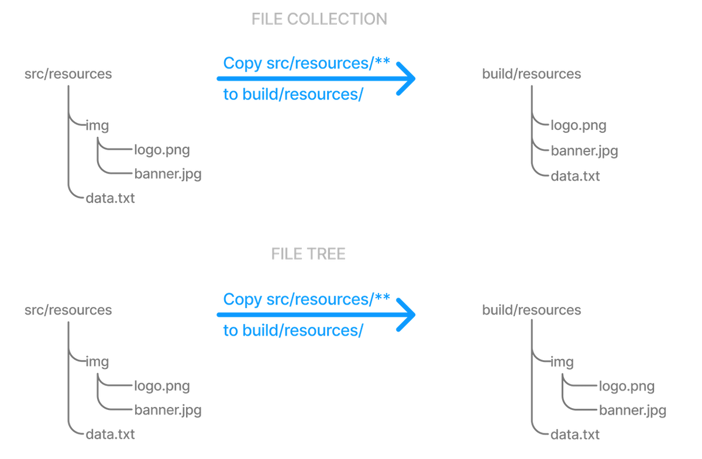

# 文件API

文件操作几乎是每个Gradle构建的基础。它们涉及处理源文件、管理文件相关性和生成报告。Gradle提供了一个强大的API来简化这些操作，使开发人员能够轻松地执行必要的文件任务。

## 硬编码路径和懒加载

最佳做法是避免在构建脚本中使用硬编码路径。Gradle还在构建脚本中鼓励懒加载。这意味着任务和操作应该推迟到实际需要时才执行，而不是急切地执行。

本章中的许多示例使用硬编码路径作为字符串文字。这使它们易于理解，但这不是一个好的做法。问题是，路径经常会发生变化，你需要改变的地方越多，你就越有可能漏掉某一个并破坏构建。

在可能的情况下，应该使用任务、任务属性和项目属性（按首选项的顺序）来配置文件路径。

例如，如果您创建一个任务来打包Java应用程序的已编译类，则应该使用类似于以下的实现：

```groovy
def archivesDirPath = layout.buildDirectory.dir('archives')

tasks.register('packageClasses', Zip) {
    archiveAppendix = "classes"
    destinationDirectory = archivesDirPath

    from compileJava
}
```

`compileJava`任务是要打包的文件的来源，项目属性`archivesDirPath`存储归档的位置，因为我们可能会在构建的其他地方使用它。

像这样直接使用任务作为参数依赖于它是否有定义的输出，所以这并不总是可能的。这个例子可以通过依赖Java插件的`destinationDirectory`约定而不是覆盖它来进一步改进，但它确实演示了项目属性的使用。

## 定位文件

要对文件执行某些操作，您需要知道它在哪里，这就是文件路径提供的信息。Gradle构建在标准Java File类的基础上，该类表示单个文件的位置，并提供用于处理路径集合的API。

### 使用ProjectLayout

ProjectLayout类用于访问项目中的各种目录和文件。它提供了检索项目目录、构建目录、设置文件和项目文件结构中其他重要位置的路径的方法。当您需要在不同的项目路径中使用构建脚本或插件中的文件时，此类特别有用：

```groovy
def archivesDirPath = layout.buildDirectory.dir('archives')
```

### 使用 [`Project.file()`](https://docs.gradle.org/current/userguide/working_with_files.html#sec:single_file_paths)

Gradle提供了`Project.file(java.lang.Object)`方法，用于指定单个文件或目录的位置。相对路径是相对于项目目录解析的，而绝对路径保持不变。

> 不要使用 `new File(relative path) ` , 除非作为参数传递给 file()、 files()、 from()等方法。否则，这将创建一个相对于当前工作目录（CWD）的路径。Gradle无法保证CWD的位置，这意味着依赖它的构建可能随时中断。

以下是将`file()`方法与不同类型的参数一起使用的一些示例：

```groovy
// Using a relative path
File configFile = file('src/config.xml')

// Using an absolute path
configFile = file(configFile.absolutePath)

// Using a File object with a relative path
configFile = file(new File('src/config.xml'))

// Using a java.nio.file.Path object with a relative path
configFile = file(Paths.get('src', 'config.xml'))

// Using an absolute java.nio.file.Path object
configFile = file(Paths.get(System.getProperty('user.home')).resolve('global-config.xml'))
```

正如您所看到的，您可以将字符串、`File`实例和`Path`实例传递到`file()`方法，所有这些都会产生一个绝对的`File`对象。

在多项目构建的情况下，`file()`方法将始终将相对路径转换为相对于当前项目目录的路径，当前项目目录可能是子项目。

### 使用Project.getRootDir()

假设您要使用相对于根项目目录的路径。在这种情况下，您需要使用特殊的`Project.getRootDir()`属性来构造一个绝对路径，如下所示：

```groovy
File configFile = file("$rootDir/shared/config.xml")
```

假设您正在目录`/dev/projects/AcmeHealth`中进行多项目构建。
上面的构建脚本位于：`AcmeHealth/subjects/AcmePatientRecordLib/build.gradle`。
文件路径将解析为绝对值：`/dev/projects/AcmeHealth/shared/config.xml`。

```shell
dev
├── projects
│   ├── AcmeHealth
│   │   ├── subprojects
│   │   │   ├── AcmePatientRecordLib
│   │   │   │   └── build.gradle
│   │   │   └── ...
│   │   ├── shared
│   │   │   └── config.xml
│   │   └── ...
│   └── ...
└── settings.gradle
```

请注意，Project还为多项目构建提供了`Project.getRootProject()`，在本例中，它将解析为：`dev/projects/AcmeHealth/subjects/Acme PatientRecordLib`

### 使用 [`FileCollection`](https://docs.gradle.org/current/userguide/working_with_files.html#sec:file_collections)

文件集合只是由`FileCollection`接口表示的一组文件路径。

路径集可以是任何文件路径。文件路径不必以任何方式关联，因此它们不必在同一目录中或具有共享的父目录。

指定文件集合的推荐方法是使用`ProjectLayout.files(java.lang.Object…)`方法，该方法返回一个`FileCollection`实例。这种灵活的方法允许您传递多个字符串、文件实例、字符串集合、文件集合等。如果任务已经定义了输出，您也可以将任务作为参数传入。

与上一节中介绍的`Project.file(java.lang.Object)`方法一样，所有相对路径都是相对于当前项目目录计算的。以下示例演示了可以使用的各种参数类型——字符串、文件实例、列表或路径：

```groovy
FileCollection collection = layout.files('src/file1.txt',
                                  new File('src/file2.txt'),
                                  ['src/file3.csv', 'src/file4.csv'],
                                  Paths.get('src', 'file5.txt'))
```

文件集合在Gradle中具有重要属性。它们可以是：

* created lazily
* iterated over
* filtered
* combined

在运行生成时评估组成集合的文件时，延迟创建文件集合非常有用。在以下示例中，我们查询文件系统以找出特定目录中存在的文件，然后将这些文件放入文件集合：

```groovy
tasks.register('list') {
    Directory projectDirectory = layout.projectDirectory
    doLast {
        File srcDir

        // Create a file collection using a closure
        collection = projectDirectory.files { srcDir.listFiles() }

        srcDir = projectDirectory.file('src').asFile
        println "Contents of $srcDir.name"
        collection.collect { projectDirectory.asFile.relativePath(it) }.sort().each { println it }

        srcDir = projectDirectory.file('src2').asFile
        println "Contents of $srcDir.name"
        collection.collect { projectDirectory.asFile.relativePath(it) }.sort().each { println it }
    }
}
```

```shell
$ gradle -q list
Contents of src
src/dir1
src/file1.txt
Contents of src2
src2/dir1
src2/dir2
```

懒惰创建的关键是将闭包（在Groovy中）或Provider（在Kotlin中）传递给`files()`方法。您的闭包或提供程序必须返回`files()`接受的类型的值，如`List<File>`、`String`或`FileCollection`。

可以通过集合上的`each()`方法（在Groovy中）或forEach方法（在Kotlin中）或在for循环中使用该集合来对文件集合进行迭代。在这两种方法中，文件集合都被视为一组`File`实例，即迭代变量的类型为`File`。

下面的例子演示了这样的迭代。它还演示了如何使用as运算符（或支持的属性）将文件集合转换为其他类型：

```groovy

// Iterate over the files in the collection
collection.each { File file ->
    println file.name
}

// Convert the collection to various types
Set set = collection.files
Set set2 = collection as Set
List list = collection as List
String path = collection.asPath
File file = collection.singleFile

// Add and subtract collections
def union = collection + projectLayout.files('src/file2.txt')
def difference = collection - projectLayout.files('src/file2.txt')
```

您还可以在示例的末尾看到如何使用`+`和`-`运算符合并和减去文件集合。生成的文件集合的一个重要特性是它们是活动的。换句话说，当您以这种方式组合文件集合时，结果总是反映源文件集合中当前的内容，即使它们在构建过程中发生了更改。

例如，假设上例中的集合在创建并集后获得一两个额外的文件。只要在将这些文件添加到集合后使用并集，则并集也将包含这些附加文件。不同的文件集合也是如此。

在筛选时，实时集合也很重要。假设您要使用文件集合的子集。在这种情况下，您可以利用FileCollection.filter（org.gradle.api.Spec.Spec）方法来确定要“保留”哪些文件。在以下示例中，我们创建一个新集合，该集合仅由源集合中以.txt结尾的文件组成：

```groovy
FileCollection textFiles = collection.filter { File f ->
    f.name.endsWith(".txt")
}
```

```shell
$ gradle -q filterTextFiles
src/file1.txt
src/file2.txt
src/file5.txt
```

如果集合在任何时候发生更改，无论是通过添加文件还是从自身删除文件，那么textFiles都会立即反映更改，因为它也是一个活动集合。请注意，传递给filter（）的闭包将File作为参数，并应返回布尔值。

#### 了解到文件集合的隐式转换

Gradle中的许多对象都具有接受一组输入文件的属性。例如，JavaCompile任务有一个定义要编译的源文件的源属性。您可以使用files（）方法支持的任何类型设置此属性的值，如API文档中所述。这意味着，例如，您可以将属性设置为File、String、collection、FileCollection，甚至闭包或Provider。

这是特定任务的一个功能！这意味着隐式转换不会只发生在具有FileCollection或FileTree属性的任何任务上。如果您想知道隐式转换是否发生在特定情况下，您需要阅读相关文档，例如相应任务的API文档。或者，您可以通过在构建中显式使用ProjectLayout.files（java.lang.Object…）来消除所有疑问。

以下是源属性可以采用的不同类型参数的一些示例：

```groovy
tasks.register('compile', JavaCompile) {

    // Use a File object to specify the source directory
    source = file('src/main/java')

    // Use a String path to specify the source directory
    source = 'src/main/java'

    // Use a collection to specify multiple source directories
    source = ['src/main/java', '../shared/java']

    // Use a FileCollection (or FileTree in this case) to specify the source files
    source = fileTree(dir: 'src/main/java').matching { include 'org/gradle/api/**' }

    // Using a closure to specify the source files.
    source = {
        // Use the contents of each zip file in the src dir
        file('src').listFiles().findAll {it.name.endsWith('.zip')}.collect { zipTree(it) }
    }
}
```

另一件需要注意的事情是，像source这样的属性在核心Gradle任务中有相应的方法。这些方法遵循附加到值集合而不是替换它们的约定。同样，此方法接受files（）方法支持的任何类型，如下所示：

```groovy
compile {
    // Add some source directories use String paths
    source 'src/main/java', 'src/main/groovy'

    // Add a source directory using a File object
    source file('../shared/java')

    // Add some source directories using a closure
    source { file('src/test/').listFiles() }
}
```

由于这是一个常见的约定，我们建议您在自己的自定义任务中遵循它。具体来说，如果计划添加一个方法来配置基于集合的属性，请确保该方法附加而不是替换值。

### 使用 [`FileTree`](https://docs.gradle.org/current/userguide/working_with_files.html#sec:file_trees)

文件树是一个文件集合，它保留了所包含文件的目录结构，并且具有`FileTree`类型。这意味着文件树中的所有路径都必须有一个共享的父目录。下图突出显示了在复制文件的典型情况下文件树和文件集合之间的区别：




> 尽管FileTree扩展了FileCollection（一种is-a关系），但它们的行为不同。换句话说，您可以在需要文件集合的任何位置使用文件树，但请记住，文件集合是文件的平面列表/集合，而文件树是文件和目录层次结构。要将文件树转换为平面集合，请使用FileTree.getFiles（）属性。

创建文件树的最简单方法是将文件或目录路径传递给Project.fileTree（java.lang.Object）方法。这将创建该基本目录中所有文件和目录的树（但不是基本目录本身）。以下示例演示了如何使用此方法以及如何使用Ant样式模式过滤文件和目录：

```groovy
// Create a file tree with a base directory
ConfigurableFileTree tree = fileTree(dir: 'src/main')

// Add include and exclude patterns to the tree
tree.include '**/*.java'
tree.exclude '**/Abstract*'

// Create a tree using closure
tree = fileTree('src') {
    include '**/*.java'
}

// Create a tree using a map
tree = fileTree(dir: 'src', include: '**/*.java')
tree = fileTree(dir: 'src', includes: ['**/*.java', '**/*.xml'])
tree = fileTree(dir: 'src', include: '**/*.java', exclude: '**/*test*/**')
```

您可以在PatternFilterable的API文档中看到更多受支持模式的示例。
默认情况下，fileTree（）返回一个fileTree实例，该实例为方便起见应用了一些默认的排除模式——与Ant的默认值相同。有关完整的默认排除列表，请参阅Ant手册。

如果这些默认排除有问题，您可以通过在设置脚本中更改默认排除来解决此问题：

```groovy
import org.apache.tools.ant.DirectoryScanner

DirectoryScanner.removeDefaultExclude('**/.git')
DirectoryScanner.removeDefaultExclude('**/.git/**')
```

使用文件树可以执行与使用文件集合相同的许多操作：

* 迭代它们（深度优先）
* 过滤它们（使用FileTree.maching（org.gradle.api.Action）和Ant样式模式）
* 合并它们

您还可以使用FileTree.visite（org.gradle.api.Action）方法遍历文件树。以下示例演示了所有这些技术：

```groovy
// Iterate over the contents of a tree
tree.each {File file ->
    println file
}

// Filter a tree
FileTree filtered = tree.matching {
    include 'org/gradle/api/**'
}

// Add trees together
FileTree sum = tree + fileTree(dir: 'src/test')

// Visit the elements of the tree
tree.visit {element ->
    println "$element.relativePath => $element.file"
}
```


