# 概述

[OpenRewrite](https://docs.openrewrite.org/) 是 Java 和其他源代码的重构生态系统。有时，我们需要将依赖关系升级到最新版本、应用安全补丁、取消使用已废弃的 API、从一种技术迁移到另一种技术（例如，[JUnit asserts 到 AssertJ](https://docs.openrewrite.org/recipes/java/testing/assertj/junittoassertj)），等等。我们可以使用 OpenRewrite 库来应对这些挑战.。

## 快速入门

**OpenRewrite的主要功能是将[配方](https://docs.openrewrite.org/recipes/java)应用到项目中，从而自动重构源代码**。OpenRewrite 为常见的转换提供了各种内置配方。每个配方都可以执行特定的重构任务。这些配方用 Java 代码编写，并通过 OpenRewrite Maven 或 Gradle 插件包含在构建过程中。

把下面代码加入`build.gradle` 文件。 执行`gradle rewriteRun`

```groovy

plugins {
    id("org.openrewrite.rewrite") version("6.9.0")
}
 
rewrite {
    activeRecipe("org.openrewrite.java.spring.boot3.UpgradeSpringBoot_3_0")
}
 
repositories {
    mavenCentral()
}
 
dependencies {
    rewrite("org.openrewrite.recipe:rewrite-spring:5.6.0")
}

```

你也可以在`init.gradle`配置，避免项目中引入冗余配置：

```
initscript {
    repositories {
        maven { url "https://plugins.gradle.org/m2" }
    }
    dependencies { classpath("org.openrewrite:plugin:6.9.0") }
}
rootProject {
    plugins.apply(org.openrewrite.gradle.RewritePlugin)
    dependencies {
        rewrite("org.openrewrite.recipe:rewrite-spring:5.6.0")
    }
    rewrite {
        activeRecipe("org.openrewrite.java.spring.boot3.UpgradeSpringBoot_3_0")
    }
    afterEvaluate {
        if (repositories.isEmpty()) {
            repositories {
                mavenCentral()
            }
        }
    }
}
```


rewrite DSL公开了一些配置选项：

* activeRecipe ： 按名称（specs.openrewrite.org/v1beta/recipe资源中给出的名称）明确打开配方。除非使用此设置明确启用，否则不会运行任何配方。

* activeStyle ：显式地按名称打开样式（specs.openrewrite.org/v1beta/style资源中给出的名称）。除非使用此设置明确启用，否则不会应用任何样式。

* configFile ：在项目目录中的某个位置（或磁盘上的任何位置）查找OpenRewrite YML配置文件的位置。此文件不需要存在。如果未另行指定，则默认值为`<projectdirectory>/rewrite.yml`。

* failOnDryRunResults :如果检测到更改，则切换rewriteDryRun是否应引发异常和非零退出代码的布尔标志。默认值为false。

* sizeThresholdMb : 在解析过程中忽略非Java源的阈值。默认阈值为10Mb。

* exclusion : 一个或多个路径，相对于应用插件的项目，在解析过程中忽略非Java源。支持glob模式。

* plainTextMasks :一组文件掩码，用于表示哪些文件应被解析为纯文本。计算为PathMatcher glob模式，其中“**”匹配任意数量的目录，“*”匹配单个目录或文件名。排除项优先于任何纯文本掩码。如果未明确定义此配置，则默认掩码为

  ```shell
  **/META-INF/services/**
  **/.gitignore
  **/.gitattributes
  **/.java-version
  **/.sdkmanrc
  **/gradlew
  **/*.sh
  **/*.bash
  **/*.bat
  **/*.ksh
  **/*.txt
  **/*.jsp
  ```

  配置示例：

  ```groovy
  plugins {
      id("java")
      id("org.openrewrite.rewrite") version("6.15.1")
  }
  
  repositories {
      mavenCentral()
  }
  
  rewrite {
      activeRecipe("com.yourorg.ExampleRecipe", "com.yourorg.ExampleRecipe2")
      activeStyle("com.yourorg.ExampleStyle", "com.yourorg.ExampleStyle2")
  
      exclusion(
              // Excludes a particular yaml file
              "subproject-a/src/main/resources/generated.yaml",
              // Exclude all json files
              "**/*.json")
      plainTextMask("**/*.txt")
      
      // These are default values, shown for example. It isn't necessary to supply these values manually:
      configFile = project.getRootProject().file("rewrite.yml")
      failOnDryRunResults = false
      sizeThresholdMb = 10
  }
  ```

  


## 工作机制

`OpenRewrite`的工作原理是对表示源代码的无损语义树（LST）进行更改，并将修改后的树打印回源代码。然后，您可以查看代码中的更改并提交结果。对LST的修改在访问者中执行，访问者被聚合到食谱中。OpenRewrite配方对源代码进行微创更改，以尊重原始格式。

例如，如果您希望在所有测试文件中一致地使用静态导入，则可以使用OpenRewrite提供的`UseStaticImport`访问者。应用于下面的文件，您可以看到它所生成的更改。

```java
// Before OpenRewrite
import org.junit.Assert;
...

Assert.assertTrue(condition);
```

```java
// After OpenRewrite
import static org.junit.Assert.assertTrue;
...

assertTrue(condition);
```

## 基于文本的配方

文本配方是放弃无损语义树（LST）而直接与文本交互的配方。在几乎所有情况下，这都不是你想要做的。这是因为对任何可以解析为LST的文件运行文本配方都会将所述文件转换为纯文本文件，并且你将无法再对该文件运行非文本配方。

话虽如此，在某些情况下，你可能想要这样做。例如，作为运行Java升级的一部分，您可能希望自动替换`Dockerfiles`中的基本映像。由于`Dockerfiles`没有解析到LST中，因此用文本配方修改它们不会造成任何危害。

示例的`Dockerfile`如下：

```dockerfile
FROM eclipse-temurin:17-jdk-jammy

WORKDIR /app

COPY .mvn/ .mvn
COPY mvnw pom.xml ./
RUN ./mvnw dependency:resolve

COPY src ./src

CMD ["./mvnw", "spring-boot:run"]
```

创建 `rewrite.yml `:

```yaml
type: specs.openrewrite.org/v1beta/recipe
name: com.yourorg.FindAndReplaceJDK17
displayName: Find and replace JDK 17 example
recipeList:
  - org.openrewrite.text.FindAndReplace:
      find: eclipse-temurin:17-jdk-jammy
      replace: eclipse-temurin:21.0.2_13-jdk-jammy
      filePattern: 'Dockerfile'
```

在`rewrite.yml`文件中，我们将定义更新基本镜像的配方。在下面的示例中，您可以看到，我们正在与`Dockerfile`文件中查找完全匹配的`eclipse-temurin:17jdk-jammy`的确切文本。

# 配方

OpenRewrite支持三种不同类型的配方：

* 声明式Yaml
* refaster模板
* 命令式: 

## 声明式

声明式是最常使用的方式。它们完全是用YAML编写的，通常将现有的食谱组合在一起，同时添加一些简单的配置。

常见的静态分析配方就是一个很好的例子。它采用了一堆与静态分析相关的简单配方，并将它们组合成一个更大的配方，可以更容易地运行。它没有添加任何逻辑，也没有改变现有的配方。

```yaml
type: specs.openrewrite.org/v1beta/recipe
name: org.openrewrite.staticanalysis.CommonStaticAnalysis
displayName: Common static analysis issues
description: Resolve common static analysis issues discovered through 3rd party tools.
recipeList:
  - org.openrewrite.staticanalysis.AtomicPrimitiveEqualsUsesGet
  - org.openrewrite.staticanalysis.BigDecimalRoundingConstantsToEnums
  - org.openrewrite.staticanalysis.BooleanChecksNotInverted
  - org.openrewrite.staticanalysis.CaseInsensitiveComparisonsDoNotChangeCase
  - org.openrewrite.staticanalysis.CatchClauseOnlyRethrows
  - org.openrewrite.staticanalysis.ChainStringBuilderAppendCalls
  # ...
```

另一个很好的例子展示了如何使用声明性配方来定义复杂的迁移配方，例如 `ApacheHttpClient`迁移配方：

```yaml
type: specs.openrewrite.org/v1beta/recipe
name: org.openrewrite.java.apache.httpclient5.UpgradeApacheHttpClient_5
displayName: Migrate to ApacheHttpClient 5.x
description: >
  Migrate applications to the latest Apache HttpClient 5.x release. This recipe will modify an
  application's build files, make changes to deprecated/preferred APIs, and migrate configuration settings that have
  changes between versions.
tags:
  - apache
  - httpclient
recipeList:
  - org.openrewrite.java.apache.httpclient4.UpgradeApacheHttpClient_4_5
  - org.openrewrite.java.dependencies.ChangeDependency:
      oldGroupId: org.apache.httpcomponents
      oldArtifactId: httpclient
      newGroupId: org.apache.httpcomponents.client5
      newArtifactId: httpclient5
      newVersion: 5.1.x
  - org.openrewrite.java.dependencies.ChangeDependency:
      oldGroupId: org.apache.httpcomponents
      oldArtifactId: httpcore
      newGroupId: org.apache.httpcomponents.core5
      newArtifactId: httpcore5
      newVersion: 5.1.x
  - org.openrewrite.java.apache.httpclient5.UpgradeApacheHttpClient_5_ClassMapping
  - org.openrewrite.java.apache.httpclient5.UpgradeApacheHttpClient_5_DeprecatedMethods
  - org.openrewrite.java.apache.httpclient5.UpgradeApacheHttpClient_5_TimeUnit
  - org.openrewrite.java.apache.httpclient5.StatusLine
```

### YAML定制配方

OpenRewrite允许您在YAML中创建配方和样式。尽管这样做可能降低了可定制性，它以开发速度和可移植性弥补了这一点。有两个地方可以定义OpenRewrite YAML文件：

* 在通过`rewrite-gradle`插件或`rewrite-maven`插件应用重写配方的项目的rewrite.yml文件中
* 在JAR的META-INF/rewrite文件夹中

如果您在rewrite.yml文件中定义配方或样式，它们将不会包含在从您的项目中发布的JAR。

如果你想分发一个配方或样式并将其应用于其他项目，你需要在JAR的META-INF/rewrite文件夹中创建它们。

| Key                                                          | Type                                                         | Description                                                  |
| :----------------------------------------------------------- | :----------------------------------------------------------- | :----------------------------------------------------------- |
| type                                                         | const                                                        | A constant: `specs.openrewrite.org/v1beta/recipe`            |
| name                                                         | string                                                       | A fully qualified, unique name for this recipe               |
| displayName                                                  | string                                                       | A human-readable name for this recipe (does not end with a period) |
| description                                                  | string                                                       | A human-readable description for this recipe (ends with a period) |
| tags                                                         | array of strings                                             | A list of strings that help categorize this recipe           |
| estimatedEffortPerOccurrence                                 | [duration](https://docs.oracle.com/javase/8/docs/api/java/time/Duration.html#parse-java.lang.CharSequence-) | The expected amount of time saved each time this recipe fixes something |
| causesAnotherCycle                                           | boolean                                                      | Whether or not this recipe can cause another cycle (defaults to false) |
| [recipeList](https://docs.openrewrite.org/reference/yaml-format-reference#recipe-list) | array of recipes                                             | The list of recipes which comprise this recipe               |

### Preconditions 

前置条件用于限制运行配方的源文件。这通常用于针对特定文件或目录，但任何非ScanningRecipe配方都可以用作前置条件。

先决条件是按文件进行检查。如果一个文件通过了前提条件检查，则所有配方都将在该文件上运行。如果您需要检查您的存储库是否符合某些标准（例如，确保存在测试源集），则需要编写一个自定义的ScanningRecipe。

当一个配方被用作先决条件时，它要更改的任何文件都被视为满足先决条件。当使用多个配方作为先决条件时，所有配方都必须对文件进行更改，才能被视为满足先决条件。

只有当满足所有先决条件时，才会运行配方列表中的配方。将先决条件应用于ScanningRecipes时，它们会限制扫描阶段和编辑阶段。

先决条件所做的更改不包括在配方的最终结果中。先决条件所做的更改仅用于确定是否应运行配方。

要创建这些顶级先决条件，您需要将先决条件映射添加到声明性配方的YAML中。此对象是一个或多个配方的列表（格式与配方列表相同）。

```yaml
type: specs.openrewrite.org/v1beta/recipe
name: org.openrewrite.PreconditionExample
preconditions:
  - org.openrewrite.text.Find:
      find: 1
recipeList:
  - org.openrewrite.text.ChangeText:
     toText: 2
```

ChangeText本身会将项目中所有文本文件的内容更改为2。但由于Find是一个先决条件，所以ChangeText只能在包含1的文件上运行。

常用作先决条件的配方包括：

* org.openrewrite.FindSourceFiles: 将配方限制为仅在路径与glob模式匹配的文件上运行
* org.openrewrite.text.Find: 将配方限制为仅在包含给定字符串的文件上运行
* org.openrewrite.java.search.FindTypes: 将配方限制为仅在包含给定类型的源代码上运行
* org.openrewrite.java.search.HasJavaVersion: 将配方限制为仅在具有指定源代码或目标兼容版本的Java源代码上运行。允许配方仅针对Java 8、11、17等代码。
* org.openrewrite.java.search.IsLikelyTest: 将配方限制为仅在可能是测试代码的源代码上运行。
* org.openrewrite.java.search.IsLikelyNotTest: 将配方限制为仅在可能是生产代码的源代码上运行。

## Refaster 

Refaster模板是基于Refaster模板创建的，它通过简单的替换（例如，将StringUtils.equals(..)替换为Objects.equals(..)）来重构代码。这些替换不仅仅是简单的字符串替换，它们还提供了编译器和类型支持。它们还可以用于构建更复杂的模板。请注意，Refaster模板对空格不敏感，这意味着您不能使用Refaster模板来添加或删除空格。

> 当你定义一个`Refaster`模板时，实际上会在后台创建一个命令式模板。可以在构建完成后在构建目录中找到这些命令式模板。

一个Java类被认为是Refaster模板，如果:

* 有多个方法具有相同的返回类型

* 这些方法中的所有参数都是相同的，并且具有相同的名称

* 其中一个方法用`@AfterTemplate`进行了注解

* 其他方法都用`@BeforeTemplate`做了注解

在`rewrite-migrate-java`中的`StringRules`类中可以找到各种`refaster`模板：

```java
@RecipeDescriptor(
        name = "Replace redundant `String` method calls with self",
        description = "Replace redundant `substring(..)` and `toString()` method calls with the `String` self."
)
@SuppressWarnings("StringOperationCanBeSimplified")
public static class RedundantCall {
    @BeforeTemplate
    public String start(String string) {
        return string.substring(0, string.length());
    }

    @BeforeTemplate
    public String startAndEnd(String string) {
        return string.substring(0);
    }

    @BeforeTemplate
    public String toString(String string) {
        return string.toString();
    }

    @AfterTemplate
    public String self(String string) {
        return string;
    }
}
```

> Refaster 模板配方名称是类名 +`Recipe`或`Recipes`，具体取决于类中是否有多个模板。

## 命令式

命令式食谱提供了最大的自由和功能，代价是更难以创建。它们允许您编写Java代码来实现您的配方。

### 编写配方

为了帮助您开始编写食谱，本指南将引导您完成创建基本食谱所需的所有步骤。如果用户指定的类还没有hello()方法，那么这个SayHelloRecipe将向该类添加一个hello()方法。

原来的类结构如下：

```java
package com.yourorg;

class FooBar {

}
```

重构后的代码如下：

```java
package com.yourorg;

class FooBar {
    public String hello() {
        return "Hello from com.yourorg.FooBar!";
    }
}
```

食谱定义代码如下:

```java
package com.yourorg;

import com.fasterxml.jackson.annotation.JsonCreator;
import com.fasterxml.jackson.annotation.JsonProperty;
import lombok.EqualsAndHashCode;
import lombok.Value;
import org.openrewrite.*;
import org.openrewrite.internal.lang.NonNull;
import org.openrewrite.java.JavaIsoVisitor;
import org.openrewrite.java.JavaTemplate;
import org.openrewrite.java.tree.J;

// Making your recipe immutable helps make them idempotent and eliminates categories of possible bugs.
// Configuring your recipe in this way also guarantees that basic validation of parameters will be done for you by rewrite.
// Also note: All recipes must be serializable. This is verified by RewriteTest.rewriteRun() in your tests.
@Value
@EqualsAndHashCode(callSuper = false)
public class SayHelloRecipe extends Recipe {
    @Option(displayName = "Fully Qualified Class Name",
            description = "A fully qualified class name indicating which class to add a hello() method to.",
            example = "com.yourorg.FooBar")
    @NonNull
    String fullyQualifiedClassName;

    // All recipes must be serializable. This is verified by RewriteTest.rewriteRun() in your tests.
    @JsonCreator
    public SayHelloRecipe(@NonNull @JsonProperty("fullyQualifiedClassName") String fullyQualifiedClassName) {
        this.fullyQualifiedClassName = fullyQualifiedClassName;
    }

    @Override
    public String getDisplayName() {
        return "Say Hello";
    }

    @Override
    public String getDescription() {
        return "Adds a \"hello\" method to the specified class.";
    }

    @Override
    public TreeVisitor<?, ExecutionContext> getVisitor() {
        // getVisitor() should always return a new instance of the visitor to avoid any state leaking between cycles
        return new SayHelloVisitor();
    }

    public class SayHelloVisitor extends JavaIsoVisitor<ExecutionContext> {
        private final JavaTemplate helloTemplate =
                JavaTemplate.builder( "public String hello() { return \"Hello from #{}!\"; }")
                        .build();

        @Override
        public J.ClassDeclaration visitClassDeclaration(J.ClassDeclaration classDecl, ExecutionContext executionContext) {
            // Don't make changes to classes that don't match the fully qualified name
            if (classDecl.getType() == null || !classDecl.getType().getFullyQualifiedName().equals(fullyQualifiedClassName)) {
                return classDecl;
            }

            // Check if the class already has a method named "hello".
            boolean helloMethodExists = classDecl.getBody().getStatements().stream()
                    .filter(statement -> statement instanceof J.MethodDeclaration)
                    .map(J.MethodDeclaration.class::cast)
                    .anyMatch(methodDeclaration -> methodDeclaration.getName().getSimpleName().equals("hello"));

            // If the class already has a `hello()` method, don't make any changes to it.
            if (helloMethodExists) {
                return classDecl;
            }

            // Interpolate the fullyQualifiedClassName into the template and use the resulting LST to update the class body
            classDecl = classDecl.withBody( helloTemplate.apply(new Cursor(getCursor(), classDecl.getBody()),
                    classDecl.getBody().getCoordinates().lastStatement(),
                    fullyQualifiedClassName ));

            return classDecl;
        }
    }
}
```

1. `@Option`，定义配方的配置选项,这里是添加`hello()`方法的类的完全限定名。
2. `getDisplayName()`方法，返回该配方的显示名称。
3. `getDescription()`方法，返回该配方的描述。
4. `getVisitor`定义了代码重构的核心逻辑:
   1. 找出符合条件的需要重构的类
   2. 覆盖 `Recipe.getVisitor()` 方法

> 如果我们查看一下LST Examples文档，可以看到`J.ClassDeclaration`包含我们需要的信息。它有一个完整的类型名称，我们可以使用它来确保我们只对指定的类进行更改。它还包含`MethodDeclarations`，因此我们可以检查是否存在一个名为`hello`的方法，如果它不存在，则可以潜在地添加一个。

> 为了创建复杂的LST元素(如新方法)，使用Java Template是一个好主意。在高层次上，Java Templates通过将代码片段转换为完全创建的lst来简化lst的创建。
>
> 模板是使用JavaTemplate.builder()方法创建的。在模板中，`#{}`可以用来表示稍后将在那里替换一个值。例如，在我们的配方中，在编译程序时，我们不知道完全限定类的名称是什么。相反，我们需要依赖用户在稍后提供这些信息。

测试类如下:

```java
package com.yourorg;

import org.junit.jupiter.api.Test;
import org.openrewrite.test.RecipeSpec;
import org.openrewrite.test.RewriteTest;

import static org.openrewrite.java.Assertions.java;

class SayHelloRecipeTest implements RewriteTest {
    @Override
    public void defaults(RecipeSpec spec) {
        spec.recipe(new SayHelloRecipe("com.yourorg.FooBar"));
    }

    @Test
    void addsHelloToFooBar() {
        rewriteRun(
            java(
                """
                    package com.yourorg;

                    class FooBar {
                    }
                """,
                """
                    package com.yourorg;

                    class FooBar {
                        public String hello() {
                            return "Hello from com.yourorg.FooBar!";
                        }
                    }
                """
            )
        );
    }

    @Test
    void doesNotChangeExistingHello() {
        rewriteRun(
            java(
                """
                    package com.yourorg;
        
                    class FooBar {
                        public String hello() { return ""; }
                    }
                """
            )
        );
    }

    @Test
    void doesNotChangeOtherClasses() {
        rewriteRun(
            java(
                """
                    package com.yourorg;
        
                    class Bash {
                    }
                """
            )
        );
    }
}
```

对于我们的SayHelloRecipe，我们要确保:

* 与配置的fullyQualifiedClassName匹配但没有hello()方法的类将添加一个hello()方法

* 已经具有hello()方法的类将保持不变

* 不匹配配置的fullyQualifiedClassName且没有hello()方法的类将不受影响

>测试文件实现了`RewriteTest`接口，该接口通过`rewriteRun()`的方法变体为测试基础结构提供了一个入口点。
>
>可以通过`defaults()`方法为所有测试设置默认值，这样您就不必在每个测试中重复相同的代码。
>
>每个测试，至少，将定义初始源代码(之前状态)。
>
>* 如果包含第二个参数(after状态)，那么测试基础结构将断言，在配方执行之后，源文件已经转换为这个新状态。
>
>* 如果没有第二个参数，那么测试基础结构将断言在配方执行后源文件没有被更改。

yaml声明如下:

```yaml
type: specs.openrewrite.org/v1beta/recipe
name: com.yourorg.SayHelloToFooBar
recipeList:
  - org.openrewrite.samples.SayHelloRecipe:
      fullyQualifiedClassName: com.yourorg.FooBar
```

### JavaTemplate

前面，我们编写了一个`Java`配方，在类还没有`hello()`方法的情况下向该类添加`hello()`方法。在该指南中，我们使用`JavaTemplate`来创建一个基本方法。但是，`JavaTemplate`可以用于更复杂的更改，例如重构现有方法。让我们来探讨一下。

源代码如下:

```java
package com.yourorg;

import java.util.Date;

public abstract class Customer {
    private Date dateOfBirth;
    private String firstName;
    private String lastName;

    public abstract void setCustomerInfo(String lastName);
}
```

修改后的代码如下:

```java
package com.yourorg;

import java.util.Date;

public abstract class Customer {
    private Date dateOfBirth;
    private String firstName;
    private String lastName;

    public void setCustomerInfo(Date dateOfBirth, String firstName, String lastName) {
        this.dateOfBirth = dateOfBirth;
        this.firstName = firstName;
        this.lastName = lastName;
    }
}
```

食谱如下:

```java
package com.yourorg;

import org.openrewrite.ExecutionContext;
import org.openrewrite.Recipe;
import org.openrewrite.TreeVisitor;
import org.openrewrite.java.JavaIsoVisitor;
import org.openrewrite.java.JavaTemplate;
import org.openrewrite.java.MethodMatcher;
import org.openrewrite.java.tree.J.MethodDeclaration;
import org.openrewrite.java.tree.J.Modifier.Type;

import java.util.stream.Collectors;

public class ExpandCustomerInfo extends Recipe {

    @Override
    public String getDisplayName() {
        return "Expand Customer Info";
    }

    @Override
    public String getDescription() {
        return "Expand the `CustomerInfo` class with new fields.";
    }

    // OpenRewrite provides a managed environment in which it discovers, instantiates, and wires configuration into Recipes.
    // This recipe has no configuration and delegates to its visitor when it is run.
    @Override
    public TreeVisitor<?, ExecutionContext> getVisitor() {
        return new JavaIsoVisitor<ExecutionContext>() {
            // Used to identify the method declaration that will be refactored
            private final MethodMatcher methodMatcher = new MethodMatcher("com.yourorg.Customer setCustomerInfo(String)");

            // Template used to insert two additional parameters into the "setCustomerInfo()" method declaration
            private final JavaTemplate addMethodParametersTemplate = JavaTemplate.builder("Date dateOfBirth, String firstName, #{}")
                    .imports("java.util.Date")
                    .contextSensitive()
                    .build();

            // Template used to add a method body to the "setCustomerInfo()" method declaration
            private final JavaTemplate addMethodBodyTemplate = JavaTemplate.builder(" ").build();

            // Template used to add statements to the method body of the "setCustomerInfo()" method
            private final JavaTemplate addStatementsTemplate = JavaTemplate.builder(
                    "this.dateOfBirth = dateOfBirth;\n" +
                            "this.firstName = firstName;\n" +
                            "this.lastName = lastName;\n")
                    .contextSensitive()
                    .build();

            @Override
            public MethodDeclaration visitMethodDeclaration(MethodDeclaration methodDeclaration, ExecutionContext executionContext) {
                if (!methodMatcher.matches(methodDeclaration.getMethodType())) {
                    return methodDeclaration;
                }

                // Remove the abstract modifier from the method
                methodDeclaration = methodDeclaration.withModifiers(methodDeclaration.getModifiers().stream()
                        .filter(modifier -> modifier.getType() != Type.Abstract)
                        .collect(Collectors.toList()));

                // Add two parameters to the method declaration by inserting them in front of the first argument
                methodDeclaration =
                        addMethodParametersTemplate.apply(updateCursor(methodDeclaration),
                        methodDeclaration.getCoordinates().replaceParameters(),
                        methodDeclaration.getParameters().get(0));

                // Add a method body and format it
                methodDeclaration = maybeAutoFormat(
                        methodDeclaration, addMethodBodyTemplate.apply(updateCursor(methodDeclaration), methodDeclaration.getCoordinates().replaceBody()),
                        executionContext
                );

                // Safe to assert since we just added a body to the method
                assert methodDeclaration.getBody() != null;

                // Add the assignment statements to the "setCustomerInfo()" method body
                methodDeclaration = addStatementsTemplate.apply(updateCursor(methodDeclaration), methodDeclaration.getBody().getCoordinates().lastStatement());

                return methodDeclaration;
            }
        };
    }
}
```


## 在项目中使用多个版本的库

如果您正在制作帮助其他人迁移到最新版本的迁移食谱呢?您的项目可能需要同一库的许多不同版本。例如，一个Mockito迁移项目可能需要Mockito版本1、2、3和4。

如果您试图在gradle或maven构建中添加同一库的多个版本，您会发现，只使用最新的文件。但是，如果没有多个版本，您将无法测试您的食谱是否正确执行，因为预期的代码甚至可能无法编译。

幸运的是，OpenRewrite已经添加了一些功能来帮助解决这个困境。下面我们将介绍如何将库的多个版本添加到项目中，以及如何在不同的测试中使用这些不同的版本。

在你的项目中，你可以把同一个库的许多不同版本(jar)放在`src/main/resources/META-INF/rewrite/classpath`目录下。然后，在您的测试中，您可以通过使用`classpathFromResources`函数来指定要使用哪一个。

例如，如果你想在测试中默认使用`junit-4.13.2`和`mockitto -core-3.12.4`，你可以在测试文件中添加以下内容:

```java
@Override
public void defaults(RecipeSpec spec) {
    spec
        .parser(JavaParser.fromJavaVersion()
            .classpathFromResources(new InMemoryExecutionContext(), "junit-4.13.2", "mockito-core-3.12.4"));
}
```

如果您想在另一个测试或另一个文件中使用这些库的不同版本，您所需要做的就是将相应的jar添加到`src/main/resources/META-INF/rewrite/classpath`目录中，并在`classpathFromResources`函数中指定新版本。

上面的解决方案可以工作，但是只支持Maven项目。对于Gradle项目，有一个比手动下载并复制jar到`src/main/resources/META-INF/rewrite`目录更简单的选择。您可以使用OpenRewrite` recipe-library`插件:

```groovy
plugins {
    id("org.openrewrite.build.recipe-library") version "latest.release"
}
```

添加了`recipe-library`插件后，您就可以在构建中添加`recipeDependencies`部分。在这里，你可以添加一个`parserClasspath`来指定依赖项及其对应的版本:

```groovy
recipeDependencies {
    parserClasspath("org.mockito:mockito-core:2.16.0")
    parserClasspath("org.mockito:mockito-core:3.12.4")
    parserClasspath("junit:junit:3.7")
    parserClasspath("junit:junit:4.13.2")
}
```

应用插件之后，您可以运行`downloadRecipeDependencies`任务。这将为`recipeDependencies`中指定的每个依赖项下载相应的jar，并将它们放在`src/main/resources/META-INF/rewrite`目录中。从这里，您可以以与上面相同的方式使用`classpathFromResources`函数。

## 在多个源文件类型上编写食谱

在创建新食谱时，您可能会发现需要检查多个源文件(可能是不同类型的)，以便在访问者中做出关键决策。例如，您可能希望查找Maven POM文件中出现的特定条件，如果满足该条件，则更改YAML文件中的应用程序属性。

在这种情况下，您应该创建一个ScanningRecipe。在这里，您将创建一个累加器，访问者可以根据需要对其进行读写。

下面你可以找到一个扫描食谱的例子:

```java
import org.openrewrite.*;
import org.openrewrite.internal.lang.Nullable;
import org.openrewrite.yaml.YamlVisitor;

public class MavenYamlRecipe extends ScanningRecipe<MavenYamlRecipe.Accumulator> {
    @Override
    public String getDisplayName() {
        return "Something with Maven and something with YAML";
    }

    @Override
    public String getDescription() {
        return "Something with Maven and something with YAML.";
    }

    @Override
    public Accumulator getInitialValue(ExecutionContext ctx) {
        return new Accumulator();
    }

    @Override
    public TreeVisitor<?, ExecutionContext> getScanner(Accumulator acc) {
        return new TreeVisitor<Tree, ExecutionContext>() {
            @Override
            public Tree visit(@Nullable Tree tree, ExecutionContext executionContext) {
                if (!(tree instanceof SourceFile)) {
                    return tree;
                }

                SourceFile sourceFile = (SourceFile) tree;
                String sourcePath = PathUtils.separatorsToUnix(sourceFile.getSourcePath().toString());
                if (sourcePath.equals("pom.xml")) {
                    // it's a maven project
                    // have a xml visitor to check whether "pom.xml" meet some condition, assume it's true here
                    boolean isPomConditionMet = true;

                    // set it in Accumulator
                    acc.pomConditionMet = isPomConditionMet;
                }

                return tree;
            }
        };
    }

    @Override
    public TreeVisitor<?, ExecutionContext> getVisitor(Accumulator acc) {
        if (!acc.pomConditionMet) {
            // if pom condition not met, do nothing
            return TreeVisitor.noop();
        }

        // whatever your YAML visitor does can now respond to pomConditionMet
        return new YamlVisitor<ExecutionContext>(){
            // some logic
        };
    }

    // @Data
    static class Accumulator {
        boolean pomConditionMet = false;
        // something else if needed from scanner
    }
}
```


## 在一个配方中创建多个访问者

当您开始编写越来越复杂的食谱时，您会发现通常需要一个以上的访问者。这是因为重大更改通常需要访问许多类型的无损语义树(lst)，以确定是否应该进行更改。

例如，假设您想编写一个食谱，将`final`修饰符添加到任何未重新赋值的局部变量。要做到这一点，首先需要创建一个访问器来访问所有的VariableDeclarations，并对它们进行一些检查(比如确定它们是否已经具有final修饰符)。一旦你找到了所有可能的变量，你就需要访问所有可以使用它们的地方，看看它们是否被重新分配了。如果它们被重新分配，您也需要在访问期间跟踪它们。这两个问题都可以通过添加第二个访问者来解决。

```java
package com.yourorg;

import lombok.EqualsAndHashCode;
import lombok.Value;
import org.openrewrite.Cursor;
import org.openrewrite.ExecutionContext;
import org.openrewrite.Recipe;
import org.openrewrite.Tree;
import org.openrewrite.internal.ListUtils;
import org.openrewrite.java.JavaIsoVisitor;
import org.openrewrite.java.TreeVisitingPrinter;
import org.openrewrite.java.tree.J;
import org.openrewrite.java.tree.Space;
import org.openrewrite.marker.Markers;

import java.util.Collections;
import java.util.concurrent.atomic.AtomicBoolean;

public class FinalizeLocalVariables extends Recipe {

    @Override
    public String getDisplayName() {
        return "Finalize local variables";
    }

    @Override
    public String getDescription() {
        return "Adds the `final` modifier keyword to local variables which are not reassigned.";
    }

    @Override
    public JavaIsoVisitor<ExecutionContext> getVisitor() {
        return new JavaIsoVisitor<ExecutionContext>() {
            @Override
            public J.VariableDeclarations visitVariableDeclarations(J.VariableDeclarations varDec, ExecutionContext executionContext) {
                J.VariableDeclarations variableDeclarations = super.visitVariableDeclarations(varDec, executionContext);

                // If the varDec already has a "final" modifier, we don't need to check anything else
                if (variableDeclarations.hasModifier(J.Modifier.Type.Final)) {
                    return variableDeclarations;
                }

                // If any variable is uninitialized, we should make no changes
                if (variableDeclarations.getVariables().stream().anyMatch(namedVariable -> namedVariable.getInitializer() == null)) {
                    return variableDeclarations;
                }

                // If the varDec is in a for loop control, we should make no changes
                if (isDeclaredInForLoopControl(getCursor())) {
                    return variableDeclarations;
                }

                // Fields should not be changed (aka "instance variables" and "class variables")
                if (variableDeclarations.getVariables().stream().anyMatch(namedVariable -> namedVariable.isField(getCursor()) || isField(getCursor()))) {
                    return variableDeclarations;
                }

                if (variableDeclarations.getVariables().stream()
                        .noneMatch(namedVariable ->
                                FindAssignmentReferencesToVariable.find(getCursor()
                                                        .getParentTreeCursor()
                                                        .getValue(),
                                                namedVariable)
                                        .get())) {
                    variableDeclarations = autoFormat(
                            variableDeclarations.withModifiers(
                                    ListUtils.concat(variableDeclarations.getModifiers(), new J.Modifier(Tree.randomId(), Space.EMPTY, Markers.EMPTY, J.Modifier.Type.Final, Collections.emptyList()))
                            ), executionContext);
                }

                return variableDeclarations;
            }
        };
    }


    private boolean isDeclaredInForLoopControl(Cursor cursor) {
        return cursor.getParentTreeCursor()
                .getValue() instanceof J.ForLoop.Control;
    }

    private boolean isField(Cursor cursor) {
        return cursor.dropParentUntil(parent -> parent instanceof J.ClassDeclaration || parent instanceof J.MethodDeclaration)
                .getValue() instanceof J.ClassDeclaration;
    }

    @Value
    @EqualsAndHashCode(callSuper = false)
    private static class FindAssignmentReferencesToVariable extends JavaIsoVisitor<AtomicBoolean> {

        J.VariableDeclarations.NamedVariable variable;

        /**
         * @param subtree   The subtree to search.
         * @param variable  A {@link J.VariableDeclarations.NamedVariable} to check for any reassignment calls.
         * @return An {@link AtomicBoolean} that is true if the variable has been reassigned and false otherwise.
         */
        static AtomicBoolean find(J subtree, J.VariableDeclarations.NamedVariable variable) {
            return new FindAssignmentReferencesToVariable(variable)
                    .reduce(subtree, new AtomicBoolean());
        }

        @Override
        public J.Assignment visitAssignment(J.Assignment a, AtomicBoolean hasAssignment) {
            // Return quickly if the variable has been reassigned before
            if (hasAssignment.get()) {
                return a;
            }

            J.Assignment assignment = super.visitAssignment(a, hasAssignment);

            if (assignment.getVariable() instanceof J.Identifier) {
                J.Identifier identifier = (J.Identifier) assignment.getVariable();

                if (identifier.getSimpleName().equals(variable.getSimpleName())) {
                    hasAssignment.set(true);
                }
            }

            return assignment;
        }

        @Override
        public J.AssignmentOperation visitAssignmentOperation(J.AssignmentOperation assignOp, AtomicBoolean hasAssignment) {
            if (hasAssignment.get()) {
                return assignOp;
            }

            J.AssignmentOperation assignmentOperation = super.visitAssignmentOperation(assignOp, hasAssignment);

            if (assignmentOperation.getVariable() instanceof J.Identifier) {
                J.Identifier identifier = (J.Identifier) assignmentOperation.getVariable();

                if (identifier.getSimpleName().equals(variable.getSimpleName())) {
                    hasAssignment.set(true);
                }
            }

            return assignmentOperation;
        }

        @Override
        public J.Unary visitUnary(J.Unary u, AtomicBoolean hasAssignment) {
            if (hasAssignment.get()) {
                return u;
            }

            J.Unary unary = super.visitUnary(u, hasAssignment);

            if (unary.getOperator().isModifying() && unary.getExpression() instanceof J.Identifier) {
                J.Identifier identifier = (J.Identifier) unary.getExpression();

                if (identifier.getSimpleName().equals(variable.getSimpleName())) {
                    hasAssignment.set(true);
                }
            }

            return unary;
        }
    }
}
```


# 语法树参考

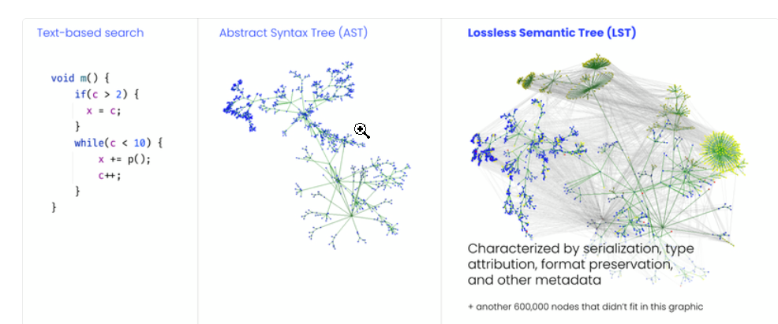

无损语义树 （LST） 是代码的树表示形式。与传统的抽象语法树 （AST） 不同，OpenRewrite 的 LST 提供了一组独特的特性，可以跨存储库执行准确的转换和搜索：

* 类型属性。每个 LST 都充满了类型信息。例如，在引用字段时，源代码可能只是将其称为 myField。另一方面，MyField 的 OpenRewrite LST 将包含有关 myField 类型的其他信息，即使它没有在同一个源文件甚至同一个项目中定义。

* 格式保留。树中保留了 LST 之前和之后的空格，因此可以打印出树以重构原始源代码，而不会破坏格式。此外，插入代码的重构操作对周围代码的本地样式敏感，并与本地样式匹配。

类型归属对于模式的准确匹配是必要的。例如，如果我们正在寻找 SLF4J 日志语句，并且我们看到如下语句，如果没有类型归属，我们如何知道记录器是 SLF4J 还是 Logback 记录器？

```java
logger.info("Hi");
```

如果格式在整个存储库中不是 100% 一致，则格式保留是必要的。

## LST 生命周期

在本地运行 OpenRewrite 配方时：

1. OpenRewrite 进程创建存储在内存中的 LST。这反映了磁盘上存储库的当前状态。

2. 该过程通过在 LST 上进行转换来继续。如果配方是搜索配方，这可能是添加搜索标记 （~~>） - 或者可能是更重要的代码更改。

3. 配方完成运行后，LST 将转换回文本，然后用于覆盖已更改的任何现有文件。

4. 覆盖所有文件后，该过程结束。配方运行之间不存储任何内容。

5. 如果在第一个配方完成后运行另一个配方，届时将生成一个新的 LST。

6. 如果先前的配方进行了更改，并且这些更改存在于本地，则新生成的 LST 将具有所有这些更改。如果之前的配方没有进行任何更改，则 LST 实际上将与之前的配方相同（但会重新生成，因为前一个配方不再存在）。

## Java LST

在构建配方时，了解 OpenRewrite 无损语义树 （LST） 如何与代码相对应非常重要。例如，除非您知道` J.Identifier` 是用于表示变量的类，否则您无法使用配方正确重命名变量。

为了在不冒引入语法或语义错误的风险的情况下以编程方式修改代码，必须使用能够准确、全面地表示所述代码的数据结构。OpenRewrite 使用无损语义树 （LST） 来实现此目的。与其他树数据结构一样，更复杂的 LST 由其他更简单的 LST 递归组成。

例如，ClassDeclaration 是定义类的 LST。典型的类声明将由字段、方法、构造函数和内部类等元素组成。这些元素中的每一个本身都是 LST。因此，术语“LST”可以指一个完整的 Java 文件，也可以仅指其中的一部分。

需要注意的是，可以操纵 LST 来创建无法编译的代码。虽然 OpenRewrite 提供了一些防止其类型系统中语法无效转换的保护措施（例如不允许将 import 语句替换为方法声明），但仍然可以编写.

此图演示了如何将简单的 Java 类表示为 LST。请注意 LST 由其他 LST 组成的分层结构。

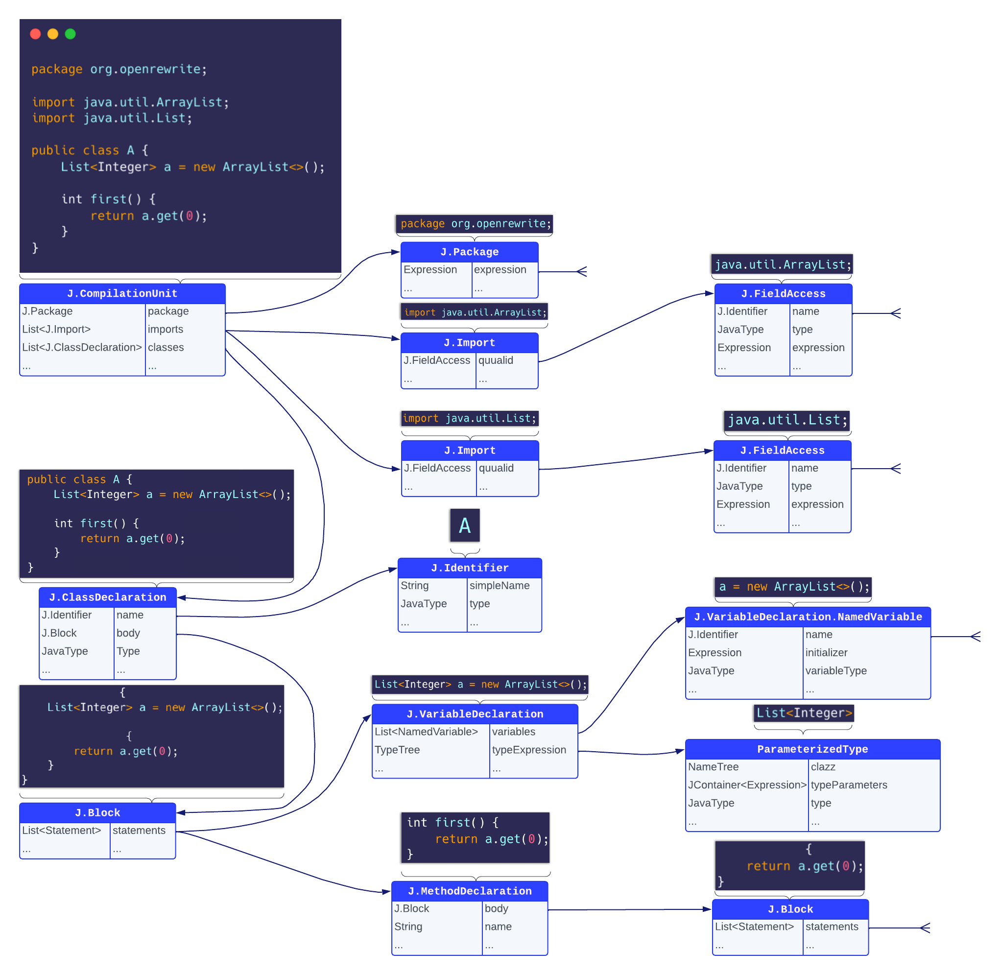

下面是一个简单的 Java 类，其全部目的是演示不同类型的 LST。以下每个部分都将突出显示此代码的不同部分，以演示哪些块对应于哪个 LST。此 LST 类型列表并不详尽，但应该让您对最常见的类型有一个很好的了解。

```java
package org.openrewrite;
                
import java.util.ArrayList;
import java.util.List;
import java.util.stream.Collectors;

@AnAnnotation
public class A {

    List<Integer> a = new ArrayList<>();

    int foo() {
        int a = 1 + 2, b = 3, c;
        this.a = this.a.stream()
                .map(it -> it + 1)
                .collect(Collectors.toList());
        return a;
    }
}

@interface AnAnnotation {}
```

### Binary

二进制是具有左右两侧的表达式，由运算符分隔。运算符的示例包括 +、-、||、&& 等。

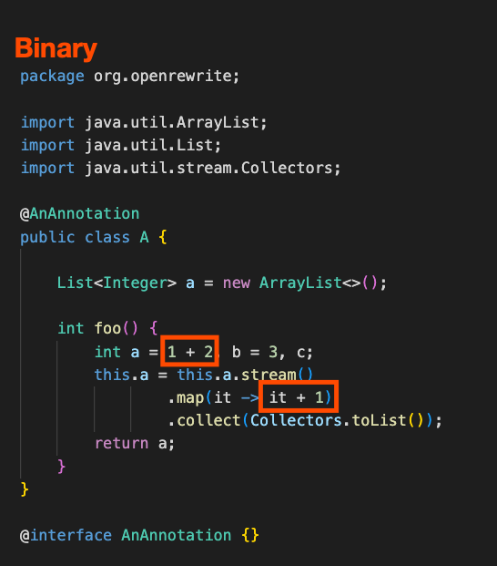

### Block

块是一对大括号和其中包含的语句。块可以相互嵌套。

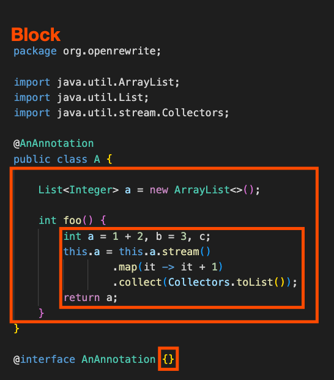

### ClassDeclaration

ClassDeclaration 包含任何 Java 类的所有代码。请注意，ClassDeclaration 可以嵌套在另一个类中，例如：

```java
public class A {
    // ...
    private class B {
        // ...
    }
}
```

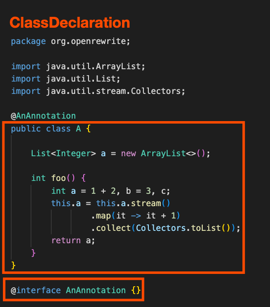

### CompilationUnit

CompilationUnit 是 Java LST 的根。为了使 LST 表示有效的 Java 代码，所有其他元素都必须包含在其中。

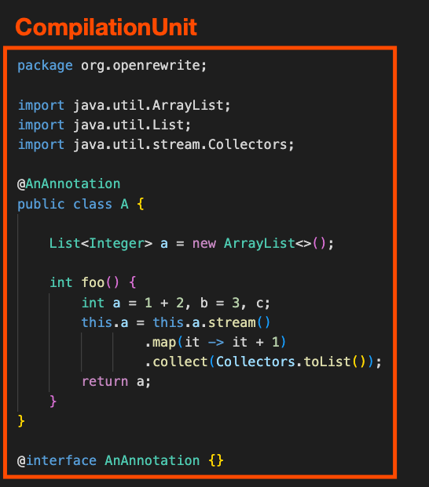

### Expression

表达式是返回值的任何内容。MethodInvocation、Identifier 和 Binary 都是表达式的示例。请注意，某些 LST（如 MethodInvocation）既是语句又是表达式。

在下面的代码中，仅突出显示了部分表达式，因为表达式内部通常可以包含许多表达式，如果所有表达式都突出显示，则很难阅读。例如，import java.util.ArrayList 是许多表达式（java、util、ArrayList、java.util 和 java.util.ArrayList）。


### FieldAccess

FieldAccess 是任何完全限定的名称。通常，这些是 package 或 import 语句，但它们也可以在代码中显示为：this.foo。

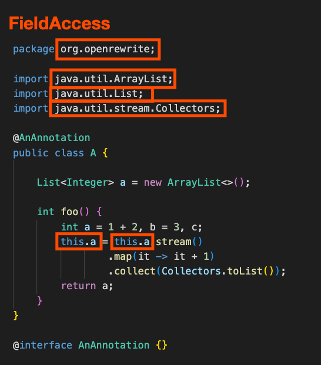

### Identifier

标识符是代码中的任何名称（类名、变量名、方法名等）。

您可以使用 J.Identifier.getFieldType（） 来判断标识符是字段所在的类。如果返回 null，则表示标识符不是字段。

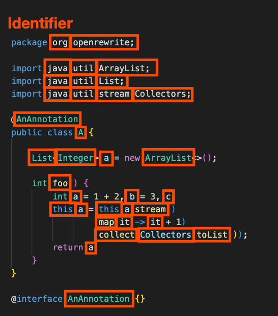

### MethodDeclaration

MethodDeclaration 是批注、修饰符、返回类型、名称、参数列表和正文，它们共同定义类上的方法。

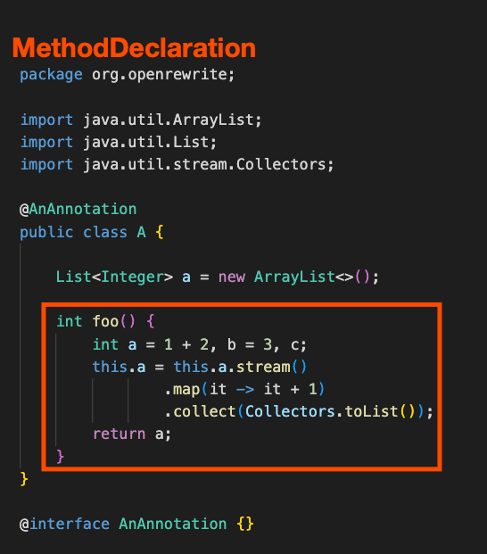

### MethodInvocation

MethodInvocation 由 select 表达式、任何定义的类型参数、方法名称及其参数组成。方法调用有一个有点令人惊讶的结构，其中最高级别的 LST 元素由 select 表达式（最后一个点左侧的所有内容）和右侧的名称组成。让我们以下面的代码为例来进一步阐明这一点。

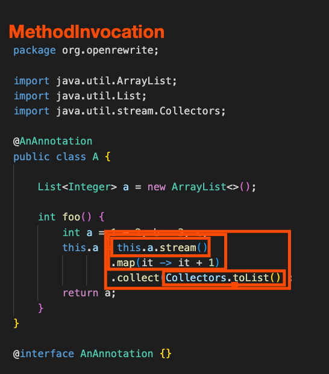

- In the above code, the "highest-level" `MethodInvocation` (`this.a.stream().map(it -> it + 1).collect(Collectors.toList())`) would have these components:
  - Select expression: `this.a.stream.map(it -> it + 1)`
  - Name: `collect`
  - A single argument: `Collectors.toList()`
- The argument passed into the above `MethodInvocation` (`Collectors.toList()`) is itself a `MethodInvocation` that would have these components:
  - Select expression: `Collectors`
  - Name: `toList`
  - No arguments
- The select expression of the highest-level `MethodInvocation` (`this.a.stream().map(it -> it + 1)`) is *also* a `MethodInvocation` and it would have these components:
  - Select expression: `this.a.stream()`
  - Name: `map`
  - A single argument which is the lambda expression: `it -> it + 1`
- The select expression of the above `MethodInvocation` (`this.a.stream()`) is also a `MethodInvocation` that has these components:
  - Select expression: `this.a`
  - Name: `stream`
  - No arguments

### NewClass

NewClass 是指通过其构造函数和 new 关键字创建对象。

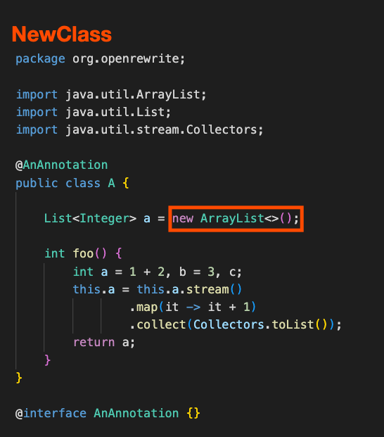

### Statement

语句是出现在块内其自身行上的任何内容。语句元素通常以分号结尾。if、while、try、Block、return 和 MethodInvocation 都是语句的示例。请注意，某些 LST 元素（如 MethodInvocation）既是语句又是表达式。

在下面的代码中，仅突出显示了部分语句，因为语句通常具有许多子语句，并且图表将变得难以阅读。例如，`List<Integer> a = new ArrayList<>()` 是一个语句，以及 `new ArrayList<>()`。

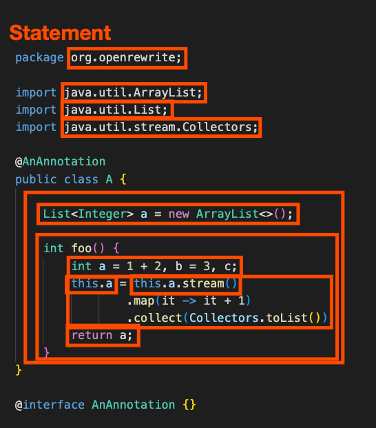

### VariableDeclarations

VariableDeclarations 包含一个或多个相同类型的变量的声明，每个变量都有或没有初始化的表达式。

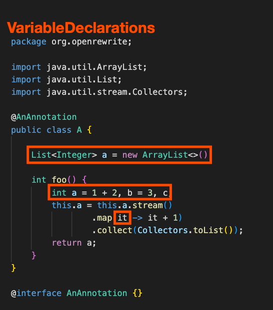


## YAML LST

下面是一个简单的 YAML 文件，其全部目的是演示不同类型的 LST。以下每个部分都将突出显示此文件的不同部分，以演示哪些块对应于哪个 LST。此 LST 列表并不详尽，但它应该让您很好地了解最常见的类型。

```yaml
document: this is document 1

jedis-list:
  - Yoda
  - Qui-Gon Jinn
  - Obi-Wan Kenobi
  - Luke Skywalker

jedi:
  name: Obi-Wan Kenobi
  home-planet: Stewjon
  height: 1.82m

requests:
  - http://example.com/
  - url: http://example.com/
    method: GET
---
document: this is document 2

reporting:
- module: final-stats
- module: console
---
- item_1
- item_2
```

### Documents

文档 LST 是 YAML LST 的根。为了使 LST 表示有效的 YAML，所有其他元素都必须包含在其中。它由一个或多个文档 LST 组成。

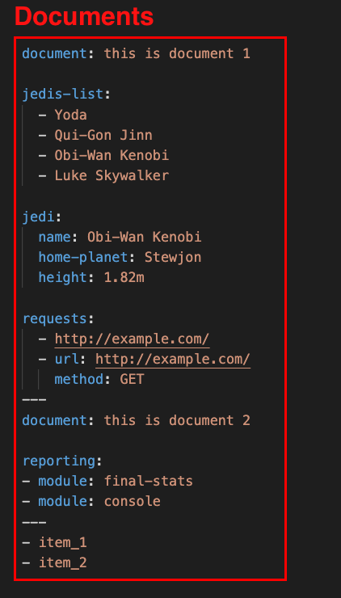

### Document

文档 LST 将所有 YAML 包含在单个文档中。一个 YAML 文件可以有多个文档 - 每个文档由包含三破折号分隔符的行分隔`---`.

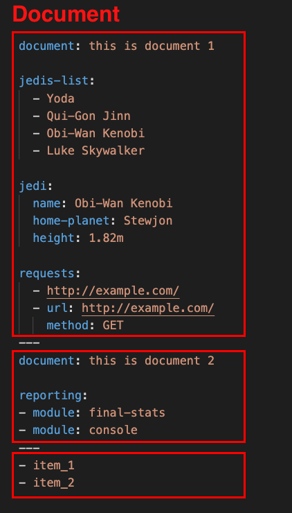

### Mapping

映射由 1 个或多个映射条目（键值对）组成。大多数 YAML 文件将包含至少一个映射。

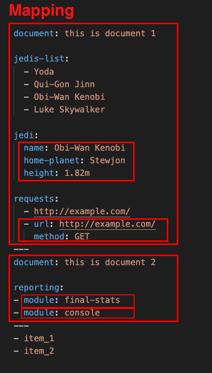

### Mapping Entry

映射条目是一个键值对。键通常是标量。另一方面，该值可以是大多数 LST，例如 Mapping、Sequence 或 Scalar。

例如，第一个文档中的第二个条目 （jedis-list） 具有标量键。该条目的值是一个序列，其中包含所有绝地武士的列表。

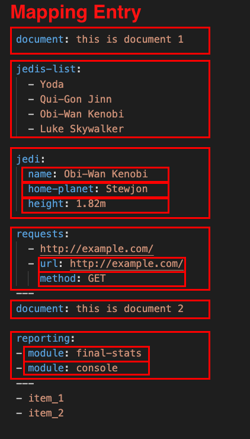

### Sequence

序列是 1 个或多个序列条目的有序列列表。

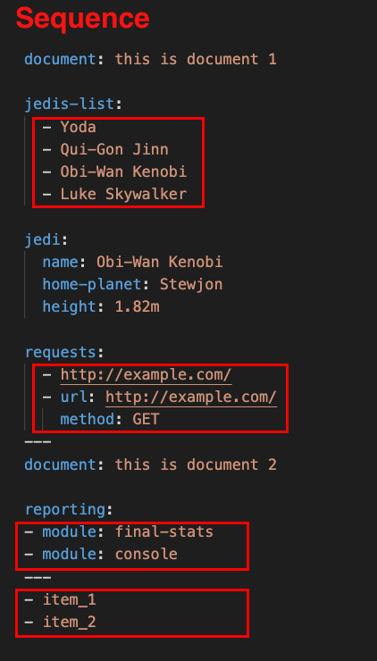

### Sequence Entry

序列条目是序列中的一个项目。您可以将每个序列条目视为键值对中的值。此值可以是大多数其他 LST，例如 Mapping 或 Scalar。与映射条目不同，序列条目没有键。

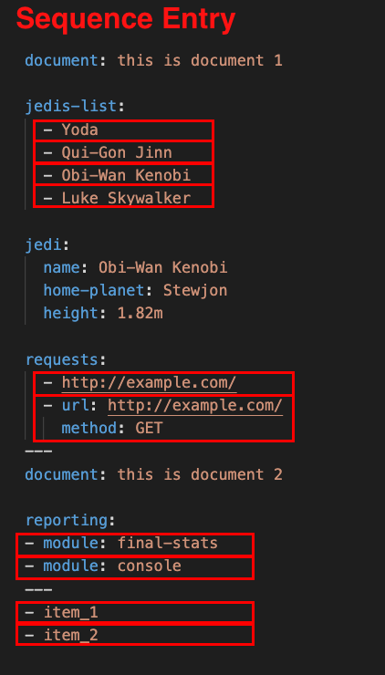

### Scalar

标量是一个 YAML 值，例如字符串、数字或布尔值。

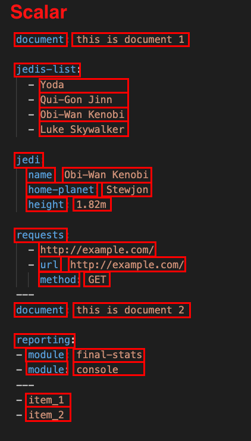

## TreeVisitingPrinter

当您第一次开始研究无损语义树 （LST） 时，可能很难理解哪些代码对应于哪些 LST。您可以使用调试器单步执行树，但这可能需要花费大量时间，并且很容易迷失在不相关的元素中。

幸运的是，在 OpenRewrite 7.35.0 中，创建了一个新选项：TreeVisitingPrinter。利用这一点，您可以将一段代码注入到 Java 配方中（或使用调试器运行命令），并快速查看某些代码如何转换为特定的 LST。

本指南将介绍使用 TreeVisitingPrinter 获取代码的 LST 的可视化表示形式的不同方法。

```java
package com.yourorg;

import org.openrewrite.ExecutionContext;
import org.openrewrite.Recipe;
import org.openrewrite.java.JavaIsoVisitor;
import org.openrewrite.java.TreeVisitingPrinter;
import org.openrewrite.java.tree.J;

public class SomeRecipe extends Recipe {
    @Override
    public String getDisplayName() {
        return "Some display name";
    }

    @Override
    public JavaIsoVisitor<ExecutionContext> getVisitor() {
        return new JavaIsoVisitor<ExecutionContext>() {
            @Override
            public J.CompilationUnit visitCompilationUnit(J.CompilationUnit compUnit, ExecutionContext executionContext) {
                // This next line could be omitted in favor of a breakpoint
                // if you'd prefer to use the debugger instead.
                System.out.println(TreeVisitingPrinter.printTree(getCursor()));
                return super.visitCompilationUnit(compUnit, executionContext);
            }
        };
    }
}
```

测试代码:

```java
@Test
void someTest() {
    rewriteRun(
        java(
            """
                class A {
                    void test() {
                        int a;
                        a = 0;
                    }
                }
            """
        )
    );
}
```

从那里，如果您运行了该测试，您将在控制台中看到以下内容：

```shell
----J.CompilationUnit
    \---J.ClassDeclaration
        |---J.Identifier | "A"
        \---J.Block
            \-------J.MethodDeclaration | "MethodDeclaration{A{name=test,return=void,parameters=[]}}"
                    |---J.Primitive | "void"
                    |---J.Identifier | "test"
                    |-----------J.Empty
                    \---J.Block
                        |-------J.VariableDeclarations | "int a"
                        |       |---J.Primitive | "int"
                        |       \-------J.VariableDeclarations.NamedVariable | "a"
                        |               \---J.Identifier | "a"
                        \-------J.Assignment | "a = 0"
                                |---J.Identifier | "a"
                                \-------J.Literal
```

# Visitors

在 OpenRewrite 配方中，访问者是核心逻辑所在的地方。它决定了应该更新哪些元素以及何时更新。


# Environment

发现、配置和实例化配方以应用于一组源文件

OpenRewrite 的环境抽象为 Recipes 和 Styles 提供了发现、激活和配置工具。查看 OpenRewrite 运行的常见运行时上下文会很有帮助，以便更好地了解环境是如何建立的：

| Context                       | Integrations                                                 |
| :---------------------------- | :----------------------------------------------------------- |
| Rewrite Maven/Gradle plugins  | 扫描项目的编译和提供的范围类路径，并查找任何可用的配方。扫描编译和提供的范围类路径，并查找包含配方和样式的声明性定义的“META-INF/rewrite/*.yml”。在插件的“configLocation”配置所引用的 YML 文件中添加资源。根据插件的“activeRecipes”和“activeStyles”配置激活配方和样式 |
| Command line utilities        | 可能有一些命令行标志，指示要激活的配方和样式，以及一组预定义的访问者和配方，以添加到环境中。 |
| Mass-refactoring microservice | 根据服务的帖子正文输入将访客和食谱添加到环境中。如果服务在预先发布的 LST 的数据存储中运行，则不需要任何样式配置，因为样式应已存储在此服务设计用于操作的 LST 中。 |

下面的代码演示了如何手动构建环境并使用各种不同的资源加载器。

```java
File rewriteYml = ...;
try(InputStream rewriteInputStream = new FileInputStream(rewriteYml)) {
  ResourceLoader rewriteYmlLoader = new YamlResourceLoader(
    rewriteInputStream,
    // wouldn't have to exist on disk necessarily (just used in logging)
    rewriteYml.toURI(),
    System.getProperties()
  );

  Iterable<Path> classpath = ...

  // any manually built visitors
  Iterable<? extends RefactorVisitor<?>> visitors = ...

  Environment env = Environment.builder()
    .load(rewriteYmlLoader) // can be called more than once for multiple files
    .scanClasspath(classpath) // classpath scans for META-INF/rewrite/*.yml
    .scanUserHome() // looks for `~/.rewrite/rewrite.yml
    .build();
}
```

一旦创建了环境的实例，就可以询问它以列出所有可用的食谱和styes。还有用于检索配方描述的功能，其中提供了配方及其可用选项的描述。

# Recipes

封装操作集合以完成某些更高级别的任务，如框架迁移。

配方表示一组可应用于无损语义树的搜索和重构操作。配方可以表示单个独立操作，也可以与其他配方链接在一起，以实现更大的目标，例如框架迁移。

OpenRewrite 提供了一个用于发现、实例化和配置配方的托管环境。若要实现搜索或重构操作，配方将委托给处理 LST 遍历和操作的访问者。


执行管道指示如何将配方应用于一组源文件以执行转换任务。通过调用配方的 run（） 方法并将将通过管道传递的源文件集传递给它来启动转换。执行管道维护和管理源文件的中间状态，因为它们被传递给访问者和嵌套配方。

顶级配方（启动执行管道的配方）和任何已链接在一起的后续配方都将参与执行管道。配方是可组合的，因此，嵌套步骤也可能为管道提供额外的嵌套配方。

反过来，每个配方将作为管道中的一个步骤执行，步骤执行包括以下内容：

1. 调用配方的 validate（） 方法以确保其配置正确。OpenRewrite 对如何处理验证错误没有意见，默认情况下，它将跳过验证失败的配方。可以通过执行上下文将错误处理程序引入管道来更改此行为。

2. 如果配方具有关联的访问者，则配方将委托给其关联的访问者来处理已馈送到管道的所有源文件。正是在这个特定阶段，可以引入并发性来并行处理源 LST。

3. 如果配方具有链接/链接配方，则执行管道将启动该配方的步骤执行，并重复此过程，直到不再有嵌套配方。

以相同的“迁移 JUnit 5”配方为例，流经管道的流程如下所示：

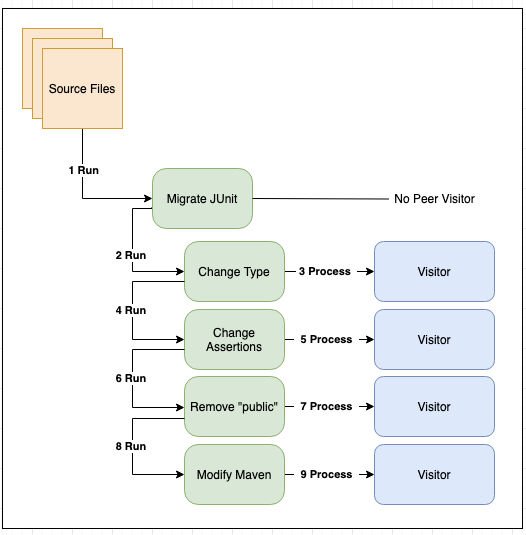

启动执行管道需要创建执行上下文。Recipe.run（） 有重载版本，如果没有提供，它们将隐式创建执行上下文。执行上下文是一种在配方（及其基础访问者）之间共享状态的机制。ExecutionContext 提供了以线程安全方式添加和轮询消息的功能。

执行管道中的配方可能会产生更改，进而导致另一个配方执行进一步的工作。因此，管道可能会再次对管道中的所有配方执行多次传递（或循环），直到对传递不进行任何更改或达到某个最大传递数（默认为 3）。这允许配方响应其他配方所做的更改，这些配方在管道中执行它们之后。

例如，假设将两个配方添加到执行管道中。第一个配方在 LST 上执行空格格式设置，第二个配方生成添加到同一 LST 的其他代码。这两个配方是按顺序执行的，因此在第二个配方添加其生成的代码之前应用格式化配方。执行管道检测到已进行更改，并执行第二次遍历配方。在第二次传递期间，格式化配方现在将正确格式化作为结果添加的生成代码

成功完成配方的执行管道将生成 Result 实例的集合。每个结果表示对特定源文件所做的更改，并提供对以下信息的访问：

| Method                        | Description                                                  |
| :---------------------------- | :----------------------------------------------------------- |
| `getBefore()`                 | The original `SourceFile`, or null if the change represents a new file. |
| `getAfter()`                  | The modified `SourceFile`, or null if the change represents a file deletion. |
| `getRecipesThatMadeChanges()` | The recipe names that made the changes to the source file.   |
| `diff()`/`diff(Path)`         | A git-style diff (with an optional path to relativize file paths in the output) |

# Markers

向 LST 添加任意元数据

标记使用元数据对 LST 元素进行注释。访问者可以读取或将实现 Marker 接口的任何类型附加到任何 LST 元素的 Marker。标记可用于识别搜索结果或在 OpenRewrite 执行期间在配方之间进行通信。当 LST 打印回源代码时，大多数标记（作为元数据）在源代码中没有文本表示形式。例外情况是 SearchResult 标记，它们打印为指示搜索结果的注释。OpenRewrite 将框架提供的标记附加到 LST。

提供标记的 LST 实现最后有两种添加标记的方法。LST 元素是不可变的，并且包括它们的元数据，因此这些方法返回具有指定标记的 LST 元素的副本。

```java
// Returns the existing Markers
Markers getMarkers();

// Fully replaces any existing Markers
<M extends Markable> M withMarkers(Markers markers);
```

### Reading Markers from an LST Element

```java
// Returns the first Marker of the specified type.
<M extends Marker> Optional<M> findFirst(Class<M> markerType)

// Returns all Markers of the specified type
<M extends Marker> List<M> findAll(Class<M> markerType)

// Add a new marker or update some existing marker via the remappingFunction
// The existence of "identity" is determined based on equality
<M extends Marker> Markers compute(M identity, BinaryOperator<M> remappingFunction)

// Add a new marker or update some existing marker via the remappingFunction
// The existence of "identity" is determined based on type equality
<M extends Marker> Markers computeByType(M identity, BinaryOperator<M> remappingFunction)
```

```java
class SomeVisitor implements JavaVisitor<ExecutionContext> {

    @Override
    public J.ClassDeclaration visitClassDeclaration(J.ClassDeclaration classDecl, ExecutionContext ctx) {

        // This snippet will retrieve the root element's markers in any language, from anywhere in a visitor
        Markers m = getCursor().firstEnclosing(SourceFile.class).getMarkers();

        // There is only one of each of these markers, so Markers.findFirst() is a convenient way to access them
        Optional<BuildTool> buildTool = m.findFirst(BuildTool.class);

        // Some markers are language-specific
        Optional<JavaProject> javaProject = m.findFirst(JavaProject.class);

        return classDecl;
    }
}
```


在典型的配方中，标记的最常见形式是 SearchResult。将 SearchResult 标记添加到 LST 的 Recipe 被描述为搜索配方。SearchResults 可以选择包含文本说明。将 SearchResult 添加到 LST 元素时，它将作为注释打印到它所附加到的元素旁边。

在此示例中，搜索配方 FindAnnotations 添加了一个 SearchResult，指示它找到了匹配的 Annotation。

```java
public J.Annotation visitAnnotation(J.Annotation annotation, ExecutionContext ctx) {
    J.Annotation a = super.visitAnnotation(annotation, ctx);
    if (annotationMatcher.matches(annotation)) {
        aa = a.withMarkers(a.getMarkers().searchResult());
    }
    return a;
}
```

```java
public J.Identifier visitIdentifier(J.Identifier identifier, ExecutionContext ctx) {
    J.Identifier ident = super.visitIdentifier(identifier, ctx);
    if (isNullType(ident.getType()) && !isAllowedToHaveNullType(ident)) {
        ident = ident.withMarkers(ident.getMarkers().searchResult("Identifier type is null"));
    }
    return ident;
}
```


